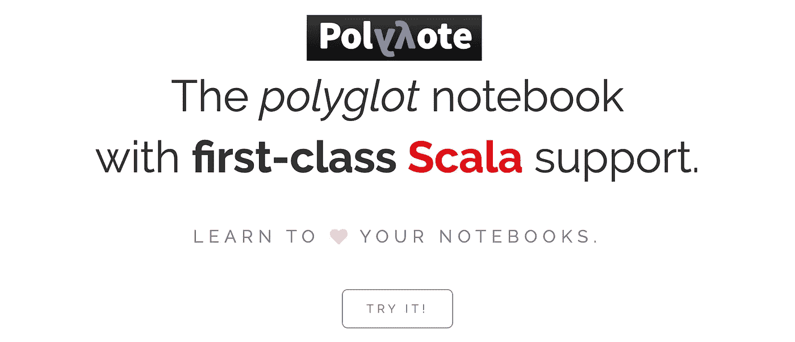
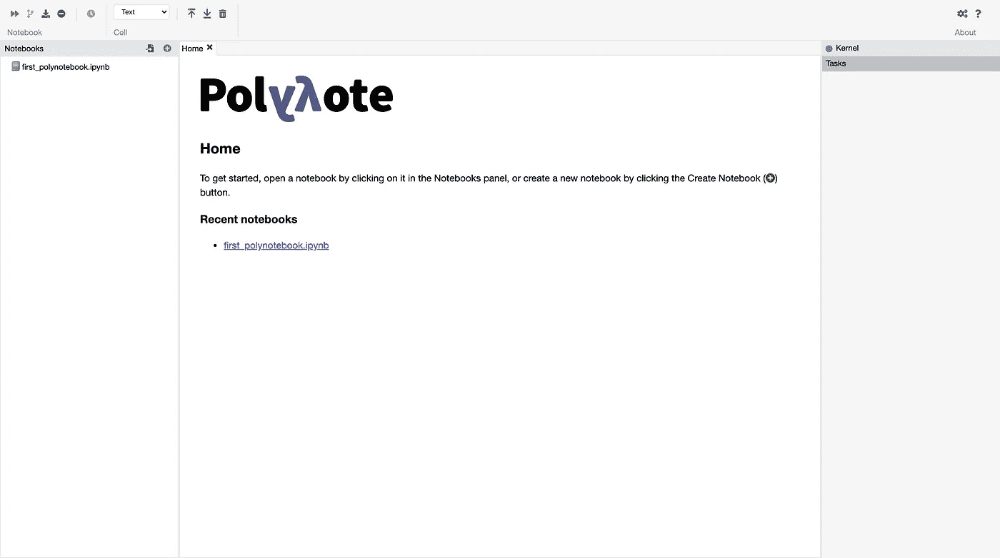
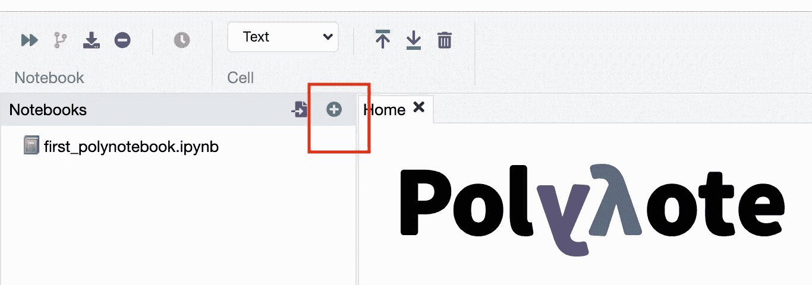
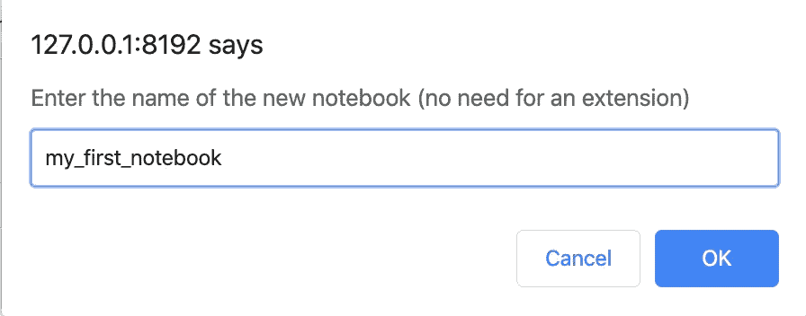
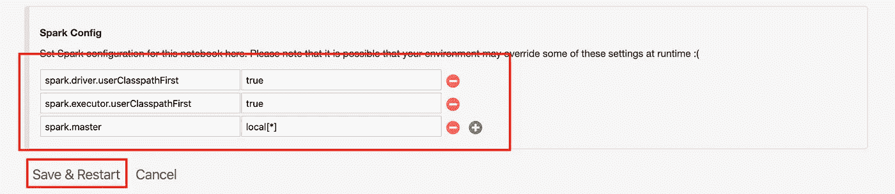
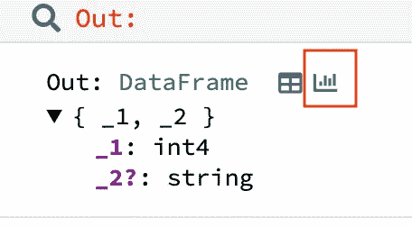
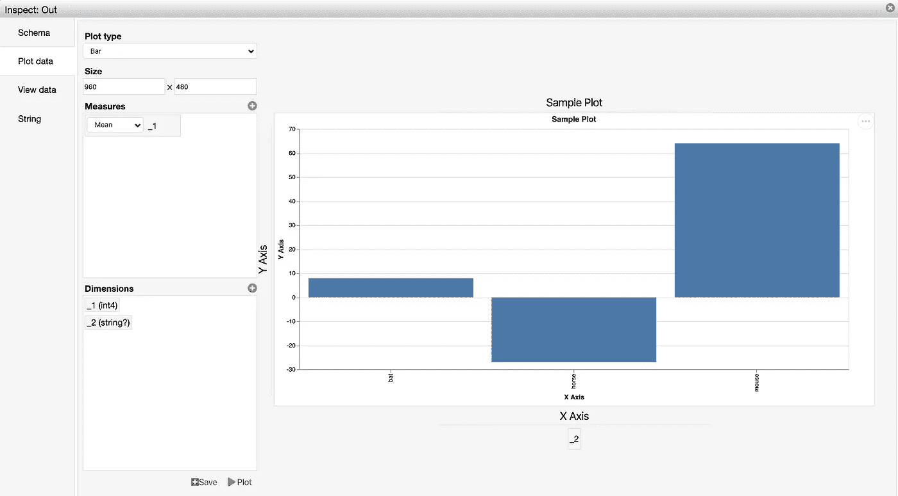

# Polynote 入门:网飞的数据科学笔记本

> 原文：<https://towardsdatascience.com/getting-started-with-polynote-netflixs-data-science-notebooks-47fa01eae156?source=collection_archive---------10----------------------->



Source: [https://polynote.org/](https://polynote.org/)

[图沙尔·卡普尔](https://www.tusharck.com/):([https://www.tusharck.com/](https://www.tusharck.com/))

2019 年 10 月 23 日，[网飞](https://netflix.com)宣布开源推出 Polynote:一款新的多语言笔记本，这是他们开发的内部基于 JVM 的 ML 平台笔记本，现在向公众发布。它具有一些迄今为止您在笔记本 ide 中缺少的革命性功能，特别是对于数据科学家和机器学习研究人员来说，它通过一流的 Scala 支持、Apache Spark 集成、多语言互操作性(包括 Scala、Python 和 SQL)为他们提供了以前不存在的工具和灵活性。自动完成功能在顶部添加了樱桃。以下是帮助您设置和运行带有 [Apache Spark](https://spark.apache.org/) 配置的笔记本的步骤。

# 设置 Polynote 笔记本 IDE 的步骤(Mac/Linux)

1.  下载以下内容:

*   多项式:[https://github.com/polynote/polynote/releases](https://github.com/polynote/polynote/releases)
*   阿帕奇火花:[https://spark.apache.org/downloads.html](https://spark.apache.org/downloads.html)
*   Java(根据您的操作系统选择):[https://www . Oracle . com/tech network/Java/javase/downloads/JDK 8-downloads-2133151 . html](https://www.oracle.com/technetwork/java/javase/downloads/jdk8-downloads-2133151.html)

2.打开终端并转到下载位置:

```
cd Users/user_name/Downloads
```

3.解压缩 tar 文件:

```
tar -zxvpf polynote-dist.tar.gz
cd polynote
```

4.解压缩 Apache Spark 文件(您可能需要根据 Spark 版本更改文件名):

```
tar -zxvpf spark-2.4.4-bin-hadoop2.7.tgz
cd polynote
```

5.现在，您需要设置一些环境变量以使 polynote 正常运行，请设置以下变量:

***注*** :

1.  将*用户名*更改为您的用户
2.  将 **JAVA_HOME** path 变量中的 **jdk1.8.0_191.jdk** 修改为您系统中安装的版本。要检查版本，您可以在终端上运行`java -version`。

```
**export** **JAVA_HOME**=/Library/Java/JavaVirtualMachines/jdk1.8.0_191.jdk/Contents/Home/**export** **SPARK_HOME**=/Users/user_name/Downloads/spark-2.4.4-bin-hadoop2.7**export PATH**="$PATH:$SPARK_HOME/bin:$SPARK_HOME/sbin"
```

6.检查 spark-submit 是否工作，在您的终端中键入 **spark-submit** ，然后您应该会看到类似这样的内容。

```
Usage: spark-submit [options] <app jar | python file | R file> [app arguments]Usage: spark-submit --kill [submission ID] --master [spark://...]Usage: spark-submit --status [submission ID] --master [spark://...]Usage: spark-submit run-example [options] example-class [example args]
...
...
```

7.您还需要安装一些 python 依赖项:

```
pip3 install jep jedi pyspark virtualenv
```

***注意*** :如果你在 Mac 上得到一个“无效活动开发者路径”的错误，你需要通过运行下面的命令来安装 xcode 开发者工具。然后之后就可以安装上面的依赖项了。

`xcode-select --install`

8.在 polynote 目录下运行以下命令，在浏览器上启动笔记本 IDE(与 [Google Chrome](https://www.google.com/chrome/) 配合使用效果最佳)

```
./polynote
```

9.打开谷歌浏览器，复制粘贴以下网址:

```
[http://127.0.0.1:8192/](http://127.0.0.1:8192/)
```

您的 Polynote 笔记本 IDE 现在应该已经启动并运行，应该会看到如下内容:



Polynote welcome page

# 制作您的第一个 polynote 笔记本并设置 spark 配置

1.  单击左侧窗格中的加号图标创建一个笔记本。



2.在弹出的对话框中输入您的 polynote 笔记本的名称，然后按 ok。



3.点击 ***配置&依赖*** 就在你的笔记本名称上方。

4.在这里为笔记本设置 Spark 配置，点击 ***保存&重启*** 。

```
spark.driver.userClasspathFirst: truespark.executor.userClasspathFirst: truespark.master: local[*]
```



5.添加一个新单元格，添加以下代码，然后按 shift enter 键:

```
**val** scalaDF = spark.createDataFrame(List((8, **"bat"**),
(64, **"mouse"**),
(-27, **"horse"**)))
```

6.要可视化您的数据帧，运行以下代码并按下**图形图标。**

```
scalaDF
```



7.将打开一个弹出框，您可以在其中设置指标和轴，以可视化您的数据框架，如下所示:



Sample Graph

8.要在 python 中使用数据帧，请执行以下操作:

*   添加一个新的单元格，将该单元格的语言从 Scala 更改为 Python，并运行以下代码:

```
**from** pyspark.sql **import** DataFramepythonDF = DataFrame(scalaDF, sqlContext) # sqlContext is provided by PolynotepandaDF = pythonDF.toPandas()pandaDF
```

您可以从下面的 git URL 查看 polynote 笔记本。

[https://github . com/tusharck/polynotebook-sample/blob/master/first _ polynotebook . ipynb](https://github.com/tusharck/polynotebook-sample/blob/master/first_polynotebook.ipynb)

也可以查看下面关于混合编程语言的 polynote 文档:

[https://polynote . org/docs/03-mixing-programming-languages . html](https://polynote.org/docs/03-mixing-programming-languages.html)