# AWS EMR 上的 PySpark 入门

> 原文：<https://towardsdatascience.com/getting-started-with-pyspark-on-amazon-emr-c85154b6b921?source=collection_archive---------1----------------------->

## 使用 Spark on AWS 大规模处理数据的分步指南

**带有 PySpark 和 AWS EMR 的数据管道**是一个多部分系列。这是第 1 部分，共 2 部分。如果您正在寻找如何将数据管道作为产品工作来运行的指导，请查看[第 2 部分](/production-data-processing-with-apache-spark-96a58dfd3fe7)。

1.  AWS EMR 上的 PySpark 入门**(本文)**
2.  [在 AWS EMR 上使用 PySpark 处理生产数据](/production-data-processing-with-apache-spark-96a58dfd3fe7) **(接下来)**


# 动机

如果您在过去十年中一直关注业务和技术趋势，您可能会意识到组织生成的数据量已经激增。企业渴望使用所有这些数据来获得洞察力和改进流程；然而，“大数据”意味着巨大的挑战。

必须发明全新的技术来处理越来越大的数据集。这些新技术包括云计算服务提供商的产品，如亚马逊网络服务(AWS)和开源的大规模数据处理引擎，如 Apache Spark。**随着生成的数据量持续飙升，能够使用这些“大数据”工具的有抱负的数据科学家将在市场中脱颖而出。**

# 我们开始吧

在本指南中，我将教您如何在 Amazon EMR 集群上开始使用 PySpark 处理数据。本教程面向熟悉 Python，但刚开始使用 Spark 的当前和有抱负的数据科学家。

Spark 非常适合处理大型数据集，用于探索性数据分析和特征工程等日常数据科学任务。它还可以用于大规模实现许多流行的机器学习算法。

# 我们今天要讲的内容

1.  Spark、亚马逊 S3 和 EMR 概述
2.  在 Amazon EMR 上创建集群
3.  通过 Jupyter 笔记本连接到我们的集群
4.  从亚马逊 S3 加载数据

# 大数据工具概述

## 火花

在[文档](https://spark.apache.org/)中，“Apache Spark 是一个用于大规模数据处理的统一分析引擎。”Spark 的引擎允许您在分布式集群上并行处理大型数据处理任务。Spark 集群包含一个充当中央协调器的主节点和几个处理主节点分配的任务的工作节点。

在本指南中，我们将使用 Python，但是 Spark 开发人员也可以使用 Scala 或 Java。模块包含 Pandas 和 SQL 用户熟悉的语法。`pyspark.ml`模块可以用来实现很多流行的机器学习模型。

Spark 使用懒惰评估，这意味着它不做任何工作，直到你要求一个结果。通过这种方式，引擎可以决定执行 DAG(有向无环图-或您指定的操作列表)的最佳方式。当我定义一个操作时— `new_df = df.filter(df.user_action == 'ClickAddToCart')` — Spark 将该操作添加到我的 DAG 中，但不执行。一旦我请求一个结果— `new_df.collect()` — Spark 就会执行我的过滤器和我指定的任何其他操作。

***在我们继续之前有一个小提示:*** *使用分布式云技术可能会令人沮丧。首先，您可能会发现 Spark 错误消息难以理解，难以调试。我鼓励你坚持下去！阅读错误。了解哪些部分信息丰富，然后谷歌一下。我不能保证你最终会停止敲键盘，但会变得更容易。如果没有学习曲线，这就不是一个让你与众不同的好方法！*

## 亚马逊 S3

[亚马逊 S3](https://aws.amazon.com/s3/) (简单存储服务)是一种简单且相对便宜的安全存储大量数据的方式。典型的 Spark 工作流是从 S3 存储桶或其他源读取数据，执行一些转换，并将处理后的数据写回另一个 S3 存储桶。

## 亚马逊电子病历

[亚马逊 EMR](https://aws.amazon.com/emr/) (Elastic Map Reduce)是一个大数据平台，将多个节点同步到一个可扩展的集群中，可以处理大量数据。如上所述，我们将作业提交给集群的主节点，它会计算出运行作业的最佳方式。然后，主节点相应地将任务分配给工作节点。

# 在 Amazon EMR 上设置您的环境

首先，创建一个 [AWS 帐户](https://aws.amazon.com/?source=post_page---------------------------)并登录控制台。我建议现在花时间[创建一个 IAM 用户](https://docs.aws.amazon.com/IAM/latest/UserGuide/id_users_create.html#id_users_create_console)并[删除你的根访问键](https://docs.aws.amazon.com/IAM/latest/UserGuide/id_root-user.html)。

*更新:我已经创建了一个* [*AWS 快速设置指南*](/quick-setup-guide-for-your-aws-account-423dadb61f99) *引导您如何创建 IAM 用户和角色，创建一个 S3 桶，并配置 AWS CLI。*

在本教程中，我将使用美国西部地区(俄勒冈州)。您可以通过右上方的下拉菜单更改您所在的地区:

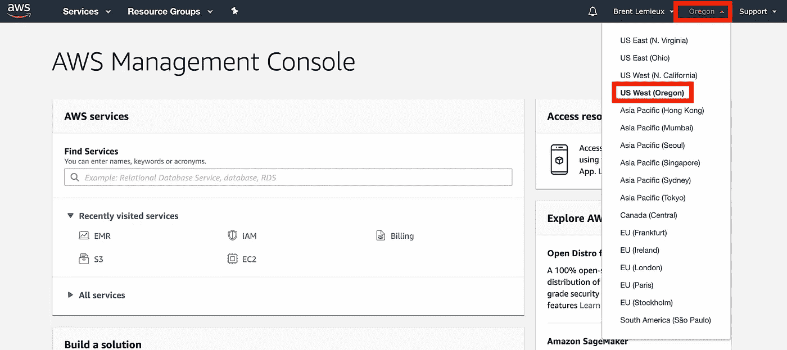

关于 AWS 费用的警告:你需要提供一张信用卡来创建你的账户。 ***为了保持成本最低，不要忘记在使用完 EMR 集群后终止它*** *。对于本指南，我们将使用 m5.xlarge 实例，在撰写本文时，每小时的成本为 0.192 美元。此外，在亚马逊 S3 上托管数据每月会收取少量费用——这一费用会随着你托管的数据量而增加。为避免持续成本，请在使用后删除存储桶。*

## 在亚马逊 S3 上存储配置文件

为了在集群的所有节点上安装有用的包，我们需要创建文件`emr_bootstrap.sh`并将其添加到 S3 上的 bucket 中。

```
#!/bin/bash
sudo pip install -U \
    matplotlib \
    pandas
```

使用控制台中的“查找服务”搜索框搜索 S3，导航至该城市:

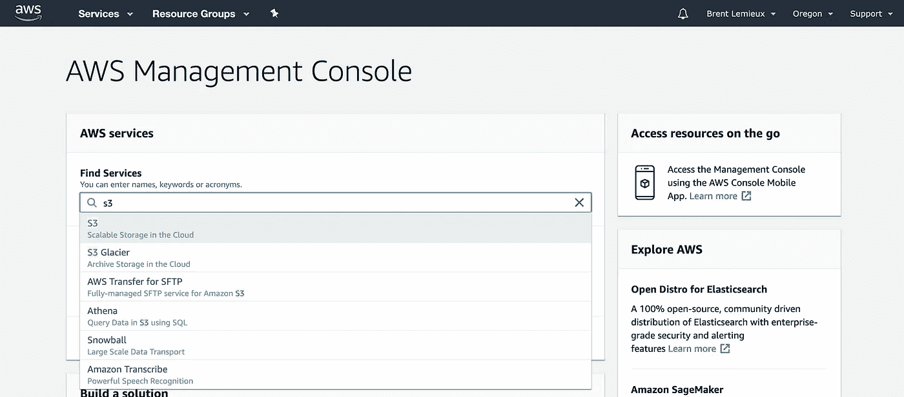

点击“创建存储桶”，填写“存储桶名称”字段，点击“创建”:

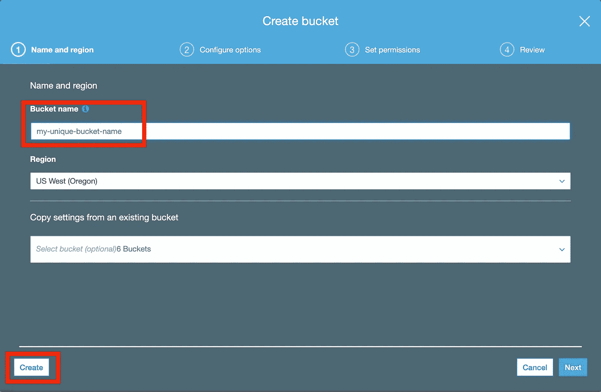

点击“上传”、“添加文件”，打开您创建的文件`emr_bootstrap.sh`。点击“上传”上传文件。


## 创建密钥对文件

从控制台主页导航到 EC2:

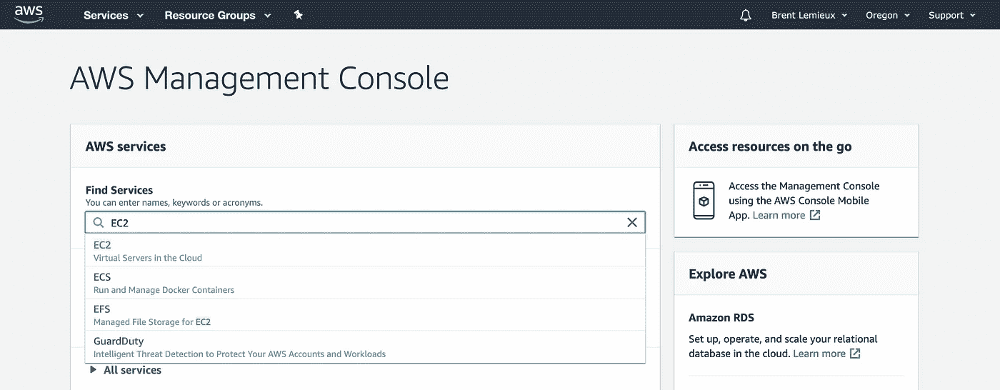

选择“密钥对”

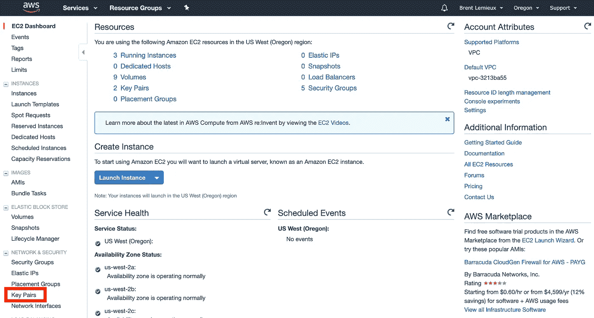

单击“创建密钥对”，然后输入名称并单击“创建”。

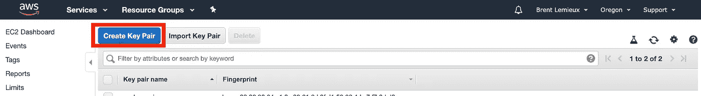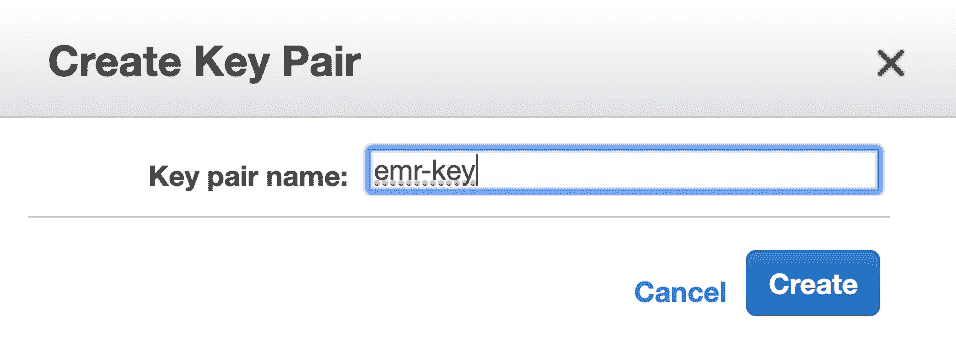

你的文件`emr-key.pem`应该会自动下载。把它存放在一个你会记住的目录里。我把我的`.pem`文件放在`~/.ssh`里。确保这个文件不要放在你的 GitHub repos 或任何其他公共场所，以保证你的 AWS 资源更加安全。

## 在 Amazon EMR 上创建集群

从您的控制台导航到 EMR，单击“创建集群”，然后“转到高级选项”。

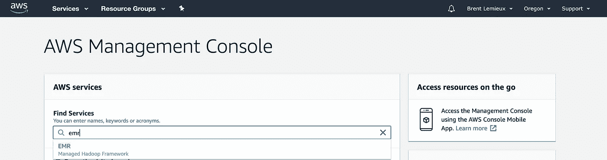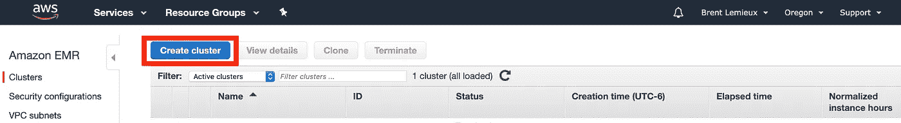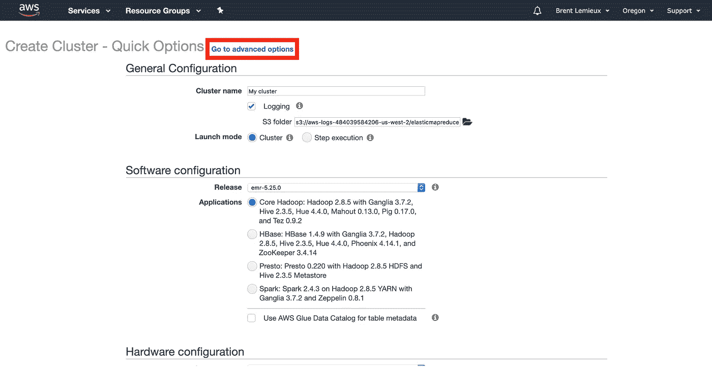

进行以下选择，从“版本”下拉列表中选择最新版本并选中“Spark”，然后单击“下一步”。

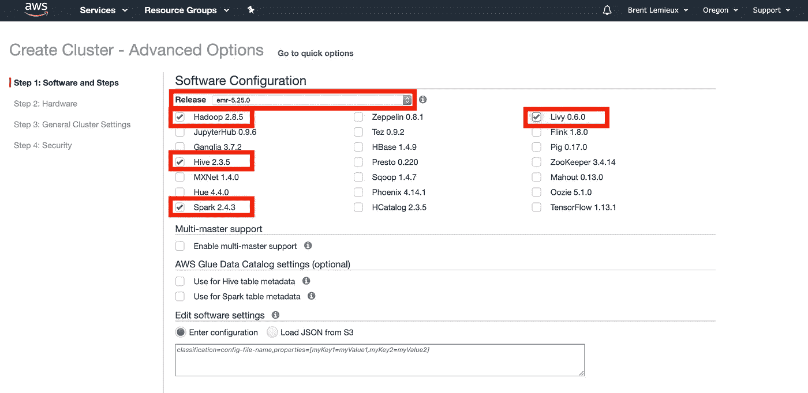

选择“us-west-2a 中的默认”选项“EC2 子网”下拉列表，将您的实例类型更改为 m5.xlarge 以使用最新一代的通用实例，然后单击“下一步”。

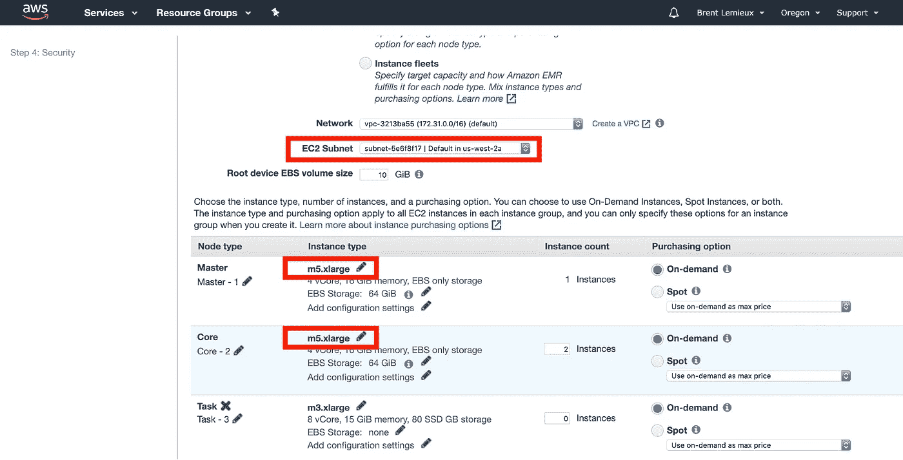

命名您的集群，添加`emr_bootstrap.sh`作为引导操作，然后单击“Next”。你的引导动作的脚本位置将是你在教程前面上传`emr_bootstrap.sh`的 S3 文件路径。您的引导操作将在集群中的每个节点上安装您指定的软件包。

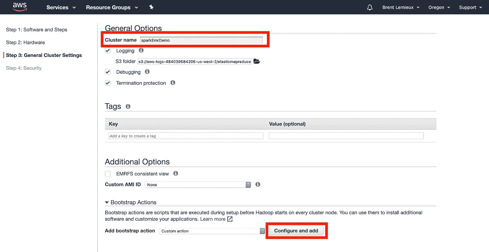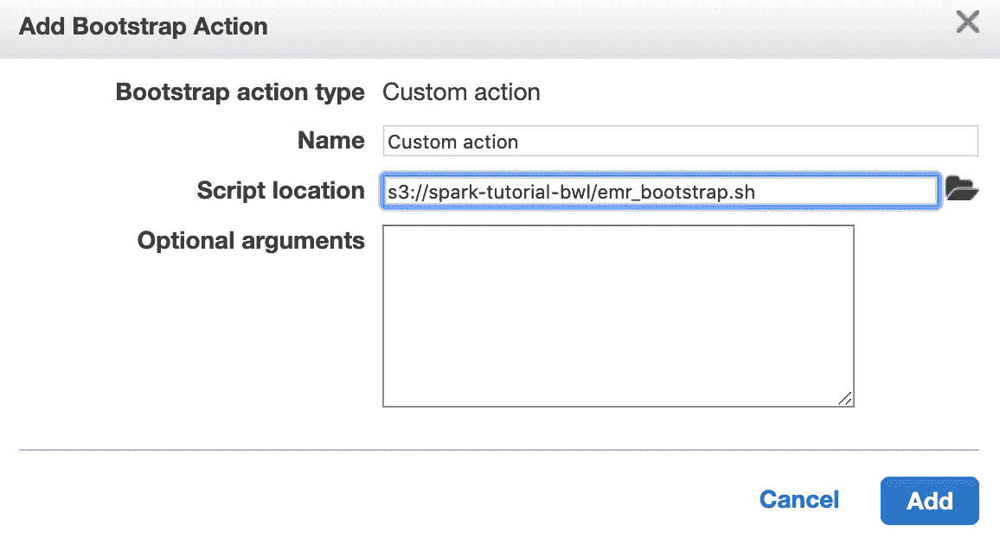

选择您之前创建的密钥对，然后单击“创建集群”。您的集群将需要几分钟的时间来启动，但是一旦它进入“等待”状态，您就可以进入下一步了——使用 Jupyter 笔记本连接到您的集群。

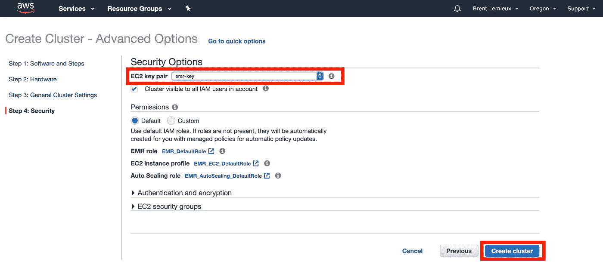

## 使用 Jupyter 笔记本连接到您的集群

导航至左侧面板中的“笔记本”。点击“创建笔记本”并按照以下步骤操作。

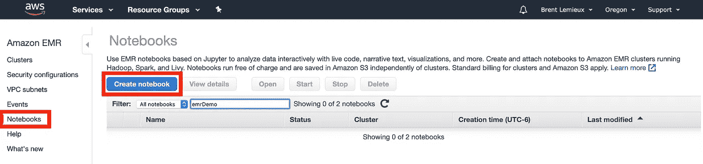

命名您的笔记本并选择您刚刚创建的集群。

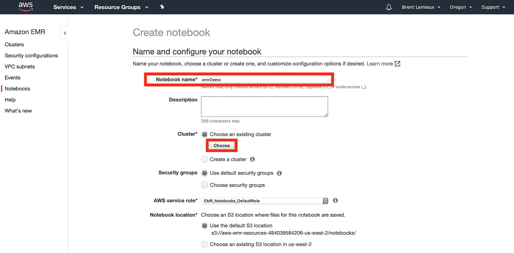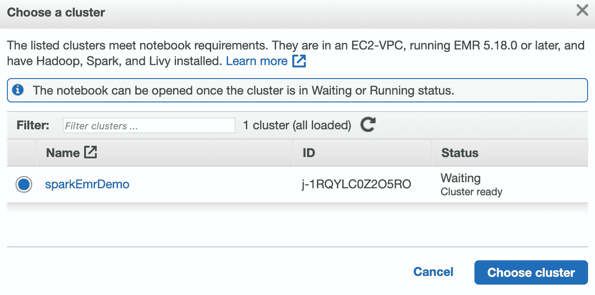

一旦你的笔记本“准备好”，点击“打开”。您现在已经准备好开始在云上运行 Spark 了！

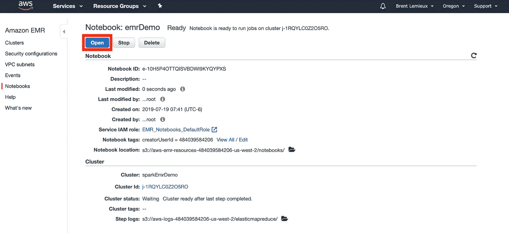

## 连接到 S3 上的数据源

在笔记本的第一个单元格中，导入您要使用的包。例如:

```
from pyspark.sql import functions as F
```

您应该得到以下输出:

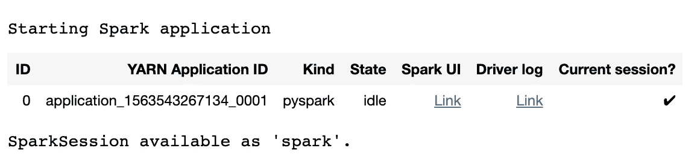

注意:SparkSession 在笔记本中被自动定义为`spark` —您必须在创建脚本作为 Spark 作业提交时自己定义。

接下来，让我们从 S3 导入一些数据。我们将使用亚马逊在公共桶中提供的数据。让我们看看[亚马逊客户评论数据集](https://registry.opendata.aws/amazon-reviews/)。具体来说，我们来看看书评:

```
input_bucket = 's3://amazon-reviews-pds'
input_path = '/parquet/product_category=Books/*.parquet'
df = spark.read.parquet(input_bucket + input_path)df.show()
```

`input_path`中的`/*.parquet`语法告诉 Spark 读取`s3://amazon-reviews-pds/parquet/product_category=Books/`桶目录中的所有`.parquet`文件。

我将很快推出一个关于 PySpark DataFrame API 的数据争论的教程，但是现在，请查看 DataCamp 的这个[优秀的备忘单开始吧。](https://s3.amazonaws.com/assets.datacamp.com/blog_assets/PySpark_SQL_Cheat_Sheet_Python.pdf)

# 下一个

一旦你在 Jupyter 笔记本上测试了你的 PySpark 代码，把它移到一个脚本中，然后[用 Spark 和 AWS 命令行界面创建一个生产数据处理工作流](https://medium.com/@brent_64035/production-data-processing-with-apache-spark-96a58dfd3fe7)。然后，你准备好[安排你的气流火花工作](/set-up-an-airflow-environment-on-aws-in-minutes-f934cf10ec54)。

# 保持联系

感谢您的阅读！请让我知道你是否喜欢这篇文章，或者你是否有任何批评。如果这篇指南对你有用，一定要关注我，这样你就不会错过我以后的任何文章。

如果你在一个数据项目上需要帮助或者想打声招呼，**在**[**LinkedIn**](https://www.linkedin.com/in/brent-lemieux/?source=post_page---------------------------)上联系并给我发消息。干杯！