# R 编程入门

> 原文：<https://towardsdatascience.com/getting-started-with-r-programming-2f15e9256c9?source=collection_archive---------8----------------------->

## 使用数据科学中第二常用的编程语言 R 进行端到端的数据分析。

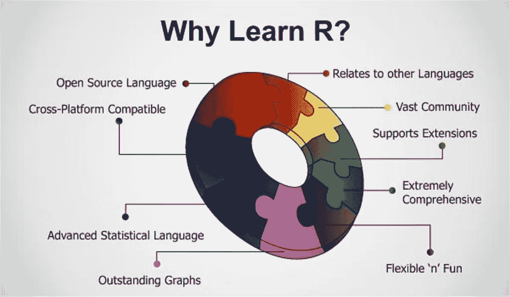

(Source: [https://hackernoon.com/5-free-r-programming-courses-for-data-scientists-and-ml-programmers-5732cb9e10](https://hackernoon.com/5-free-r-programming-courses-for-data-scientists-and-ml-programmers-5732cb9e10))

# 介绍

r 是一种专注于统计和图形分析的编程语言。因此，它通常用于统计推断、数据分析和机器学习。r 是目前数据科学就业市场上最受欢迎的编程语言之一(图 1)。

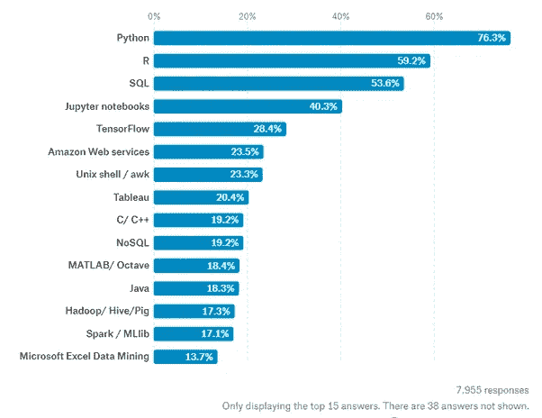

Figure 1: Most Requested programming languages for Data Science in 2019 [1]

R 可从[r-project.org](http://www.r-project.org/)安装，R 最常用的集成开发环境(IDE)之一当然是 [RStudio](http://www.rstudio.com/ide/) 。

有两种主要类型的包(库)可用于向 R 添加功能:基本包和分布式包。安装 R 时会附带基础包，分布式包可以使用 [CRAN](https://cran.r-project.org/web/packages/available_packages_by_date.html) 免费下载。

一旦安装了 R，我们就可以开始做一些数据分析了！

# 示范

在本例中，我将带您浏览对[手机价格分类数据集](https://www.kaggle.com/iabhishekofficial/mobile-price-classification#train.csv)的端到端分析，以预测手机的价格范围。我在这次演示中使用的代码在我的 [GitHub](https://github.com/pierpaolo28/R-Programming/blob/master/Smartphone%20Prices/workflow.r) 和 [Kaggle](https://www.kaggle.com/pierpaolo28/mobile-price-classification?scriptVersionId=20002929) 账户上都有。

## 导入库

首先，我们需要导入所有必需的库。

可以使用***install . packages()***命令在 R 中安装软件包，然后使用 ***library()*** 命令加载。在这种情况下，我决定先安装 PACMAN(软件包管理工具)，然后用它来安装和加载所有其他软件包。PACMAN 使加载库更容易，因为它可以在一行代码中安装和加载所有必要的库。

导入的包用于添加以下功能:

*   **dplyr:** 数据处理与分析。
*   **ggplot2:** 数据可视化。
*   **里约:**数据导入导出。
*   **gridExtra:** 制作可以在页面上自由排列的图形对象。
*   **比例尺:**用于缩放图中的数据。
*   **ggcorrplot:** 到在后台使用 ggplot2 可视化相关矩阵。
*   **脱字符:**用于训练和绘制分类和回归模型。
*   **e1071:** 包含执行机器学习算法的函数，如支持向量机、朴素贝叶斯等…

## 数据预处理

我们现在可以继续加载数据集，显示它的前 5 列(图 2)并打印每个特性的主要特征的摘要(图 3)。在 R 中，我们可以使用 ***< -*** 操作符创建新的对象。

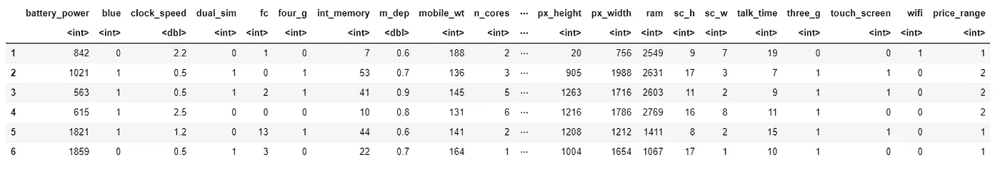

Figure 2: Dataset Head

summary 函数为我们提供了数据集中每个要素的简要统计描述。根据所考虑特征的性质，将提供不同的统计数据:

*   **数值特征:**均值、中位数、众数、极差、四分位数。
*   **因子特征:**频率。
*   **因子和数字特征的混合:**缺失值的数量。
*   **人物特征:**长班之长。

Factors 是 R 中使用的一种数据对象，用于将数据(例如整数或字符串)分类并存储为级别。例如，它们可用于一个特征的热编码或创建条形图(我们将在后面看到)。因此，当处理具有很少唯一值的列时，它们特别有用。

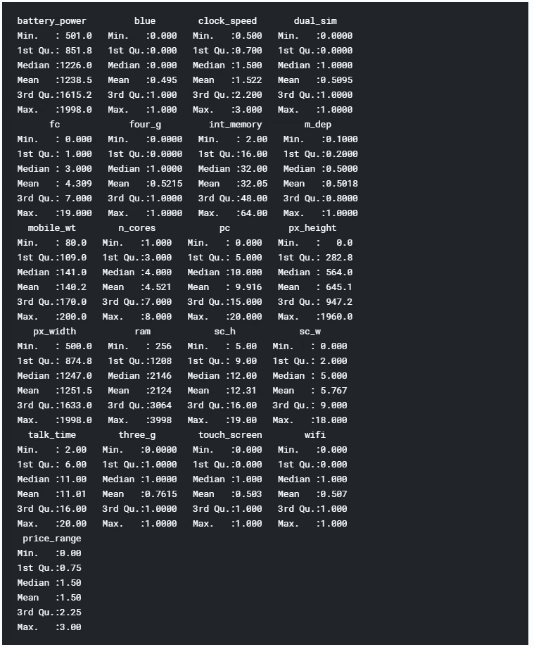

Figure 3: Dataset Summary

最后，我们现在可以使用下面的代码检查我们的数据集是否包含任何非数字(NaNs)值。

从图 4 中我们可以看到，没有发现缺失的数字。

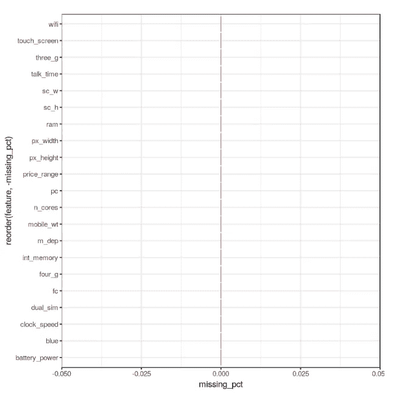

Figure 4: Percentage of NaNs in each feature

## 数据可视化

我们现在可以通过绘制数据集的关联矩阵来开始我们的数据可视化(图 5)。

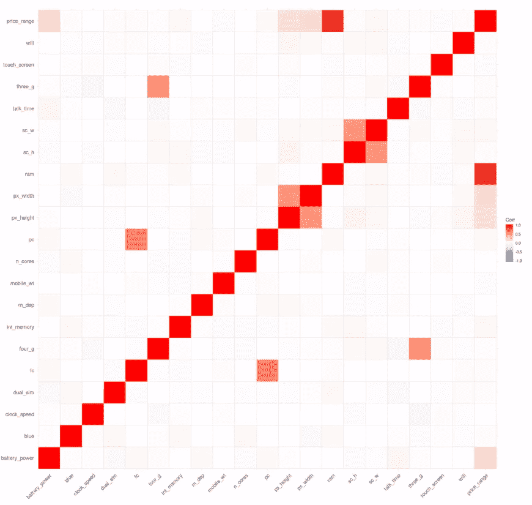

Figure 5: Correlation Matrix

接下来，我们可以开始使用条形图和箱线图分析单个特征。在创建这些图之前，我们需要首先将考虑的特征从数值转换为因子(这允许我们将数据分箱，然后绘制分箱后的数据)。

我们现在可以通过将它们存储在三个不同的变量(p1，p2，p3)中来创建三个条形图，然后将它们添加到***grid . arrange()***中来创建一个子图。在这种情况下，我决定检查蓝牙，双卡和 4G 功能。正如我们从图 6 中看到的那样，该数据集中考虑的手机中，略多的手机不支持蓝牙，是双卡，支持 4G。

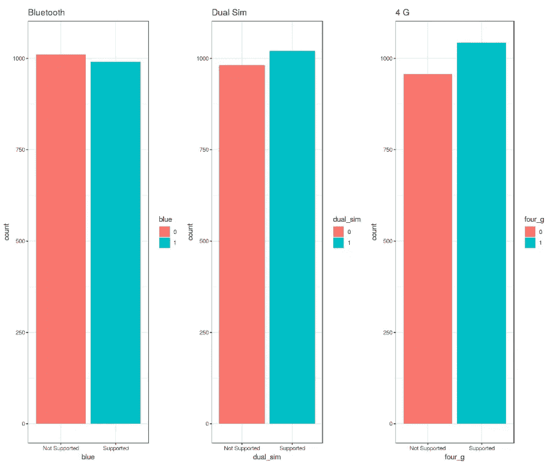

Figure 6: Bar Plot Analysis

这些图是使用 R ***ggplot2*** 库创建的。当调用 ***ggplot()*** 函数时，我们创建一个坐标系，我们可以在其上添加图层[2]。

我们给 ***ggplot()*** 函数的第一个参数是我们将要使用的数据集，而第二个参数是一个美学函数，我们在其中定义我们想要绘制的变量。然后，我们可以继续添加其他参数，如定义所需的几何函数(如柱状图、散点图、箱线图、直方图等)，添加绘图主题、轴限制、标签等…

进一步分析，我们现在可以使用 ***prop.table()*** 函数计算不同案例之间差异的精确百分比。从结果输出(图 7)中我们可以看到，50.5%的考虑移动设备不支持蓝牙，50.9%是双卡，52.1%有 4G。

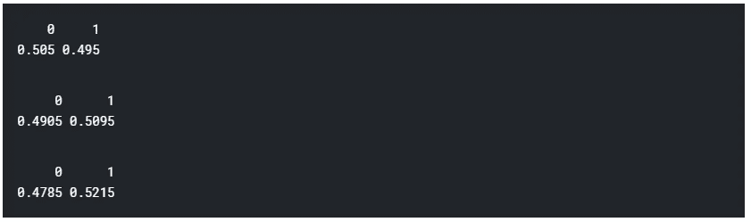

Figure 7: Classes Distribution Percentage

我们现在可以继续使用之前使用的相同技术创建 3 个不同的盒状图。在这种情况下，我决定研究更多的电池电量、手机重量和 RAM(随机存取存储器)如何影响手机价格。在这个数据集中，我们得到的不是实际的手机价格，而是一个价格范围，表示价格有多高(从 0 到 3 的四个不同级别)。

结果总结在图 8 中。增加电池功率和 RAM 会导致价格上涨。相反，更贵的手机似乎总体上更轻。在 RAM 与价格范围图中，有趣的是记录了总体分布中的一些异常值。

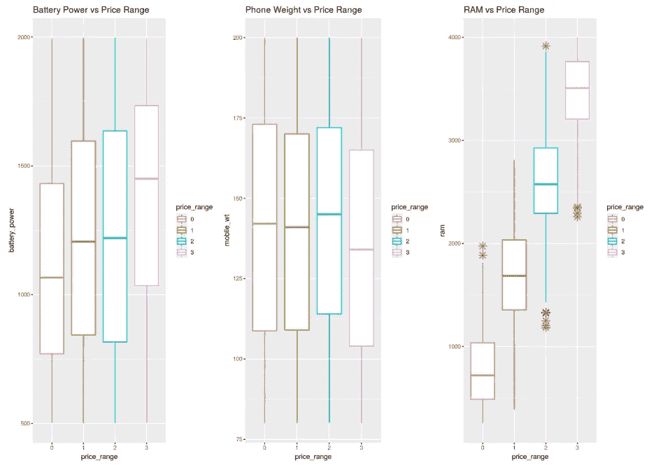

Figure 8: Box Plot Analysis

最后，我们现在将检查前置和主摄像头的百万像素摄像头质量分布(图 9)。有趣的是，前置摄像头分布似乎遵循指数衰减分布，而主摄像头大致遵循均匀分布。如果你有兴趣了解更多关于概率分布的信息，你可以在这里找到更多信息。

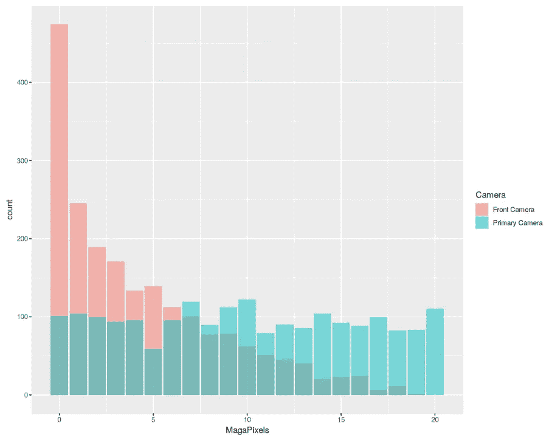

Figure 9: Histogram Analysis

## 机器学习

为了执行我们的机器学习分析，我们需要首先将我们的因素变量转换为数字形式，然后将我们的数据集划分为训练集和测试集(75:25 的比率)。最后，我们将训练集和测试集分成特征和标签( ***price_range*** )。

现在是时候训练我们的机器学习模型了。在这个例子中，我决定使用[支持向量机(SVM)](/svm-feature-selection-and-kernels-840781cc1a6c) 作为我们的多类分类器。使用 R ***summary()*** 我们可以检查我们训练好的模型的参数(图 10)。

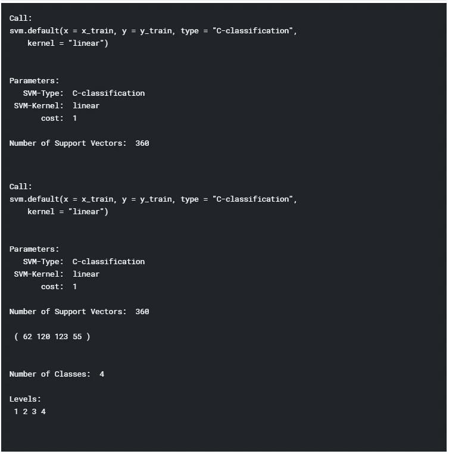

Figure 10: Machine Learning Model Summary

最后，我们现在可以测试我们的模型，在测试集上做一些预测。使用 R***confusion matrix()***函数，我们就可以得到我们的模型准确性的完整报告(图 11)。在这种情况下，记录的准确度为 96.6%。

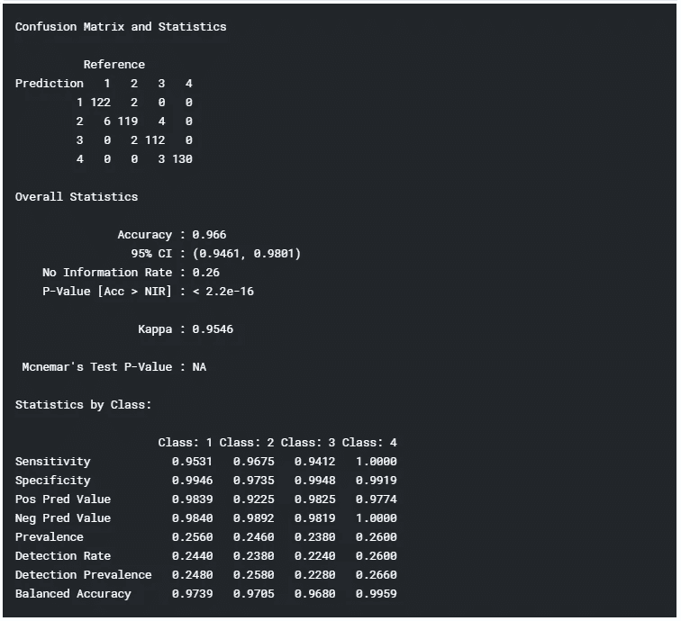

Figure 11: Model Accuracy Report

*我希望你喜欢这篇文章，谢谢你的阅读！*

# 联系人

如果你想了解我最新的文章和项目[，请通过媒体](https://medium.com/@pierpaoloippolito28?source=post_page---------------------------)关注我，并订阅我的[邮件列表](http://eepurl.com/gwO-Dr?source=post_page---------------------------)。以下是我的一些联系人详细信息:

*   [领英](https://uk.linkedin.com/in/pier-paolo-ippolito-202917146?source=post_page---------------------------)
*   [个人博客](https://pierpaolo28.github.io/blog/?source=post_page---------------------------)
*   [个人网站](https://pierpaolo28.github.io/?source=post_page---------------------------)
*   [中等轮廓](https://towardsdatascience.com/@pierpaoloippolito28?source=post_page---------------------------)
*   [GitHub](https://github.com/pierpaolo28?source=post_page---------------------------)
*   [卡格尔](https://www.kaggle.com/pierpaolo28?source=post_page---------------------------)

# 文献学

[1]2019 年哪些语言对数据科学家很重要？Quora。访问:[https://www . quora . com/2019 年哪些语言对数据科学家很重要](https://www.quora.com/Which-languages-are-important-for-Data-Scientists-in-2019)

[2] R 代表数据科学，Garrett Grolemund 和 Hadley Wickham。访问网址:[https://www . bio inform . io/site/WP-content/uploads/2018/09/rdata science . pdf](https://www.bioinform.io/site/wp-content/uploads/2018/09/RDataScience.pdf)