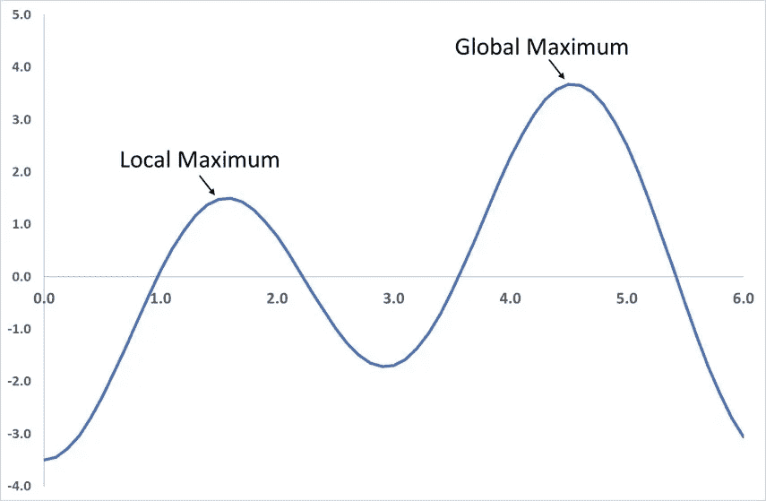

# Python 随机优化入门

> 原文：<https://towardsdatascience.com/getting-started-with-randomized-optimization-in-python-f7df46babff0?source=collection_archive---------11----------------------->


## 如何用 Python 的 mlrose 包使用随机化优化算法解决简单的优化问题

mlrose 提供实现一些最流行的随机化和搜索算法的功能，并将它们应用于一系列不同的优化问题领域。

在本教程中，我们将讨论什么是优化问题，并逐步通过一个例子来说明如何使用 *mlrose* 来解决它们。这是三个系列教程中的第一个。第二部分可以在这里找到，第三部分可以在这里找到。

# 什么是优化问题？

[Russell 和 Norvig (2010)](http://aima.cs.berkeley.edu/) 将优化问题定义为“目标是根据目标函数找到最佳状态”的问题

“国家”的含义取决于问题的背景。状态的一些例子是:

*   机器学习模型中使用的权重，例如神经网络；
*   在国际象棋棋盘上放置棋子；
*   在一个国家的地图上的所有城市的游览中所访问的城市的顺序；
*   为世界地图上的国家选择的颜色。

对我们来说，重要的是状态可以用数字来表示，理想情况下是一个一维数组(或向量)。

“最佳”的含义是由数学公式或函数(称为目标函数、适应度函数、成本函数或损失函数)定义的，我们希望最大化或最小化它。该函数接受一个状态数组作为输入，并返回一个“适合度”值作为输出。

输出适应值允许我们将输入的状态与我们可能考虑的其他状态进行比较。在这种情况下，状态数组的元素可以被认为是函数的变量(或参数)。

因此，优化问题可以简单地认为是一个数学函数，我们希望通过选择每个参数的最佳值来最大化/最小化它。

## 例子

五维一最大优化问题涉及找到使*适应度(x)*=*x0*+*x1*+*x2*+*x3*+*x4*最大化的状态向量 *x* = [ *x0，x1，x2，x3，x3，x4* 。

如果 x 的每个元素只能取值 0 或 1，那么这个问题的解就是*x*=【1，1，1，1，1】。当 *x* 设为等于这个最优值时，*适应度(x)* = 5，它可以取的最大值。

# 为什么使用随机优化？

对于上面给出的一个最大值的例子，即使解决方案不是立即显而易见的，也有可能计算所有可能的状态向量的适应值， *x* ，然后选择这些向量中的最佳向量。

然而，对于更复杂的问题，这不能总是在合理的时间内完成。随机化优化克服了这个问题。

随机化优化算法通常从初始“最佳”状态向量(或多个状态向量的群体)开始，然后随机生成新的状态向量(通常是当前“最佳”状态的邻居)。

如果新状态比当前的“最佳”状态更好，则新向量成为新的“最佳”状态向量。

重复该过程，直到不再可能找到比当前“最佳”状态更好的状态向量，或者如果在预先指定的尝试次数内找不到更好的状态向量。

不保证随机优化算法将找到给定优化问题的最优解(例如，该算法可能找到适应度函数的局部最大值，而不是全局最大值)。



然而，如果在算法的每一步进行足够多的尝试来寻找更好的状态，那么算法将返回问题的“好”解决方案。

在搜索优化问题的最优解所花费的时间和最终找到的解的质量之间存在权衡。

# 用 mlrose 解决优化问题

使用 *mlrose* 解决优化问题包括三个简单的步骤:

1.  定义一个适应度函数对象。
2.  定义一个优化问题对象。
3.  选择并运行随机优化算法。

为了说明这些步骤中的每一个，我们将通过 8 皇后优化问题的例子来工作，如下所述:

## 例如:8-皇后

在国际象棋中，皇后是棋盘上最有力的棋子。它可以攻击同一行、同一列或同一对角线上的任何棋子。在 8 皇后问题中，给你一个 8 x 8 的棋盘，上面有 8 个皇后(没有其他棋子),目的是将皇后放在棋盘上，这样它们就不会互相攻击。

显然，在这个问题的最佳解决方案中，棋盘的每一列都有一个皇后。所以我们只需要确定每个皇后的行位置，我们可以将这个问题的状态向量定义为 *x* = [ *x0，x1，x2，x3，x4，x5，x6，x7* ，其中 *x i* 表示皇后在 *i* 列中的行位置(对于 *i* = 0，1，…，7)。

因此，下图中的棋盘可以用状态向量 *x* = [6，1，7，5，0，2，3，4]来描述，其中假设棋盘的左下角位于第 0 列和第 0 行。


这不是 8 皇后问题的最佳解决方案，因为列 5、6 和 7 中的三个皇后正在对角地攻击彼此，列 2 和 6 中的皇后也是如此。

在开始这个例子之前，您需要导入 *mlrose* 和 *Numpy* Python 包。

```
import mlrose
import numpy as np
```

# 定义一个适应度函数对象

解决任何优化问题的第一步是定义适应度函数。这是我们最终想要最大化或最小化的函数，并且可以用来评估给定状态向量的适合度， *x* 。

在 8 皇后问题的上下文中，我们的目标是找到一个不存在攻击皇后对的状态向量。因此，我们可以将我们的适应度函数定义为评估给定状态的攻击皇后对的数量，并尝试最小化该函数。

*mlrose* 包含一系列常见优化问题的预定义适应度函数类，包括 N 皇后问题家族(8 皇后是其中一员)。预定义的`Queens()`类包括上述(8-)皇后适应度函数的实现。

我们可以为这个类初始化一个适应性函数对象，如下所示:

```
fitness = mlrose.Queens()
```

或者，我们可以把 8 皇后问题看作是一个目标是找到一个状态向量的问题，在这个状态向量中，所有的皇后对不会互相攻击。在这种情况下，我们可以将我们的适应度函数定义为评估给定状态的*非攻击*皇后对的数量，并尝试最大化该函数。

8-Queens 健身函数的定义不同于 *mlrose* 的预定义`Queens()`类所使用的定义，因此要使用它，我们需要创建一个自定义健身函数。这可以通过首先用形式为`fitness_fn(state, **kwargs)`的签名定义一个适应度函数来完成，然后使用 *mlrose* 的`CustomFitness()`类来创建一个适应度函数对象，如下所示:

# 定义一个优化问题对象

一旦我们创建了一个适应度函数对象，我们就可以使用它作为优化问题对象的输入。在 *mlrose* 中，优化问题对象被用来包含我们试图解决的优化问题的所有重要信息。

mlrose 提供了定义三种优化问题对象的类:

*   `DiscreteOpt()`:用于描述离散状态优化问题。离散状态优化问题是状态向量的每个元素只能取一组离散的值。在 *mlrose* 中，这些值被假定为 0 到( *max_val* -1)范围内的整数，其中 *max_val* 在初始化时定义。
*   `ContinuousOpt()`:用于描述连续状态的优化问题。连续状态优化问题类似于离散状态优化问题，除了状态向量中的每个值可以取在初始化时指定的 *min_val* 和 *max_val* 之间的连续范围内的任何值。
*   `TSPOpt()`:用于描述旅行推销员(或旅游)优化问题。旅行销售人员优化问题不同于前两种问题类型，因为我们知道最优状态向量的元素是整数 0 到( *n* -1)，其中 *n* 是状态向量的长度，我们的目标是找到这些整数的最优排序。

8 皇后问题是离散状态优化问题的一个例子，因为状态向量的每个元素必须取 0 到 7 范围内的整数值。

为了初始化离散状态优化问题对象，需要指定问题长度(即状态向量的长度，在本例中为 8)； *max_val* ，如上定义(也是 8)；在前一步骤中创建的适应度函数对象；以及该问题是最大化还是最小化问题。

对于这个例子，我们将使用上面定义的两个适应度函数对象中的第一个，所以我们想解决一个最小化问题。

```
problem = mlrose.DiscreteOpt(length = 8, fitness_fn = fitness,
                             maximize = False, max_val = 8)
```

然而，如果我们选择使用第二个(自定义)适应度函数对象，我们将处理一个最大化问题，因此，在上面的代码中，我们必须将*最大化*参数设置为*真*而不是*假*(此外还要更改*适应度 _fn* 参数的值)。

# 选择并运行随机优化算法

现在我们已经定义了一个优化问题对象，我们准备解决我们的优化问题。mlrose 包括(随机重启)爬山、随机爬山(也称为随机爬山)、模拟退火、遗传算法和 MIMIC(互信息最大化输入聚类)随机优化算法的实现。

对于离散状态和旅行推销员优化问题，我们可以选择这些算法中的任何一个。但是，在 MIMIC 的情况下，不支持连续状态问题。

对于我们的例子，假设我们希望使用模拟退火。要实现这个算法，除了定义一个优化问题对象，还必须定义一个调度对象(指定模拟退火温度参数如何随时间变化)；算法在每一步寻找“更好”状态的尝试次数(*max _ attempts*)；以及算法总体上应该运行的最大迭代次数( *max_iters* )。如果需要，我们还可以指定算法的开始状态( *init_state* )。

为了指定时间表对象， *mlrose* 包括预定义的几何、算术和指数衰减的衰减时间表类，以及一个用于定义您自己的衰减时间表的类，其定义方式类似于我们创建定制适应度函数对象的方式。

假设我们希望使用指数衰减时间表(具有默认参数设置)；在每个算法步骤中，最多尝试 10 次以找到“更好”的状态；将我们自己限制在算法的最多 1000 次迭代；并且从初始状态 *x* = [0，1，2，3，4，5，6，7]开始。这可以使用下面的代码来完成。

给定提供给它的参数值以及该状态的适合度值，该算法返回它能找到的最佳状态。

```
The best state found is:  [6 4 7 3 6 2 5 1]The fitness at the best state is:  2.0
```

运行这段代码为我们提供了 8 皇后问题的一个好的解决方案，但不是最优的解决方案。该算法找到的解决方案如下图所示:


解状态的适应度值为 2，表示棋盘上还有两对进攻皇后(0 列和 3 列的皇后；和第 6 排的两个皇后)。理想情况下，我们希望我们的解决方案的适应值为 0。

我们可以通过调整算法的参数来尝试改进我们的解决方案。算法的任何参数都可以调整。然而，在这种情况下，让我们只关注调整 *max_attempts* 参数，并将其从 10 增加到 100。

这一次当我们运行我们的代码时，我们得到一个适应度值为 0 的解，表明棋盘上没有一个皇后在互相攻击。

```
The best state found is:  [4 1 3 5 7 2 0 6]The fitness at the best state is:  0.0
```

这可以从下面得到证实:


# 摘要

在本教程中，我们定义了优化问题的含义，并通过一个简单的例子说明了如何使用 *mlrose* 来解决这些问题。这就是解决大多数优化问题所需的全部内容。

然而，有一种类型的问题我们到目前为止只是简单地涉及了一下:旅行销售人员优化问题。在本教程的第 2 部分，我们将通过一个例子来说明如何使用 *mlrose* 来解决这类问题。你可以在这里找到第二部分。

***要了解更多关于 mlrose 的信息，请访问这个包的 GitHub 资源库，这里有***[](https://github.com/gkhayes/mlrose)****。****

**Genevieve Hayes 博士是数据科学家、教育家、人工智能和分析专家，供职于*[*Genevieve Hayes Consulting*](https://www.genevievehayes.com/)*。你可以在*[*LinkedIn*](https://www.linkedin.com/in/gkhayes/)*或者*[*Twitter*](https://twitter.com/genevievekhayes)*上关注她。她还是* [*价值驱动数据科学*](https://www.genevievehayes.com/episodes/) *的主持人，这是一个每月两次的播客，面向寻求最大化其数据和数据团队价值的企业。**

**想要发掘企业数据的价值，但不知道从哪里开始？**[***下载免费的数据科学项目发现指南。*T50**](https://www.genevievehayes.com/discovery-guide/)**