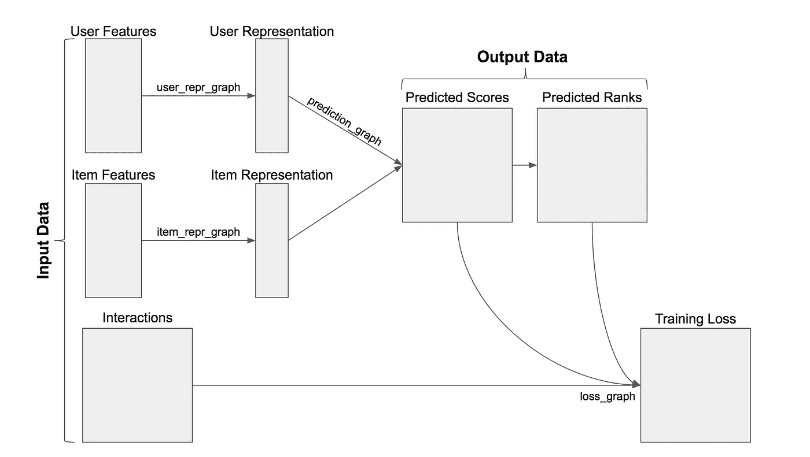

# 推荐系统和 TensorRec 入门

> 原文：<https://towardsdatascience.com/getting-started-with-recommender-systems-and-tensorrec-8f50a9943eef?source=collection_archive---------6----------------------->

## 一步一步建立推荐系统的原型。


推荐系统在许多产品中用于向用户呈现相关或个性化的项目(食物、电影、音乐、书籍、新闻等)。为此，他们从用户之前与物品的交互中学习，以识别用户的口味并改进未来的推荐。

这篇文章将带领我们使用 [TensorRec](https://github.com/jfkirk/tensorrec) 完成一个新的 Python 推荐系统的原型，包括输入数据操作、算法设计和预测的使用。

你可以从这篇文章的例子[这里](https://github.com/jfkirk/tensorrec/blob/master/examples/getting_started.py)找到 Python 代码。

# 系统概况

[TensorRec](https://github.com/jfkirk/tensorrec) 是一个用于构建推荐系统的 Python 包。TensorRec 推荐系统消耗三条输入数据:用户特征、项目特征和交互。基于用户/项目特征，系统将预测推荐哪些项目。在拟合模型时使用相互作用:将预测与相互作用进行比较，并计算损失/惩罚，系统学习减少损失/惩罚。



当我们制作系统原型时，我们将处理三个主要问题:我们如何处理交互，我们如何处理特征，以及我们如何构造推荐器本身。

# 交互数据

对于这个例子，我们将使用 [MovieLens 数据集](https://grouplens.org/datasets/movielens/)。该数据集包含电影的 1-5 星评级、关于这些电影的元数据以及用户应用于电影的标签。对于我们的第一个原型，我们将关注评级，但我们稍后将返回到其他元数据。

原始形式的评级如下所示:

```
userId, movieId, rating, timestamp
1,      1,       4.0,    964982703
1,      3,       4.0,    964981247
1,      6,       4.0,    964982224
1,      47,      5.0,    964983815
1,      50,      5.0,    964982931
1,      70,      3.0,    964982400
...
```

每行代表一个等级:一个用户对一部电影的看法。我们将使用这些评分作为我们的互动。我们训练这个系统的第一步是接收和格式化这些交互数据。首先，我们读入收视率的 CSV 文件。

在这一点上，我们将通过洗牌和分割评级来将评级分为训练和测试集。我们的原型将在训练集上进行训练，我们将使用测试集来评估它们的成功。像这样随机分割训练集/测试集是不成熟的，并且有更严格的模型评估技术，但是对于这个例子来说是快速和清晰的。

接下来，我们将这些评级重新组织到一个[稀疏矩阵](https://docs.scipy.org/doc/scipy/reference/sparse.html)中。在这个矩阵中，每行代表一个用户，每列代表一部电影。这个矩阵中的第[ *i，j* 个值是用户 *i* 与电影 *j* 的交互。

# 协作过滤器原型

协作过滤器是一种算法，它可以学习哪些用户有相似的品味，并根据相似用户的喜好向用户推荐商品。一种常见的方法是通过[矩阵分解](https://www.cs.cmu.edu/~mgormley/courses/10601-s17/slides/lecture25-mf.pdf)。在矩阵分解中，我们必须学习两个矩阵(用户表示和项目表示),当它们相乘时，近似交互:


From Wikipedia

在这种情况下， *W* 的行是用户表示， *H* 的列是项目表示， *V* 中的值是交互。需要学习 *W* 和 *H* 以产生*v*的最佳近似值

*W* 的宽度和 *H* 的高度是相同的——这个共享尺寸被称为“组件数量”具有更多组件的模型正在学习更复杂的用户和项目表示，但这可能会导致过度拟合训练数据。总的来说，我们希望将大量信息压缩到小的表示中。出于这个原因，在我们的原型中，我任意选择使用 5 个组件。当进一步构建原型时，我们应该尝试增加和减少组件的数量，并警惕过度拟合。

如果只给出单位矩阵作为用户/项目特征，TensorRec 将默认执行矩阵分解。这些单位矩阵通常被称为“指示器特征”

我们现在已经创建了两个指标特征矩阵，构建了一个包含 5 个组件的简单协作过滤器模型，并对模型进行了拟合！

接下来，当然，我们将想看看模型的表现如何。

为了做到这一点，我们将查看一个名为“K 处召回”的指标。Recall@K 表示，对于普通用户来说，他们的测试项目在预测排名中排在前 *K* 的百分比。换句话说，如果我们的 recall@10 值为 0.06，那么我喜欢的某部电影就有 6%的机会进入我的十大推荐。

Recall@K 对于许多推荐系统来说是一个很好的指标，因为它模拟了推荐产品的行为:如果一个电影网站只向我展示我的前 10 个推荐，那么他们的算法将希望有效地将我喜欢的电影放入我的前 10 个推荐中。

在计算召回之前，我们要决定哪些交互应该算作“喜欢”在这种情况下，我选择使用所有评分至少为 4.0 的评分作为“喜欢”，并忽略其他评分。

太好了！让我们来看看结果:

```
Matrix factorization collaborative filter:
Recall at 10: Train: 0.0008 Test: 0.0010
```

…不太好。这些结果告诉我们，在测试集电影中，喜欢的电影进入前 10 名的几率只有 0.1%。这个推荐系统是无效的，我们会想办法改进它。

# 损失图

配置 TensorRec 系统的一种方法是改变损耗图。损失图包含预测和交互，并计算系统在学习时试图减少的惩罚(损失)。

默认情况下，TensorRec 使用 RMSE(均方根误差)作为损失图。这意味着 TensorRec 正试图精确地估计交互的值:如果我给一部电影打 4.5 分，TensorRec 正试图产生一个精确的 4.5 分的预测分数。

这很直观，但它并不符合推荐系统在许多产品中的工作方式:一个电影网站不需要准确预测我的评级，它只需要能够将我喜欢的电影排在我不喜欢的电影之上。由于这个原因，许多系统通过“学习排序”来运行。我们可以通过使用称为 WMRB 的损耗图来使 TensorRec 系统以这种方式工作。

[WMRB，代表“加权边际-等级批量”，](https://arxiv.org/abs/1711.04015)的工作原理是随机抽取用户没有互动过的项目样本，并将他们的预测与用户喜欢的项目进行比较。随着时间的推移，这将用户喜欢的项目推到排名的顶部。

我们可以告诉 TensorRec 使用 WMRB，方法是在构建模型时指定它，并在拟合模型时指定样本批次的大小。在这种情况下，我们希望只训练正面评级(≥4.0)的模型，因此 WMRB 会将这些评级推到顶部。

让我们来看看结果:

```
WMRB matrix factorization collaborative filter:
Recall at 10: Train: 0.1098 Test: 0.0776
```

好多了！我们已经从一个喜欢的项目进入前 10 名的 0.1%的机会一直到 7.76%的机会。这是一个右损失函数有多大影响力的例子。TensorRec 允许您指定和定制自己的损失图，您可以在这里看到更多示例损失图[。](https://github.com/jfkirk/tensorrec/blob/master/tensorrec/loss_graphs.py)

# 添加元数据要素

为了继续实验，我们应该尽量利用其他可用的数据。在 MovieLens 示例中，我们可以使用电影元数据，比如电影的类型，来丰富推荐内容。

原始格式的电影元数据文件如下所示:

```
movieId, title,                    genres
1,       Toy Story (1995),         Adventure|Animation|Children|C...
2,       Jumanji (1995),           Adventure|Children|Fantasy
3,       Grumpier Old Men (1995),  Comedy|Romance
4,       Waiting to Exhale (1995), Comedy|Drama|Romance
...
```

首先，我们要读取这些数据，将电影映射到我们的内部 id，并跟踪每部电影的类型。然后我们将使用 [Scikit 的 multilabel binary izer](https://scikit-learn.org/stable/modules/generated/sklearn.preprocessing.MultiLabelBinarizer.html#sklearn.preprocessing.MultiLabelBinarizer)对流派标签进行二进制化。二值化的输出将成为我们新的推荐系统的特征。

运行该程序将打印出原始元数据和二进制类型的示例:

```
Raw metadata example:
['movieId', 'title', 'genres']
[0, 'Toy Story (1995)', ['Adventure', 'Animation', 'Children', 'Comedy', 'Fantasy']]Binarized genres example for movie Toy Story (1995):
[0 0 1 1 1 1 0 0 0 1 0 0 0 0 0 0 0 0 0 0]
```

# 基于内容的推荐

既然我们已经有了关于我们的项目的元数据，我们可以尝试的一件事就是仅仅基于项目元数据进行推荐。

为此，我们将配置一个 TensorRec 模型，对项目特征使用传递表示图。对我们来说，这意味着项目表示将与传入的项目特征相同(只是电影类型)，并且用户表示将反映用户有多喜欢该特定类型。

太好了！让我们来看看结果:

```
Content-based recommender:
Recall at 10: Train: 0.0471 Test: 0.0130
```

它没有排名协作过滤器好，但召回率为 1.3%，比我们的第一个协作过滤器有效得多。

这个系统有一个主要的弱点:仅仅是流派本身并不能很好的描述，也不能提供足够的信息来做出明智的推荐。如果我们有更多的描述性元数据(更多的标签、演员、子流派等)，我们可能会在这个基于内容的推荐系统上取得更大的成功。

另一方面，该系统有一个主要优点:通过仅依赖元数据特征，而不使用指示符特征，我们可以推荐在训练模型时不存在的电影。类似地，如果我们有有价值的用户元数据，我们可以避免使用用户指示器功能，并为从未与电影互动过的用户做出预测。这被称为“冷启动”推荐。

# 混合模型

我们知道我们的排名协作过滤器给了我们最好的结果，但似乎使用电影元数据也有一些价值。让我们将这两者结合起来:我们将使用指示器特性来获得协作过滤器的优势，我们还将使用内容特性来利用元数据。像这样结合了协同过滤和基于内容的推荐的系统被称为“混合”模型。

为此，我们将两组特征叠加在一起:

太好了！让我们来看看结果:

```
Hybrid recommender:
Recall at 10: Train: 0.1196 Test: 0.0794
```

凭借 7.94%的召回率，这是我们迄今为止最强的推荐系统。与纯协作过滤器 7.76%的结果相比，差异并不明显，但仍然是一个进步。如果我们使用比流派更多的元数据，我们可能会看到更大的影响。

# 提出建议

我们有一个经过训练的模型，现在我们可以使用这个模型为我们的用户提供建议。我们通过将用户的特征向量和所有项目特征传递给`predict_rank()`并检查结果排名来做到这一点:

这个代码片段将为用户 432 打印出前 10 个推荐。我选择用户 432 是因为我熟悉他们评价过的电影，所以我觉得我可以站在他们的立场上判断他们的推荐。我们应该注意，用户 432 已经评级的电影仍将被包括在内——如果我们想要过滤掉这些电影，我们将需要通过后处理步骤来完成。

让我们看看用户 432 的训练数据，看看他们喜欢什么类型的电影:

```
User 432 liked:
Usual Suspects, The (1995)
Pulp Fiction (1994)
Silence of the Lambs, The (1991)
Reservoir Dogs (1992)
Shawshank Redemption, The (1994)
Kill Bill: Vol. 1 (2003)
Social Network, The (2010)
Trainspotting (1996)
Arrival (2016)
My Big Fat Greek Wedding (2002)
```

一些犯罪，一些黑色喜剧，和一个著名的爱塔伦蒂诺。让我们看看用户 432 对我们混合模型的建议:

```
User 432 recommendations:
Seven (a.k.a. Se7en) (1995)
Usual Suspects, The (1995)
Pulp Fiction (1994)
Silence of the Lambs, The (1991)
Fargo (1996)
American Beauty (1999)
Fight Club (1999)
Shawshank Redemption, The (1994)
Departed, The (2006)
Memento (2000)
```

更多带有明显黑色喜剧倾向的犯罪电影！这看起来一目了然，但让我们检查用户 432 的测试电影:

```
User 432's held-out movies:
Fargo (1996)
American History X (1998)
Fight Club (1999)
Dark Knight Rises, The (2012)
```

《法戈》和《搏击俱乐部》都符合用户 432 的推荐——这是一个很好的结果！对于这个特定用户，我们实现了 50%的召回率。

# 前进

为了继续完善我们的推荐系统，我们应该试验更多的表示、预测和损失图，为系统提供更多的元数据，以不同的方式设计这些元数据功能，以不同的方式管理交互/反馈数据，并优化系统的各种超参数。

我最近有机会拜访了 T2，讨论了设计和部署推荐系统时的许多设计选择。你可以在这里找到这次演讲的视频[。](https://www.youtube.com/watch?v=xBMGr08fowA&t=3m58s)

如果您有任何问题，请在这里提问或[打开 GitHub 问题](https://github.com/jfkirk/tensorrec/issues)。