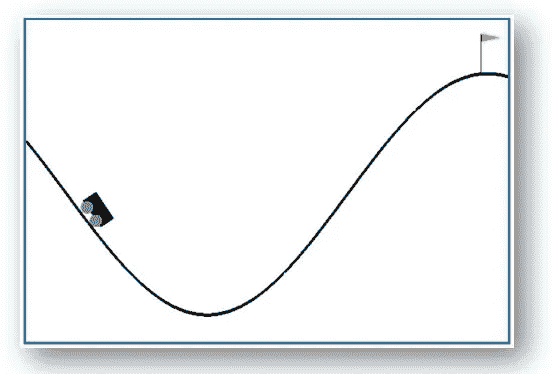
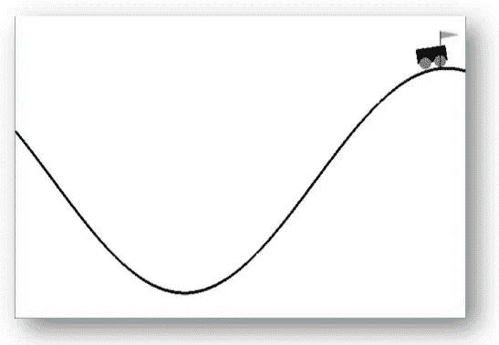
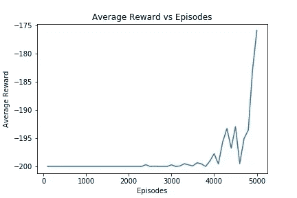

# 强化学习入门，开放 AI 健身房

> 原文：<https://towardsdatascience.com/getting-started-with-reinforcement-learning-and-open-ai-gym-c289aca874f?source=collection_archive---------2----------------------->


## 使用 Q-learning 解决山地汽车环境。

这是强化学习和开放 AI 健身房系列文章的第三篇。第一部可以在这里找到[，而第二部可以在这里](/the-other-type-of-machine-learning-97ab81306ce9)找到[。](/how-to-install-openai-gym-in-a-windows-environment-338969e24d30)

# 介绍

强化学习(RL)是机器学习的一个分支，它通过与反馈可能延迟的环境进行交互来处理学习。

虽然 RL 是一个非常强大的工具，已经成功地应用于从优化化学反应到教计算机玩视频游戏的各种问题，但由于缺乏有趣和具有挑战性的实验环境，它在历史上一直很难开始。

这就是 OpenAI 健身房的用武之地。

OpenAI Gym 是一个 Python 包，包含一系列 RL 环境，从简单的“玩具”环境到更具挑战性的环境，包括模拟机器人环境和 Atari 视频游戏环境。

它的开发目标是成为 RL 研究的标准化环境和基准。

在本文中，我们将使用 OpenAI Gym 山地汽车环境来演示如何开始使用这个令人兴奋的工具，并展示如何使用 Q-learning 来解决这个问题。

本教程假设您的计算机上已经安装了 OpenAI Gym。如果你还没有这样做，安装说明可以在[这里](/how-to-install-openai-gym-in-a-windows-environment-338969e24d30)找到 Windows，在[这里](https://github.com/openai/gym#installation)找到 Mac 或 Linux。

# 山地汽车问题



The OpenAI Gym Mountain Car environment

在 OpenAI 健身房网站上，对山地车问题描述如下:

> *汽车在一维轨道上，定位在两座“山”之间。目标是开车上右边的山；然而，这辆车的引擎不够强劲，不足以单程爬上这座山。所以，成功的唯一方法就是来回开车造势。*

汽车在任何时间点的状态都由一个包含其水平位置和速度的向量给出。汽车在两山之间的山谷底部(大约在-0.5 的位置)静止不动地开始每一集，当汽车到达旗子(位置> 0.5)或移动 200 次后，该集结束。

在每次移动时，汽车有三个可用的动作:向左推、向右推或什么都不做，每次移动(包括什么都不做)都要罚 1 个单位。这意味着，除非他们能在不到 200 步的时间内找到爬山的方法，否则他们总的“奖励”将是-200 个单位。

从这个环境开始，按如下方式导入并初始化它:

```
import gym
env = gym.make(‘MountainCar-v0’)
env.reset()
```

# 探索环境

一旦导入了山地汽车环境，下一步就是探索它。所有 RL 环境都有一个状态空间(即环境中所有可能状态的集合)和一个动作空间(即环境中可以采取的所有动作的集合)。

您可以使用以下方式查看这些空间的大小:

```
> print(‘State space: ‘, env.observation_space)
State space: Box(2,)> print(‘Action space: ‘, env.action_space)
Action space: Discrete(3)
```

这告诉我们，状态空间表示一个 2 维的盒子，所以每个状态观察是 2 个(浮点)值的向量，并且动作空间包括三个离散的动作(这是我们已经知道的)。

默认情况下，这三个动作由整数 0、1 和 2 表示。但是，我们不知道状态向量的元素可以取什么值。这可以通过以下方法找到:

```
> print(env.observation_space.low)
[-1.2  -0.07]>print(env.observation_space.high)
[0.6  0.07]
```

由此我们可以看出，状态向量的第一个元素(代表小车的位置)可以取-1.2 到 0.6 范围内的任何值，而第二个元素(代表小车的速度)可以取-0.07 到 0.07 范围内的任何值。

当我们在本系列的第一篇文章中介绍 Q-learning 算法时，我们说过，只要每个状态-动作对被访问足够多的次数，它就能保证收敛*。然而，在这种情况下，我们处理的是一个连续的状态空间，这意味着有无限多的状态-行动对，因此不可能满足这一条件。*

解决这个问题的一种方法是使用深度 Q 网络(dqn)。DQNs 通过使用深度神经网络作为 Q 函数的近似器，将深度学习与 Q 学习结合起来。dqn 已经成功应用于开发能够玩 Atari 视频游戏的人工智能。

然而，对于像山地车问题这样简单的问题，这可能有点矫枉过正。

另一种方法是将状态空间离散化。一种简单的方法是将状态向量的第一个元素四舍五入到最接近的 0.1，将第二个元素四舍五入到最接近的 0.01，然后(为了方便起见)将第一个元素乘以 10，将第二个元素乘以 100。

这将状态-动作对的数量减少到 855 个，这使得满足 Q 学习收敛所需的条件成为可能。

# q-学习回顾

在本系列的第一篇文章中，我们详细介绍了 Q-learning 算法。在执行该算法时，我们假设了一维状态空间，因此我们的目标是找到最优的 Q 表， *Q* ( *s* ， *a* )。

在这个问题中，由于我们处理的是二维状态空间，我们用 *Q* ( *s1* ， *s2* ， *a* )代替了 *Q* ( *s* ， *a* )，但除此之外，Q 学习算法基本保持不变。

概括地说，算法如下:

1.  初始化 *Q* ( *s1* 、 *s2* 、 *a* )，将所有元素设置为小随机值；
2.  观察当前状态，( *s1* ，*S2*)；
3.  根据探索策略，选择要采取的行动，*a*；
4.  采取行动 *a* 并观察产生的奖励 *r* ，以及环境的新状态(*S1’*，*S2’*)；
5.  根据更新规则更新 *Q* ( *s1* 、 *s2* 、 *a* ):

*Q'(s1，s2，a) = (1 — w)*Q(s1，s2，a) + w*(r+d*Q(s1 '，s2 '，argmax a' Q(s1 '，s2 '，a '))*

其中 *w* 为学习率 *d* 为折现率；

6.重复步骤 2–5，直到收敛。

# 开放式健身房的 Q-Learning

要在开放人工智能健身房实施 Q-learning，我们需要观察当前状态的方法；采取行动并观察行动的结果。这些可以按如下方式完成。

重置环境时，会返回环境的初始状态:

```
> print(env.reset())
array([-0.50926558, 0\. ])
```

要采取行动(例如， *a* = 2)，必须使用`step()`方法通过该行动“向前推进”环境。这将返回一个 4-ple，给出新的状态，奖励，一个布尔值，指示该情节是否已经终止(由于目标已经达到或 200 步已经过去)，以及任何附加信息(对于这个问题，它总是为空)。

```
> print(env.step(2))
(array([-0.50837305, 0.00089253]), -1.0, False, {})
```

如果我们假设一个ε-贪婪的探索策略，其中ε在总集数上线性衰减到指定的最小值(`min_eps`)，我们可以将上述所有内容与上一节中的算法放在一起，并产生以下用于实现 Q-学习的函数。

出于跟踪目的，该函数返回一个列表，其中包含 100 集每集的平均总奖励。它还使用`env.render()`方法可视化了最后 10 集的山地车运动。

环境只在最后 10 集可视化，而不是所有集，因为可视化环境会显著增加代码运行时间。

假设我们假设学习率为 0.2，贴现率为 0.9，初始ε值为 0.8，最小ε值为 0。如果我们运行 500 集的算法，在这些集的结尾，汽车已经开始明白它需要来回摇摆以获得爬山所必需的动量，但只能做到大约一半。

然而，如果我们将剧集数量增加一个数量级至 5000 集，到 5000 集结束时，汽车几乎每次都能完美地爬山。



Success!

绘制 5000 集的平均奖励与集数的关系图，我们可以看到，最初，平均奖励相当平稳，一旦达到最大 200 次移动，每次运行就终止。这是算法的探索阶段。



然而，在最后的 1000 集里，该算法采用了它通过探索学到的东西，并利用它来增加平均奖励，随着汽车学习爬山，这集现在以不到 200 个动作结束。

这个开发阶段是唯一可能的，因为给了算法足够的时间来探索环境，这就是为什么当算法只运行 500 集时，汽车不能爬山。

# 摘要

在本文中，我们展示了 RL 如何用于解决 OpenAI Gym 山地车问题。为了解决这个问题，有必要对我们的状态空间进行离散化，并对 Q-learning 算法进行一些小的修改，但是除此之外，所使用的技术与本系列第一篇文章中用于解决简单网格世界问题的技术相同。

但这只是 Open AI Gym 中可供用户使用的众多环境之一。对于有兴趣尝试自己在本文中学到的技能的读者，我建议尝试其他任何经典控制问题(此处提供),然后继续讨论 2D 盒子问题。

通过不断修改和构建 Q-learning 算法，应该有可能解决 OpenAI Gym 用户可用的任何环境。然而，和所有事情一样，第一步是学习基础知识。这就是我们今天成功做到的。

**想了解更多关于价值驱动的数据科学的信息吗？** [**加入我的邮件列表，让我的最新文章和建议直接发送到你的收件箱。**](http://www.genevievehayes.com/)