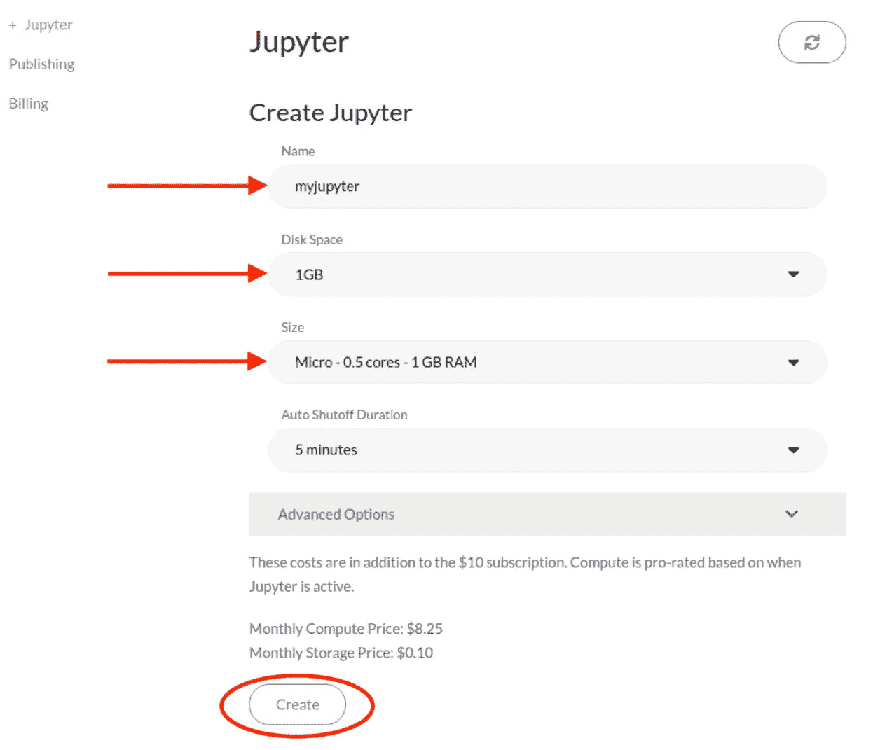
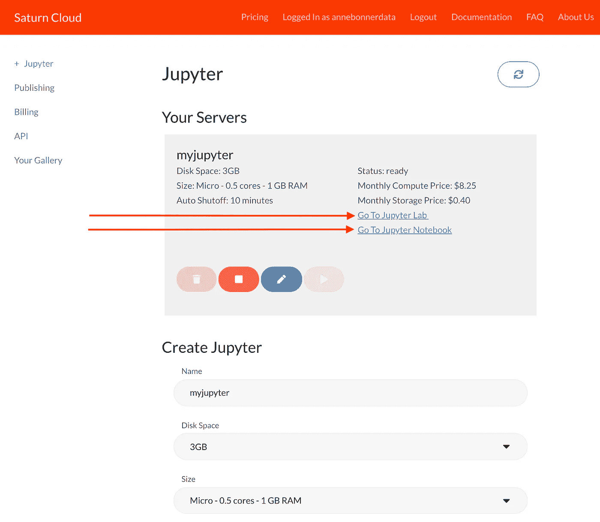
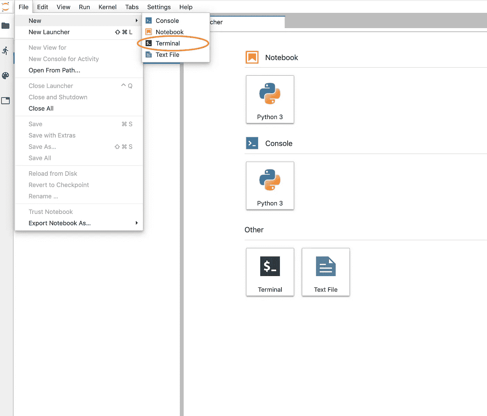
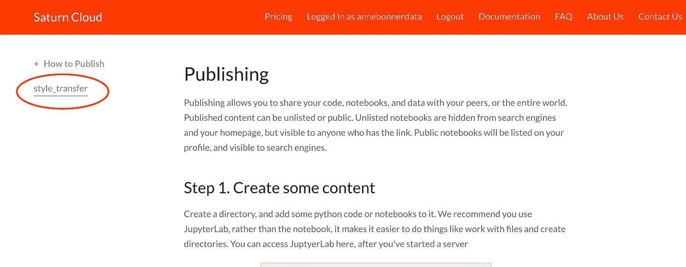
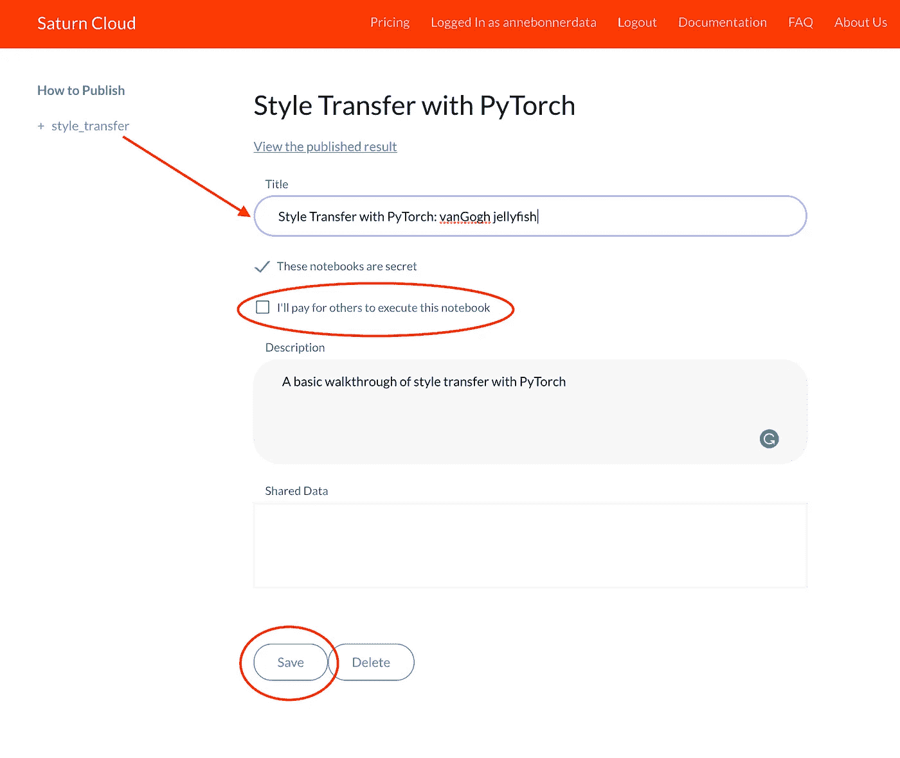
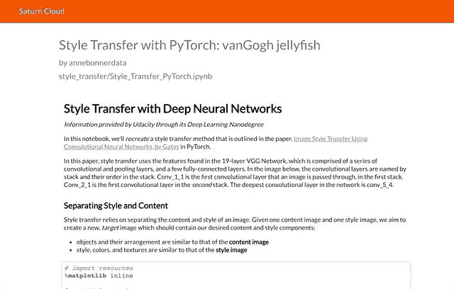

# 如何使用 Saturn Cloud 轻松创建、发布甚至共享云托管的 Jupyter 笔记本

> 原文：<https://towardsdatascience.com/getting-started-with-saturn-cloud-jupyter-notebooks-b3f509a500ef?source=collection_archive---------8----------------------->

## 用土星云以闪电般的速度在 Jupyter 笔记本上创建、运行和协作的完全初学者指南


Image by [Mary Gorobchenko](https://pixabay.com/users/margodeco-5842268/?utm_source=link-attribution&utm_medium=referral&utm_campaign=image&utm_content=2887882) from [Pixabay](https://pixabay.com/?utm_source=link-attribution&utm_medium=referral&utm_campaign=image&utm_content=2887882)

**很难不爱** [**土星云**](https://www.saturncloud.io/?source=ab-1) **。**

Saturn Cloud on [YouTube](https://www.youtube.com/watch?v=0Mj5Kx-vBU8)

我最近开始使用一个名为土星云的托管 Jupyter 服务，它很神奇。

[土星云让生活变得简单。](https://www.saturncloud.io/?source=ab-1)

有了土星云，运行云托管的 Jupyter 笔记本变得异常容易。你点击几个按钮，你就完全设置好了。您可以创建、运行、发布甚至共享 Jupyter 笔记本了。你甚至可以与其他人合作！对于数据科学家来说，在他们的 Jupyter 笔记本上使用基于云的计算可能是最简单的方法。这是我发现的唯一能让你立即(而且毫无痛苦地)做到的方法！)发布并与全世界分享您的笔记本。

> 如果你想确切地看到**设置土星云并共享你的笔记本有多快多轻松，向下滚动到“设置土星云”**

****

**Image by [Peter Mill](https://pixabay.com/users/peterstuartmill-145662/?utm_source=link-attribution&utm_medium=referral&utm_campaign=image&utm_content=255564) from [Pixabay](https://pixabay.com/?utm_source=link-attribution&utm_medium=referral&utm_campaign=image&utm_content=255564)**

**数据科学环境正在发生变化。无论你是经验丰富的专业人士还是在校学生，分享你的工作变得越来越重要。几乎不费吹灰之力就能在笔记本上发布和协作，这太棒了！**

**没有其他简单的方法可以让您的团队共享笔记本进行协作。(至少在没有雇人安装的情况下不会...)如果你刚出校门，这是一个很大的坎！对于那些已经雇佣了昂贵的数据科学家的公司来说，这也是一个问题，他们需要专注于数据，而不是试图找到某种解决方法。有了土星云，就简单得可笑了。**

## **[Jupyter 笔记本](https://jupyter.org/)**

**Jupyter 笔记本是最好的之一(免费！)工具，帮助您获得在大量数据相关领域高效工作所需的技能。它们是数据科学、机器学习、深度学习、人工智能等的理想工具。它们不仅可以保存代码，还可以保存丰富的文本元素，比如图像、图形、链接等等。这使得他们成为一个完美的地方，把分析，你的结果，以及正在发生的事情的描述。**

**还有大约一百万种方法可以定制您的 Jupyter 笔记本，让它变得令人惊叹…**

**[](/how-to-effortlessly-optimize-jupyter-notebooks-e864162a06ee) [## 技巧、窍门、诀窍和魔法:如何毫不费力地优化您的 Jupyter 笔记本电脑

### 让 Jupyter 笔记本变得更好、更快、更强、更光滑、更棒的完整初学者指南

towardsdatascience.com](/how-to-effortlessly-optimize-jupyter-notebooks-e864162a06ee) 

如果你不熟悉 Jupyter 笔记本，一旦你知道你在做什么，使用它们会非常简单。开始使用 Anaconda 和 Jupyter 笔记本可能会有一些小问题，但是一旦你设置好了，就可以轻松使用它们，并且定制它们非常有趣。

> 如果您在设置时遇到问题，您可能想看看这篇文章:

[](/how-to-successfully-install-anaconda-on-a-mac-and-actually-get-it-to-work-53ce18025f97) [## 如何在 Mac 上成功安装 Anaconda(并让它实际工作)

### 正确安装 Anaconda 和修复可怕的“找不到 conda 命令”错误的快速而简单的指南

towardsdatascience.com](/how-to-successfully-install-anaconda-on-a-mac-and-actually-get-it-to-work-53ce18025f97) 

尽管它们很容易使用，但要启动并运行云托管服务通常很困难。有很多人已经完全陷入了试图让他们的笔记本电脑运行云提供商的困境。

这就是土星云出现的地方！

[](https://www.saturncloud.io/?source=ab-1)

## [土星云](https://www.saturncloud.io/?source=ab-1)

> 如果你能弄清楚如何在[亚马逊](http://amazon.com)上订购东西，你就能在土星云上建立起来。

首先也是最重要的，土星云是由几个非常不可思议的人领导的:

*   **雨果·史**是[蟒蛇](https://anaconda.org/)的联合创始人。他在金融部门的数据科学领域工作了 5 年( [JP 摩根](https://www.jpmorgan.com/country/US/en/jpmorgan)、[都铎投资公司](https://www.tudor.com/)和 [Teza Technologies](https://www.teza.com/) )。他还花了 5 年时间在 Enthought 和 Anaconda 开发数据科学工具。
*   **塞巴斯蒂安·梅蒂**是 [Resolute.ai](https://resolute.ai/) 的联合创始人。他在管理咨询方面有丰富的经验，他了解业务问题、战略和增长。

(你可以在这里找到相关信息。)

我很幸运能花一点时间和他们交谈，我可以告诉你，他们是一些非常不可思议的人。

> 完全披露:我有机会与他们交谈的原因是因为我为土星云做了一点工作(并得到了他们的报酬)。另一方面，这意味着我已经了解了他们是一个多么伟大的团队，我也有机会了解他们所提供的东西！

有一些服务提供云托管的 Jupyter 笔记本，如[谷歌云](https://cloud.google.com/)和[亚马逊 SageMaker](https://aws.amazon.com/sagemaker/) 。这些都是很好的选择！但是它们并不总是那么容易使用。已经有很多关于让你的 Jupyter 笔记本在 [Azure](https://docs.microsoft.com/en-us/azure/notebooks/tutorial-create-run-jupyter-notebook) 、 [Google Cloud](/running-jupyter-notebook-in-google-cloud-platform-in-15-min-61e16da34d52) 和 [SageMaker](https://medium.com/data-science-bootcamp/jupyter-notebook-on-amazon-sagemaker-getting-started-55489f500439) 上运行的文章。当你阅读文章时，你可以看到一些平台肯定比其他平台更容易。如果你想把事情做好，通常需要很多步骤。

另一方面，建立土星云几乎毫不费力。


Image by [Bolanu Teslaru Andrei](https://pixabay.com/users/abolanu-5139348/?utm_source=link-attribution&utm_medium=referral&utm_campaign=image&utm_content=2288404) from [Pixabay](https://pixabay.com/?utm_source=link-attribution&utm_medium=referral&utm_campaign=image&utm_content=2288404)

土星云是简单的，免费的，每个人都可以使用，完全不费力。

## 建立土星云

土星云的建立再简单不过了。你只需点击几个按钮就能让一切正常工作。大约需要两分钟。

如果你能弄清楚如何在亚马逊上订购东西，你就能在土星云上建立起来。

你可以在这里找到官方文档，但是你需要做的就是注册，然后你就会被放到你的仪表盘上。你将命名你的 Jupyter，选择你需要多少磁盘空间，你想要多少 ram/CPU/GPU，然后点击“创建”

您可能会在一分钟内启动并运行！

> 如果你是那种做完后忘记按停止键的人，确保你设置了自动关机，这样你就可以避免不必要的费用！



现在，您将看到一个指向您的 Jupyter 笔记本的链接和一个指向您的 Jupyter 实验室的链接。如果您想直接进入笔记本并开始使用，只需点击 Jupyter 笔记本的链接。您将看到一个启动 Jupyter 的播放按钮，一个停止 Jupyter 运行的停止按钮，一个修改服务器的编辑按钮，以及一个删除 Jupyter 的垃圾桶图标。



如果愿意，您甚至可以定制您的 Python 和 Linux 环境。如果您想在主目录中创建新环境，请查看高级选项。

就是这样！你被陷害了！

点击“去 Jupyter 笔记本”，建立一些不可思议的东西！

## 发布和共享

如果你想分享你的笔记本，这是难以置信的简单。[你可以在这里找到详情](https://www.saturncloud.io/docs/publishing?source=ab-1)。你只需要在你的 Jupyter 实验室里打开一个终端。



运行下面这行简单的代码，将“笔记本”替换为您的文件夹或笔记本的名称:

```
publish ~/notebooks
```

重新加载“如何发布”页面，您将在屏幕上看到已发布笔记本的名称。单击您的笔记本名称以配置其发布方式。您可能需要更改标题或添加描述。你肯定要决定笔记本是否保密，是否要让别人匿名执行你的笔记本。(这些执行的计算费用将记入您的账户。)一切都清晰得令人难以置信，所以不用担心会有惊喜！



Reload the page and click on your notebook



Make some changes if you feel like it!

现在你有一个发布的笔记本，看起来很棒！

与世界分享！



[头过来自己看看](https://www.saturncloud.io/privpub/annebonnerdata/5510f9b8d35044fbb00efce545c0d279/style_transfer/Style_Transfer_PyTorch.ipynb)！

有了土星云，你就拥有了 Jupyter 笔记本的所有优势，难以置信的速度，你甚至可以发布和分享你的作品。如果您厌倦了免费选项的缺点，并且您希望能够现在就开始并专注于您的数据，而不是跳过一堆圈，请看看土星云。

你还在等什么？


Image by [Alexandr Ivanov](https://pixabay.com/users/ivanovgood-1982503/?utm_source=link-attribution&utm_medium=referral&utm_campaign=image&utm_content=1482630) from [Pixabay](https://pixabay.com/?utm_source=link-attribution&utm_medium=referral&utm_campaign=image&utm_content=1482630)

感谢阅读！像往常一样，如果你用这些信息做了什么惊人的事情，请在下面的评论中让大家知道，或者随时在 LinkedIn [@annebonnerdata](https://www.linkedin.com/in/annebonnerdata/) 上联系。

当然了，

[](https://mailchi.mp/00c59b0317a3/content-simplicity)**