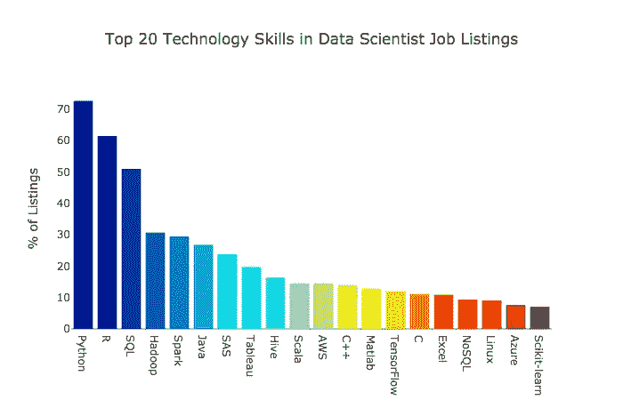

# 开始使用 TabPy

> 原文：<https://towardsdatascience.com/getting-started-with-tabpy-268f1da881cd?source=collection_archive---------5----------------------->

## 集成 Tableau 和 Python 的介绍

在任何领域，保持弹性和适应性，勤奋地接触新的工具和想法都是至关重要的。在像数据科学这样年轻的领域，自学和接受新的挑战变得越来越重要。当我进入数据科学训练营的最后一个月时，我回想起我在课程开始时看到的下图。



[https://towardsdatascience.com/the-most-in-demand-skills-for-data-scientists-4a4a8db896db](/the-most-in-demand-skills-for-data-scientists-4a4a8db896db)

[Jeff Hale](https://towardsdatascience.com/@jeffhale) 浏览了几个职位列表网站，列出了数据科学职位招聘中最常见的技术技能。虽然我的训练营已经涵盖了大量的这些技能，但该计划不可能详尽地介绍与数据科学相关的技能。对于我没有学到的技能，仅仅因为它们没有在项目中介绍，并不意味着它们在我的职业生涯中不会有用。如果他们真的出现了，我想确保我准备好最好地利用现有的资源和我现有的知识来发展对这些技能的全面理解。

在这篇博客中，我决定深入其中一个我们在训练营中没有涉及到的相关概念。我之前听说过几次 Tableau，但是我从来没有用过。我了解它作为数据可视化工具的功能，可以轻松连接到多个数据源，并允许用户构建仪表板，但除此之外我知道的不多，所以我决定进行调查。一旦我下载了免费试用版(【https://www.tableau.com/products/trial】T2)，我就导入了一个 CSV 文件，这个文件是我在最近的[项目](https://github.com/kahartman2/beautiful_coffee)中使用的，使用的数据来自[詹姆斯·勒杜](https://github.com/jldbc/coffee-quality-database)。这个文件包含了大量关于咖啡豆及其质量的数据。一旦导入了文件，我就可以在 Tableau 的一个表中查看数据，如下所示。


导入这个数据集后，我惊喜地发现，用以用户为中心的界面创建数据可视化非常简单。数据集功能列在工作簿的左侧，并且自动生成与每个豆的原产地相关联的地理坐标。我可以简单地将下面列出的度量拖到一个标有“列”和“行”的区域来生成可视化。


为了创建下面的热图，我将“纬度”和“经度”标签拖到“列”和“行”条目中，如下所示。


为了创建下面的散点图，我简单地将“香气”和“回味”字段拖到“列”和“行”条目中。接下来，我单击“香气”和“回味”标签右侧的箭头，选择标准偏差作为要显示的测量单位。


在创建了热图、散点图和其他一些基本的可视化之后，我对如何将 Python 和 Tableau 集成在一起感到好奇。我发现使用 API Tableau Python Server(tabby)可以很容易地实现这一点，它支持 Python 代码的远程执行。

## 用 TabPy 连接 Tableau

为了集成 TabPy 和 Tableau，我克隆了下面的 Github 库。

[](https://github.com/tableau/TabPy) [## 表格/标签

### 动态执行 Python 代码并在 Tableau 可视化中显示结果-Tableau/tabby

github.com](https://github.com/tableau/TabPy) 

接下来，使用存储库上的指令和这里的指令，我遵循以下步骤:

1.通过在命令行中键入以下命令来安装 tabby-server。

```
pip install tabpy-server
```

2.在克隆的存储库中，转到路径 tabpy-server/tabpy_server。

3.运行文件 tabpy.py。为了运行这个文件，我需要将文件*common/config . py . template*改为 *common/config.py.*


4.打开 Tableau 工作簿。按照路径*帮助>设置和性能>管理外部服务连接到*在 Tableau 上选择外部服务连接。


## 使用 TabPy 在 Tableau 中运行 Python

此时，连接被设置为在 Tableau 工作簿中运行 Python 代码。这可以通过填写计算字段来完成。


计算字段遵循以下示例中的常规格式。


[https://github.com/tableau/TabPy](https://github.com/tableau/TabPy)


[https://github.com/tableau/TabPy/blob/master/TableauConfiguration.md](https://github.com/tableau/TabPy/blob/master/TableauConfiguration.md)

函数可以以 SCRIPT_REAL、SCRIPT_INT、SCRIPT_STR、SCRIPT_BOOL 开头，代表函数返回类型。在引号内，输入被称为 _arg1、_arg2、…、_argN。右引号后面是逗号和参数定义。据 Tableau 网站上的一个社区[帖子](https://community.tableau.com/thread/236479)称，这些都是表格计算，所以必须聚合，比如 SUM()、MAX()、MIN()、ATTR()。

## 后续步骤

这篇博客文章仅仅提供了一个关于 Tableau 和 TabPy 的概述。还有很多其他功能。Tableau 可以连接到其他数据源，并可以创建不断更新的实时仪表板。我只是想了解如何将 Python 整合到 Tableau 中，当然还有其他方法可以整合 Python。下面的链接包括描述如何使用 Tableau 的其他资源以及合并 Python 的更高级方法，如机器学习模型。我计划利用这些资源继续我对 Tableau 的探索，并希望进一步提高我整合 Python 和 Tableau 知识的能力。

[](https://www.tableau.com/about/blog/2017/1/building-advanced-analytics-applications-tabpy-64916) [## 用 TabPy 构建高级分析应用程序

### 回到 11 月，我们引入了 TabPy，使得在 Tableau 计算字段中使用 Python 脚本成为可能。当你…

www.tableau.com](https://www.tableau.com/about/blog/2017/1/building-advanced-analytics-applications-tabpy-64916)  [## Tableau 和 Python 集成|Tableau 社区论坛

### 必须了解表格计算，包括了解维度和度量如何影响…

community.tableau.com](https://community.tableau.com/docs/DOC-10856) [](https://www.datacamp.com/community/tutorials/data-visualisation-tableau) [## 使用 Tableau 实现数据可视化

### 作为数据分析师，我们的目标是以这样一种方式整理我们数据的洞察力，使每个看到它们的人都能够…

www.datacamp.com](https://www.datacamp.com/community/tutorials/data-visualisation-tableau) [](https://www.tableau.com/learn/training?qt-training_tabs=1#qt-training_tabs) [## Tableau 培训和教程

### 学习你在做深入的数据准备和分析吗？负责给别人创作内容？如果你有画面…

www.tableau.com](https://www.tableau.com/learn/training?qt-training_tabs=1#qt-training_tabs)