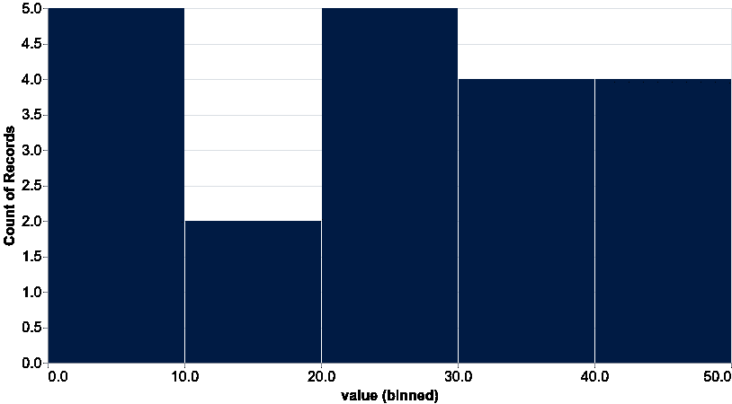

# TensorFlow.js 入门

> 原文：<https://towardsdatascience.com/getting-started-with-tensorflow-js-d74c7085fc0b?source=collection_archive---------20----------------------->

## 学习 TensorFlow.js 的基本构建模块，并在浏览器中使用 JavaScript 构建您的第一个(简单)模型


> TL；DR 通过 TensorFlow.js 了解机器学习的基础知识-张量、基本可视化和训练一个将千克转换为磅的简单模型

那么这个东西 TensorFlow.js 是什么？

> [TensorFlow.js](https://www.tensorflow.org/js) 是一个用 JavaScript 开发和训练 ML 模型，并在浏览器或 Node.js 上部署的库

出于我们的目的，TensorFlow.js 将允许您建立机器学习模型(特别是深度神经网络)，您可以轻松地与现有或新的 web 应用程序集成。想想您的 ReactJs、Vue 或 Angular 应用程序通过机器学习模型的力量得到了增强。

**在浏览器中运行本教程的完整源代码:**

[](https://codesandbox.io/s/getting-started-tensorflow-js-3182j?fontsize=14) [## 入门-tensorflow-js - CodeSandbox

### 浏览器中 TensorFlow.js 基础教程。包括张量，可视化与 tfjs-vis 和建立一个…

codesandbox.io](https://codesandbox.io/s/getting-started-tensorflow-js-3182j?fontsize=14) 

# 张量

张量是 TensorFlow 的主要构件。它们是 n 维数据容器。你可以把它们想象成 PHP、JavaScript 等语言中的多维数组。这意味着你可以用张量作为标量，向量和矩阵值，因为它们是这些的推广。

每个张量包含以下属性

*   `rank` -尺寸数量
*   `shape` -每个尺寸的大小
*   `dtype` -数值的数据类型

让我们从创建第一个张量开始:

检查它的等级:

```
1
```

这证实了你的张量是一维的。让我们检查一下形状:

```
[3]
```

具有 3 个值的一维。但是你怎么能看到这个东西的内容呢？

```
Tensor {kept: false, isDisposedInternal: false …}
```

不是你所期望的，对吗？张量是自定义对象，有一个输出其值的 [print()](https://js.tensorflow.org/api/latest/#tf.Tensor.print) 方法:

```
Tensor
    [1, 2, 3]
```

当然，这些值不一定只是数字。您可以创建字符串的张量:

您可以使用 [tensor2d()](https://js.tensorflow.org/api/latest/#tensor2d) 创建矩阵(或二维张量):

```
[2, 3]
```

当我们开始开发模型时，有一些实用的方法会很方便。先说 [ones()](https://js.tensorflow.org/api/latest/#ones) :

```
Tensor
    [[1, 1, 1],
     [1, 1, 1],
     [1, 1, 1]]
```

您可以使用 [reshape()](https://js.tensorflow.org/api/latest/#reshape) 来改变张量的维度:

```
Tensor
    [[1, 2, 3],
     [4, 5, 6]]
```

# 张量数学

您可以使用 [add()](https://js.tensorflow.org/api/latest/#add) 进行元素相加:

```
Tensor
    [5, 7, 9]
```

和 [dot()](https://js.tensorflow.org/api/latest/#dot) 来计算两个张量的点积:

```
Tensor
    [[9, 12],
     [9, 12]]
```

最后，我们来看看[转置()](https://js.tensorflow.org/api/latest/#transpose):

```
Tensor
    [[1, 3],
     [2, 4]]
```

您可以将转置视为输入张量的翻转轴版本。

[看看所有的算术运算](https://js.tensorflow.org/api/latest/#Operations-Arithmetic)

# 使用 tfjs-vis 进行可视化

> tfjs-vis 是一个小型的浏览器可视化库，旨在与 TensorFlow.js 一起使用。

让我们从创建一个简单的条形图开始。以下是我们的数据:

现在，让我们使用[条形图()](https://js.tensorflow.org/api_vis/latest/#render.barchart)来呈现数据:

请注意，我们向渲染器提供了一个 DOM 元素作为图表的容器，当您想要将图表嵌入到应用程序中时，这可能会很方便。


让我们看看[直方图()](https://js.tensorflow.org/api_vis/latest/#render.histogram)并创建一个示例图表:



这两个图表的 API 非常一致。让我们做一个散点图:


[看看完整的 tfjs-vis API](https://js.tensorflow.org/api_vis/latest/)

# 训练你的第一个模型

是时候将你学到的东西付诸实践，并建立你的第一个模型。为了使它更真实，我们将尝试近似计算千克到磅的转换，它由以下函数描述:

让我们用它来准备数据并创建 2000 个训练示例:

我们将使用一种叫做[监督学习](https://en.wikipedia.org/wiki/Supervised_learning)的机器学习方式。简而言之，我们需要为我们的模型提供 2 个数组——X 是训练特征(千克)，y 是训练标签(相应的磅)。

TensorFlow.js 允许您使用 [sequential()](https://js.tensorflow.org/api/latest/#sequential) 构建分层模型。我们将非常简单:1 层，输入大小为 1，1 个学习参数:

并教它把千克换算成磅:

你的模型需要一个指标来知道做得有多好。在我们的例子中，这就是[均方误差(MSE)](https://en.wikipedia.org/wiki/Mean_squared_error) 。一旦你知道了如何测量误差，你就需要知道如何利用数据最小化误差。在我们的例子中，这就是[亚当优化器](https://js.tensorflow.org/api/latest/#train.adam)。

最后，我们使用这些数据为 *100* 个时期(我们的模型看到数据的次数)训练我们的模型，并请求洗牌。为什么洗牌？我们不希望我们的模型学习数据的排序，只是不同例子之间的关系。

训练完成后(可能需要一些时间)，您可以使用您的模型来预测 10 公斤对应的磅数:

```
10 kg to lbs: 22.481597900390625
```

看起来不错，对吧？

# 结论

祝贺你完成了机器学习理解之旅的第一部分。您了解了:

*   张量:n 维数据容器
*   tfjs-vis:与 TensorFlow.js 集成的可视化库
*   使用简单模型从千克预测磅

**在浏览器中运行本教程的完整源代码:**

[](https://codesandbox.io/s/getting-started-tensorflow-js-3182j?fontsize=14) [## 入门-tensor flow-js-code sandbox

### 浏览器中 TensorFlow.js 基础教程。包括张量，可视化与 tfjs-vis 和建立一个…

codesandbox.io](https://codesandbox.io/s/getting-started-tensorflow-js-3182j?fontsize=14) 

我希望这篇教程只是让你渴望了解机器学习和 JavaScript 的可能性。准备好下一个了吗？

*最初发表于*[*https://www.curiousily.com*](https://www.curiousily.com/posts/getting-started-with-tensorflow-js/)*。*

建立机器学习模型(特别是深度神经网络)，可以轻松地与现有或新的 web 应用程序集成。想想您的 ReactJs、Vue 或 Angular 应用程序通过机器学习模型的强大功能得到了增强:

[](https://leanpub.com/deep-learning-for-javascript-hackers) [## JavaScript 黑客的深度学习

### 建立机器学习模型(特别是深度神经网络)，您可以轻松地与现有或新的网络集成…

leanpub.com](https://leanpub.com/deep-learning-for-javascript-hackers) 

通过使用 Python 从头构建机器学习模型、工具和概念，加深对它们的理解

[](https://leanpub.com/hmls) [## 从零开始实践机器学习

### “我不能创造的东西，我不理解”——理查德·费曼这本书将引导你走向更深的…

leanpub.com](https://leanpub.com/hmls)