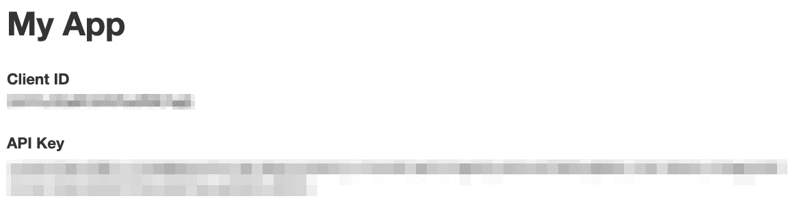

# Yelp API 入门

> 原文：<https://towardsdatascience.com/getting-started-with-the-yelp-api-ac30915a77ae?source=collection_archive---------25----------------------->

## 面向小型企业的数据科学

## 构建一种算法来帮助小企业利用 Yelp 数据。


这篇文章是我们探索小企业如何利用 Yelp 数据更好地了解他们在当地市场的地位的系列文章之一。在深入研究事实之前，我想先告诉你一些这个项目的灵感和目标。当然，如果你只是对技术部分感兴趣，你可以[在这里](https://medium.com/p/ac30915a77ae#906d)跳到它。

## 灵感

我在 2012 年搬到纽约市，在过去的七年里，我已经看到一些我最喜欢的当地企业倒闭。大牌品牌开始缓慢但稳步地进入。当然，我们可以整天谈论规模经济和租金上涨，但钱包的力量也允许大公司以小公司无法做到的方式利用大量数据。是我们开始缩小这一差距的时候了。

通过这个系列，我们将对阿斯托里亚我最喜欢的墨西哥餐馆之一进行分析:[查诺酒吧](https://www.yelp.com/biz/chanos-cantina-astoria)。

## 邻近地区

与纽约市其他更著名的街区不同，阿斯托里亚保持着独特的身份，有着一系列当地美食。毫无疑问，它得益于作为这个城市最多样化的区的邻居。但这也意味着每家餐馆都有众多的竞争对手，这让任何一家本地餐馆都更难脱颖而出。事实上，在 Yelp 上快速搜索阿斯托里亚的墨西哥餐馆会得到 24 页的结果。

## 目标

我们的目标很简单:确定感兴趣的业务的前五到十名竞争对手，然后使用自然语言处理和情感分析来确定公司做得好的地方和需要改进的地方。要做到这一点，需要大量的数据科学技术，我们将在本系列的每一部分逐一介绍。这些包括但不限于:

*   使用 Yelp API 访问数据
*   k 均值聚类
*   网页抓取
*   情感分析/自然语言处理
*   监督机器学习
*   神经网络

现在，你可能会问自己，一个不精通这种类型的分析的小企业应该如何实现所有这些？最终，我们希望将它部署在一个干净的模块中，只需要一些基本的输入:

*   **公司名称**(如 Yelp 上显示的):*查诺酒吧*
*   **地点**(邮编或城市，St): *纽约州阿斯托里亚*
*   **搜索词**(潜在客户可能用来在 Yelp 上找到该企业的任何短语或短语组合):*墨西哥餐厅酒吧*

不多说了，让我们开始构建并使用 Yelp API 进行设置。

# Yelp API

## 认证令牌

首先:如果你想使用 Yelp API 访问数据，Yelp 需要能够验证你的身份。这是通过[生成一个访问令牌](https://www.yelp.com/login?return_url=%2Fdevelopers%2Fv3%2Fmanage_app)来完成的。如果您还没有 Yelp 帐户，您需要创建一个。点击上面的链接，您应该会看到一个如下所示的页面:


为每个独立的项目创建一个具有不同的**应用名称**的新令牌是一个好主意。必填字段包括:

*   应用名称
*   工业
*   联系电子邮件
*   描述

不需要过多考虑这些，只需要尽你所能地填写，同意条款和条件(别担心，我检查过了，没有 human 厘泊条款)，然后为机器人确认你不是机器人。在下一页，您将获得一个**客户端 ID** 和**令牌**。



你会注意到我把自己的令牌模糊掉了，那是因为你不想和别人分享你的令牌。如果有恶意的人得到了你的令牌，他们可能会使用它来暂停你的帐户，甚至更糟。换句话说:


理想情况下，您会希望将这些保存为环境变量。关于这个主题的更多详细信息，[这篇文章](/how-to-hide-your-api-keys-in-python-fb2e1a61b0a0)是个很好的起点。

现在，您可以将这些硬编码到您的 Jupyter 笔记本中，如下所示:

```
client_id = your_unique_client_id
api_key = your_unique_api_key
```

## 给 Yelp 打电话

现在我们已经解决了这个问题，我们可以开始调用 Yelp API 来获取新数据了。在我们的例子中，我们想要搜索纽约阿斯托里亚的*墨西哥餐馆&酒吧*，并将结果保存到 dataframe 中。第一步是通过命令行安装 Yelp API。

```
pip install yelpapi
```

安装 API 后，您现在可以将它加载到任何 Jupyter 笔记本电脑中:

```
from yelpapi import YelpAPIyelp_api = YelpAPI(api_key)
```

很简单！现在，对 Yelp API 的请求需要三个部分:

*   **搜索词**:标准 Yelp 搜索中使用的搜索词。
*   **位置:**城市、街道或邮政编码
*   **搜索限制:**您想要多少个结果(最多 50 个)？

我们想在纽约的阿斯托里亚找到*墨西哥餐馆&酒吧*，所以我们将所需数据传递给一个搜索查询，如下所示:

```
term = 'Mexican restaurant bar'
location = 'Astoria, NY'
search_limit = 50response = yelp_api.search_query(term = term,
                                 location = location,
                                 limit = search_limit)type(response)--------------OUTPUT:
dict
```

如你所见，我们将搜索结果保存到一个*响应*变量中，它是一个字典。

## 将结果保存到数据框架

通过进一步的检查，我们会发现这个字典有三个键:

*   商业
*   总数
*   地区

出于我们的目的，我们对*业务*数据感兴趣。随着进一步的评估，你会发现这个键中的数据是一个字典列表，每个字典代表一个不同的业务，所有的字典都有相同的键。这允许我们将键列表设置为列名，并将值用作 dataframe 中的数据。我们可以用几行代码来实现这一点:

```
cols = list(response['businesses'][0].keys())
data = pd.DataFrame(columns=cols)for biz in response['businesses']:
    data = data.append(biz, ignore_index=True)data.head()
```

瞧啊。我们有一个数据框架，其中包含了我们在使用传统 Yelp 搜索时通常会看到的所有信息，但其格式可以用于分析。

## 结论

正如您所看到的，使用 Yelp API 访问数据非常简单和方便。在下一篇文章中，我们将看看分类标签，并使用 K-Means 聚类来找出哪些餐厅与 Chano's Cantina 最相似。我们将这些视为最直接的竞争对手，以便进行更深入的分析。

有关 Yelp API 更广泛功能的更多信息，请查看[文档](https://www.yelp.com/developers/documentation/v3/get_started)。