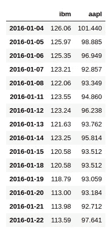
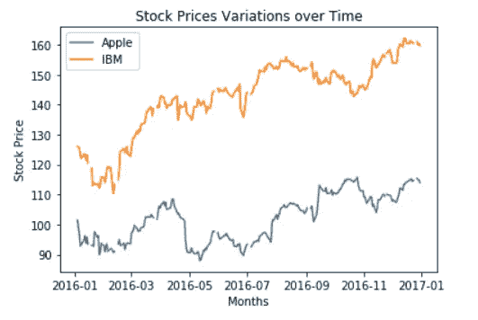
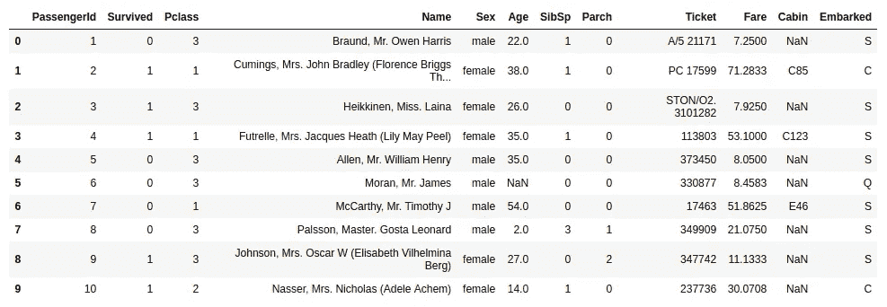

# Python 可视化入门

> 原文：<https://towardsdatascience.com/getting-started-with-visualizations-in-python-945d92b85823?source=collection_archive---------28----------------------->


Photo by [M. B. M.](https://unsplash.com/@m_b_m?utm_source=medium&utm_medium=referral) on [Unsplash](https://unsplash.com?utm_source=medium&utm_medium=referral)

想象任何事情都会让我们有更好的理解，对事情有一个整体的了解，无论是你公司每月的营业额，不断上升的温度，甚至是你可以跑得比其他人都快的紧张局势，相信我，后一种情况很有效。

> 艺术的目的不是表现事物的外表，而是表现其内在的意义。
> —亚里斯多德

可视化是一门艺术，它不仅仅是更好地呈现数据，而是实际上描绘出隐藏在数据深处的趋势、模式和其他迹象，光盯着数据是看不出来的。

这是任何想要从事数据科学的人都需要掌握的关键艺术之一，没有它，你将是不完整的，你的任务，你的任务将是不完整的，尤其是当你去找某人解释，为什么会发生这种情况？

让我们来看看一些最常见的情节；

# **先沉住气。**

> 难道我们不应该先看看这里需要什么来策划吗？

有如此多的开源库可供您使用，实际上需要做的是**将要**做的事情。

## 现在别跟我开玩笑了！

## 显然，你需要一台笔记本电脑和 **Jupyter 笔记本，也许还需要一些 Python 基础知识。**

让我们现在开始吧。

# 线形图:

> 折线图或折线图是一种图表，它将信息显示为由直线段连接的一系列数据点，称为“标记”。

这更像是一个散点图，只是中间有线条，它用于显示与正在进行或移动的因素相关的数据点。L

让我们用一个例子来观察这一点；



该数据代表股票在某一天的价值。

这里的索引包含了查询的日期，我们有一个单独的列用于不同的公司，在本例中是 IBM 和 Apple。

## 空谈不值钱。给我看看代码！

使用 **Plotly** 时要记住的事情。首先，您需要创建如下跟踪:

```
trace0 = go.Scatter(
    x= <List of values on x-axis>,
    y= <List of values on y-axis>,
    name= <Trace Name>
)
```

这将创建一个分散的对象，通常被称为跟踪。

一些智慧即将到来，**你可以做出任何数量的这些，并在同一个情节中表现出来。**

第二，布局，

```
layout = go.Layout(    
    title=go.layout.Title(        
        text= <Heading for your plot>
    ),
    xaxis=go.layout.XAxis(
        title=go.layout.xaxis.Title(
            text= <X-Axis Name>
        )
    ),
    yaxis=go.layout.YAxis(
        title=go.layout.yaxis.Title(
            text= <Y-Axis Name>
        )
    )
)
```

**plot ly . graph _ objs . graph _ objs . layout**提供了各种即兴创作和排列情节的方法，可以是颜色、字体，通常是任何东西。

太好了！这是上面代码的线图输出

> W 如果我想用 Matplotlib 代替 Plotly 呢？

非常欢迎你！

而这就给了我们下面的剧情。



# 直方图:

> 直方图是数字数据分布的精确表示。它是对连续变量的概率分布的估计。

## 抓住你了。首先，不要把它和条形图联系起来。

-直方图与条形图非常不同，因为条形图涉及两个变量，而直方图只涉及一个变量。

让我们来看看泰坦尼克号的数据集。



直方图有助于我们做出推论，比如如果我是一个有年龄的女孩，我活下来的概率是多少。

## 不，我不想成为一个女孩，我只是不想像杰克那样死去。

假设你得到了这个，让我们冲向代码。

**Plotly** 提供了不同的类，当输入数据时，可以产生惊人的结果， **plotly.figure_factory** 就是其中之一。

```
fig = ff.create_distplot(hist_data, #Used for finding distribution
                         group_labels, #Labels of the classes used
                         bin_size=1.5, #Width of the bin
                         colors = ['#393E46', '#2BCDC1'], 
                         show_rug=False)
```

## 看起来简单，输出花式！

看到这里，我们可以很容易地提供前一个问题的答案，**如果我是一个年龄在 18 岁到 35 岁之间的女孩，我很可能会幸存下来，**因为我们可以看到，女性的生存密度在 18 岁到 35 岁之间最高。罗斯活下来的证据之一，如果我们为男性设计，我们肯定会知道为什么杰克没有。

## 那不是很容易吗！

现在你们就像，

好吧，我会给你的。

# 箱线图:

> 这是一种通过四分位数图形化描述数字数据组的方法。

这家伙捕捉了很多信息，我是说**很多。**

它很好地显示了分布情况，即数据中的值如何分布。

它们是基于五个数字摘要(“最小值”、“第一个四分位数(Q1)”、“中值”、“第三个四分位数(第三季度)”和“最大值”)显示数据分布的标准化方式，这在一个图中包含了大量信息。

## 空谈不值钱！不用提醒我，我知道。

我们会考虑同样的泰坦尼克号的数据，但我们会考虑票价，而不是年龄。

类似于线图，我们有**plotly . graph objs . graph obj . Box**，我们可以用它来传递值，它会将其转换为盒图 obj。

```
trace0 = go.Box(
    x = train.loc[(train['Sex']=='female'), 'Fare'].dropna().values,
    name = "Female"
)
```

虽然你们很聪明，但盒子图更聪明。

看到这里，我们可以推断出，大多数男性乘客都是廉价旅行，而大多数女性乘客都有昂贵的机票，而且大多是高级别的。

# 现在泰坦尼克号对我来说是有意义的，杰克和罗斯在一起的原因，也是他没能活下来的原因。

# 数据说话。

[喜欢吗？喜欢吗？讨厌吗？给我写封信，我很想探索一下。](http://xs2pranjal.github.io)