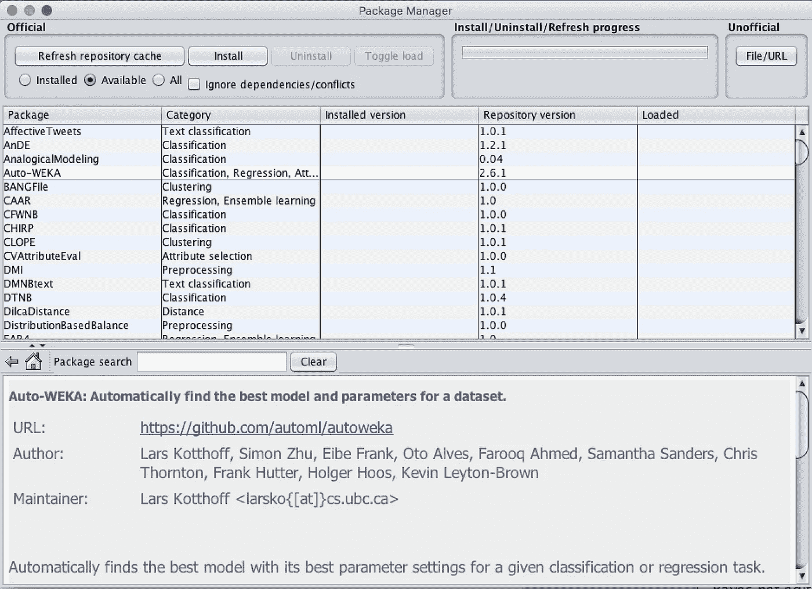

# Weka 3 入门 GUI 上的机器学习

> 原文：<https://towardsdatascience.com/getting-started-with-weka-3-machine-learning-on-gui-7c58ab684513?source=collection_archive---------5----------------------->

Weka Splash Screen

## 使用 Weka 构建机器学习模型的分步指南

eka 是一种不会飞的强壮的棕色鸟。名字读作[T3 这个](https://www.cs.waikato.ac.nz/ml/weka/sounds/weka-say.au)，鸟的声音读作[T7 这个](https://www.cs.waikato.ac.nz/ml/weka/sounds/weka-long.au)。它是美丽的新西兰岛上特有的，但这不是我们在本文中讨论的。在这篇文章中，我想向您介绍用于机器学习的 Weka 软件。WEKA 是 Waikato 环境的缩写，用于知识分析。它是由新西兰怀卡托大学开发的。它是一个开源的 Java 软件，拥有一组用于数据挖掘和数据探索任务的机器学习算法。这是一个非常强大的工具，用于理解和可视化本地机器上的机器学习算法。它包含用于数据准备、分类、回归、聚类和可视化的工具。

# 使用案例:

*   如果您刚刚开始学习机器学习和算法，那么 WEKA 是入门和探索不同算法的最佳工具，以了解哪一种算法最适合您的问题。
*   有时您有一个分类问题，但您不知道哪种算法可以解决它并获得最佳的精确结果。WEKA 是一种简单的方法，可以将许多不同的算法应用于您的数据，并查看哪一种算法会给出最好的结果。

# 安装:

安装软件非常简单，你只需要先安装 Java 8，然后从[这里](https://www.cs.waikato.ac.nz/ml/weka/downloading.html)下载适合你的平台的可执行文件。

安装后，导航到包管理器，开始安装任何学习方案和工具

GUI Chooser — Weka

我将安装和演示的第一个包是 [Auto-Weka](https://github.com/automl/autoweka) 。Auto-weka 是 weka 的 AutoML 实现。对于给定的分类或回归任务，它会自动找到具有最佳超参数设置的最佳模型。

安装完成后，您需要重启软件来加载库，然后我们就可以开始了。

> **注意:**有一个已知问题。为了通过 OSX 上的 WEKA GUI 使用 Auto-WEKA，WEKA 必须从命令行运行，而不是从 Mac 应用程序运行。例如:
> 
> CD/Applications/WEKA-3–8–1-Oracle-JVM . app/Contents/Java/
> 
> java -jar weka.jar

# 加载数据集:

Weka 还提供了一些数据集，你可以用它们来做实验。现在，让我们加载第一个数据集，并对其进行一些探索。在这个例子中，我将使用[虹膜数据集](https://archive.ics.uci.edu/ml/machine-learning-databases/iris/)。对于 Mac OSX，点击“**浏览器**”→**“打开文件”→/Volumes/WEKA-3–8–3/WEKA-3–8–3/data。**

加载数据集后，您可以看到 weka 会自动显示属性的一些统计数据(在左侧窗口中列出)，当您选择一个要素时，它会显示该特定要素的类分布。

您也可以点击**“可视化全部”，可视化与所有其他功能相关的类别分布。**

# 培训:

现在。让我们训练一个实际的分类器。Weka 附带了许多可以立即使用的分类器。当您选择“分类”选项卡时，您可以看到一些分组的分类算法:

以下是每个组的摘要:

*   **贝叶斯**:一组使用贝叶斯定理的分类算法，比如朴素贝叶斯、朴素贝叶斯多项式。
*   **函数**:一组回归函数，如线性回归、逻辑回归等。
*   **懒惰**:懒惰学习算法，比如局部加权学习(LWL)和 k 近邻。
*   **meta**:AdaBoost、Bagging 等一套降低方差的集成方法和降维算法。
*   **misc** :比如 SerializedClassifier，可以用来加载预先训练好的模型进行预测。
*   **规则**:基于规则的算法，比如 ZeroR。
*   **树**:包含决策树算法，如决策树桩和随机森林。

现在，让我们首先使用随机森林分类器对虹膜数据集进行分类。随机森林是一种集成学习算法，可用于分类、回归和其他任务。它的工作原理是在训练时构建大量的**决策树**并输出预测的类。为了在 Weka 中使用 RF，从树组中选择随机森林。一旦选择了随机森林算法，它将自动加载默认的超参数集。您可以通过单击显示在分类器旁边的命令来自定义超参数。

至于评估训练，我将使用 15 k 倍交叉验证，然后我们准备好训练。虹膜数据集非常小，因此训练时间将在几分之一秒内。它将生成培训的输出摘要，如下所示:

您可以看到混淆矩阵、ROC 面积、精确度、召回率等指标。

# 我应该用什么算法来解决我的问题？

一般来说，很难知道哪种算法最适合你要解决的问题。一旦你缩小了问题的范围(多类分类、回归、二元分类)，你就可以开始尝试一套算法来处理这个范围的问题。在此过程中，您可能会发现可以提取数据中隐藏结构的算法。

Weka 是实现这一点的一个非常好的工具，因为你可以在算法之间快速切换，并在数据集的一部分上训练它们，然后比较结果，而不必编写太多代码。一旦您确定了算法，您就可以开始实现对您的数据最有效的算法的生产级别。因此，您可以使用更智能的方式，为您的数据自动选择正确的算法和正确的超参数。这种聪明的方式叫做: **AutoML** 。

# 使用 AutoML (Auto-Weka):

Auto-WEKA 是 WEKA 的 AutoML 实现包。它的使用非常像任何其他 WEKA 分类器。将数据集加载到 Weka 后，可以使用 Auto-Weka 自动确定最佳 WEKA 模型及其超参数。它通过使用 [SMAC 工具](http://www.cs.ubc. ca/labs/beta/Projects/SMAC/)智能地探索分类器和参数的空间来做到这一点。

Auto-WEKA 只有几个选项可以调整。大多数情况下，只有两个选项是相关的:

*   **时间限制:**Auto-WEKA 确定最佳分类器和配置所需的时间(分钟)。如果您不能在默认时间(15 分钟)内获得好的结果，您可以将此旋钮调到更高的值
*   **memLimit:** 运行分类器的内存限制，以兆字节为单位。如果您有一个非常大的数据集，您应该增加这个值。Auto-WEKA 运行时，它将在状态栏中提供迄今为止评估的配置数量和最佳配置的估计误差，如下所示:

*   **并行运行**:并行执行的运行次数。

时间限制结束后，auto-weka 过程将停止，并显示数据集的最佳配置。现在，让我们探索一下 Auto-Weka 的一些结果。下面是 Auto-Weka 输出的摘要:

它说最好的分类器是逻辑模型树算法(LMT ),上面指定的超参数是“自变量”。您可以使用 LMT 分类器的[文档](http://weka.sourceforge.net/doc.dev/weka/classifiers/trees/LMT.html)来解释这些参数。以下是每个参数的含义:

*   **-C** 在所有节点使用交叉验证进行升压
*   **-P** 用概率上的误差代替误分类误差作为停止判据。
*   **-M 3** 将一个节点可拆分的最小实例数设置为 3。
*   **-W 0** 为 LogitBoost 的重量微调设置 beta。0 表示不进行重量调整。

你也可以看到 Auto-Weka 证明了 LMT 会给出比随机森林更好的结果。LMT 有 96%的正确分类实例，而 RF 有 94%, LMT 的错误分类实例较少，为 4 %,而 RF 为 6%。这是一个很小的差异，但它会对较大的数据集产生巨大的影响。

# 总结:

这篇文章是一个快速入门指南，介绍如何使用 Weka 通过 GUI 在数据集上探索和训练机器学习算法，而无需编写任何代码。收集一些对数据的见解，甚至学习一种新的算法或知道哪种算法最适合你的数据集，都是非常有用的。