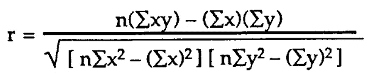

# 获得相关性和协方差的基础知识

> 原文：<https://towardsdatascience.com/getting-the-basics-of-correlation-covariance-c8fc110b90b4?source=collection_archive---------3----------------------->

相关性是广泛使用的统计概念之一。这篇博文试图回答什么是相关性，为什么它如此有用，相关性和协方差有什么关系，以及计算相关性的一些方法。

**什么是相关性？**

相关性，决定一个变量如何相对于另一个变量移动/变化的统计技术。它给了我们关于这两个变量的相关程度的概念。这是一种双变量分析方法，描述了不同变量之间的关联。在大多数商业活动中，用一个主题与其他主题的关系来表达这个主题是很有用的。

例如:如果在产品营销上花很多钱，销售额可能会增加。

**它为什么有用？**

1.如果两个变量密切相关，那么我们可以从一个变量预测另一个变量。

2.相关性在确定其他变量所依赖的重要变量方面起着至关重要的作用。

3.它被用作各种建模技术的基础。

4.适当的相关性分析有助于更好地理解数据。

5.相关性有助于理解因果关系(如果有的话)。

**相关性和协方差的关系**

在深入研究相关性之前，让我们先了解一下协方差。

**协方差**:前缀‘Co’定义某种联合动作，方差指的是变化或变动。所以它说，两个变量是相关的，基于这些变量，如何改变彼此的关系。

但是等等，协方差和相关性一样吗？

因为协方差和相关性有相同的含义，所以相关性比协方差更进一步，也告诉我们关系的强度。

两者都可以是正面的，也可以是负面的。如果一个增加另一个也增加，协方差为正，如果一个增加另一个减少，协方差为负。

协方差计算如下

Covariance formula

变量 x 的 Xᵢ=观测点

所有观察值的 x̅=平均值(x)

变量 y 的 Yᵢ=观测点

ȳ =所有观察值的平均值(y)

n=观察次数

**解码协方差公式:**两个变量 x 和 y 之间的协方差是每一项与其各自均值的差的乘积之和除以数据集中的项数减一..

通过一个简单的示例数据获得更好的理解:

以下数据显示了相应温度下的客户数量。

Example to understand correlation and covariance

首先找出两个变量的平均值，用各自的平均值减去每一项，然后按如下方式相乘

x 的平均值，x̅=(97+86+89+84+94+74)/6 = 524/6 = 87.333

y 的平均值，ȳ=(14+11+9+9+15+7)/6 = 65/6 = 10.833

*COV* ( *x，y*)= 112.33/(6–1)= 112.33/5 = 22.46

温度和顾客之间的协方差是 22.46。因为协方差是正的，所以温度和顾客数量有正的关系。随着温度的升高，顾客的数量也在增加。

但是这里没有关于这种关系有多强的信息，这就是相关性出现的原因。

相关系数是指任何相关测量方法的结果。

这里，样本相关系数计算如下

Correlation formula

*COV* ( *x，y* ) =变量的协方差 *x* 和*y*
**σ***x*=变量的样本标准差*x*
**σ***y*=变量的样本标准差 *y*

COV(x，y) = 22.46

σx = 331.28/5=66.25= 8.13

σy = 48.78/5=9.75=3.1

相关性= 22.46/(8.13 x 3.1)= 22.46/25.20 = 0.8

0.8 表示温度和客户数量之间的相关性强度非常强。

样本相关系数可以用来估计总体相关系数。

存在不同的方法来计算两个对象之间的相关系数。一些方法是:

**1。** **皮尔逊相关系数**

它捕捉两个连续变量之间线性关联的强度和方向。它试图通过两个变量的数据点绘制最佳拟合线。皮尔逊相关系数表明这些数据点离最佳拟合线有多远。只有当一个变量的变化与另一个变量的变化成比例时，这种关系才是线性的。

**皮尔逊相关系数计算方法为**

r =皮尔逊相关系数

n =观察次数
∑xy = x 和 y 值乘积之和
∑x = x 值之和
∑y = y 值之和
∑x2 = x 值的平方和
∑y2 = y 值的平方和

**斯皮尔曼相关系数**

它试图确定存在于两个顺序或连续变量之间的单调关系的强度和方向。在单调关系中，两个变量会一起变化，但不会以恒定的速率变化。它是根据变量的排序值而不是原始数据计算出来的。

单调和非单调关系如下所示:

Spearman rank correlation coefficient

ρ= Spearman 等级相关系数
di=相应变量等级之间的差异
n=观察次数

**比较:皮尔逊和斯皮尔曼相关系数**

Pearson 和 Spearman 相关系数可以取-1 到 1 之间的值。

**(i)** 如果一个变量以一致的速率随另一个变量增加，则皮尔逊系数将为 1，这产生一条完美的线。在这种情况下，斯皮尔曼系数也是 1。

**(ii)** 如果一个变量随着另一个变量增加，但不是以一致的比率增加，那么皮尔逊系数将是正的，但小于 1。在这种情况下，斯皮尔曼系数仍然是 1。

**(iii)** 如果关系是随机的，那么两个系数都将接近 0。

**(iv)** 如果变量之间的关系是一条完美的直线，但关系是递减的，那么两个系数都是-1。

**(v)** 如果两个变量之间的关系是一个变量减少，而另一个变量增加，但比率不一致，则皮尔逊系数将为负，但大于-1。在这种情况下，斯皮尔曼系数为-1。

**什么时候用什么？**

皮尔逊相关描述线性关系，斯皮尔曼相关描述单调关系。散点图将有助于可视化数据，并了解应该使用哪个相关系数。另一种方法是同时应用这两种方法并检查哪种方法执行得好。例如，如果结果显示 spearman 相关系数大于 Pearson 系数，这意味着我们的数据具有单调关系，而不是线性的。

此外，相关性并不意味着因果关系。这里看[为什么](/why-correlation-does-not-imply-causation-5b99790df07e)为什么。

更多阅读:

1.  [https://365 data science . com/协方差-线性相关系数/#close](https://365datascience.com/covariance-linear-correlation-coefficient/#close)
2.  [https://www.wallstreetmojo.com/correlation-vs-covariance/](https://www.wallstreetmojo.com/correlation-vs-covariance/)

感谢阅读！