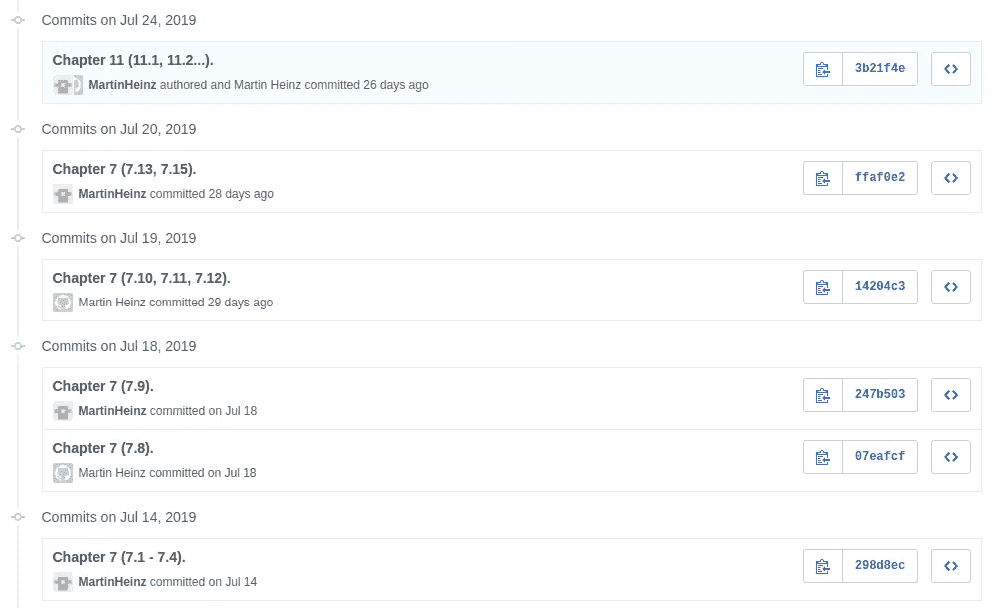

# 从阅读书籍中获得最大收益——以“专业的方式”阅读

> 原文：<https://towardsdatascience.com/getting-the-most-out-of-reading-books-reading-the-professional-way-6a65ab7c831e?source=collection_archive---------26----------------------->

*注:此文最初发布于*[*martinheinz . dev*](https://martinheinz.dev/blog/2)

阅读书籍，无论是关于编程、软件开发还是其他方面的书籍，都是获取某一领域知识的最佳途径之一。然而，人们经常快速浏览书籍，注意力不集中，最终记不住或很快忘记他们刚刚学到的东西。但是有更好的方法。

# 专业的读书方式

我在学校从来没有真正注意过，尤其是在高中的斯洛伐克语课上，但有一件事我记得很清楚，那就是我们的老师告诉我们的阅读书籍的方式*“专业方式”*。她告诉我们，当她阅读书籍(主要是诗歌和其他东西)时，她会从每几行或每一段中做笔记。当时我唯一的想法是:*“哇，这么浪费时间读诗，真是有些敬业啊……”*(开个玩笑)。

后来，当我开始学习计算机科学并阅读了相当多的书籍和文章时，我意识到按照高中老师告诉我们的方式开始记笔记可能是个好主意。从那以后，我写了很多笔记，养成了一些好习惯，并对整个过程进行了*【优化】*，所以让我告诉你如何有效地阅读书籍*【专业方式】*。但是首先，为什么写笔记真的有好处呢？

# 为什么呢？

做笔记有益原因有很多，有些很明显，有些不太明显。所以，现在开始:

*   集中注意力——阅读时，你可能会走神，读了几段后，你会意识到自己不知道刚刚读了什么。如果你做笔记，你会被迫思考你正在读的东西，否则你就不能做笔记
*   多记——思考、写作，并试着把你对刚读过的东西的想法用连贯的句子表达出来，这将有助于你从中记起更多的东西
*   保持记录——如果你正确地写了笔记，那么你可以用它们来记录你读了哪些书/文章，或者你读到哪里了——它就像书上的一个标记，如果你读了很多，从一本书跳到另一本书，这很有帮助
*   笔记本身——嗯，做笔记最明显的优势就是笔记。无论你刚刚读了什么，你都会得到摘要，当有一天你需要它的时候，你会很高兴你真的写下了一些东西。

# 做这件事的最好方法

现在，我可能已经说服你开始记笔记了，我想分享一些习惯和方法，让它对你来说尽可能的简单和有用。

*   不要复制粘贴书本上的句子——自己写或者最好重新措辞，这样你就容易理解了
*   章节注释基于书籍/文章的章节，这样以后更容易找到具体的部分
*   使用要点——你不需要整段文字，你只需要回忆起你在一本书上读到的内容或者在哪里可以找到更多的信息，有时关键词就足够了
*   使用版本控制软件——这是最重要的一个——为你的笔记创建一个存储库，并根据流派或类型(书籍或文章)将它们归类到目录中，这样你就可以在任何地方访问它们，并可以跟踪你在什么时候读了什么，读了多少
*   使用有意义的提交消息——如果你决定使用 GitHub 或其他版本控制软件，那么我强烈建议你花时间编写好的提交消息。我一般用*“第 X 章(第 X.Y，X.Z 节)”*这样的格式(见下图)。
    ——使用 markdown——如果你要阅读任何编程书籍，那么都会有代码，而编写包含代码的文本的最简单方法无疑是 markdown。另外，当你在 GitHub 中打开它时，它会被很好地格式化。
*   养成一个习惯——一开始可能会很烦人，会让你慢下来，但随着时间的推移，它会变得越来越自然，你会变得更有效率，所以坚持下去。

Example of commits

# 结论

在这里，我主要写了阅读书籍或文章时做笔记，但这真的适用于你做的所有学习。阅读书籍、文章时写笔记，阅读你从未使用过的图书馆文件时也要写笔记，例如建立数据库或新网站时。迟早(实际上这可能一直发生在我们所有人身上)你会想:*“我读到的这个东西是什么…？”*或*“我已经做过一次了……但是我不记得怎么做了……”*。拥有好的笔记可以给你很大的帮助，所以下次你打开某本书或文章时，只要打开你最喜欢的文本编辑器，创建 **Book Name.md** 就可以了。