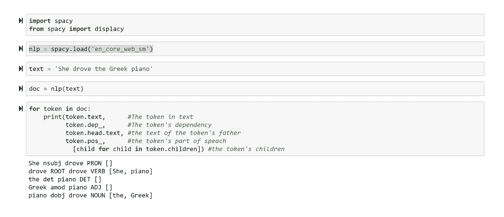
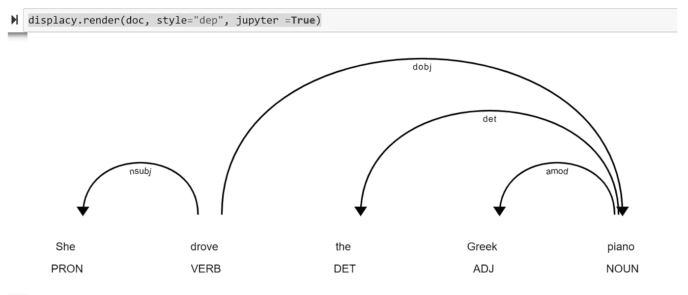
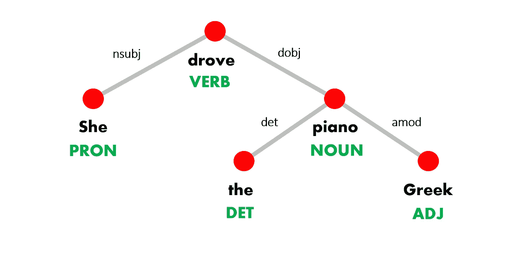
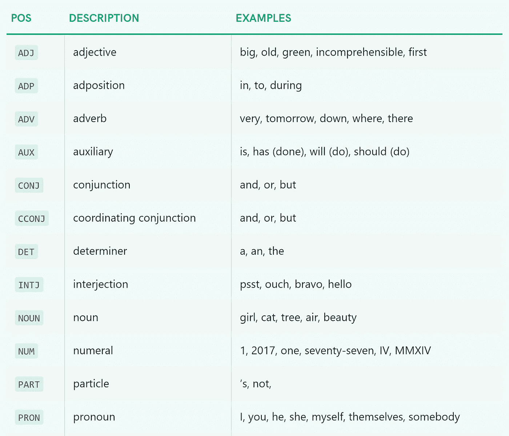
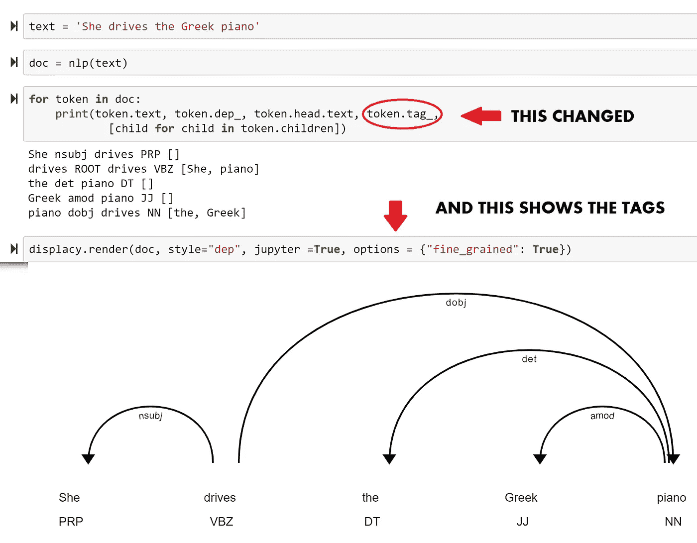
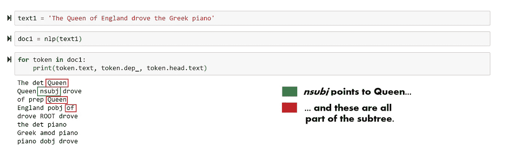
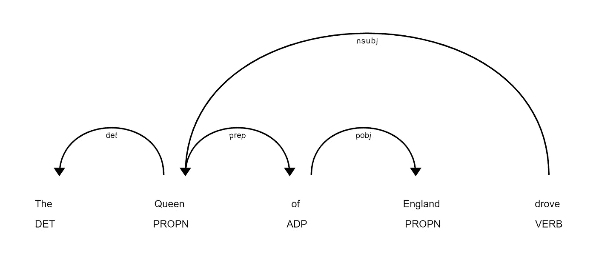
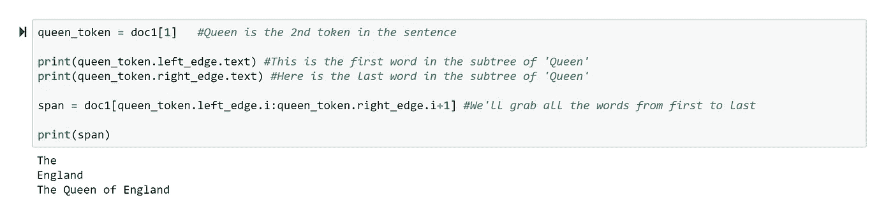
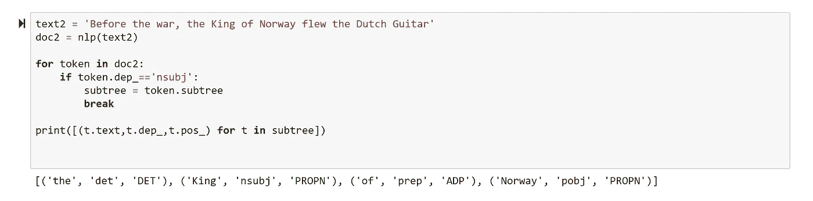
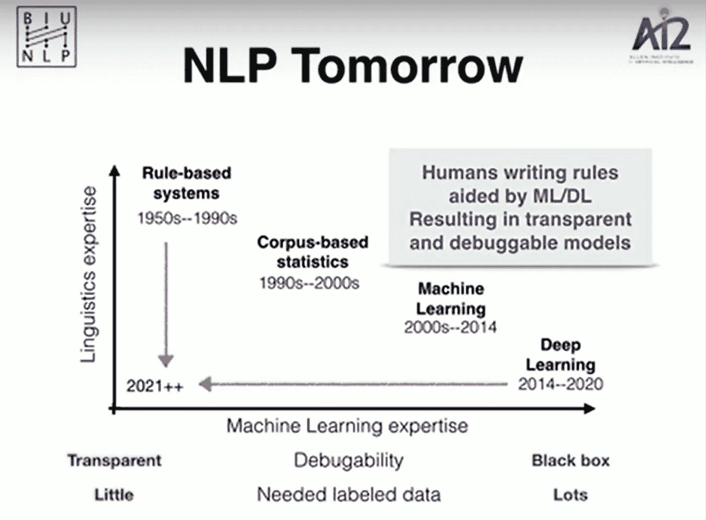

# 掌握解析树

> 原文：<https://towardsdatascience.com/getting-to-grips-with-parse-trees-6e19e7cd3c3c?source=collection_archive---------18----------------------->

对 NLP 有用。没那么复杂。

Source: Anni Roenkae for Pexels

虽然我们按顺序读、写、说，但实际上单词是按层次排列的。随着我们掌握了母语，这种等级制度就成了我们的第二天性，以至于我们很少需要停下来思考哪些单词应该放在哪里才能构成一个完整的句子。

解析树是在树形图中显式可视化这种层次的一种方式。

直到几年前，许多自然语言处理(NLP)都涉及到将句子解析成这样的图形并对其进行处理。例如，人们可以将树分成不同的结构类型；或者操纵一棵树来形成新的树，新的树可能对应于也可能不对应于具有相邻语义属性的新句子。

对一些人来说，足够的计算能力和深度神经网络的出现使所有这些努力都变得多余:如果一个词的完整上下文由其邻居决定，让你的网络处理足够的文本数据就足够了。

嗯，也许吧。然后，也许你有很多句子碰巧有相似的结构，简单地把它们分开会很有用。为了以防万一，解析树是一个很好的工具。

# **我们先从小事做起**

让我们从一个微小的句子开始。我们将使用 spaCy 解析器对其进行解析，并以三种不同的方式呈现结果，以帮助将解析树结构上下文化。

第一个是句子中单词的有序列表，以及每个单词所扮演的角色。

第二个是相同的信息，展示了解析树在空间中的可视化方式。

第三张是同一棵树的稍微不同的插图，从上到下读起来很容易。

**下面是关于解析树需要注意的四件事:**
1 .句子中的每个单词都是图表中的一个节点。我们所说的词实际上是指“句法词”，称为标记。例如， *She 的*可以写成一个单词，但是表示“她是”，所以 *She* 将是一个令牌，*的*将是第二个令牌，在它自己的节点中。

2.该树有一个根**节点**，树的其余部分从该节点流出。这是一个句子的主要动词。

3.如箭头所示，边缘是有方向的。如果一条边从一个节点到另一个节点，第一个节点是“父节点”，第二个节点是“子节点”。在解析树中，每个节点(根节点除外)都有一个父节点，并且可以有零个或多个子节点

4.每个节点都有一个标签。每条边都有单独的标签。**这是两套不同的标签**。

你可能对节点上的标签很熟悉，它们表示**词性**(词性):动词、名词、形容词等。
这个清单比你想象的要长(稍后会有更多)。这里还有几个，完整的名单可以在这里找到[。](https://spacy.io/api/annotation#pos-tagging)

边缘的东西呢？

它们被称为**句法依赖标签**，显然，有些是通用的(确切地说是 37 个)，而有些是语言依赖的。你可以在 spaCy 文档中找到一个[完整列表](https://spacy.io/api/annotation#dependency-parsing)，但是你真正需要做的是:a .识别它们是什么，b .理解它们有助于导航树，以及 c .记住那些碰巧对你有用的。

例如， *nsubj* 将是一个显而易见的答案，因为这通常是句子的主语。另一个流行的是 *amod* ，这是一个形容词修饰语。在我们的例子中，这位女士驾驶的不是任何旧钢琴，而是一种特殊的钢琴——一架希腊钢琴。

# **细化词性标注**

假设我们的句子改成“她**驾驶**希腊钢琴”。词性标注完全相同——drives 和 drives 都是动词。需要一个更精确的系统来区分这两者。

嗯，完整的 POS 标记系统确实适应这种区别。以下是[不同标签](https://www.clips.uantwerpen.be/pages/mbsp-tags)的列表；正如你所料，它比以前长了很多。再说一次，我不可能记住哪怕是一半，所以我把它保存在一个文档中作为参考。

为了区分简化的标记(它可能告诉你一个令牌是一个动词，但不是它的时态)和完整版本，spaCy 调用第一个 POS 和第二个标记。您的解析树可以显示标记的完整标记。在其文档中，spaCy 列出了标签及其相应的位置，这很有帮助。

# **短语和子树**

让我们看看当我们把“她”改成更具体的东西时会发生什么。句子的主语现在从一个单词变成了包含几个单词的名词短语。因此， *nsubj* 边指向“Queen ”,并从那里流出一个子树。

The subtree for the *sentence’s subject*

要知道子树在哪里开始，在哪里结束，我们可以在句子中寻找属于这个子树的最右边和最左边的标记，并获取它们之间的所有内容:

现在，看看下面这个新句子。尽管这个句子和我们之前的句子没有一个单词相同，我们还是觉得这两个句子有很大的相似之处。例如，在这里我们可以看到主题子树在语法上是相同的:

# 快速回顾

解析树是表示句子的方向树:标记是节点，边是单词之间的语法关系，源于句子的主要动词。这意味着每个令牌都可以通过从根开始的单一路径到达。

树表示明确了句子的层次性质，因此句子中较小的句法单元对应于子树。

节点和边都用两组不同的标签进行了标注。重要的是不要陷入这些标签的字母汤。请记住，它们可以用来导航树。这为基于规则的分析提供了坚实的基础，尤其是与正则表达式结合使用时。

# 摘要

在 2019 年 spaCy IRL 活动的[主题演讲](https://www.youtube.com/watch?v=e12danHhlic)中，NLP 研究员兼艾伦人工智能研究所研究主任 Yoav Goldberg 概括地描绘了用于分析文本的技术。

他补充说，大多数应用自然语言处理仍然使用基于规则的系统，而不是来自学术界的最新研究。基于规则的系统的优点是需要的数据更少，更透明，更容易调试。

然而，他们确实需要更多的语言知识。

基于规则的系统远非完美，NLP 的未来可能会将规则与机器学习和深度学习技术结合起来。

最终，我们的目标是让 NLP 不仅高效，而且让*更容易*(或者至少更容易)。这意味着降低专业知识的前期要求。不仅仅是机器学习，语言学也是如此。

我认为这篇文章有助于做到这一点。