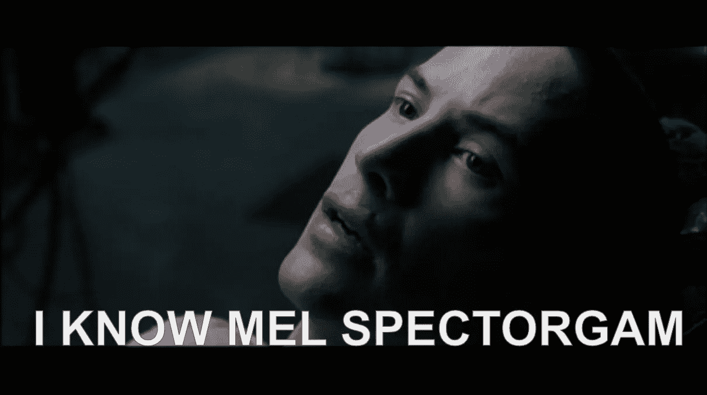
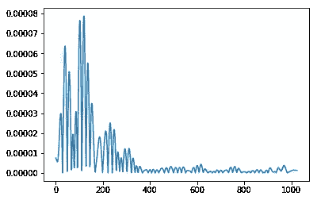
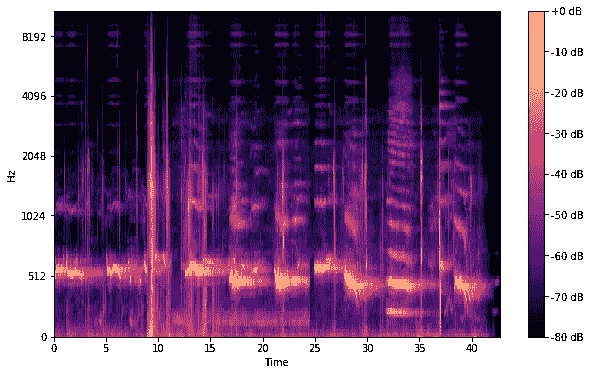

# 了解 Mel 光谱图

> 原文：<https://towardsdatascience.com/getting-to-know-the-mel-spectrogram-31bca3e2d9d0?source=collection_archive---------1----------------------->

如果你想像 Neo 一样了解 Mel 光谱图，请阅读这篇短文！(也许不是全部，但至少有一点)

> 对于 TL；博士和全部代码，去[这里](https://github.com/DalyaG/CodeSnippetsForPosterity/tree/master/GettingToKnowTheMelSpectrogram)。

## 几天前发生在我脑子里的一次真实对话

我:嗨梅尔声谱图，我可以叫你梅尔吗？
*梅尔:确定。*

我:谢谢。梅尔，我们第一次见面时，你对我来说是个谜。
*梅尔:真的吗？击球手出局了吗*

我:你由两个概念组成，它们的全部目的是使抽象的概念对人类来说是可理解的——梅尔标度****和[**光谱图**](https://en.wikipedia.org/wiki/Spectrogram)——然而你自己对我这个人类来说很难理解。梅尔:这种片面的讲话有什么意义吗？****

****我:你知道更困扰我的是什么吗？我听说你是 DSP *(数字信号处理)*领域的 *buzzz* ，但是我在网上很少找到关于你的直观信息。梅尔:我应该为你感到难过吗？****

****我:所以无论如何，我不想让你被误解，所以我决定写你。
*梅尔:啧啧。这其实挺好的。希望现在有更多的人理解我。*****

****我:很乐意，我的朋友。我想我们可以谈谈你的核心元素是什么，然后用 python 上的[**librosa**](https://librosa.github.io/librosa/index.html)**包展示一些好看的招数。梅尔:哦，太棒了！我爱 librosa！它可以用一行代码生成我！******

******我:太好了！让我们在这篇文章中用这首美丽的鲸鱼歌曲作为我们的玩具例子吧！你怎么想呢?梅尔:你知道你在自言自语，对吗？******

# ******声谱图******

******视觉化声音是一种恍惚的概念。有一些迷人的方法可以做到这一点，也有更多的数学方法，我们将在这篇文章中探索。******

************

******Photo credit: Chelsea Davis. See more of this beautiful artwork [here](https://blog.soundviz.com/2015/10/29/8-stunning-ways-artists-are-visualizing-sound/).******

******当我们谈论*声音*时，我们通常谈论一系列不同压力强度的振动，所以想象声音有点像想象空气波。******

************************

******但这只是这首复杂而丰富的鲸鱼歌曲的二维表现！
声音的另一种数学表示是[傅立叶变换](https://en.wikipedia.org/wiki/Fourier_transform)。不需要太多的细节(观看[这个](https://www.youtube.com/watch?v=spUNpyF58BY)教育视频以获得易于理解的解释)，傅立叶变换是一种功能，它将时域中的信号作为输入，并将其分解为频率输出。******

******让我们以一个短时窗为例，看看应用傅立叶变换会得到什么。******

************

******现在让我们把完整的鲸歌分成几个时间窗口，并在每个时间窗口上应用傅立叶变换。******

************

******哇，这里看不到什么，是吗？这是因为人类听到的大多数声音都集中在非常小的频率和振幅范围内。******

************

******让我们做另一个小调整——将 y 轴(频率)转换为对数标度，将“颜色”轴(振幅)转换为[分贝](https://en.wikipedia.org/wiki/Decibel)，这是振幅的对数标度。******

************

******这就是我们所说的[声谱图](https://en.wikipedia.org/wiki/Spectrogram)！******

# ******熔融标度******

******让我们暂时忘记所有这些可爱的形象化，谈谈数学。从数学上来说，Mel 标度[是频率标度的一些非线性变换的结果。这种 Mel 标度被构造成使得在 Mel 标度上彼此距离相等的声音，对于人类来说也是“声音”,因为它们彼此距离相等。
与 Hz 标度相反，500 和 1000 Hz 之间的差异很明显，而 7500 和 8000 Hz 之间的差异几乎不明显。](https://en.wikipedia.org/wiki/Mel_scale)******

******幸运的是，有人为我们计算了这个非线性转换，我们需要做的就是使用 librosa 中的适当命令来应用它。******

******没错。就是这样。但是这给了我们什么呢？
使用重叠的三角形滤波器，将 Hz 标度划分为仓，并将每个仓转换为 Mel 标度中的相应仓。******

************

******现在*这个*给了我们什么？
现在，我们可以获取一个时间窗口的振幅，计算[与`mel`的点积](https://en.wikipedia.org/wiki/Dot_product)以执行转换，并在这个新的频率范围内获得声音的可视化。******

************

******嗯，还是没什么意义，他？好吧，让我们总结一下，看看我们会得到什么。******

# ******梅尔光谱图******

******我们现在知道什么是声谱图，也知道什么是梅尔标度，所以梅尔声谱图是一个声谱图，相当令人惊讶的是，它以梅尔标度为其 *y* 轴。******

******这就是如何用一行代码生成 Mel 光谱图，并使用另外 3 行代码很好地显示它:******

************

# ******概述******

******Mel 谱图是以下管道的结果:******

1.  ********分离到窗口**:用大小为`n_fft=2048`的窗口对输入进行采样，每次进行大小为`hop_length=512`的跳跃来采样下一个窗口。******
2.  ******对每个窗口进行 FFT** (快速傅立叶变换)，从时域变换到频域。****
3.  ******生成 Mel 标度**:取整个频谱，并将其分成`n_mels=128`均匀间隔的频率。
    我们所说的均匀分布是什么意思？不是通过频率维度上的距离，而是人耳听到的距离。****
4.  ******生成谱图**:对于每个窗口，将信号的幅度分解成其分量，对应 mel 标度中的频率。****

********

# ****未完待续…****

****现在我们知道了梅尔光谱图和尼奥，我们要用它做什么？****

****好吧，那是另一个帖子…****

****与此同时，你有没有利用 Mel 光谱图做一些疯狂的项目？请在评论中分享！****