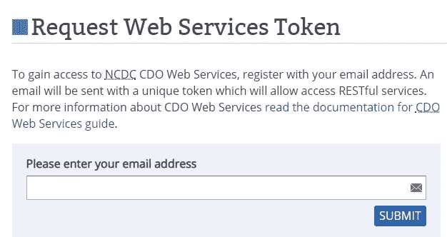
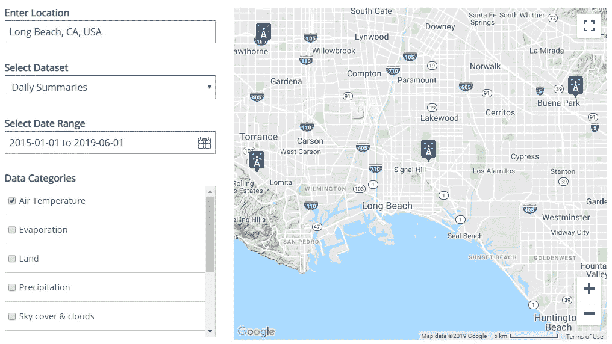
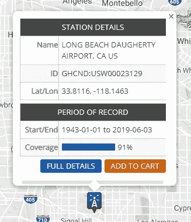
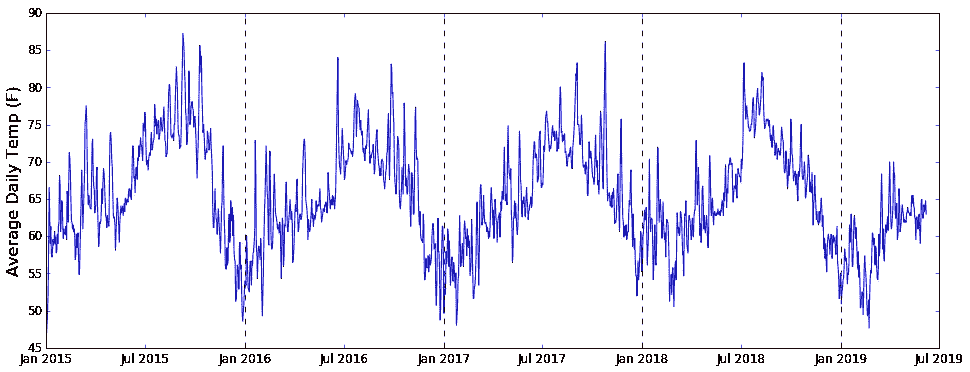

# 通过 3 个简单的步骤获取天气数据

> 原文：<https://towardsdatascience.com/getting-weather-data-in-3-easy-steps-8dc10cc5c859?source=collection_archive---------5----------------------->

Photo by [Max LaRochelle](https://unsplash.com/@maxlarochelle?utm_source=unsplash&utm_medium=referral&utm_content=creditCopyText) on [Unsplash](https://unsplash.com/search/photos/weather?utm_source=unsplash&utm_medium=referral&utm_content=creditCopyText)

继续我们的数据收集之旅，这次我们将看看如何收集**天气数据**。天气数据的应用是无穷无尽的，从独立的天气预报应用到天气分析只是更大目标的一个组成部分的项目。

在我的团队帮助俄亥俄州辛辛那提市改善其紧急医疗响应系统的项目中，我个人发现需要访问天气数据。我的团队需要使用每日天气数据作为模型中的预测器，来预测整个城市的应急响应水平。

我们将从最可靠的来源获得天气数据， **NOAA** (美国国家海洋和大气管理局)。

既然我现在住在美丽的**加州长滩**，让我们通过尝试回答以下问题来引导我们的探索:

【2015 年以来，长滩的日平均气温变化如何？

我们开始吧！

# 1.向 NOAA 请求访问令牌

为了从 NOAA 请求数据，我们将需要请求一个**访问令牌**，它基本上确认我们是请求数据的可信来源。导航至[请求令牌网站](https://www.ncdc.noaa.gov/cdo-web/token)。

Request an Access Token from NOAA

填写一个电子邮件地址，您很快就会收到一封包含您的访问令牌的电子邮件。把它存放在安全的地方，保持私密。否则，其他人可能会代表你向 NOAA 提出请求，而你不一定希望这样。

# 2.确定要访问哪个气象站

下一件你可能想做的事情是找出从哪个气象站收集数据。找到该电台最简单的方法是导航到[查找电台网站](https://www.ncdc.noaa.gov/cdo-web/datatools/findstation)

根据您的**首选位置**、**数据集首选项**(选择*每日概要*获取每日数据)、**时间范围**(您选择的范围越长，越少的站将拥有完整的数据)和**数据类别**(我们只关心手头任务的气温)。

页面右侧的地图将自动更新可用的电台。

对于这个应用程序，我们将选择长滩机场站。请务必记下电台 ID。对我们来说就是 **GHCND:USW00023129。**

# 3.抢数据！

现在我们有了访问令牌，并且知道了我们希望访问的站点的 ID，剩下要做的就是向 NOAA 请求数据。我们将使用 Python 的 ***请求*** 库来完成这个任务。

首先让我们用 Python 导入所需的库。

为了向 NOAA 请求数据，我们需要使用 NOAA 的 **API** (应用程序编程接口)，它基本上只是与 NOAA 通信以请求数据的特定语言。

让我们来看一下 NOAA API 请求的结构。

基本请求如下所示:

> ***https://www.ncdc.noaa.gov/cdo-web/api/v2/data?***

在问号后面，'？'，我们将需要把所有的选项指定确切的数据，我们正在寻找。这些将包括:

*   ***datasetid*** ，对我们来说就是 **GHCND** (全球历史气候网络日报)。
*   ***datatypeid*** ，这是我们要寻找的变量列表。对我们来说，那将是平均气温
*   ***限制*** ，指定响应中包含的最大项数。默认是 25，最大是 **1000** ，这是我们要设置的。
*   ***stationid*** ，指定我们想要哪个(些)站的数据。我们的站号是 **GHCND:USW00023129**
*   ***开始日期*** 和 ***结束日期*** ，指定我们希望从中获取数据的日期范围。我们将每年调用一次 API，因为 1000 个项目对于我们从 2015 年到现在的整个 3.5 年的日期范围来说是不够的。

总之，我们对 2015 年所有数据的第一个请求如下:

> 【https://www.ncdc.noaa.gov/cdo-web/api/v2/data? datasetid = GH CND&data typeid = TAVG&limit = 1000&station id = GH CND:usw 00023129&start date = 2015-01-01&end date = 2015-12-31

让我们看看进行 API 调用的代码:

现在是将收集的数据存储为数据帧的代码:

由生成的数据帧制成的图表如下所示:

**好看！**因此，我们成功地请求、处理并报告了自 2015 年 1 月以来加州长滩的日平均气温。

事实上，NOAA API 内置了更多的选项。查看[完整文档](https://www.ncdc.noaa.gov/cdo-web/webservices/v2#data)。我认为浏览 NOAA API 的一个完整的具体用例是一个好的开始。

*~数据采集快乐！:)*