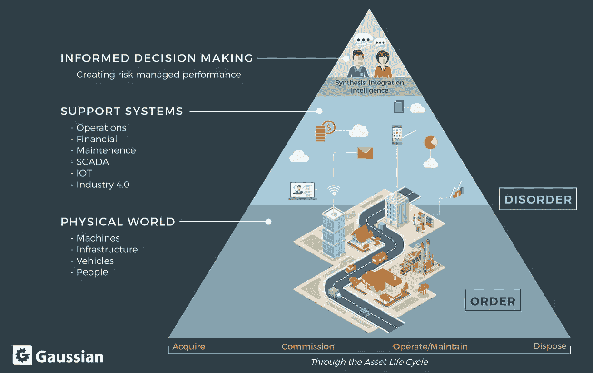
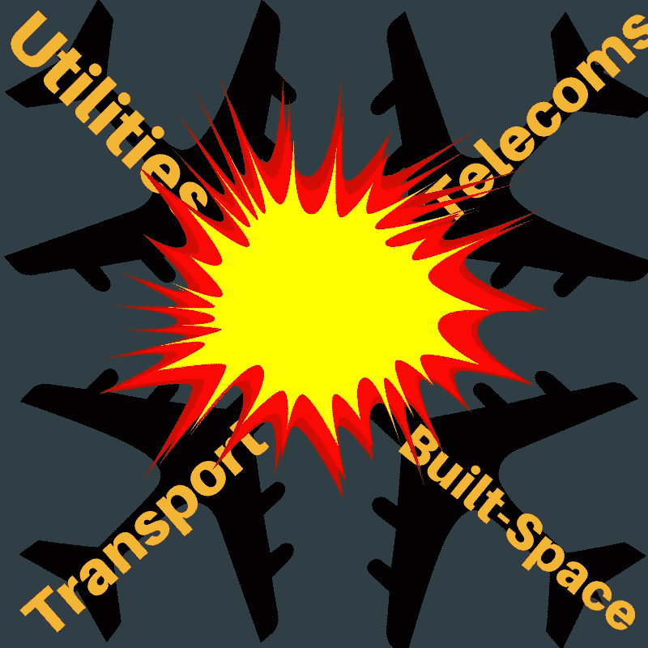
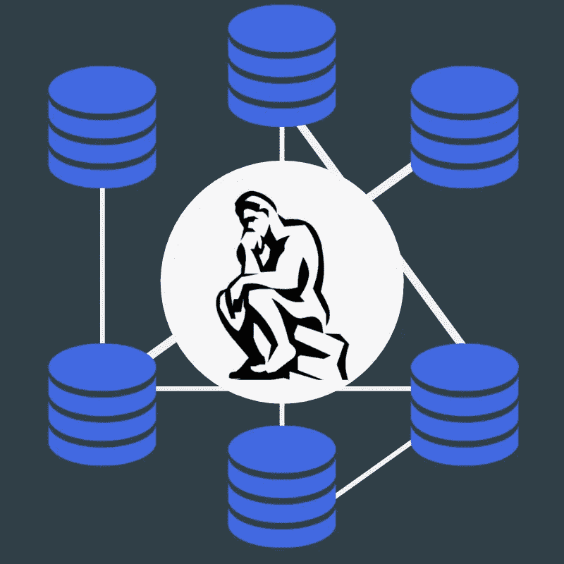
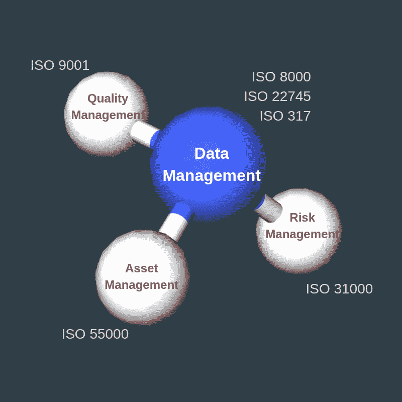

# 整理您的数据

> 原文：<https://towardsdatascience.com/getting-your-data-straight-96ea6295867a?source=collection_archive---------24----------------------->

## 经理和企业主指南。

“大数据”现在风靡一时。这是多年来在“热门词汇前 40 名”中排名靠前的词汇之一，但有很好的理由:数据正迅速成为一种新的资产类别，因此也应该如此对待。此外，代替 2018 年最近的数据丑闻(脸书、MyHeritage、Aadhaar)，越来越明显的是，需要在数据质量和数据安全方面达成更大的共识。

幸运的是，存在与实物资产管理、质量和风险相关的完整知识体系——其中的每一个现在都可以被利用和调整，以帮助管理我们更难以捉摸的朋友:数据——以及从中收集的信息。

**大量涌入的数据**

在整个人类历史中，超过 90%的数据都是在过去的两年中产生的——这种惊人的快速发展没有显示出放缓的迹象；据《经济学人》报道，到 2020 年，每人每秒将产生近 2MB 的数据。

当观察财富 500 强公司的领导层时，大约五分之三的领导者认为，未能成为数据驱动很可能导致过时。因此，分析公司数据将成为保持竞争力的核心，这已成为常识。

**两层**

需要理解的是，世界正日益分为两层——物理层和数字层；我们也越来越多地与物理层的代理交互，而不是像过去那样直接与它交互。在资产管理(AM)行业，当与大公司打交道时尤其如此——每个公司都拥有大量有价值的实物资产。

我们非常熟悉的物理层是实际的物理世界。它是你的基础设施、工厂、机器和设备——当然，还有你的员工；50 年前，你需要直接管理——通过观察和指挥链。

数字层由数据和信息组成。它是你的 It 和财务系统，你的协议和机器数据，你的网络和社交媒体；它是一个数字足迹，包含物理层可以提供的所有信息——随着数字化和超连通性的发展，这一层也在增长。

The World is Being Divided into Two Layers (CREDIT: [Grahame Fogel](https://www.linkedin.com/in/grahame-fogel-70b3361?miniProfileUrn=urn%3Ali%3Afs_miniProfile%3AACoAAAA6E3sBD1y_Jm8QO6r-c8G8xW4m4DXd4BI&lipi=urn%3Ali%3Apage%3Ad_flagship3_search_srp_all%3BmAkUyNlQSCm38AO9TglVZw%3D%3D), [Gaussian Engineering](http://gauseng.com), 2018)

物理层的管理代理数量众多，可以是您的 SCADA 系统、您的物联网管理门户、您的 ERP 系统和商业智能仪表板等等。

但是，重要的是要认识到，所有这些代理(通过它们来管理物理层)都依赖于您的数据。整理数据极其重要，因为有了坏数据，你与物理世界的联系就会动摇，组织很容易陷入混乱和无序。在这个领域中，决策是基于通常不正确的信息做出的，而决策本身会导致行动，这些行动会通过一个复杂的、官僚的电话故障游戏过滤掉。

**产业的碰撞**

现在是上述各层提供整个行业碰撞和融合的背景的时候。行业颠覆大体上是关键技术和消费者行为演变的结果——这种行为通常是技术格局变化的结果。从广义上来说，关键技术颠覆在以前局限于自己领域的行业之间创造了融合节点。

最先经历这种融合的行业是科技、媒体和电信:我们现在已经习惯于通过电信公司观看电影和电视剧，通过科技公司购买书籍和音乐。

如今，新一轮行业融合正变得越来越明显。在这里的[高斯](http://www.gauseng.com)，我们相信这是两个，最值得注意的:

1.  医疗保健、消费品、保险
2.  公用事业、建筑空间、交通和电信的融合

The Next Wave of Industry Collision (Credit: Author on [Canva](http://canva.com))

在南非，我们已经看到第一波浪潮在我们面前展开，Discovery 和 Momentum(两家当地保险提供商)开始利用各种智能设备来监控客户的健康并将数据与他们的产品联系起来。

第二波浪潮是我们 [Gaussian](http://www.gauseng.com) 最感兴趣的——这一波浪潮将推动“智能城市”的普及；是实物资产真正与无形资产相遇的浪潮；在这一浪潮中，公用事业公司开始重新思考并转变其运营，以利用实时数据；这是断电管理、分布式电源和高级资产管理的浪潮。所有这些都是通过使用数据**实现的。**

*所以这个数据最好是对的。*

**孤岛式数据集成的可怕之处**

我们最近参与了一个煤矿项目；我们被要求分析他们的数据，并帮助他们做出更好的决策。我们发现该矿从各种来源收集数据，并将其存储在不同的地方:

*   他们的财务数据存储在 SAP(他们的企业资源规划或 ERP 系统)中
*   他们的交易数据存储在他们的计算机化维护管理系统(CMMS)中
*   他们的石油分析结果存储在各种 Excel 电子表格中
*   他们的主数据存储在一个独立的、自托管的数据库中
*   他们的安全事故数据存储在安全事故应用程序中

整合这个数据，类似于美国人、意大利人、法国人、西班牙人、瑞典人；每个人都有不同的有价值的知识；坐下来试着玩琐碎的追求。他们都说不同的语言。协作很难。

Siloed Data Can Prove an Immense Challenge for Organizations Wishing to Make Use of Data Analytics (Credit: Author on [Canva](http://canva.com))

同样，集成来自各种来源的数据是乏味的、耗时的，有时甚至是完全不可能的！经常会有大量重复的信息；每个源以不同的名称或不同的格式引用事物(员工、资产、日期);很多数据最终都没有被使用。

如果上述情景听起来和你自己的公司非常相似，你并不孤单！这是(不幸的)许多大中型组织的情况；确保数据质量并非易事。

ISO 8000 是数据质量和交换的全球标准，为这类问题提供了解决方案。

**标准的重要性**

标准是建立规范和程序的已发布文档，它们有助于描述提高兼容性和互操作性的协议。大多数标准都是为在合同中使用而设计的，所以做生意的人可以确保他们“在同一页上”，可以这么说。

当一项标准在全球范围内被采用时，它有助于大大降低成本并促进国际贸易——然而，要想有机会在全球范围内被采用，标准本身必须具有一定的质量。标准的质量主要取决于两个因素，即:

1.  开发它的领域专家的专业知识和声誉
2.  用于建立共识的过程

可能最大和最著名的标准组织是国际标准化组织或 ISO 这是一个独立的非政府组织，由 163 个国家标准机构组成。正如他们在自己的网站上提到的，ISO 成立的初衷是回答一个基本问题:“做这件事的最佳方式是什么？”。

ISO 从更明显的东西开始，如重量和其他测量方法，但在过去的 50 年里发展成为一个标准家族，涵盖了从我们穿的衣服到我们视频聊天的 Wi-Fi 网络的一切。

但是我们最感兴趣的标准——也是最高管理层应该感兴趣的标准——是 ISO 的一套管理系统标准。这些标准提供了清晰的定义，组织应该用这些方法来管理业务的相互关联的部分，以实现他们的目标。有几种 ISO 管理体系标准，其中几种列举如下:

*   ISO 45001 |职业健康和安全管理
*   ISO 14001 |环境管理
*   ISO 9001 |质量管理
*   ISO 55000 |资产管理
*   **ISO 8000–61**|**数据质量管理**
*   ISO 31000 |风险管理

当我们聚焦于数据时，ISO 8000——数据质量和交换的标准——是最相关的。通过实施这些文档中的原则，组织可以确保持续维护高质量的可移植数据，这些数据独立于应用程序，并且对制定战略和运营决策非常有用。

**对综合管理系统的需求**

有趣的是——也值得考虑的是——随着行业的合并和新行业的出现，这些标准之间的界限变得越来越模糊。除此之外，上述管理标准其实极其相似。这些标准中的每一个都共享一个 ***计划-执行-检查-行动*** 结构，并具有类似的要求，例如:

*   记录系统
*   控制文件和记录
*   培养
*   内部审计
*   纠正/预防措施
*   管理评审

这里的要点是: ***组织需要整合一个*** ***集成管理系统，首先允许制定数据驱动的决策，包括运营决策和战略决策。***

There is an Increasing Need for a Data-Driven, Integrated Management System (Credit: Author on [Canva](http://canva.com))

一体化管理体系的好处怎么强调也不过分。您的组织将体验到更高的效率、有效性和成本降低；同时最大限度地减少因需要多次年度审计而造成的干扰。IMS 允许管理团队依靠一个系统来实现他们组织的目标；它允许他们将他们的系统和流程整合在一起，并确保他们作为一个具有统一目标的单一单位工作。

未来属于能适应的人；变形者、早期采用者和创意者；那些能够创建组织，将所有这些东西集合在一起并统一起来的人。但最重要的是，未来属于那些为未来做打算的人。

我们将很快发布一个由 6 部分组成的博客系列，详细介绍开发一个**数据驱动的集成管理系统的过程。**保持关注@ [高斯工程、资产和数据管理专家](http://www.gauseng.com)。