# 基尼指数与信息熵

> 原文：<https://towardsdatascience.com/gini-index-vs-information-entropy-7a7e4fed3fcb?source=collection_archive---------1----------------------->

## 关于杂质测量和信息增益，您需要了解的一切

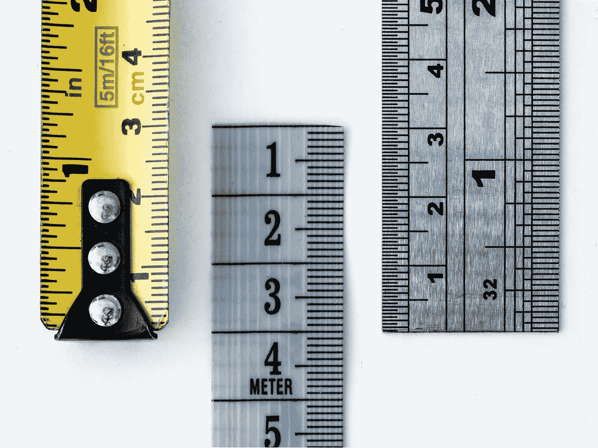

[Source](https://unsplash.com/photos/WahfNoqbYnM)

# 简介:

对数据科学家来说，杂质/信息增益的度量，尤其是基尼指数和熵，是有趣且实用的概念。下面我们将通过简单易懂的例子来深入探讨这些概念。

# 目录

*   背景
*   基尼直觉
*   熵直觉
*   使用 python 进行可视化
*   信息增益比较
*   实用的外卖

# 背景:

决策树根据目标变量的纯度递归分割特征。该算法旨在找到最具预测性特征的最佳点，以便将 1 个数据集分成 2 个数据集。这两个新数据集的目标变量将比原始数据集的更纯。

然而，“纯粹”是这里的关键词。这个词到底是什么意思？在一般意义上,“纯洁”可以被认为是一个群体的同质化程度。但是同质性可能意味着不同的东西，这取决于你的决策树运行在哪个数学主干上。决策树的*决策*的两个最受欢迎的支柱是基尼指数和信息熵。

**下面这三个例子应该能让大家明白这一点:**

> 如果我们有 4 个红色口香糖球和 0 个蓝色口香糖球，那么这 4 个口香糖球就是 100%纯的。
> 
> 如果我们有 2 个红色和 2 个蓝色，那么这个组是 100%不纯的。
> 
> 如果我们有 3 个红色和 1 个蓝色，如果我们分别使用基尼系数或熵，则该组的纯度为 75%或 81%。

为什么这很重要？根据使用的杂质测量，树分类结果可能会有所不同。这可能对您的模型产生很小(有时很大)的影响。

# 基尼指数直觉:

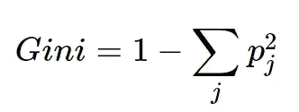

让我们从基尼指数开始，因为它更容易理解。根据[维基百科](https://en.wikipedia.org/wiki/Decision_tree_learning#Gini_impurity)，目标是*“测量从集合中随机选择的元素被错误标记的频率”[1]。*

为了形象化，让我们回到口香糖的例子。如果我们决定任意将 4 个口香糖球都标记为红色，其中一个口香糖球被错误标记的频率是多少？

## 4 红色和 0 蓝色:

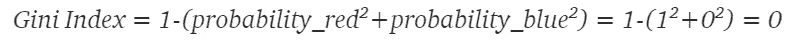

杂质测量值为 0，因为我们永远不会错误地标记这里的 4 个红色口香糖球中的任何一个。如果我们任意选择将所有的球标为“蓝色”，那么我们的指数仍然是 0，因为我们总是错误地给口香糖球标上标签。

> 无论你选择哪个阶层的概率，基尼系数总是一样的，因为在上面的公式中，基尼系数总是等于 0。

基尼系数为 0 是最纯粹的分数。

## **2 红 2 蓝:**

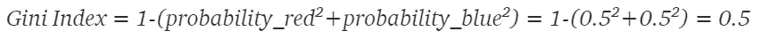

杂质测量值为 0.5，因为我们有一半时间会错误地给口香糖球贴上错误的标签。因为该指数用于二元目标变量(0，1)，0.5 的基尼指数是最不纯粹的分数。一半是一种类型，一半是另一种类型。**将基尼系数除以 0.5，有助于直观理解该系数代表什么。0.5/0.5 = 1，意味着分组尽可能不纯(在只有 2 个结果的组中)。**

## 3 红色和 1 蓝色:

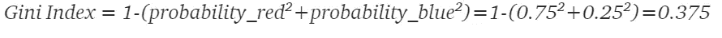

这里的杂质测量值是 0.375。为了更直观的理解，如果我们将此除以 0.5，我们将得到 0.75，这是错误/正确标记的概率。

# 熵直觉:

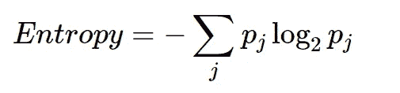

由于等式中的对数，熵的计算量更大。像基尼一样，基本思想是通过目标变量来衡量一个群体的无序程度。这种方法不是利用简单的概率，而是采用概率的对数基数 2(然而，只要你是一致的，你可以使用任何对数基数)。熵方程使用对数，因为它有许多有利的性质。主要优点是它提供的附加性能。这些麻省理工学院的讲座[笔记](http://web.mit.edu/6.02/www/f2011/handouts/2.pdf)将有助于更清楚地掌握这个概念(pg8) [2]。

让我们用同样的口香糖场景来想象熵是如何工作的:

## 4 红色和 0 蓝色:

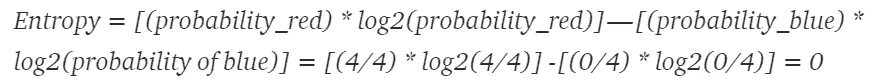

不出所料，熵的杂质测量值也是 0。这是使用信息熵的最大纯度分数。

## 2 个红色和 2 个蓝色:

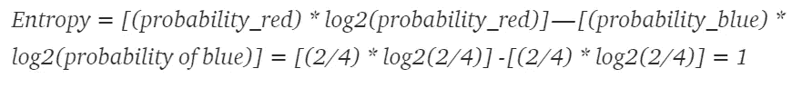

此处的杂质测量值为 1，因为这是可获得的最大杂质。

## 3 红色和 1 蓝色:

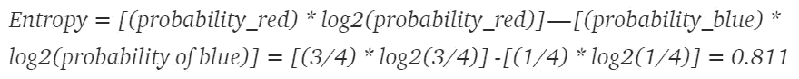

这里的纯度/杂质测量值是 0.811，比基尼系数差一点。

# 形象化

让我们用 python 中的一些代码来可视化基尼和熵曲线:

## 基尼系数:

下面我们制作一个函数来自动计算基尼系数。

```
#Gini Function
#a and b are the quantities of each class
def gini(a,b):
    a1 = (a/(a+b))**2
    b1 = (b/(a+b))**2
    return 1 - (a1 + b1)
```

与我们的口香糖主题保持一致，让我们做一个循环，计算任何可以想象的红色和蓝色口香糖彩车组合的基尼系数，加到 4。我们将对上述基尼函数进行 10，000 次迭代，以便稍后绘制基尼曲线。

```
#Blank lists
gini_list = []
blue_list = []
red_list = []
blue_prob_list = []#Looping Gini function on random blue and red float amounts
for x in range (10000):
 blue = random.uniform(0, 4)
 red = abs(4-blue)
 a = gini(red,blue)
 b = blue/(blue+red)
 gini_list.append(a)
 blue_list.append(blue)
 red_list.append(red)
 blue_prob_list.append(b)#Dataframe of amount of blue, red, Probability of blue, and gini score
df = pd.DataFrame({“Blue”: blue_list, “Red”: red_list,”Gini Score”: gini_list, “Probability of Blue”: blue_prob_list})
df = df[[‘Red’, ‘Blue’, ‘Probability of Blue’, ‘Gini Score’]]
df
```

数据帧的开头在下面。其他 9994 行装不下。

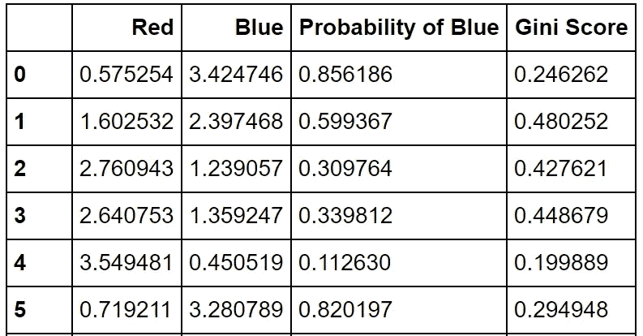

现在我们将绘制我们的曲线:

```
plt.scatter(blue_prob_list,gini_list)
plt.xlabel(‘Probability of Blue Gumball %’)
plt.ylabel(‘Gini’)
plt.title(‘Gini Curve’)
```

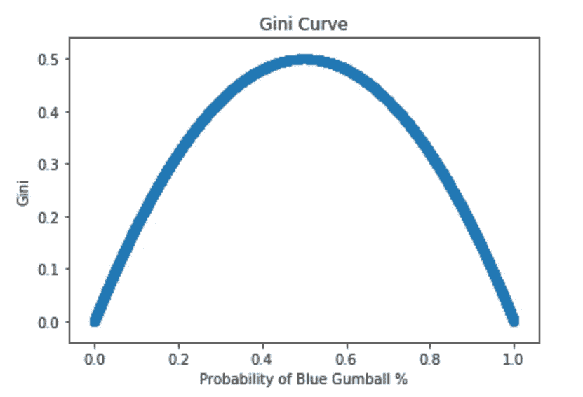

## **熵:**

```
#Gini Function
#a and b are the quantities of each class. Base is the log base input.
def entropy(base,a,b):
    try:
        var =  abs(((a)/(a+b)) * log(((a)/(a+b)),base)) - (((b)/(a+b)) * log(((b)/(a+b)),base))
        return var
    except (ValueError):
        return 0#Blank lists
ent_list = []
blue_list = []
red_list = []
blue_prob_list = []#Loop with log base 2
for x in range (10000):
    blue = random.uniform(0, 4)
    red = abs(4-blue)
    a = entropy(2,red,blue)
    b = blue/(blue+red)
    ent_list.append(a)
    blue_list.append(blue)
    red_list.append(red)
    blue_prob_list.append(b)df = pd.DataFrame({"Blue": blue_list, "Red": red_list,"Entropy": ent_list, "Probability of Blue": blue_prob_list})
df = df[['Red', 'Blue', 'Probability of Blue', 'Entropy']]
df
```

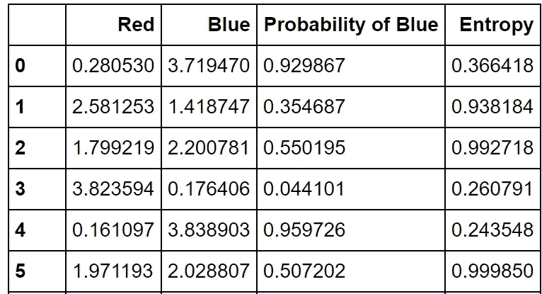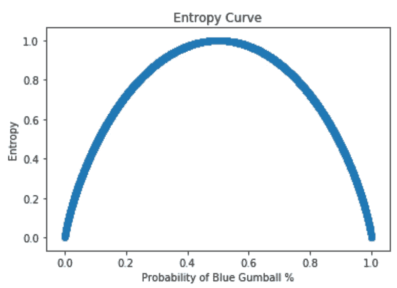

## **对比:**

基尼是蓝色的，熵是橙色的。在下一节中，您将看到这些差异是如何在信息增益中体现出来的！

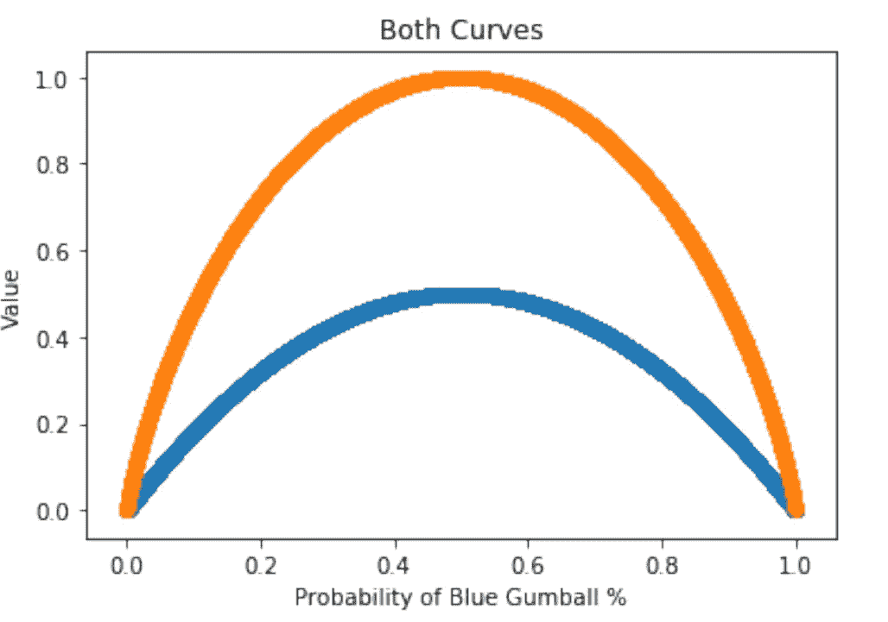

# 信息增益

信息增益是杂质如此重要的原因。一旦我们获得了数据集的杂质，我们就可以看到当我们沿着树向下并测量节点的杂质时获得了多少信息。

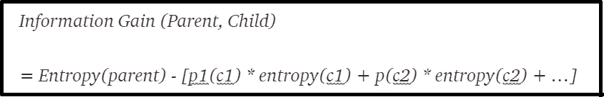

Source [3]

在下面的例子中，我们通过一个特定的属性(比如口香糖的**大小**)来分割口香糖偏好。它给出了父/子节点关系:

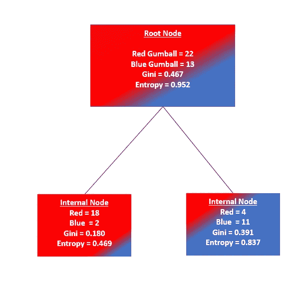

## 基尼系数信息增益(根据上面的等式)

```
#Defining Gini info gain function:def gini_info_gain(pa,pb,c1a,c1b,c2a,c2b):
    return (gini(pa,pb))-((((c1a+c1b)/(pa+pb))*gini(c1a,c1b)) + (((c2a+c2b)/(pa+pb))*gini(c2a,c2b)))#Running Functiongini_info_gain(22,13,18,2,4,11)
```

> = 0.196 基尼信息增益
> 
> 0.196/0.467 = 41.97%的增益

## 熵信息增益(来自上面的等式)

```
#Defining Entropy info gain function:def entropy_info_gain(base,pa,pb,c1a,c1b,c2a,c2b):
    return (entropy(base,pa,pb))-((((c1a+c1b)/(pa+pb))*entropy(base,c1a,c1b)) + (((c2a+c2b)/(pa+pb))*entropy(base,c2a,c2b)))#Running Functionentropy_info_gain(2,22,13,18,2,4,11)
```

> = 0.325 熵信息增益
> 
> 0.325/0.952 = 34.14%的增益

对于这个例子，基尼具有更高的信息增益测量。

# 最终要点:

1.  基尼的最大杂质是 0.5，最大纯度是 0
2.  熵的最大杂质是 1，最大纯度是 0
3.  不同的决策树算法利用不同的杂质度量:CART 使用 GiniID3 和 C4.5 使用熵。在您的模型中使用决策树/随机森林之前，这是值得研究的。

*本出版物中的所有代码都可以在我的 github 上找到[这里](https://github.com/ahershy/Gini-Index-and-Entropy-Exercise/blob/master/Entropy%2Bvs%2BGini%2BAnalysis.ipynb)

# 来源:

[1][https://en . Wikipedia . org/wiki/Decision _ tree _ learning # Gini _ infinity](https://en.wikipedia.org/wiki/Decision_tree_learning#Gini_impurity)

[2]http://web.mit.edu/6.02/www/f2011/handouts/2.pdf

[3]f . Provost 和 t . Fawcett(2013 年)。*商业数据科学:你需要了解的数据挖掘和数据分析思维*。加利福尼亚州科隆:奥赖利。

**考虑通过我的推荐链接加入 Medium:**[https://andrewhershy.medium.com/membership](https://andrewhershy.medium.com/membership)

**如果您觉得这很有帮助，请订阅。如果你喜欢我的内容，请查看其他几个项目:**

[*随机森林是否优于 Logistic 回归？*(一比较)](/is-random-forest-better-than-logistic-regression-a-comparison-7a0f068963e4)

[*Excel vs SQL:概念上的比较*](/excel-vs-sql-a-conceptual-comparison-dcfbee640c83)

[*用 Python 中的逻辑回归预测癌症*](/predicting-cancer-with-logistic-regression-in-python-7b203ace16bc)

[*利用数学和 Python 优化你的投资*](/portfolio-linear-optimization-breakdown-f519546ed1ff)

[*从头开始计算 R 平方(使用 python)*](/r-squared-recipe-5814995fa39a)

[*Python 中的字云:综合示例*](/word-clouds-in-python-comprehensive-example-8aee4343c0bf)