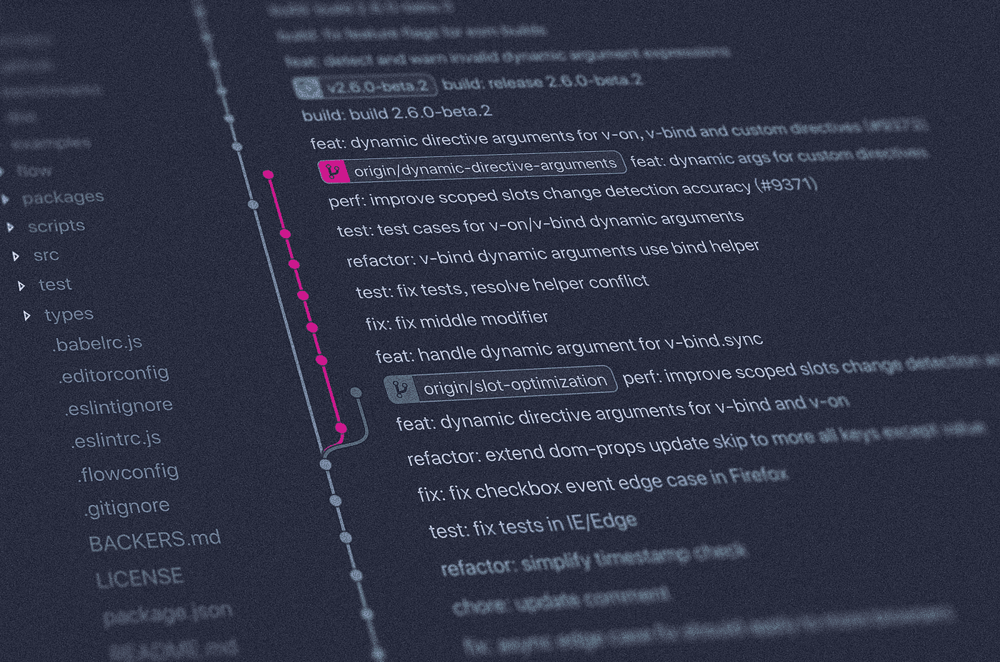

# Git 基础

> 原文：<https://towardsdatascience.com/git-basics-ec81696be4e6?source=collection_archive---------27----------------------->

Photo by [Yancy Min](https://unsplash.com/@yancymin?utm_source=unsplash&utm_medium=referral&utm_content=creditCopyText) on [Unsplash](https://unsplash.com/search/photos/git?utm_source=unsplash&utm_medium=referral&utm_content=creditCopyText)

Git 被用作版本控制软件——用于维护软件的多个版本。

但是现在，它的用途远不止于此——与他人协作、代码版本控制、共享、将代码从本地机器部署到临时服务器，即“将代码部署到云”等等。

## Git 是做什么的？

*   假设从代码的第一个版本开始，Git 不仅允许我们访问我们代码的最新版本，而且所有添加/删除的代码行都被跟踪，我们知道我们项目的所有历史。
*   Git 非常擅长在不同的人之间同步代码。Git 将代码存储在一个远程服务器中，因此我们的合作伙伴可以访问相同的代码。当多人对代码进行更改时，Git 会保留一个更新的代码版本，该版本合并了所有更改，因此团队中的每个人都在同一页面上。
*   Git 非常擅长测试代码。在对代码进行修改和测试以查看其工作情况时，Git 允许我们维护代码的原始副本。我们可以在测试完新代码后恢复它，或者如果对新代码满意，用原来的代码替换它。因此，Git 在允许恢复到旧版本的代码方面做得很好。

## Git 与之通信的远程服务器是什么？

Git 与托管存储库(保存所有代码和跟踪变更的中央存储位置)的远程服务器通信。许多 Git 托管站点包括 Github、Bitbucket、Gitlab、Beanstalk 等，它们用于在互联网上存储 Git 存储库，以便进行软件开发版本控制。我们可以将我们的存储库“推”到远程服务器，这样我们的合作者和互联网上的其他人也可以看到并参与这些项目。同样，我们可以“克隆”我们想要工作的项目的存储库。

## Git 命令

*   存储库的 url 托管在 Github/Bitbucket 或任何其他远程服务器上——我们希望将它下载到我们的计算机上
*   `git add <filename>`:这个文件是我们下次保存存储库副本时想要跟踪的文件。请记住，我们必须位于包含要添加的文件的目录中。
*   `git add *`:添加所有未保存的文件，这显然比 git 添加单个文件要快。然而，将添加和提交分开使我们能够控制我们的存储库，并使我们能够指定我们想要跟踪的变更。
*   `git commit -m "message"`:这个命令只是保存对存储库所做的更改。-m 代表方法。该消息应该描述我们在“提交”中所做的任何更改。这非常有用，因为我们可以返回到描述一系列变化的消息列表。
*   `git status`:告诉我们我们的知识库中当前正在发生什么

## 我们如何将我们在本地所做的任何更改发送到托管站点？

*   将代码从我们的电脑上传到储存在互联网上的知识库中。结果，主机端，例如 GitHub，现在能够跟踪它了。
*   `git pull`:该命令用于在本地计算机上下载最新版本的存储库。

合并冲突——Git 将尝试合并所有的更改。但是，当对一个特定文件的相同行进行了多次更改时，可能会出现冲突，这会导致我们试图运行`git pull`时出现冲突。在这种情况下，因为合并不能发生，所以拉不能发生。出现一条消息，显示*“自动合并失败。您需要解决冲突，然后提交结果。”在决定要保留哪些修改后，必须进行修改。*

*   `git log`:显示所有提交的历史记录。每个提交都可以通过唯一的提交哈希来区分。
*   `git reset --hard <commit hash>`:将存储库重置回提交哈希指定的版本。
*   `git reset --hard origin/master` : `origin/master`表示存储库的版本，它是我们从中获得它的存储库的来源。

注意:对我们计算机上的存储库所做的任何更改都不会影响主机站点上正在进行的在线操作，除非我们对它进行了那些更改。

暂时就这样吧！点击此处获取更多 Git ！