# 饭桶

> 原文：<https://towardsdatascience.com/git-for-noobs-7a846ce98c9a?source=collection_archive---------6----------------------->

## Git:什么，为什么，怎么做。

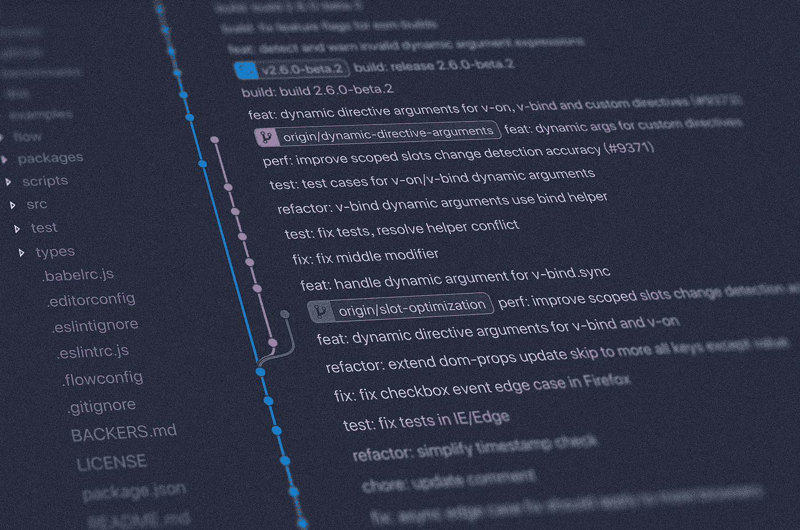

每个参与计算机科学/软件/编程世界的人无疑都听说过 **Git** 。但是我们真的知道 Git 是什么吗，以及我们为什么要使用它吗？它的基本理念是什么？Git、 **Github** 、 **GitLab** 和其他类似 **Bitbucket** 的平台有什么区别？

如果你想学习所有这些东西，请继续阅读。我们将讨论 Git 的**历史、**它的目的和理念**，然后在**构建一个真实项目**的同时，更深入地了解它的主要功能和特性。**

不要感到不知所措，**在这篇文章结束时，你会完全理解什么是 git**，为什么它在软件开发中如此重要，以及你如何利用它为我们服务。让我们继续吧！

# 介绍

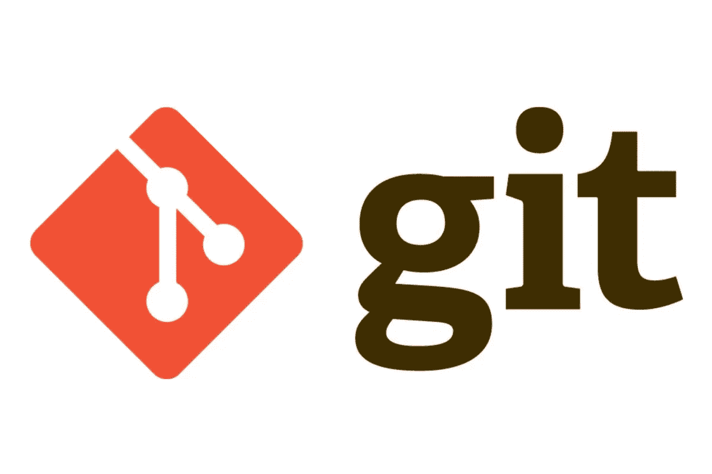

Logo of git

Git 是世界上最流行的版本控制系统(VCS)。

什么是 VCS？非常简单:VCS 是一个软件，它帮助管理随着时间的推移对特定代码所做的更改。

如果您有一个名为 *CatImageDetector.py* 的文本文档，并且您一直在对其进行更改，如果使用得当，**VCS 将跟踪这些更改**，这样，如果您想返回到与您编辑的上一个版本不同的版本(例如，因为代码不再正常工作)，您可以轻松地做到这一点。

上一段有一些值得强调的内容:像 Git 这样的 VCS 被认为是为了跟上变化并存储文本文档。它们**不是用来存储数据的；为此，我们有许多其他平台。因此，有时他们很难跟上 Jupyter 笔记本等格式的变化。**

Git 背后的理念与通常的本地文档重写形成对比，我们做所有的事情——我们编辑一个文档，但只能看到它的最后一张图片——如果我们想回到以前的版本，我们可能做不到。

这种系统(VCS)在和不同的人一起工作时也非常有价值。假设你和另外两个同事一起做一个项目:你们都在修改相同的文档，并且希望这种协作尽可能有效。正如我们将在后面看到的，Git 允许您以尽可能好的方式做到这一点(如果遵循某些准则的话)。

我认为，这两点是 Git T1 背后的主要思想:允许用户管理他们的软件项目，以便在每一个期望的变更后备份代码，并保护项目免受团队协作时可能出现的一些不一致的影响。

Git 也有一些特殊性，使它更加引人注目，比如它的**分布式特性**，它是跟踪文档不同版本的方式(**使用 Deltasδ**:相邻版本之间的变化)，它的**性能**或者它的**安全性**，但是这些问题将在后面讨论，或者超出了本文的范围。

让我们继续，简单看看 Git 是如何诞生的。

# Git 的历史

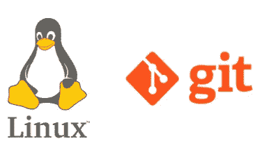

Logos of Linux and git

Git 的历史与 Linux 的历史紧密相连。Linux 操作系统内核的起源——来自世界各地的开发人员都在为这个项目做贡献——要求存在一个有效的版本控制系统，让每个人都能以有序和系统的方式工作。

2005 年，这些开发人员在工作中使用的 VCS**BitKeeper**从免费变成了收费，因此寻找新 VCS 的竞赛开始了，最好是一个分布式的。

这个项目的首席开发人员 Linus Torvalds 过了一段时间后决定，如果他找不到适合未来任务的完美 VCS，他就自己造一个。**git 就是这样诞生的**。

您可能想知道 git 实际上代表什么。这个答案起初并不明显，一旦我们知道了它，并且知道了它被创造出来的目的之后，它就变得明显了。 **GIT 代表“全球信息跟踪者”**。

**酷吧？**好吧，让我们更专业一点。

# Git 基础——使用组

如前所述，Git 的优点之一是它有效地允许我们与来自世界各地的人们一起工作。然而，为了这种合作的成功，我们不能只是以我们认为合适的方式使用 git，并希望我们的同事理解我们所做的，并相应地推动他们的行动；必须遵循一些指导方针。

但是首先，在定义这些准则之前，让我们描述一下 git 的一些基本元素:**存储库和分支**。

## 存储库和分支

一个存储库，尽管它的名字很长，最好理解为一个文件夹，就像我们电脑中的文件夹一样，我们正在处理的所有元素都存储在那里。

在同一个项目中工作的人将从同一个存储库中进行修改、上传文档和下载文档。

分支是促进自组织和协作工作的工具。项目通常从称为主分支的初始分支开始，并从那里构建多个其他分支，形成树状结构。


Repositories tree-like structure

**为什么要这样做？**想象一下，你正在和 4 到 5 个不同的人一起做一个项目，他们和你一样修改相同的脚本，但是实现不同的功能。如果你们都不断地上传对主分支上相同内容的修改，一切很快就会变得混乱。相反，每个人都应该在他们自己的分支上工作，在那个分支上实现变更，并且当所有的事情都在他们自己的分支上完美地工作时，这些变更应该被小心地合并。

## **指南和 Git-Flow**

现在我们知道了什么是*(存储库的简称)和分支，让我们看看正确使用它们的指导方针。上一段的描述只是一个简单的例子来说明什么是分支，但是使用它们不仅仅是为每个开发人员/特性创建一个分支，然后将它们组合在一起那么简单。*

*我们已经谈到了主分支，说它是任何项目的根或主要分支，但是我们没有给予它应有的重要性。主分支是存储项目的最新工作或生产代码的分支，只应在上传将要实际使用的经过全面测试的代码时使用。这里上传的任何东西都应该可以投入生产了。*

*如果我们不能触及主要分支，那么我们如何构建代码呢？简单:我们创建另一个分支，通常称为 develop，**，这是我们实际开发代码**的地方，也是我们不断进行更改的地方。*

*等等，当上述情况发生时会发生什么，例如，我们有许多人在同一代码库的不同功能上工作？你可能会猜到答案:我们**从 develop** 分支出分支，并在那里工作，一旦我们完成工作，就将更改上传到 develop，并检查与其他开发人员的代码没有冲突。*

*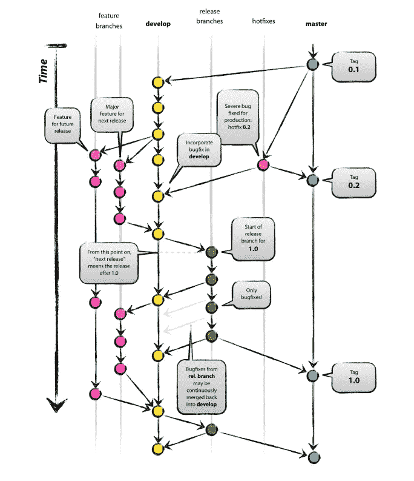*

*Image from: [https://nvie.com/posts/a-successful-git-branching-model/](https://nvie.com/posts/a-successful-git-branching-model/)*

*然而，当只有少数开发人员接触开发分支上的相同代码时，可能没有必要从它创建多个分支。此外，有时我们可能希望从存储库中的某个点开始创建一个分支，以便从那里为产品的不同版本或发布开发新的特性。*

*当来自开发的代码已经被测试、测试、再测试，是的，再测试，然后我们可以上传变更到我们的主分支。*

*最普遍接受的方法是通过所谓的***Git-Flow****完成，您可以在这里找到:**

**[](https://nvie.com/posts/a-successful-git-branching-model/) [## 一个成功的 Git 分支模型

### 在这篇文章中，我将展示我为自己的一些项目(包括工作和私人项目)介绍的开发模型…

nvie.com](https://nvie.com/posts/a-successful-git-branching-model/) 

现在我们知道了如何有效地处理分支，让我们简单地看一下主要的 git 命令，然后展示一个实际的例子。

# Git 命令

我不打算描述所有的 git 命令及其输出，只是为了能够使用 git 来管理项目的代码，您 100%需要了解并熟悉的命令。

*   **status:** `git status`该命令显示您的存储库的当前状态，说明哪些文件已经被修改，哪些文件已经被添加或提交。
*   **branch** : `git branch`返回我们存储库的分支，突出显示我们当前正在处理的分支。


Output of the git branch command

*   **add:** `git add document.py`告诉 git 您想要在下一次提交中包含在 *document.py* 中所做的更改。

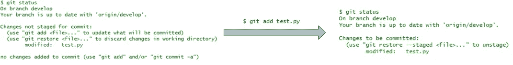

Returns of the git status command before and after adding a file

*   **commit:**`git commit -m "message"`commit 命令基本上记录了您所做的更改，并将其添加(使用之前的命令)到您的本地存储库中。commit 命令有一条消息，通常描述已进行的更改以及通过 commit 上传的更改。

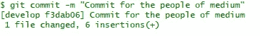

Output of the commit command

我们在文章中提到了 git 的分布式本质，这是它最早的特性之一，但我们并没有真正描述这意味着什么。它**被**称为**分布式**,因为每个 **git** 工作目录都包含一个完整的存储库，其中包含该树的完整历史。

您通常有一个远程存储库(可以配置),从中上传和下载代码，但是 git 的性质并不要求您这样做。

*   **push:** `git push`该命令将您在本地 repo 中所做的更改(通过提交)发送到您已经配置的远程存储库。

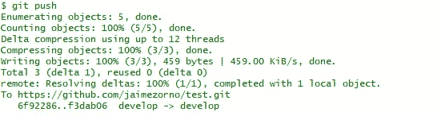

Output of the push command

*   **拉:**拉是推的兄弟命令。它将远程存储库下载到您的本地机器上。

最后，我们将看到允许我们使用分支的命令:

*   **checkout:** `git checkout branch`就是我们如何从我们所在的分支切换到另一个分支。*分支*是这个命令是我们想要切换到的分支。checkout 命令也可以用来创建新的分支。使用命令`git checkout -b newly_created_branch`我们创建一个新的分支并切换到它。

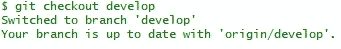

Switching from master to develop

*   **合并:** `git merge branchToMergeFrom` 我一直在说上传，但实际上合并两个分支的词是合并。这意味着将您在一个分支中所做的更改移动到您所在的分支。通常的做法是这样的:想象我们想把我们的变更从开发变成主控。首先，如果我们在开发中，我们必须签出到主节点，然后`git merge develop`将我们的*开发*分支中所做的更改传递到我们的*主节点*分支。请记住，只有当代码已经可以使用并经过测试时，才可以这样做。


Merging from develop to master

这些是使用 git 时需要知道的主要命令。现在您已经了解了它们，**让我们探索一下 git 和使用它的各种服务之间的区别！**

# Git vs GitHub 和其他平台

什么是 GitHub，GitLab，BitBucket，Azure repos 等等？他们和 git 是什么关系？


git and GitHub

我们在这篇文章中多次提到，git 的关键特征之一是它的**去中心化特性**。这意味着一组用户在他们的本地机器上有 git，知道其他用户的 IP 地址，并使用其对应的凭证建立 HTTP 或 SSH 隧道，一切都可以从他们的伙伴的本地机器推送或向他们的伙伴的本地机器拉取回购。

然而，对于商品来说，如果我们只使用 git 来管理协作，那将会是建立一个远程服务器，让每个人从那里进行推和拉。这难道不会使 git 集中化吗？嗯，从技术上来说不是，因为这个远程服务器不会构成网络的单点故障:如果代码在远程服务器上，这意味着它已经在用户的本地机器上，因此我们可以从那里恢复它。

像 Github、GitLab、或 **Bitbucket** 这样的**服务提供的只是一种高效、有组织、简单的方式来做到这一点，同时还增加了额外的功能，如拉请求和一个闪亮的基于 web 的用户界面。在这种情况下， **Git(一个 VCS)是被各种基于 c 语言的服务使用的工具**，比如 Github** 。Git 是一个管理源代码的开源工具，而 Github 是一个在线服务，git 用户可以通过连接上传或下载资源。Git 是核心，GitHub 和其他服务提供了围绕它的层。

为了让你的代码进入 GitHub，[看看这里](https://help.github.com/articles/create-a-repo)。最后，让我们看一个简单快捷的例子，展示如何使用 git 来管理 Github 上的一些代码及其工作流。

# 使用 Github 的 Git 示例

好了，现在我们已经涵盖了所有的理论，让我们来看看一个非常简单的 Github 使用示例。**许多现代的 ide，如 Sublime Text、Visual Studio 或 Pycharm，都内置了 git 插件**，这样我们就可以轻松地将代码上传到我们之前提到的某个平台上。在我们的例子中，我们将使用 Pycharm。

首先，我们将**创建一个新项目**，并为它指定我们想要的名称: *Git_for_Noobs。*然后，在名为 *Git_for_medium.py* 的脚本中，我们将编写以下代码:

```
print("Hello Medium!")
```

保存它，然后继续添加到我们的本地 git repo，并使用消息"*First commit of the Git _ for _ Noobs repo "*进行第一次提交，如下面的视频所示。

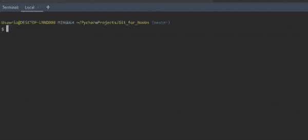

git add and then commit

但是，如果我们现在尝试推送到远程回购，它会给我们一个错误，因为我们还没有配置。**首先，我们需要进入项目的 VCS 选项，并创建一个 GitHub 存储库**。一旦我们完成了这些，工具可能会为我们推送第一次提交，如果我们正在使用 GitHub，我们会看到一个新的存储库已经创建，如下图所示。

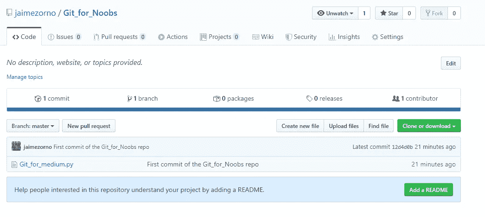

Repository Git_for_Noobs with our first commit

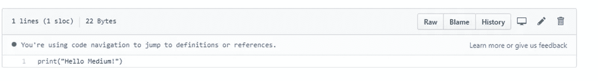

Content for the Git_for_medium.py file

好了，现在我们已经创建了我们的回购并上传了我们的第一个文件，让我们创建一个新的分支并做一些更改。首先，让我们变得更加外向一些，将代码改为如下所示:

```
print("Hello Internet!")
```

之后，让我们使用`git checkout -b develop`创建一个名为 develop 的新分支(默认情况下，当创建一个新的 repo 时，第一个分支将被称为 master ),并将我们的文件 *Git_for_medium.py* 添加到其中*。*

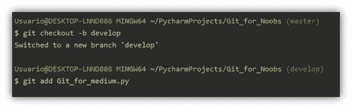

Creating a new branch called develop and adding it

最后，让我们提交这些更改，然后将它们推送到 GitHub。

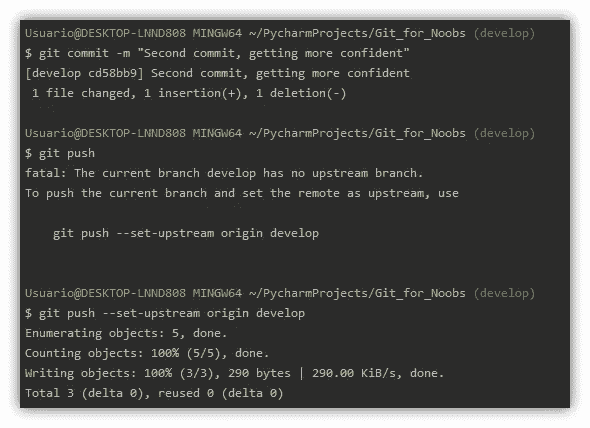

Commit and push

如您所见，push 命令给了我们一个错误，因为我们在远程 *repo* 中没有一个名为 develop 的分支(它只是在本地创建的)，并且它不知道将我们的代码放在哪里。使用- `git--set-upstream origin develop`我们告诉它将更改推送到 GitHub *repo* 中一个新的分支，名为 develop。让我们来看看变化吧！

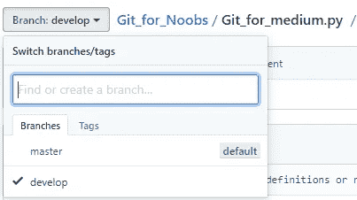

We now have two branches, master and develop.

现在我们有两个分支，master 和 develop，它们都有不同的代码，因为我们的第二个提交只被推送到 develop 而不是 master。

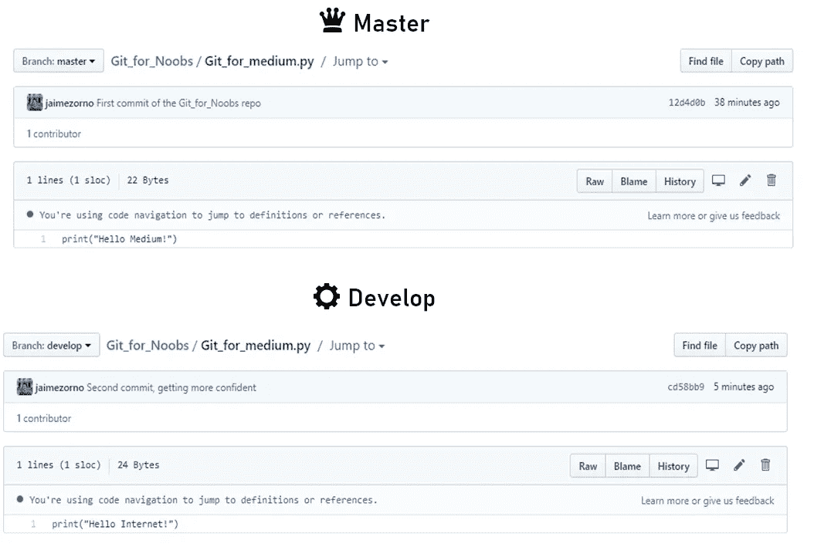

Contents of the develop and master branches

让我们对我们的脚本做最后的修改，并推动它发展。现在我们已经完全进入外向模式，想和每个人打个招呼。这段代码现在将成为编程社区中最著名的一句话:

```
print("Hello world!")
```

现在，一如既往，我们按照这个顺序添加、提交和推送。

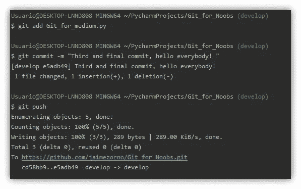

add, commit and push changes in our file

在下图中，我们可以看到 develop 分支中代码的最后一种格式(顶部)，以及我们对 *repo* 所做的所有提交，独立于它们所在的分支(底部)。

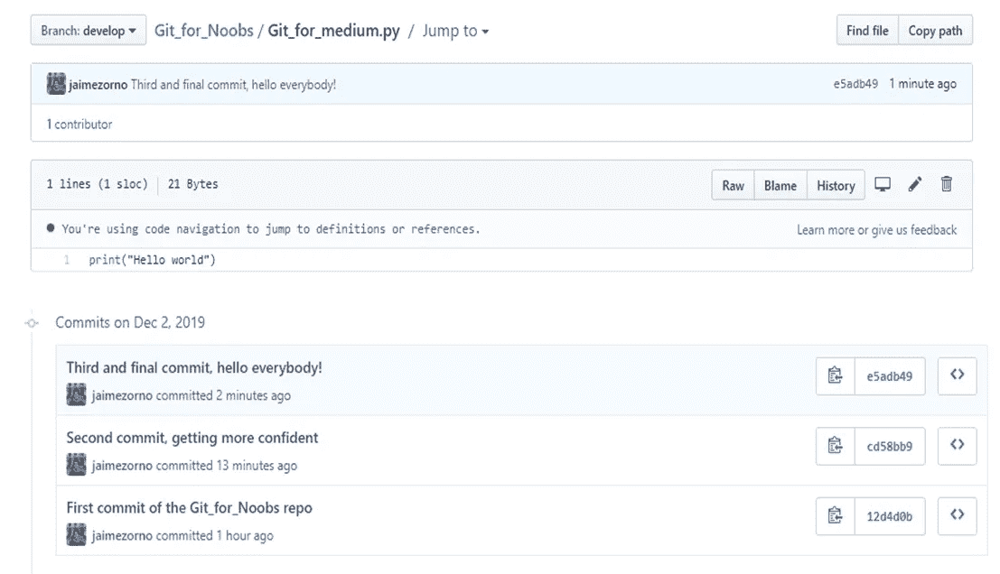

Last change to our Git_for_medium.py on develop and all the history of commits to our repo

作为最后一步，让世界知道我们现在是一个更加外向的人，并且**更新我们在开发分支中所做的改变以掌握**。这可以通过`checkout`命令(移动到母版)完成，然后合并开发，如下图所示。

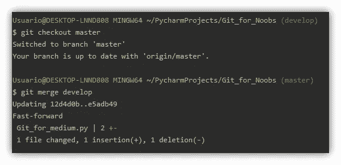

Merging from develop to master

在内部，**合并工作就像任何其他提交**一样，所以在这之后我们还必须使用`git push`推送我们的远程回购。现在，如果我们看一下主分支，我们有与开发分支相同的代码！酷吧？

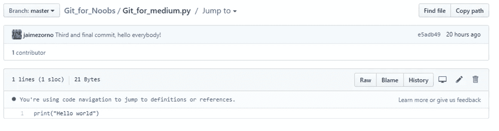

Last state of our Master branch after the merge

# 结论

Git 是一个非常有用的软件开发工具。我们已经看到了它的用途，它不应该用于什么，它的哲学，起源以及与使用它的服务的区别。

更多类似这样的帖子[**请在 Medium**](https://medium.com/@jaimezornoza) 上关注我，敬请关注！

就这些，我希望你喜欢这个帖子。请随时在 LinkedIn 上与我联系，或者在 Twitter 上关注我。还有，你可以看看我在数据科学和机器学习上的帖子[**这里**](https://medium.com/@jaimezornoza) 。好好读！

# 额外资源

如果你想了解更多一点，澄清你从这篇文章中学到的东西，或者深入这个主题，我在这里留下了一些信息，我认为可能会很有用。

*   [什么是 git Atlassian 教程](https://www.atlassian.com/git/tutorials/what-is-git)

 [## 什么是 Git:使用本指南成为 Git 专家| Atlassian Git 教程

### 到目前为止，当今世界上使用最广泛的现代版本控制系统是 Git。Git 是一个成熟的、积极的…

www.atlassian.com](https://www.atlassian.com/git/tutorials/what-is-git) 

*   [Git 工作流 Atlassian 教程](https://www.atlassian.com/git/tutorials/comparing-workflows)

[](https://www.atlassian.com/git/tutorials/comparing-workflows) [## Git 工作流| Atlassian Git 教程

### Git 工作流是如何使用 Git 以一致且高效的方式完成工作的诀窍或建议…

www.atlassian.com](https://www.atlassian.com/git/tutorials/comparing-workflows) 

*   关于如何使用 git 在团队中工作的博客文章

[](https://blog.hipolabs.com/how-to-work-in-a-team-version-control-and-git-923dfec2ac3b) [## 如何在团队中工作:版本控制和 git

### 不知道命令做什么就停止记忆命令！

blog.hipolabs.com](https://blog.hipolabs.com/how-to-work-in-a-team-version-control-and-git-923dfec2ac3b) 

*   [关于 git 和 github 区别的博文](https://www.theserverside.com/video/Git-vs-GitHub-What-is-the-difference-between-them)

[](https://www.theserverside.com/video/Git-vs-GitHub-What-is-the-difference-between-them) [## Git vs. GitHub:两者有什么区别？

### Git 和 GitHub 一样吗？肯定不是。自从微软……以来，Git 和 GitHub 的比较越来越频繁

www.theserverside.com](https://www.theserverside.com/video/Git-vs-GitHub-What-is-the-difference-between-them) 

*   在 h [上发布如何开始使用 git](https://git-scm.com/book/en/v2/Getting-Started-Installing-Git)

[](https://git-scm.com/book/en/v2/Getting-Started-Installing-Git) [## Git -安装 Git

### 在开始使用 Git 之前，您必须让它在您的计算机上可用。即使已经安装了，也是…

git-scm.com](https://git-scm.com/book/en/v2/Getting-Started-Installing-Git) 

*   [Youtube 视频:“学会 git:基本概念”](https://www.youtube.com/watch?v=8KCQe9Pm1kg)

***尽情享受，有任何疑问随时联系我！*****