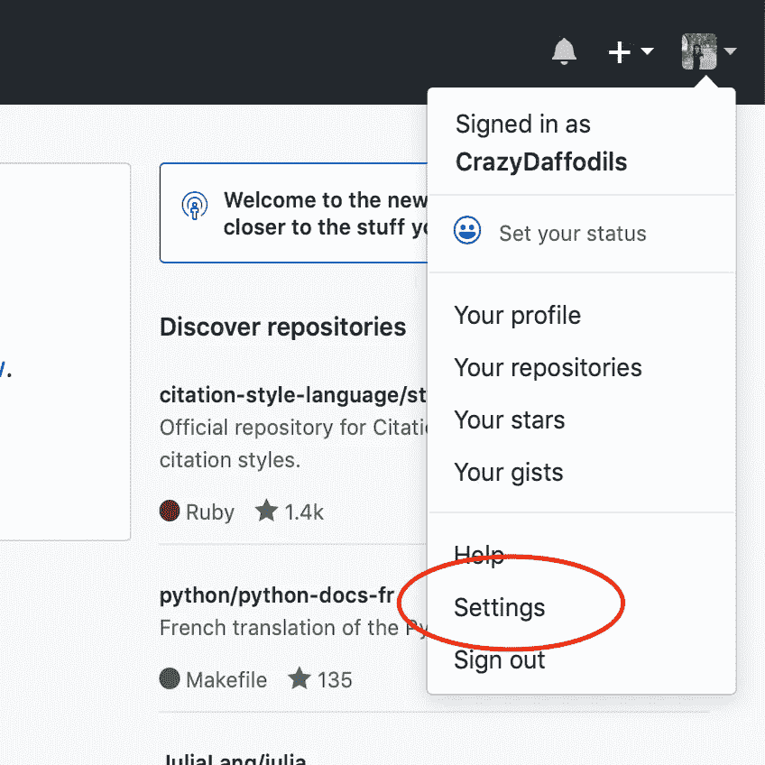
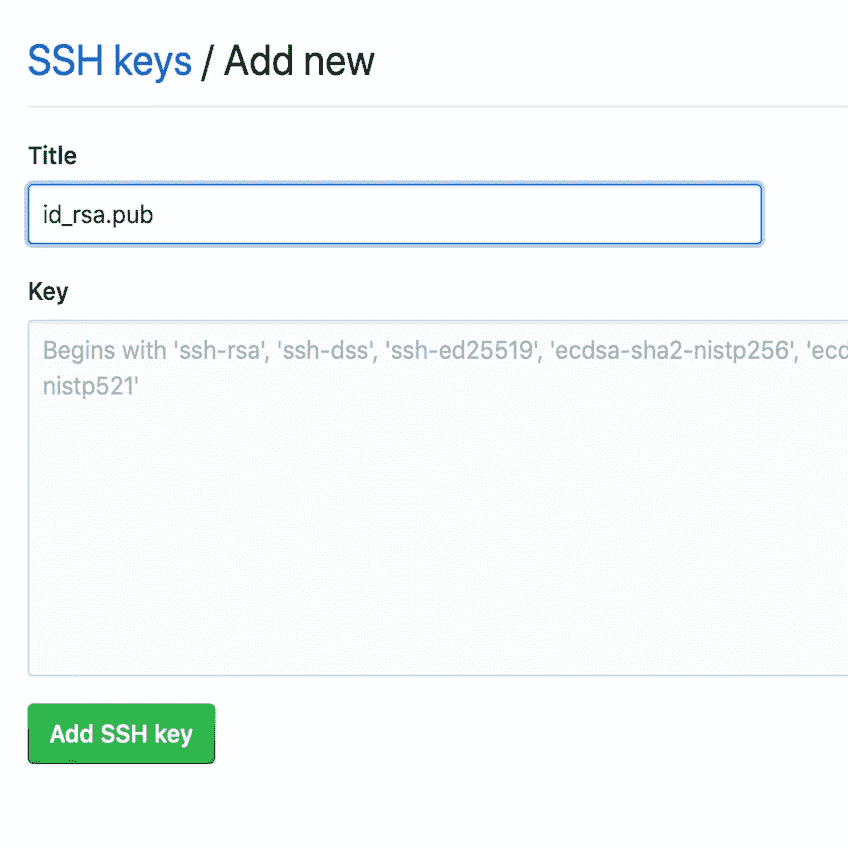
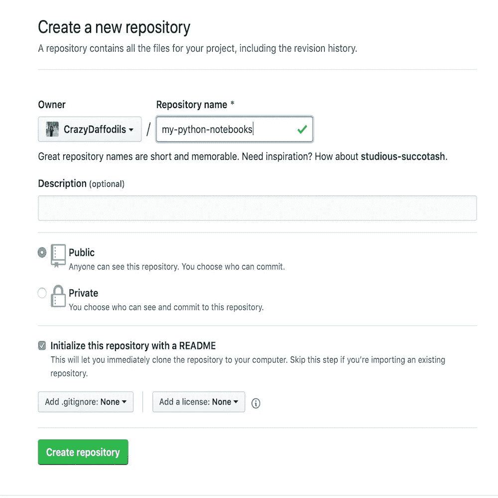
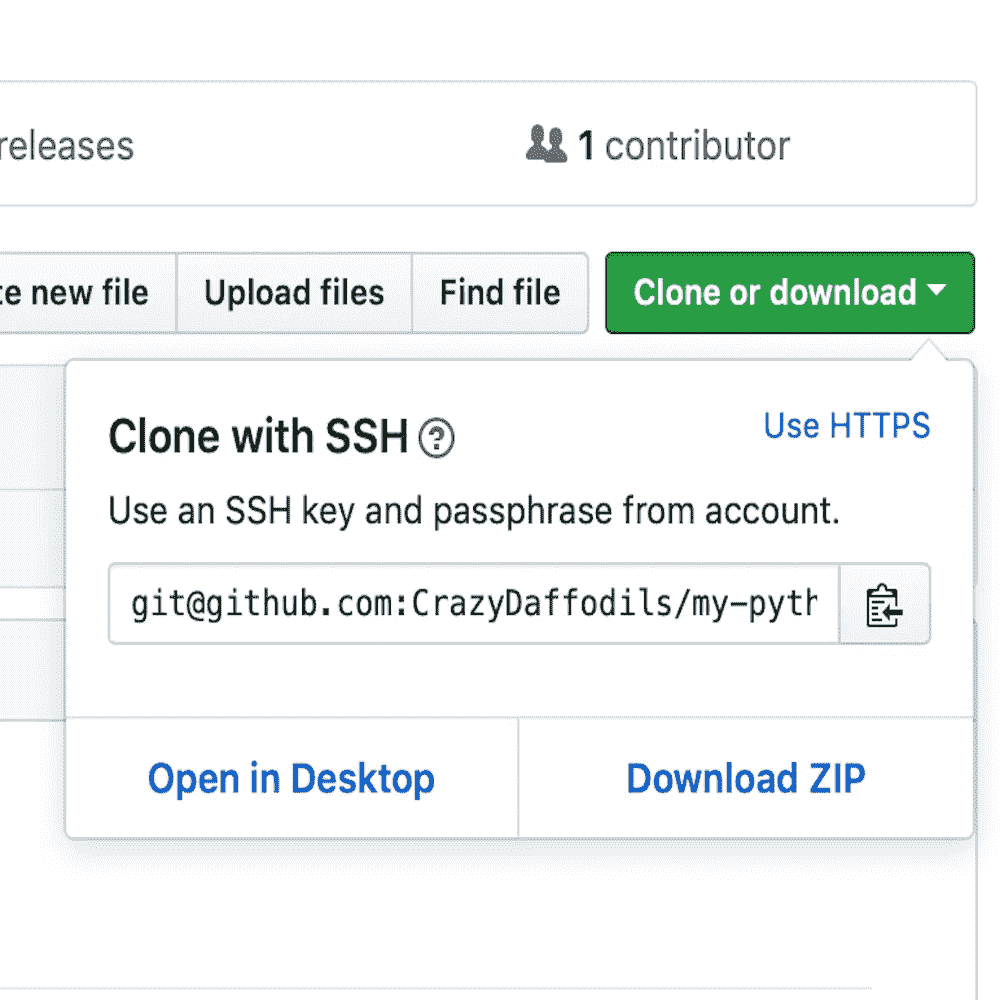

# 20 分钟后准备好！

> 原文：<https://towardsdatascience.com/git-ready-in-20-minutes-d11699a0aea2?source=collection_archive---------9----------------------->


当我开始我的数据科学之旅时，一位密友兼导师建议我熟悉 git。这似乎是一种干扰，但我想，“这是一个版本控制系统。我肯定能在 2-3 天内学会，并回到 Python 的美丽世界。”我大错特错了。我离开 Python 两天的短暂旅行变成了三个月的假期。我当然不后悔花费的时间，因为不可否认学习 git 的重要性。git 对于每个程序员的重要性已经在几个优秀的[博客](https://medium.freecodecamp.org/the-four-data-science-skills-i-didnt-learn-in-grad-school-and-how-to-learn-them-f2b039fc0f59)中有很好的描述，我在这里不打算重复了。

对于像我这样没有编程背景的初学者来说，一开始可能看起来有些吓人。在花了大量时间试图理解 git 的底层概念和内部结构之后，我意识到它真的没有尽头。然而，它可以分阶段学习。如果你从来没有使用过 git，并且一直把它放在后面，我强烈建议你至少开始使用它。它并不像看起来那么复杂，您可以随时随地学习更多功能。到本文结束时，您将对 git 的功能有一个大致的了解，用 [GitHub](http://GitHub.com) 创建了一个帐户，采取了安全措施，创建了一个存储库，并检入了一些代码——所有这些都有望在 20 分钟内完成！

让我们从几个关键概念开始。

## **吉特**

Git 是一个版本控制系统；分布式的。版本控制系统(VCS)记录关于代码文件的变更内容、变更时间、变更地点和变更人的信息。与其他 VCS 不同，git 是“分布式”的*，即*。，它不是由中央服务器管理的。Git 以快照的形式存储数据。当您保存一个文件的状态(在 git 术语中称为 commit)时，git 获取文件的一系列快照，并为它分配一个惟一的 40 个字符的键。在下一次提交期间，它会再次拍摄一系列快照。如果进行了任何更改，将生成一个新的密钥。如果没有，则使用相同的键引用该文件。因此，在其核心，git 只不过是一个键值数据存储。

> *git 的核心是一个* ***键值*** *数据存储。持久化地图。*

## **GitHub**

Git 协议由几个服务提供商托管，例如 GitHub、Bitbucket 和 Codebase。GitHub——最近被微软收购，是最流行的 git 托管平台之一。现在你知道为什么不能互换使用术语 git 和 GitHub 了。

## **储存库**

git 存储库是与项目相关的所有文件和文件夹的集合。简单地说，存储库就像一个包含文件夹、子文件夹和文件的目录。GitHub 允许你创建无限数量的公共和私有库。顾名思义，公共存储库是公开的，可以查看和复制；而用户可以展示对其私有储存库的访问控制。

## **SSH 密钥**

SSH 或安全 Shell 允许使用加密技术在主机和客户端之间建立安全连接。SSH 密钥的生成本质上是公钥-私钥对的生成。使用安全 Shell 身份验证的动机是大大增强双方(在本例中是您的计算机和 GitHub)之间信息传输的安全性。为了更好的理解 SSH 协议，请参考 ssh.com[的](https://www.ssh.com/ssh/protocol/)

## **命令行界面**

CLI 允许您通过命令与计算机进行交互。与使用鼠标点击图形图标的图形用户界面(GUI)不同，使用 CLI 的交互更快、更可靠，并允许高级操作。如果您以前从未使用过终端，现在是时候开始了。这个阶段只需要几个命令。如果您熟悉使用 CLI，请随意跳过这一部分。打开终端窗口，键入以下命令以了解如何在文件夹和文件中导航。在光标处键入命令，然后按 Return 键执行命令。

```
ls
```

列出目录的内容。您的目录可能包含文件和文件夹。一旦您键入“ls”并按下 return 键，所有内容都会列出来。

```
ls –a
```

列出内容，包括隐藏的文件和文件夹。

```
cd <folder_name>
```

cd 代表“更改目录”。键入您希望导航到的文件夹/目录的名称(不要键入<>)。如果目标文件夹不在当前目录中，您需要键入目标文件夹的完整路径。或者使用命令 cd..

```
cd ..
```

在目录中向上导航一步。

```
pwd
```

打印当前目录的路径

```
clear
```

清除所有以前命令的屏幕

```
cp <source/filename> <destination>
```

cp 代表复制。要将文件从一个位置复制到另一个位置，请使用上述格式。

这就足够开始了。我在这里假设您使用的是基于 MacOS 或 Unix 的系统。您熟悉基本的终端命令，并且能够导航到所需的目录。

## **创建 GitHub 账户**

通过注册使用 [GitHub](https://github.com) 创建一个帐户。现阶段可以选择**免费**计划。验证电子邮件地址将引导您进入主页。

## **生成 SSH 密钥**

如果愿意，您可以在 GitHub 中使用现有的 SSH 密钥，在这种情况下，您可以直接进入下一步——添加 SSH 密钥。要生成新的 SSH 密钥，请转到终端，执行命令`**ssh-keygen**`。将提示“正在生成公钥/私钥对”的消息。只需点击返回接受默认位置和文件名。如果。ssh 目录不存在，系统会为您创建一个。出现提示时，输入并重新输入密码。执行命令`**ls –a**` 列出名为. ssh 的隐藏文件夹。ssh 通过`**ls**` 命令。将列出三个文件，其中 **id_rsa** 包含私钥， **id_rsa.pub** 包含公钥。通过执行命令 `**cat id_rsa.pub**`在屏幕上显示公钥，并从终端窗口复制密钥。

## **添加 SSH 密钥**

在线访问您的 GitHub 帐户。单击个人资料图标旁边的下拉菜单。点击设置并导航至 **SSH 和 GPG** 键。单击新建 SSH 密钥按钮，添加一个标题(例如:id_rsa.pub)并粘贴从终端窗口复制的公钥。请注意，您不应该共享您的私钥。现在您已经启用了 SSH 访问来安全地管理 GitHub 的 git 操作。



**Add new SSH key on GitHub**

## **创建存储库**

导航到 GitHub 主页。在左侧面板中，单击链接到**创建新存储库**。为您的存储库指定一个名称，例如:“my-python-notebooks”，并提供一行描述。选择 **Public** ，**Initialize Repository with a ReadMe**，点击 **Create Repository** 按钮。



**Create a repository on GitHub**

## **克隆你的仓库**

您刚刚在 GitHub 上创建的存储库位于一个远程位置。为了能够在离线模式下使用它，您需要克隆存储库。这使您能够在本地计算机上创建存储库的副本，并在两个位置之间进行同步。在 GitHub 上，在资源库名称下，点击 **Clone 或 download。**在**使用 SSH 克隆**部分，复制存储库的克隆 URL。



**Clone your repository**

转到终端，将工作目录更改为要保存克隆存储库的目录。键入`**git clone**`，然后粘贴你之前复制的网址并点击回车键。GitHub 上的资源库现在已经克隆到您的计算机上了。

## **git 添加**

现在，您的本地计算机中已经有了存储库，您可以将任意数量的文件夹和/或文件复制到其中。例如:使用`cp`命令复制一个现有的 Jupyter 笔记本 **filename.ipynb** 。一旦在本地存储库中有了 filename.ipynb，就执行`**git add <filename.ipynb>**`。git add 命令拍摄文件快照，为版本控制做准备。请注意，此文件尚未“版本化”。此步骤为提交“暂存”文件。

## **git 提交**

要提交转移文件，请执行以下命令:

```
git commit –m“The file contains basic Python datatypes.”
```

引号内的注释是关于文件内容或用户所做修改的描述性消息。此步骤将文件快照永久记录在版本历史记录中。

## **git 推送**

执行`git push`命令将提交上传到 GitHub。现在，您可以刷新浏览器，并确认 GitHub 上的存储库中的文件版本。

> *恭喜你！！！*

您已经成功地创建了第一个存储库，并签入了要由 git 跟踪的文件。

# 下一步是什么？

我建议您扎实地创建存储库，添加和/或编辑更多文件，并提交修改。接下来，您应该能够在本地计算机上的现有目录中启动 git 跟踪。此外，理解分支、合并、拉请求和部署的概念。这些过程是在与开发团队协作的同时实现的。