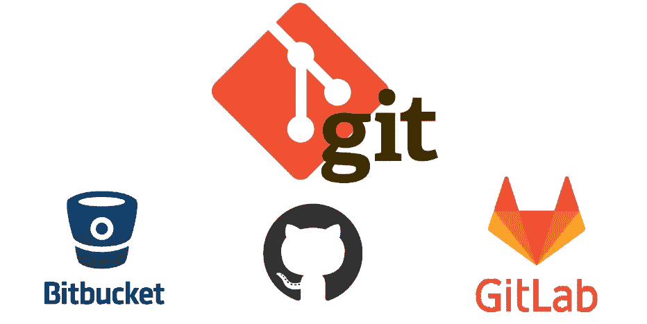
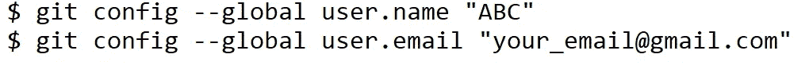
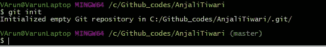
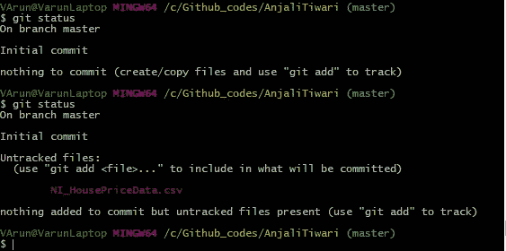
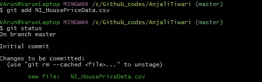
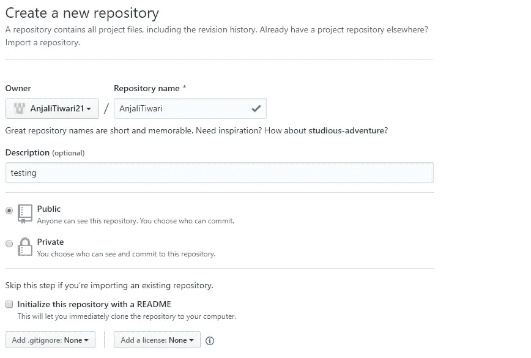
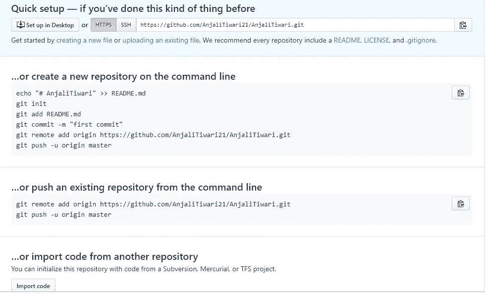
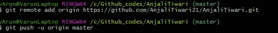
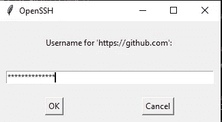

# git——版本控制系统

> 原文：<https://towardsdatascience.com/git-version-control-system-666a1ffd85d3?source=collection_archive---------11----------------------->

你为什么需要版本控制软件——你做了一些东西，现在你想在它被破坏或删除之前把它保存在某个地方，这样你就可以从你停止的地方继续工作。

> **有道理吗？**

好了，我们再深入一点，我对做个人网站很感兴趣。我研究了它的代码，花了几天时间。但是我的系统不支持挂起，或者硬盘可能已经崩溃，或者我错误地修改了我的代码，我无法返回到以前的状态。

> **这种事过去也发生在我身上，令人沮丧。**

这就是 Git 的用武之地，它通过跟踪你当前的项目和你所做的所有修改，而不是在你的系统上用不同的名字保存每一个版本，把你从所有的麻烦和挫折中解救出来。

有很多软件可以跟踪你的工作，但是这里我们只讨论 Git。Git 是一个版本控制软件，它跟踪对代码的修改。

> 因为每个公司都需要它，所以你的简历上会多一项技能。我猜这是有道理的？

好吧！也许你对它不满意。也许你喜欢把每个文件都保存在本地。

> **我再给你一个答案然后就说得通了。**

现在，我正计划与我的朋友合作，为我的网站有许多技能，这将有利于网站，为此，我需要更多的人。但是把它放在本地会让工作有点困难。因为每次你们都应该一起工作，而不是远程工作。

Git 可用于合并来自不同用户的已有版本的新版本，并清楚地了解在哪里以及由谁进行了哪些更改。

# 饭桶

Git 是一个分布式版本控制系统，每个用户都可以对他们系统上的整个存储库进行修改。它使用命令行，通过 git，可以很容易地来回撤销更改，并精确解释所做的更改。它具有以下能力:

1.  跟踪变化，即同一文件的不同版本。
2.  它还记录了项目中存在的所有文件。
3.  比较和分析不同的代码并给出详细的解释。

> 现在你知道为什么 Git 但是如何使用它了吧？

开始在 Git 环境中工作的基本步骤是拥有一个本地存储库和一个远程存储库。

**本地存储库:**本地存储库是您在本地计算机上创建的路径或目录，它是一个工作目录。您在这个私有的存储库中编写代码，直到您将它推送到远程存储库中。

**远程存储库:**远程存储库是一个公共目录，或者是一个托管您的网站的公共平台，如 Github 或 Bitbucket。使用 Git，可以很容易地将一段代码或整个项目推到远程目录。

> **现在你的朋友也可以做出改变了。:)**

Cloud Repositories: Github, Bitbucket, Gitlab

## 安装指南

现在是时候将它安装到您的系统上了。请看看这个链接来安装它。-> [安装指南](https://git-scm.com/book/en/v2/Getting-Started-Installing-Git)

## **关键概念**

让我们试着理解这里的一些关键术语:

1.  **版本控制系统:**该工具维护不同版本的代码。也称为源代码管理器。
2.  **提交:**当您进行更改时，在将更改发送到临时区域/临时索引并随后发送到远程存储库之前，这些更改应该保存在本地存储库中。这将您的代码保存到 Git 中。如果你想了解更多关于提交的信息，请点击链接 [git commit](https://git-scm.com/docs/git-commit) 。
3.  **签出:**当存储库中的内容被复制到工作目录时。
4.  **SHA(安全哈希算法)**:给每个提交一个唯一的 ID。
5.  **分支:**当你偏离了发展主线，继续做工作而不弄乱发展主线的时候。

## **配置 Git**

使用 cd 命令，您可以转到您的工作目录，并为您的本地和远程存储库设置用户凭证。这些凭证用于将代码推送到远程存储库中。

1.  使用此命令，您可以输入用户名和用户电子邮件 id。

使用 **$ git config -l** ，您可以检查所做的更改是否得到了反映。

## Git 上的本地存储库

首先，存储库应该存在于本地系统中。这个存储库将用于存储当前项目，它可以在以后被推送到 GitHub 上。我们使用命令行来探索存储库。使用命令 cd，转到路径并使用 mkdir 命令创建一个目录。

1.  **git init** :一旦创建了目录，使用 git init 命令初始化它。git init 命令创建了一个新的 git 存储库，现在是主分支。存储库是一个版本控制系统，用于存储源代码和其他开发项目。

您可以通过简单地复制文件夹或使用命令行将代码文件或任何文本文件保存到该路径。

> **使用 git branch 命令“git branch -m master oldmaster”。您也可以更改主分支。**

2. **git 状态:**使用 git 状态很容易看到存储库中所做的更改。比方说，我使用 git status 命令向 git 显示的分支添加了一个新文件。使用此命令可以看到所做的任何更改。这并不意味着已经做出并存储了更改。

**3。git add:** 所做的更改应该在提交之前添加。使用 git add 命令将代码或任何文件添加到临时区域。

为了一次添加多个文件，我们使用命令 **git add -A.** 将本地存储库中所有修改过的文件移动到暂存区。

**4。** **git commit:** 用于将文件从暂存区存储到存储库中。

## **在本地克隆存储库**

您可能希望在 GitHub 或任何远程环境中现有的存储库上工作。可以使用 git clone 命令克隆这个存储库，并将其存储在本地系统上以进一步增强代码。克隆存储库的命令是现有存储库>的 **git clone < path。**

克隆存储库时，请记住命令行并不指向另一个存储库。

## **查看提交历史的命令**

在处理代码时，您可能希望回滚所做的更改，或者对代码进行任何更改，以查看以前所做的更改。有命令可以查看过去发生了什么变化。

1.  **git log** :查看在存储库上进行的所有提交。我们使用 git log 命令。在命令中添加 SHA 键，我们可以看到一个特定的提交，后面跟着其他提交。为了只检查作为变更描述的一行，使用命令 **git — oneline** 。

**2。git — stat** :这个命令用于查看被修改的文件，以及添加或删除了多少行代码。

**3。git log -p:** 查看所做的实际更改，即可以使用该命令显示添加或删除的行。p 代表补丁。

在所有这些命令中，您都可以传递 SHA 键，这在查看特定提交时会很有用。

## GitHub 上的远程存储库

可以使用 Git 将代码推送到 GitHub。为此，应该在 GitHub 上做个交代。其次，应该在 GitHub 上创建一个新的存储库，方法是单击“+”然后单击“New Repository”按钮。

一旦你点击了新的存储库，它将引导你到一个页面，在那里你给出了你正在工作的项目的细节。回购的名称和描述。如果你不想分享你的回购，你可以选择私人选项。如果您愿意，以后可以更改它。

创建存储库后，它会将您转到下一页，您可以在这里选择是创建新的 repo，然后将代码推送到远程，还是将代码推送到现有的存储库中。

如果您已经在本地创建了 repo，那么您可以使用 SSH 将代码推送到 GitHub。

## 将主分支推送到 GitHub

因为我们已经在本地创建了 repo，所以我们将代码直接推送到 GitHub repo。当进行修改时，你将需要 GitHub 帐户的凭证。

## —关于分支的更多信息—

## 创建新分支

不要直接对主分支进行更改，应该习惯在不同的分支中进行更改。但是，如果新的更改不起作用，您可以返回到以前的提交，但是在组织中这会导致业务损失。

相反，最好是在一个新的分支中工作，测试所做的更改，然后将其转移到生产环境中。

使用命令**git branch<branch-name>添加一个指向主节点的分支。**但是如果要对一个现在不是主节点的提交进行修改，那么使用**git branch<branch-name>SHA。** SHA 告诉您在哪个提交之后应该放置新分支。

使用**git check out<branch-name>命令，我们将主分支移动到一个名为 **branch-name** 的新分支。现在，您可以通过使用与我们对旧的主分支所做的相似的步骤来添加和提交对这个分支的更改。然后将您的分支推送到远程存储库:**git Push-u origin<branch-name>****

如果成功，使用**git merge<branch-name>将代码与旧的主分支合并。**但是在运行 merge 命令之前，您需要使用 **git checkout 命令切换回原来的主分支。**

还可以使用 git 命令重命名、删除、比较分支:

1.  重命名:**git branch-m<branch-name><new-branch-name>**
2.  删除:**git branch-d<branch-name>**
3.  比较分支:**git diff<branch-name><master-branch-name>**

# 结论

Git 是免费和开源的。它易于使用，速度更快。它允许你在云上运行你的代码，并跟踪所有以前对项目的修改，即完整的变更历史。每次提交都包含作者的姓名、提交的描述、提交的时间戳和前一次提交的 SHA1 散列。

Git 在团队在偏远地区工作的情况下非常有用。因为任何个人都可以进行更改，只要授予对远程存储库的访问权限。

您可以将本地存储库与任何远程存储库(如 GitHub、GitLab、Bitbucket 等)链接起来。