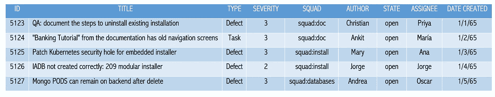
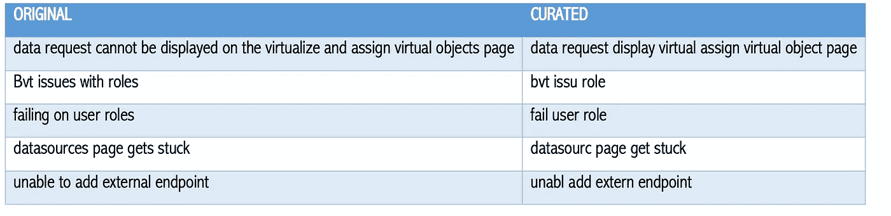
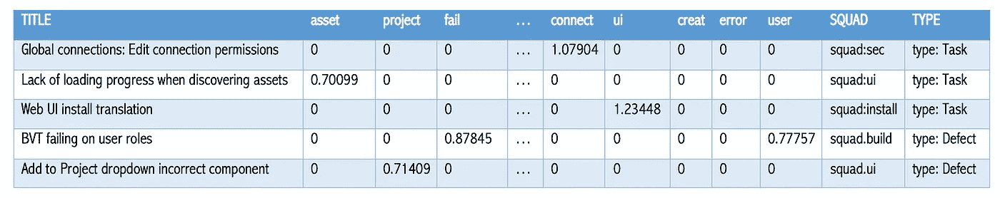
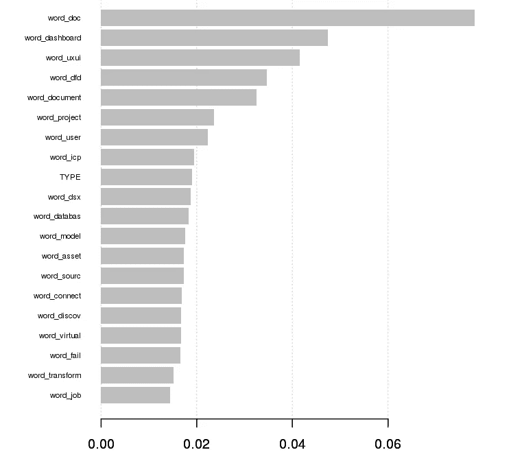

# 带有机器学习的 Github 自动完成

> 原文：<https://towardsdatascience.com/github-autocompletion-with-machine-learning-a833cb90983e?source=collection_archive---------16----------------------->

*作者*[*óscar d . Lara Yejas*](https://medium.com/@olarayej)*和* [*Ankit Jha*](https://medium.com/@jha_ankit)


作为数据科学家，软件开发是更贴近我们的领域之一，因为毕竟我们是各种帮助我们构建模型的软件包和框架的狂热用户。

GitHub 是支持软件开发生命周期的关键技术之一，包括跟踪缺陷、任务、故事、提交等等。在一个大型的开发组织中，可能会有多个团队(即*小队*)承担特定的职责，例如*性能小队*、*安装小队*、 *UX 小队*和*文档小队*等。当创建一个新的工作条目时，这会带来挑战，因为用户可能不知道一个任务或者缺陷应该被分配给哪个团队，或者谁应该是它的所有者。但是机器学习能有帮助吗？答案是*是的*，特别是，如果我们有一些来自 GitHub 库的历史数据。

# **问题陈述**

我们在本文中试图解决的问题是:*我们是否可以创建一个 ML 模型，根据 GitHub 工作项的标题和其他特征来建议团队和所有者*？

# **工具**

在本文中，我们将使用 R 编程语言。需要以下 R 包:

```
suppressWarnings({
    **library**(tm)
    **library**(zoo)
    **library**(SnowballC)
    **library**(wordcloud)
    **library**(plotly)    
    **library**(rword2vec)
    **library**(text2vec)
    **library**("reshape")
    **library**(nnet)
    **library**(randomForest)
})
```

# **数据集**

GitHub 提供了不同的工作项特征，如 *id* 、*标题*、*类型*、*严重性*、*小队*、*作者*、*状态*、*日期*等。*标题*将是我们的主要数据源，因为它总是需要的，并且可能具有最高的相关性；不难想象，比如工作项标题为*“尝试部署 Docker 实例时安装程序失败”*的话，很可能应该分配给*安装程序*小队。或者，一个标题，如*“特征 XYZ 的文档丢失”*，表明该工作项可能被分配给文档团队。下面是 GitHub 数据集的一个例子。

```
# Load the dataset from a CSV file
workItems <- **read.csv**('../github-data.csv')# Show the dataset
**show**(workItems)
```



Table 1: Sample GitHub dataset

注意，无论是*小队*还是*受让人*(即主人)，都是地面真相，在历史资料中给出。这意味着，我们可以把它当作一个分类问题。现在，由于工作项标题是以自由文本的形式给出的，所以可以使用一些自然语言处理技术来获得一些特性。

**自然语言处理(NLP)基础知识**

让我们介绍一些 NLP 术语:

*   我们的数据集(工作条目标题的集合)将被称为*语料库*。
*   每个工作项标题都是一个*文档。*
*   语料库中所有不同单词的集合就是*词典*。

从自由文本中提取特征的一个非常简单的方法是计算*词频* (TF)，即计算字典中的每个单词在每个文档中出现的次数。出现的次数越高，这个词的相关性就越强。这产生了一个*文档-术语矩阵(DTM)* ，每个文档有一行，列数与字典中的单词数一样多。该矩阵的位置【T10(I，j)】表示单词 *j* 在标题 *i* 中出现的次数。

您可以立即看到，得到的特征集将非常稀疏(即，具有大量零值)，因为字典中可能有数千个单词，但每个文档(即，标题)将只包含几十个单词。

TF 的一个常见问题是诸如“the”、“a”、“in”等词。倾向于非常频繁地出现，然而它们可能并不相关。这就是为什么 TF-IDF 通过将一个单词除以它在整个语料库中的频率函数，从而将该单词在文档中的频率归一化。这样，最相关的单词将是出现在文档中但在整个语料库中不常见的单词。

# **数据监管**

现在，在应用任何 NLP 技术之前，需要进行一些文本处理。这包括删除停用词(例如，介词、冠词等。)、大小写、标点符号和词干，这是指将词形变化/派生的单词简化为它们的基本或词根形式。下面的代码执行所需的文本预处理:

```
preprocess <- **function**(text) {
    corpus <- VCorpus(VectorSource(tolower(text)))
    corpus <- tm_map(corpus, PlainTextDocument)
    corpus <- tm_map(corpus, removePunctuation)
    corpus <- tm_map(corpus, removeWords, stopwords('english'))
    corpus <- tm_map(corpus, stemDocument)
    data.frame(text=unlist(sapply(corpus, `[`, "content")),
        stringsAsFactors=F)
}curatedText <- preprocess(workItems$TITLE)
```



Table 2: Results of text curation after removing stop words, punctuation, and case, as well as stemming the documents.

# **特征提取**

以下代码将通过将 TF-IDF 应用于我们的策划文本来创建功能。生成的 DTM 在字典中每个单词都有一列。

```
# Create a tokenizer
it <- itoken(curatedText$text, progressbar = **FALSE**)# Create a vectorizer
v <- create_vocabulary(it)  %>%
    prune_vocabulary(doc_proportion_max = 0.1, term_count_min = 5)vectorizer <- vocab_vectorizer(v)# Create a document term matrix (DTM)
dtmCorpus <- create_dtm(it, vectorizer)
tfidf <- TfIdf$new()
dtm_tfidf <- fit_transform(dtmCorpus, tfidf)
featuresTFIDF <- as.data.frame(as.matrix(dtm_tfidf))# Add prefix to column names since there could be names starting 
# with numbers
colnames(featuresTFIDF) <- paste0("word_", colnames(featuresTFIDF))# Append the squad and type to the feature set for classification
featureSet <- cbind(featuresTFIDF, 
                    "SQUAD"=workItems$SQUAD, 
                    "TYPE"=workItemsCurated$TYPE)
```



Feature set example.

现在我们有了一个特性集，其中每行是一个工作项，每列是它的 TF-IDF 分数。我们也有工作项目的类型(例如，任务或者缺陷)和基本事实(例如，团队)。

# **文本分类**

接下来，我们将为训练集和测试集创建拆分:

```
random <- runif(nrow(featureSet))train <- featureSet[random > 0.2, ]
trainRaw <- workItemsFiltered[random > 0.2, ]test <- featureSet[random < 0.2, ]
testRaw <- workItemsFiltered[random < 0.2, ]
```

**随机森林**

r 提供了 *randomForest* 包，它允许训练一个随机森林分类器，如下所示:

```
# Train a Random Forest model
> model <- randomForest(SQUAD ~ ., train, ntree = 500)# Compute predictions
> predictions <- predict(model, test)# Compute overall accuracy
> sum(predictions == test$SQUAD) / length(predictions)
[1] 0.59375
```

音符准确度低于 60%,这在大多数情况下是非常糟糕的。然而，仅仅根据标题来预测一个工作项目应该被分配到哪个组是一项非常具有挑战性的任务，即使对人类来说也是如此。因此，让我们为用户提供两到三个关于给定工作项的最可能团队的建议。

为此，让我们使用由 *randomForest* 提供的每个单独类的概率。我们需要做的就是对这些概率进行排序，并选择具有最高值的类。下面的代码正是这样做的:

```
# A function for ranking numbers
ranks <- function(d) {
            data.frame(t(apply(-d, 1, rank, ties.method='min')))
         }# Score the Random Forest model and return probabilities
rfProbs <- predict(model, test, type="prob")# Compute probability ranks
probRanks <- ranks(rfProbs)cbind("Title" = testRaw$TITLE, 
      probRanks, 
      "SQUAD" = testRaw$SQUAD,  
      "PRED" = predictions)rfSquadsPreds <- as.data.frame(t(apply(probRanks,
                               MARGIN=1, 
                               FUN=function(x) 
                                       names(head(sort(x,      
                                       decreasing=F), 3)))))# Compute accuracy of any of the two recommendations to be correct
> sum(rfSquadsPreds$V1 == rfSquadsPreds$SQUAD | 
    rfSquadsPreds$V2 == rfSquadsPreds$SQUAD) / nrow(rfSquadsPreds)
[1] 0.76# Compute accuracy of any of the three recommendations to be correct
> sum(rfSquadsPreds$V1 == rfSquadsPreds$SQUAD | 
    rfSquadsPreds$V2 == rfSquadsPreds$SQUAD |
    rfSquadsPreds$V3 == rfSquadsPreds$SQUAD) / nrow(rfSquadsPreds)[1] 0.87
```

请注意，有两个建议，其中任何一个正确的概率是 76%，而有三个建议，这个概率变成 87%，这使得模型更加有用。

**其他算法**

我们还探讨了逻辑回归、XGBoost、Glove 和 RNNs/LSTMs。然而，结果并不比随机森林好多少。

**特征重要性**



Feature importance (Given by XGBoost)

# **部署**

为了将这个模型投入生产，我们首先需要导出(1)模型本身和(2)TF-IDF 转换。前者将用于评分，而后者将提取用于训练的相同特征(即单词)。

**导出资产**

```
# Save TF-IDF transformations
saveRDS(vectorizer, "../docker/R/vectorizer.rds")
saveRDS(dtmCorpus,"../docker/R/dtmCorpus_training_data.rds")# Save DTM
saveRDS(model, "squad_prediction_rf.rds")
```

**码头工和管道工**

Docker 是一个非常有用的工具，可以将我们的资产转化为容器化的应用程序。这将帮助我们在任何地方发布、构建和运行应用程序。

对于大多数软件服务来说，API 端点是消费预测模型的最佳方式。我们探索了像 **OpenCPU** 和 **plumbr** 这样的选项。Plumber 看起来更简单，但却非常强大，可以流畅地读取 CSV 文件和运行分析，因此它是我们的选择。

Plumber 的代码风格(即使用 decorators)也更加直观，这使得管理端点 URL、HTTP 头和响应有效负载变得更加容易。

docker 文件示例如下:

```
FROM trestletech/plumber# Install required packages
RUN apt-get install -y libxml2-dev# Install the randomForest package
RUN R -e ‘install.packages(c(“tm”,”text2vec”,
          ”plotly”,”randomForest”,”SnowballC”))’# Copy model and scoring script
RUN mkdir /model
WORKDIR /model# plumb and run server
EXPOSE 8000ENTRYPOINT [“R”, “-e”, \“pr <- 
    plumber::plumb(‘/model/squad_prediction_score.R’);         
    pr$run(host=’0.0.0.0', port=8000)”]
```

评分文件 *squad_prediction_score 的一个片段。R* 如下图:

```
x <- c(“tm”,”text2vec”,”plotly”,”randomForest”,”SnowballC”)
lapply(x, require, character.only = TRUE)# Load tf-idf
vectorizer = readRDS(“/model/vectorizer.rds”)dtmCorpus_training_data = 
readRDS(“/model/dtmCorpus_training_data.rds”)tfidf = TfIdf$new()tfidf$fit_transform(dtmCorpus_training_data)# Load the model
squad_prediction_rf <- readRDS(“/model/squad_prediction_rf.rds”)#* @param df data frame of variables
#* @serializer unboxedJSON
#* @post /score
score <- function(req, df) {
    curatedText <- preprocess(df$TITLE)
    df$CURATED_TITLE <- curatedText$text
    featureSet <- feature_extraction(df)
    rfProbs <- predict(squad_prediction_rf, featureSet,type=”prob”)
    probRanks <- ranks(rfProbs)
    rfSquadsPreds <- as.data.frame(t(apply(probRanks, MARGIN=1,  
        FUN=function(x) names(head(sort(x, decreasing=F), 3))))) result <- list(“1” = rfSquadsPreds$V1, 
                   “2” = rfSquadsPreds$V2, 
                   “3” = rfSquadsPreds$V3)
    result
}#* @param df data frame of variables
#* @post /train
train <- function(req, df) {
    ...
}preprocess <- function(text) {
    ...
}feature_extraction <- function(df) {
    ...
}
```

现在，要针对您自己的存储库运行该模型，您只需要构建您自己的 docker 映像并点击端点:

```
docker build -t squad_pred_image .
docker run — rm -p 8000:8000 squad_pred_image
```

一旦 docker 映像准备就绪，示例 API 调用将如下所示:

```
curl -X POST \
    [http://localhost:8000/score](http://localhost:8000/score) \
    -H ‘Content-Type: application/json’ \
    -H ‘cache-control: no-cache’ \
    -d ‘{
        “df”: [{
            “ID”: “4808”,
            “TITLE”: “Data virtualization keeps running out of 
             memory”,
            “TYPE”: “type: Defect”
        }]
    }’
```

API 调用输出示例如下:

```
{
    “1”: “squad.core”,
    “2”: “squad.performance”,
    “3”: “squad.dv”
}
```

# **自己试试**

您是否希望使用 GitHub 帮助您的开发组织提高工作效率？用你自己的数据集试试我们的代码。让我们知道你的结果。

# **关于作者**

> scar D. Lara Yejas 是高级数据科学家，也是 IBM 机器学习中心的创始人之一。他与世界上一些最大的企业密切合作，将 ML 应用于他们的特定用例，包括医疗保健、金融、制造、政府和零售。他还为 IBM 大数据产品组合做出了贡献，特别是在大规模机器学习领域，是 Apache Spark 和 Apache SystemML 的贡献者。
> 
> scar 拥有南佛罗里达大学的计算机科学和工程博士学位。他是《人类活动识别:使用可穿戴传感器和智能手机》一书的作者，并发表了大量关于大数据、机器学习、以人为中心的传感和组合优化的研究/技术论文。
> 
> **Ankit Jha** 是一名从事 IBM Cloud Private For Data platform 的数据科学家。他也是平台的可维护性团队的一员，使用 ML 技术进行日志收集和分析。Ankit 是一位经验丰富的软件专业人士，他还拥有辛辛那提大学的分析硕士学位。