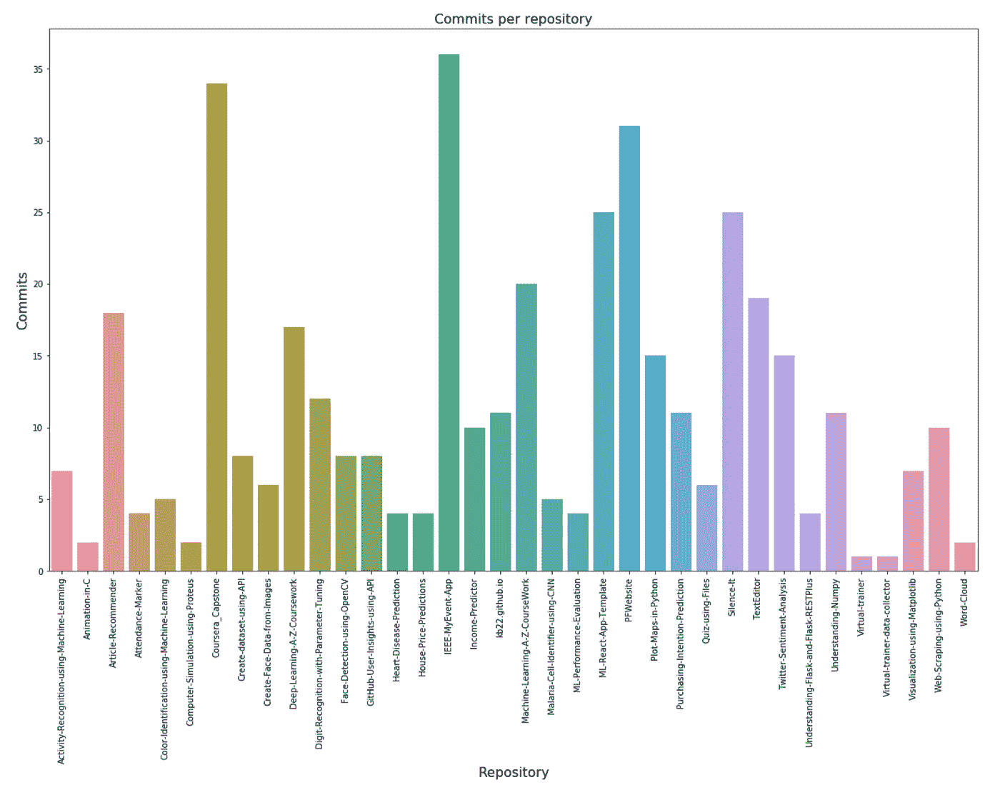
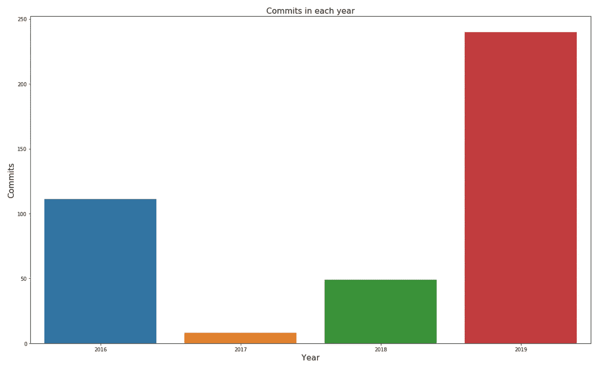
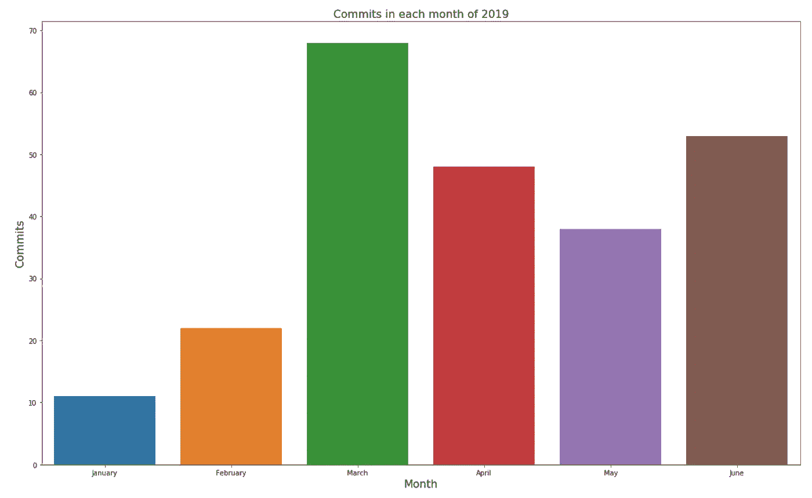
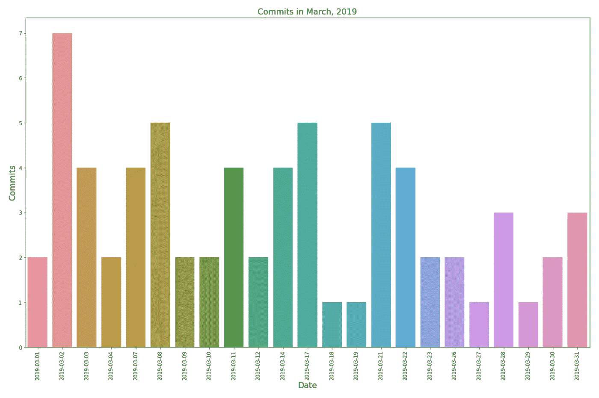
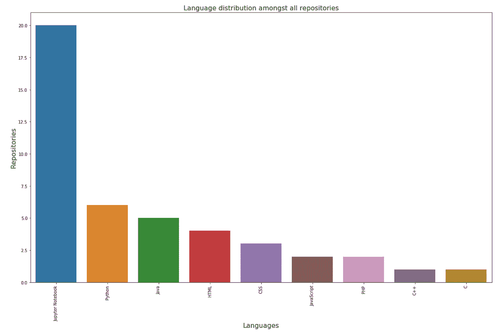

# 使用 GitHub API 的 GitHub 用户洞察—数据收集和分析

> 原文：<https://towardsdatascience.com/github-user-insights-using-github-api-data-collection-and-analysis-5b7dca1ab214?source=collection_archive---------8----------------------->

## 探索 GitHub API


Photo by [Yancy Min](https://unsplash.com/@yancymin?utm_source=medium&utm_medium=referral) on [Unsplash](https://unsplash.com?utm_source=medium&utm_medium=referral)

当我使用 GitHub 页面时，我决定在上面放一些关于我的 GitHub 项目的统计数据。因此，我决定使用 GitHub 自己的 API 来获得洞察力。因为这对其他人可能也有用，所以我决定将它作为一个项目创建并发布在 GitHub 上。查看下面的存储库:

[https://github.com/kb22/GitHub-User-Insights-using-API](https://github.com/kb22/GitHub-User-Insights-using-API)

这个项目有两个部分:

1.  **数据收集**——我使用 GitHub 的 API，使用我的凭证获取我的存储库和一些关于它们的关键信息。
2.  **数据分析**——利用上面收集的数据，我从数据中得出一些见解。

## 您也可以将该项目用于您自己的数据收集。

将您的凭证添加到文件`credentials.json`中。如果您的用户名是`userABC`，密码是`passXYZ`，那么 json 文件应该是这样的:

```
{ 
  "username": "userABC",
  "password": "passXYZ"
}
```

一旦对 json 文件进行了更改，保存该文件。然后，只需运行文件`get_github_data.py`从您的个人资料中获取数据，并将其保存到文件`repos_info.csv`和`commits_info.csv`。使用以下命令运行 Python 文件:

```
python get_github_data.py
```

# 数据收集

## 导入库和凭据

我首先将我的凭证保存在`credentials.json`文件中。

在读取凭证文件后，我使用用户名和密码创建了用于 GitHub API 认证的`authentication`变量。在访问我们自己的帐户时进行身份验证允许我们每小时打 5000 个电话。

## 用户信息

我将使用`https://api.github.com/users/<USERNAME>` API 为我的帐户获取数据。

回应中有几个关键。从 json 中，我将提取用户信息，如`name`、`location`、`email`、`bio`、`public_repos`和`public gists`。我还会将一些 URL 放在手边，包括`repos_url`、`gists_url`和`blog`。

在撰写本文时，我有 36 个公共存储库和 208 个公共 gists。

## 仓库

我现在将使用`repos_url`来获取所有的存储库。然而，该 url 将每批的最大存储库数量限制在 30 个。因此，我必须处理它。

我调用端点，如果返回的存储库数量是 30，这意味着可能有更多的存储库，我应该检查下一页。我在 API 中添加了一个名为`page`的参数，其值设置为 2，3，4…基于我所指的页面。如果返回的存储库小于 30，这意味着没有更多的存储库，我结束循环。

因为我有 36 个存储库，所以我能够在两个 API 调用中获取它们并将结果保存在`repos_data`中。

为了获得更多的信息，我不得不看一下回复。所以，我检查了第一个存储库信息。

正如我们所看到的，每个存储库都有很多信息。

我决定为每个存储库选择以下内容:
1。id:存储库的唯一 id。
2。名称:存储库的名称。
3。描述:存储库的描述。
4。created_at:首次创建存储库的时间和日期。
5。updated_at:上次更新存储库的时间和日期。
6。登录:存储库所有者的用户名。
7。许可证:许可证类型(如果有)。
8。has_wiki:一个布尔值，表示存储库是否有 wiki 文档。
9。forks_count:存储库的总分叉数。
10。open_issues_count:存储库中打开的问题总数。
11。stargazers_count:储存库中的恒星总数。
12。watchers_count:监视存储库的用户总数。
13。url:存储库的 url。
14。commits_url:存储库中所有提交的 url。15。languages_url:存储库中所有语言的 url。

> 对于提交 url，我删除了大括号内的结束值(包括大括号)。我自己从存储库 url 创建了 languages_url。

数据框架`repos_df`现在有了我需要的所有存储库信息。然而，我想更进一步，决定提取这里的所有语言，并将其附加到 dataframe 中。

每个存储库的语言可以有多个值，所以我决定以逗号分隔列表的形式组合所有语言。

完成后，我将数据帧保存到一个文件`repos_info.csv`。

## 承诺

我还可以访问每个存储库的提交 url。我决定可以收集每个存储库的提交，并将它们保存到自己的文件中。

就像 repositories API 一样，commits API 也被限制为一次调用只能提交 30 次。因此，使用与使用`page`参数相同的技术，我检索了所有提交。我看了一下 json 的回复。

对于每次提交，我保存了 git 提交所属的存储库 Id、提交的 sha 值、提交的日期和提交的消息。

我将 dataframe 数据保存到文件`commits_info.csv`。

# 数据分析

既然有了完整的数据，我决定从这些数据中得出一些见解。

## 基本分析

我注意到我有 36 个存储库和 408 个提交(T2)。然后我决定用`describe()`的方法来看一看分叉、观察者、问题和星星。我注意到以下几点:

1.  我的最大分叉数是 67，最小分叉数是 0。
2.  观察者的数量和星星的数量是成正比的。
3.  我没有在任何存储库中报告过问题。

我还观察到我用过的两个最常见的提交消息是 **Update README.md** 和 **Initial commit。看来有时我确实倾向于在 GitHub 上更新自述文件，并使用它的默认消息作为提交消息。**

## 每个存储库的提交

接下来，我想看看提交是如何在我的各种存储库中分配的。我根据存储库 id 组合了两个数据集(repos 和 commits ),并创建了一个图。



Commits per repository

> 从上面的图中，我们可以清楚地看到我在 **IEEE MyEvent App** 中获得了最大提交量，这是一个用于事件管理的 Android 应用。第二个最受关注的存储库是与 IBM 的应用数据科学顶点课程相关的存储库，名为 Coursera_Capstone。

## 年度分析

从开始做项目，推到 GitHub，已经很久了。我在 2018 年和 2019 年工作得最多，希望在年度分析中看到同样的情况。



Commits in each year

> 尽管现在才六月，我已经完成了今年最大的承诺。第二名是 2016 年。当时我正在攻读计算机科学学士学位，我已经开始从事自己的项目，因此提交的数量很高。我预计在 2018 年的**年会有更多的提交，但是我**开始的比较晚，所以可能提交的总数会比较少**。**

现在让我们来分解一下 2019 年，看看我在那里是如何进步的。

## 2019 年月度分析

我把一年分成几个月，并把数据可视化在柱状图上。



Commits in each month of 2019

> 似乎我在三月达到了**最大提交量。六月还有 6 天，但它已经占据了第二的位置。T21 最少的犯罪发生在一月份。**

让我们进一步分解 2019 年 3 月。

## 2019 年 3 月每日分析

让我们看看三月份的提交历史。



Commits in March, 2019

> 我在 2019 年 3 月 2 日进行了最大次数的提交。

## 最流行的语言

随着我对数据科学兴趣的增长，我使用 Python 参与了许多项目。因此，Python 将是最占优势的语言。



Language distribution amongst all repositories

> 我使用过各种语言，包括 HTML、CSS、C++、Java 等等。不过最常见的还是 **Jupyter 笔记本**。我在 Jupyter 笔记本中的代码是用 Python 3 编写的，因此 Python 是我所有项目中最常用的语言。

# 结论

在本文中，我讨论了为我的个人资料收集 GitHub 数据的步骤，然后使用这些数据得出见解。

希望你喜欢这个。请分享你的想法、观点和建议。我很乐意收到你的来信。