# 误差在十亿年左右

> 原文：<https://towardsdatascience.com/give-or-take-a-billion-years-32fb9305ca86?source=collection_archive---------20----------------------->

## 根据来自星系物理学公共数据库 Leda 的数据，对宇宙的年龄进行 DIY 估计。

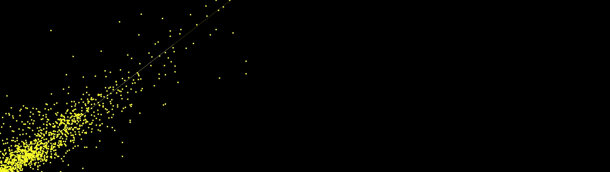

*作为搭建交易平台、*[](https://github.com/bliiir/ccat)**的一部分，我在自学数据科学。我的女儿劳拉正在做一个关于哈勃定律的项目，所以我们想利用这个机会出去玩玩。劳拉做了她的报告，我做了一个* [*Jupyter 笔记本*](https://github.com/bliiir/hubble/blob/master/galaxies.ipynb) *旁边生成了* [*图像*](https://github.com/bliiir/hubble/blob/master/hubble.png) *并练习了我公认的非常初级的数据科学技能。**

*你将从阅读中获得的是:*

*   ****好的星系数据集****
*   ****方程式使用****
*   ****单位使用****
*   ****代码用于生成结果和图像****

*我们从奥斯陆大学的天体物理学家彼得·劳尔森那里得到了很多帮助，并从 Reddit 帖子和 R 代码中获得了灵感。*

*请注意，这是实际可执行 Jupyter 笔记本的镜像，可用 [**这里用**](https://github.com/bliiir/hubble/blob/master/galaxies.ipynb) 。*

*下面我们将使用来自[](http://leda.univ-lyon1.fr/leda/fullsql.html)***星系物理学数据库*的数据，来验证[哈勃定律](https://en.wikipedia.org/wiki/Hubble%27s_law):***

***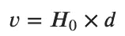******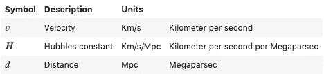***

***换句话说，一个星系的距离和它相对于我们的速度之间存在线性关系——或者说它遵循正常线性方程的结构:***

***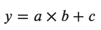***

***有了这些知识，我们可以计算出宇宙的年龄***

# ***获取数据***

## ***询问***

***以下查询被传递到[达乐数据库接口](http://leda.univ-lyon1.fr/leda/fullsql.html):***

```
***SELECT objname, v3k, mod0 WHERE (objtype='G') AND (v3k>3000) AND (v3k<30000) AND (mod0 IS NOT NULL) AND (v3k IS NOT NULL)***
```

***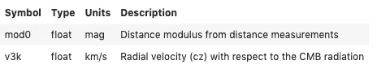***

***我们正在剔除不是星系的物体，(objtype='G ')，速度非常低(v3k > 3000)的物体，因为它们的局部速度和旋转扭曲了结果，速度非常高的物体(v3k < 30000) because the light we are getting from them only reflects their velocities in the early universe when the accelleration was significantly different.***

```
***import pandas as pdimport numpy as np
from numpy import log10,sqrtimport matplotlib.pyplot as pltfrom astropy import units as u
from astropy.cosmology import Planck15
import astropy.constants as ccfrom scipy.optimize import curve_fit***
```

***The results were saved in a text file called, 【 locally and then loaded into a pandas dataframe in Python.***

```
***# Load Leda data
df = pd.read_csv('leda.txt')***
```

***The first five lines look like this:***

```
***df.head()***
```

***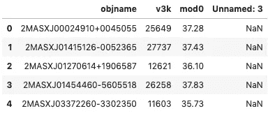***

# ***Tidy the data***

```
***# Remove empty column at the end
df = df.iloc[:,0:3]# Remove rows with missing values
df = df.dropna()# Remove whitespace from the headers
df = df.rename(columns=lambda x: x.strip())# Rename the objname column to galaxy
df = df.rename(columns={'objname':'galaxy'})# Display a sample of the dataframe
df.head()***
```

***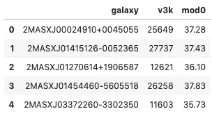***

# ***Luminosity Based Distance***

***Convert the magnitude ( 【 ) to [光度-距离](https://en.wikipedia.org/wiki/Luminosity_distance)秒差距:***

***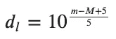******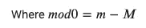***

```
***df['dl_mpc'] = 10**((df['mod0']+5)/5) / 1000000
df.head()***
```

***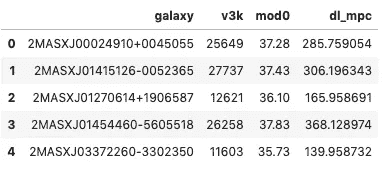***

# ***物理距离***

***光度距离没有考虑光子从光源到我们身边时，速度差异和重力效应所造成的红移和时间膨胀。***

***为了得到合适的距离，我们首先需要红移因子， *𝑧* ，它是通过将速度除以光速(cc.c)得到的:***

```
***df[‘z’] = df[‘v3k’] / cc.c***
```

***然后我们用红移因子 1+ *𝑧* 除光度距离 *𝑑𝑙* :***

```
***df['d_mpc'] = df['dl_mpc'] / (1+df['z'])***
```

***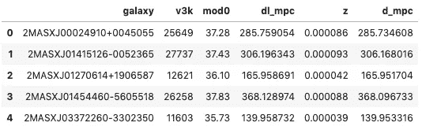***

## ***导出整齐的数据集***

```
***# Save to file
df.to_csv('galaxies.csv')***
```

# ***最佳线性拟合***

```
***def lin(x, a):
    return a * xcoeff, cov= curve_fit(lin, df['d_mpc'], df['v3k'])# The slope of the best linear fit 
a = coeff[0]
a***
```

***结果:***

```
***66.59753735677145***
```

# ***宇宙的年龄***

## ***秒***

```
***# Convert a from mpc based to km based
a_km = a / 1000000 / 30856775814913.67
age_sec = (1/a_km)
age_sec = age_sec
age_sec***
```

***结果:***

```
***4.6333208463264954e+17***
```

## ***年***

```
***# Age of the universe in years
age_year = age_sec / (60*60*24*365)
"{:,}".format(int(age_year))***
```

***结果:***

```
***'14,692,164,023'***
```

## ***容忍***

*****共方差*****

```
***cov[0][0]***
```

***结果:***

```
***0.20239139101111292***
```

*****𝑅^2*****

```
***# Residual sum of squares (ss_tot)
residuals = df['v3k'] - lin(df['d_mpc'], coeff)
ss_res = np.sum(residuals**2)# Total sum of squares (ss_tot)
ss_tot = np.sum((df['v3k']-np.mean(df['v3k']))**2)# R squared
r_squared = 1 - (ss_res / ss_tot)
r_squared***
```

***结果:***

```
***0.7590999713188041***
```

# ***情节***

```
***# Store the distance in mpc in an array
x = df['d_mpc'].values# Store the velocity in km/s in an array
y = df['v3k'].values # v3k# Least Square Best Fit line
f = lambda x: a * x# Initialize plot and subplot
fig2 = plt.figure(figsize=(25,20))
g2 = fig2.add_subplot(1, 1, 1)# Set background color to black
g2.set_facecolor((0, 0, 0))# Plot dataset
g2.scatter(df['d_mpc'], df['v3k'], c='yellow', s=5)# Plot best fit line
g2.plot(x,f(x), c="white", label="fit line", linewidth=0.2)# Add labels
g2.set_title('Speed / Distance')  
g2.set_xlabel('Distance from Earth in mpc')  
g2.set_ylabel('Speed relative to Earth in km/s')# Show plot
plt.show()***
```

***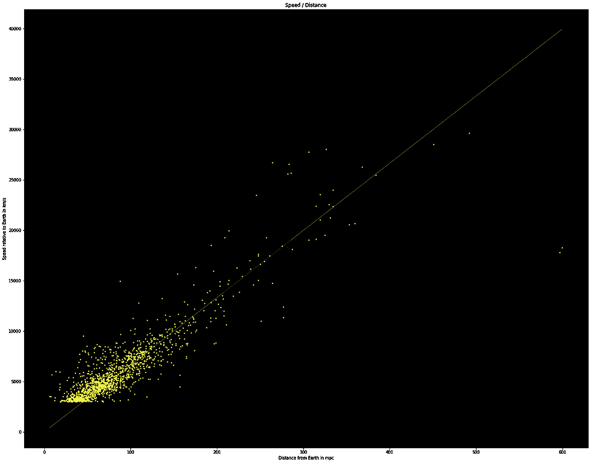***

# ***结论***

***与科学界的共识相反，劳拉和我发现宇宙已经有 147 亿岁了。***

***相差十亿年😬***

# ***链接***

*   ***Leda——星系物理学数据库***
*   ***[维基百科上的宇宙年龄](https://en.wikipedia.org/wiki/Age_of_the_universe)***
*   ***Reddit 帖子***
*   ***[Python 代码的 Jupyter 笔记本](https://github.com/bliiir/hubble/blob/master/galaxies.ipynb)***
*   ***[笔记本 PDF](https://github.com/bliiir/hubble/blob/master/hubble.pdf)***
*   ***[Gihub 知识库](https://github.com/bliiir/hubble)***