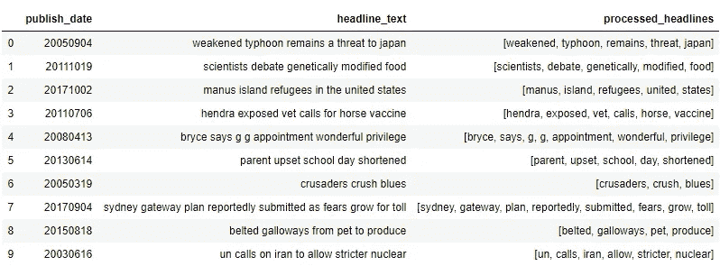
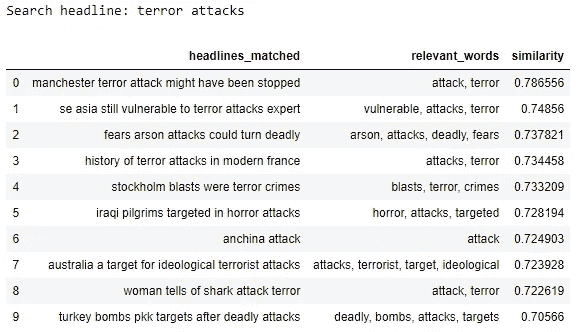
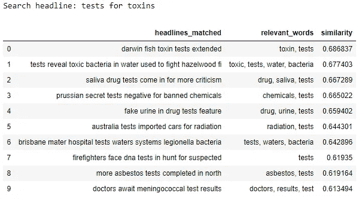
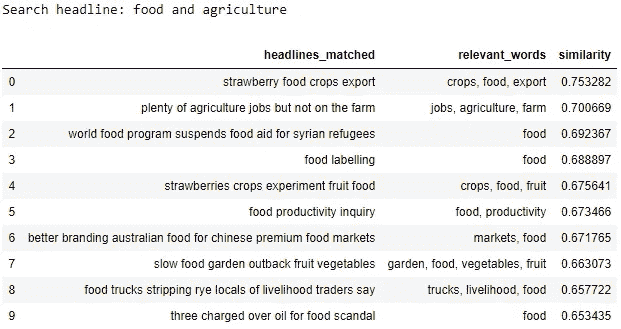
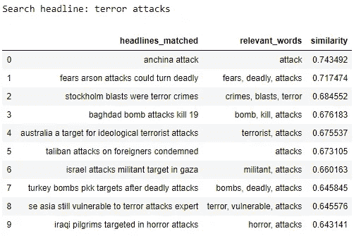
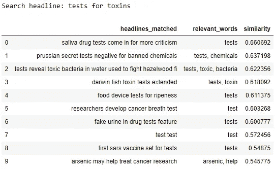
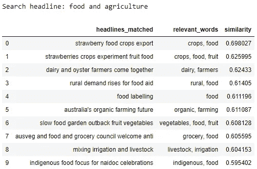

# 给你的关键词搜索一些语义上的爱！

> 原文：<https://towardsdatascience.com/give-some-semantic-love-to-your-keyword-search-c35f16df2ee?source=collection_archive---------25----------------------->


Image source: [https://ebiquity.umbc.edu](https://ebiquity.umbc.edu/blogger/2011/09/16/ten-years-of-words-from-ebiquity-papers/)

起初，**搜索引擎** (Google，Bing，Yahoo 等。)是*词汇:*搜索引擎寻找与查询词匹配的**字面**，而不理解查询的意思，只返回包含精确查询的链接。但是，随着机器学习和自然语言理解领域的新技术(NLU)的出现，很快就发现**语义** **搜索**是前进的方向。

**语义搜索**是一种搜索技术，它不仅基于关键字返回结果，而且在获取相关结果时还会考虑上下文含义和用户的意图。

随着 2013 年[蜂鸟更新](https://moz.com/learn/seo/google-hummingbird)，谷歌彻底改变了搜索引擎优化(SEO)流程。他们将重点从关键词搜索转移到理解上下文含义和用户意图的搜索，使用收集的搜索数据和 NLU 的概念，如词性标注、命名实体识别、单词嵌入等，扩展他们已经令人印象深刻的[知识图](https://en.wikipedia.org/wiki/Knowledge_Graph)。

虽然所有这些真的很令人兴奋，但我想写这篇博客的原因是为了展示两种简单的方法来为关键字搜索添加语义。我不会谈论知识图，仅仅是因为它是一个完全不同的概念，因此超出了本文的范围。

在这个练习中，我们将使用[百万新闻标题](https://www.kaggle.com/therohk/million-headlines)数据集。标题已经被清理过了，所以除了将标题分成单词标记和删除停用词之外，不需要任何文本预处理。我已经创建了一个 50，000 个标题的小样本，我将它存储在 *sample_data.parquet* 中，我将使用它来节省计算时间，但是可以随意使用整个数据集。

样本数据集如下所示:



我想谈的两种方法是—

1.  余弦相似性
2.  平滑逆频率

# 余弦相似性

从数学上来说，**余弦相似度**是[内积空间](https://en.wikipedia.org/wiki/Inner_product_space)的两个非零向量之间相似度的[度量，度量它们之间角度的](https://en.wikipedia.org/wiki/Measure_of_similarity)[余弦](https://en.wikipedia.org/wiki/Cosine)。0 的余弦为 1，对于区间(0，π] [弧度](https://en.wikipedia.org/wiki/Radian)中的任意角度都小于 1。因此，这是对**方向**和**而非大小**的判断:具有相同方向的两个向量的余弦相似度为 1，相对于彼此成 90°方向的两个向量的相似度为 0，而完全相反的两个向量的相似度为-1，与它们的大小无关。

这种方法相当简单。我们将首先在数据集中创建每个标题的嵌入，然后，找到搜索标题和标题嵌入之间的余弦相似性，以找到相似的标题。对于预训练的单词嵌入模型，我们将使用*fast text crawl-300d-2M-子单词*，并使用我最近遇到的一个新模块 [**pymagnitude**](https://pypi.org/project/pymagnitude/) 加载它。如果你还没听说过可塑性的大小，我强烈推荐你在这里看看。它们提供了一个高度优化的库来读取和查询单词嵌入，即使模型非常大，并且它们支持几乎所有预训练的模型，包括 [**ELMo**](https://allennlp.org/elmo) 。

现在我们已经加载了模型，是时候为数据集中的每个标题创建嵌入了。

*text2vec* 函数获取标题词标记，在预训练的模型中找到这些标记，并添加对*找到的*标记的嵌入。它还记录有多少单词被*找到*，然后被用于**平均出**最终的标题嵌入。我们做一个平均，因为标题和搜索标题将是可变长度的，这种方法在稍后阶段给出两者之间更好的成对比较。 *get_docs_embedding* 函数只返回所有标题嵌入的列表。

在我们开始看到结果之前，我们将添加一个名为 *get_relevant_words* 的函数。该功能将让我们提取在搜索的标题和匹配的标题之间匹配的语义相关的关键词。该函数从搜索的标题和我们正在查找相似性的标题中创建唯一的标记，并使用词对之间的余弦相似性来查找相关的词。

厉害！现在所有的部分都已经准备好了，让我们创建一个名为 *semantic_search_cossim* 的最终函数。这个函数将把搜索的标题、标题的嵌入、嵌入模型和返回的结果数作为输入，并返回一个带有结果的数据帧。我们开始吧。

以下是一些搜索及其结果:



如上所述，结果是很有希望的。这种方法通常被认为是一种基线方法，可以在此基础上进行改进以获得更好的结果。

# 平滑逆频率

如在第一种方法中所做的，取嵌入在句子中的单词的平均值，倾向于给予语义上完全不相关的单词太多的权重。[平滑逆频](https://openreview.net/forum?id=SyK00v5xx)试图用两种方式解决这个问题:

1.  加权:像 TF-IDF 一样，SIF 对句子中嵌入的单词进行加权平均。每个单词嵌入都由`a/(a + p(w))`加权，其中`a`是通常设置为`0.001`的参数，`p(w)`是该单词在参考语料库中的估计频率。
2.  公共成分去除:接下来，SIF 为一组句子计算结果嵌入的主成分。然后，它从这些句子中减去嵌入在它们的第一主成分上的投影。这应该移除与语义上不太相关的频率和语法相关的变化。

我们来直观的看一下。根据`a/(a + p(w)),`,出现频率高的单词的权重较低，因为`p(w)`对于这些单词来说较大。我们通过移除我们生成的句子嵌入的第一主成分并从每个单独的句子嵌入中减去它来进一步增强句子嵌入。因此，由于 PCA 中的第一个成分是具有最大方差的成分，因此来自杂散字的大多数变化通过该操作被*平滑*。你可以从上面链接的文章中读到更多，但是现在，我们将使用 SIF 在我们的数据集上进行语义搜索。

我们将使用具有 SIF 优化实现的 [**fse**](https://pypi.org/project/fse/) 库。该库已经由 [**Oliver Brochers**](https://towardsdatascience.com/@oliverbor) 开发，你可以在这里阅读它的实现[。对他大吼一声！](/fse-2b1ffa791cf9)

**注意:** *fse* 与 *gensim* 库一起工作，因为两者使用相同的 cython 实现。同样，对于这种方法，我们不会删除停用词，因为 SIF 会自己处理常用词。对于文本处理，我们只是将标题分割成空间上的单词标记。

我用的是 *glove.42B.300d* ，可以从[这里](https://nlp.stanford.edu/projects/glove/)下载。

功能 *glove_to_w2v* 将手套模型转换成 *gensim* 模型，然后与 *fse* 兼容。这个函数只需要调用一次。函数 *init_model* 加载并返回新转换的模型。

一旦我们加载了模型，我们将所有的标题分割成空间上的单词标记，并调用 *fse* 的 *IndexedList* 函数。

*IndexedList* 函数给出了下面的输出——每个标题都被标记化，并分配了一个索引号。

```
(['drug', 'test', 'records', 'destroyed', 'landis'], 0)
(['grains', 'council', 'awaits', 'awb', 'restructure', 'details'], 1)
(['plan', 'to', 'move', 'year', '7', 'to', 'high', 'school'], 2)
(['teen', 'jailed', 'over', 'after', 'boy', 'brain', 'damaged'], 3)
(['awb', 'drops', 'plan', 'to', 'boost', 'directors', 'pay'], 4)
```

这样，我们就可以训练我们的 SIF 模型了。一旦完成训练，您可以使用 pickle 保存模型，然后只需加载 SIF 模型并进行搜索。在此之后，除非有新的数据集进入，否则不需要上面提到的任何步骤。

这里的最后一个函数是 *semantic_search_sif* ，它将搜索到的标题、sif 模型、数据、预训练的嵌入模型、索引标题作为输入，并返回一个数据帧作为输出。注意 SIF 模型的*相似逐句*功能。该函数的输出是一个包含元素的元组(<句子>、<句子的索引>、<相似度得分>)。例如

```
(['anchina', 'attack'], 41199, 0.7434917688369751)
```

这就是为什么我们考虑索引 1、2，因为它们分别代表标题的索引和相对于被搜索标题的相似性得分。

SIF 模型的结果如下:



# 结论

在这篇博客中，我们研究了什么是语义搜索，以及可以用来实现语义搜索的几种基本方法。现在，关键字搜索已经成为过去，每个搜索引擎都应该足够聪明，能够理解用户查询的上下文，并相应地返回结果。自然语言理解刚刚开始展示它的力量，不可思议的事情还在后头。