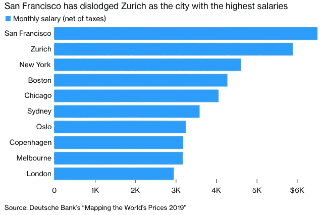
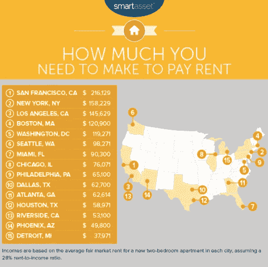

# 成为一名数据记者，给自己一个优势

> 原文：<https://towardsdatascience.com/give-yourself-an-edge-by-becoming-a-data-journalist-c19c05c05d0e?source=collection_archive---------28----------------------->

Photo by [Web Hosting](https://unsplash.com/@webaroo?utm_source=medium&utm_medium=referral) on [Unsplash](https://unsplash.com?utm_source=medium&utm_medium=referral)

当你试图在网上搜索如何成为一名数据科学家时，会弹出许多项目，如数据科学、数据分析、商业分析等热门数据科学项目的名称。事实上，在线数据科学相关课程泛滥成灾。

然而，如果你已经在媒体行业工作，并希望进一步发展你的职业生涯，学习如何成为一名数据记者听起来更有吸引力。

# 为什么我决定成为一名数据记者

我在威斯康星大学麦迪逊分校主修传播艺术。但我想不通困扰大多数学生的问题:毕业后该做什么？
有这么多不同的机会可以考虑，我不知道该选择什么。

# #1:在硅谷一家科技公司的工作经历

毕业后，我在硅谷做了一年的质量保证专家，以 NDA 的名义在库比蒂诺的一家财富 100 强公司进行桌面和移动应用软件测试。我通过定制的错误跟踪软件从用户体验中收集数据，以确保产品的质量，同时与其他测试人员、制作人员和开发人员合作。然而，我总是渴望得到一份与媒体相关的工作，尽管我热爱我的工作和我出色的同事。

# #2:付不起我的房租

旧金山是众所周知的薪水最高的城市。

Image: Bloomberg, May 20, 2019

*但是最高工资只针对* ***工程师*** *，租金设置为* ***工程师工资。*** *而且说真的，比纽约市的房租还要贵。*

Image: MarketWatch, May 22, 2016

我再也付不起在湾区的房租了(一间工作室每月大约 3500 美元)。当时我意识到，如果我想继续存钱，我必须找到一份与编码相关的工作。我还发现，与技术相关的工作增加了高薪留在美国的机会。

此外，我的公司教了我一些编程，他们建议我学习另一种编程语言，如 Python、Java 或 C 语言。我的同事已经工作了三年多，已经熟悉了至少一种编程语言。有时候在公司工作也要用终端，但当时听起来没什么意思。

# #3:仍然想和媒体一起工作，但是作为一名“精通技术”的记者

这就是为什么我决定成为一名数据记者，用媒体的背景知识分析数据，根据分析的数据制作图表，通过媒体渠道展示见解。我认识到，美国许多与技术相关的工作仍然需要更多的人，媒体行业也需要更多的人。所以，我决定学习数据分析/数据科学和可视化。

# 我从专家那里学到了什么，我现在学到了什么？

我在 LinkedIn 上搜索了数据科学家的简介，以检查我必须学习哪些技能。我给著名的数据科学家发了消息和问题，他们中的一些人回答了问题。此外，我还可以从媒体中获得关于数据科学领域的非常有用的信息，我最喜欢的是 [Adam Thomas 关于数据新闻的文章](/we-are-the-european-journalism-centre/datajournalism-com-where-journalism-meets-data-ea02a3f0d445)。他在文章中介绍了这样一个伟大的环节'[datajournalism.com](https://datajournalism.com)'。

人们还分享了他们获得数据科学家工作的经验或技巧。从他们的文章中，我意识到我的期望(DS =世界上最性感的工作)和现实(我要学的真正的东西比如 Python，SQL，机器学习等等)不匹配。这就是为什么我经常阅读这个领域的书籍。我全心全意地推荐[彭凯莉的文章](/how-to-land-a-data-scientist-job-at-your-dream-company-my-journey-to-airbnb-f6a1e99892e8)，它帮助我建立了一个强大的心态，因为这真的很重要。

现在我知道我至少要学习 Python、R、SQL 等一门编程语言，甚至线性代数等数学。为了可视化，我必须学习 Tableau、熊猫或 MATLAB/Seaborn。事实上，我目前正在学习和使用 Python，MySQL，Tableau，Pandas 和 MATLAB。是的，这真的很难。但是每个人都知道入门——学习软件的用户界面——是最难的部分。现在，我越来越熟悉使用这些技能，而且变得越来越有趣。

对于想在数据相关领域开始职业生涯的新手，我希望这篇文章有助于你了解这个领域。我会继续写我的经验、项目和关于数据科学的想法。