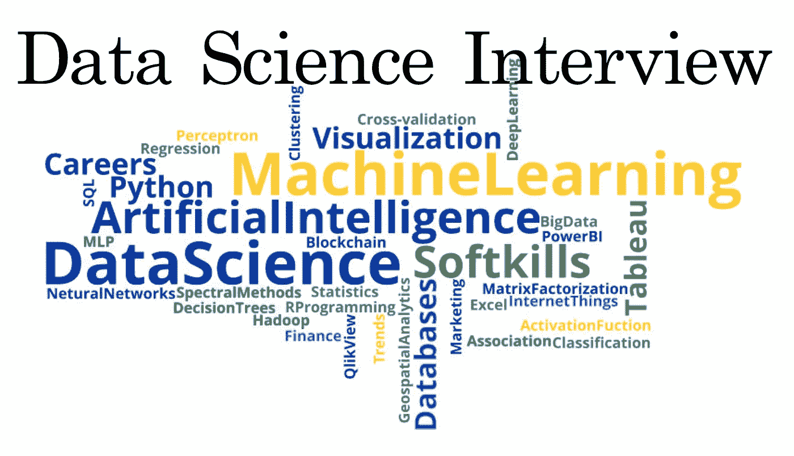

# 在 Expedia 面试了 60 名候选人后，给出了一些数据科学面试的技巧

> 原文：<https://towardsdatascience.com/giving-some-tips-for-data-science-interviews-after-interviewing-60-candidates-at-expedia-395fff7e073b?source=collection_archive---------5----------------------->

Courtesy of www.superdatascience.com

在过去的一年里，我面试了很多人申请 Expedia 集团的数据科学职位，从初级到高级，有些是硕士/博士研究生，有些来自其他公司(如微软、亚马逊、Spotify、Twitter)，我想在这里分享我的经验，以便对申请数据科学职位的人有用，并就可能遇到的问题给你们一些提示。

面试候选人帮助我认识了具有广泛背景和技能的人，从 CS/ECE、统计/数学到土木/机械工程，我有机会与几位杰出的人交谈。

在我进入更多细节之前，我想提一下，近年来“数据科学家”有了更好的名字，如“机器学习科学家”和“应用科学家”。虽然在一些公司，这些职位所指的任务/技能略有不同，但对大多数公司来说，这三个头衔或多或少指的是同一件事。所以在这篇文章中，我所说的“数据科学”指的是上面所有的标题。

虽然每个人都有他/她自己独特的一套技能，可用于解决一些问题，但大多数公司都希望数据科学候选人具备一套基本技能，我将把这些技能分为以下几类，然后详细讨论。根据公司和职位级别的不同，您可能会从以下一个或多个项目中得到问题，因此您可能希望提高您在这些方面的背景知识:

1.  *关于你的简历和以前作品的问题*
2.  *通用机器学习(和深度学习)知识*
3.  *普通统计和数学知识*
4.  *编程和软件工程技能*
5.  *统计建模技巧*
6.  *计算机视觉、自然语言处理和定价主题*
7.  *沟通和表达技巧*
8.  *行为问题*
9.  *系统设计技巧(视职位级别而定)*
10.  *管理和领导技能(取决于职位级别)*

# ***1。关于你的简历和以前作品的问题***

你的简历在面试中会被问到的问题中起着至关重要的作用。所以，确保你对简历中提到的任何东西都足够熟悉，从课程和研究项目到编程语言。像“告诉我更多关于你自己和你的背景”，或者“告诉我你在你现在的公司的工作”这样的一般性问题很常见，但是你也会得到关于你简历的更详细的问题。

例如，如果你在简历中提到几个以前与 NLP 相关的项目，你应该对 NLP 主题有很好的理解，并且很有可能会得到一些关于 NLP 的技术问题，以评估你在这方面的技术深度。因此，如果你在一个项目上做了一些合作，但对工作贡献很小，我建议你让自己更熟悉那个项目的技术方面。

或者，如果你提到 Python 或 Scala 是你最喜欢的编程语言，请确保你了解这些语言的细节(至少了解数据科学职位所需的程度)，以及每种语言中的一些机器学习相关的库。我看到许多候选人在简历中提到 Scala/Python，但是当我问他们一个关于这些语言的简单问题时，他们对此一无所知，这将给我一个负面的信号。如果你对这些语言的经验非常有限，最好诚实地告诉面试官这一点，我相信大多数面试官不会因为你没有足够经验的事情来评判你。

# ***2。通用机器学习(和深度学习)知识***

虽然不同公司的数据科学工作可能涉及广泛的问题和技能(包括数据提取和预处理，运行 SQL 查询，简单的数据分析，到深度学习，NLP 和计算机视觉)，**机器学习**是一个基本概念，是当今大多数顶级公司对“数据科学候选人”的期望。因此，如果你申请的是数据科学职位，请确保你对以下机器学习概念有很好的理解。像“统计学习的要素”[1]和“模式识别和机器学习”[2]这样的书对这些主题很有用。

*   *监督和非监督算法*
*   *经典分类算法，如 SVM、逻辑回归、决策树、随机森林、XGboost*
*   *经典回归算法:线性回归、LASSO、随机森林、前馈神经网络、XGboost*
*   聚类算法，如 K 均值和谱聚类
*   *降维技术，如 PCA、LDA 和自动编码器。*
*   *偏差-方差权衡*
*   *过拟合以及如何避免过拟合(例如正则化、特征选择、丢失(对于神经网络))*
*   *著名的深度学习模型，如卷积神经网络(CNN)、递归神经网络(RNN)和 LSTMs、自动编码器、残差架构、序列到序列模型、GANs*
*   *评估指标，如分类准确度、精确度、召回率、F1 值、均方误差、平均绝对偏差*
*   *流行的损失函数，如交叉熵、MSE、三重损失、对抗性损失、利润最大化损失等*
*   *反向传播*
*   *也许还有强化学习和深度 Q 学习(更多研究型岗位)*
*   *线下和线上(A/B)指标对比？*

上面列出的项目涵盖了一些与数据科学职位相关的高级机器学习概念，但您也可能会被问及一些关于上述主题的更详细的问题，例如，您可能会被问到:

*   *SVM 和逻辑回归分类的比较*
*   *生成模型和判别模型之间的差异*
*   *消失渐变问题背后的根本原因以及避免该问题的一些常见做法*
*   *批量梯度下降时使用动量的优势*

# *3。普通统计和数学知识*

今天的许多数据科学家曾经是统计学家和分析人员，许多 ML 模型只是(重新标记的)统计学习模型(如线性回归、岭回归、LASSO、logistic 回归)。所以毫不奇怪，许多面试官喜欢问一些关于统计或数学的问题。

对于统计和概率，如果你熟悉以下概念会更好:

*   *模型的偏差和方差以及如何计算*
*   *从分布中抽样*
*   *置信分数和给定置信分数所需的样本数量*
*   *均值、方差、相关性(统计意义上和经验意义上)*
*   *随机过程，随机漫步(金融公司数据科学职位)*
*   *如何求某事件的概率*
*   *P 值*
*   *R 平方(决定系数)解释*

对于数学问题，您可能会被问到以下主题的问题:

*   *一些需要思考的脑筋急转弯问题*
*   *如何计算特定损失函数的梯度*
*   *关于损失函数或优化算法的一些详细问题*

# *4。编程和软件工程技能*

任何数据科学家都需要进行某种程度的编程。在初创公司(员工人数较少)，数据科学家可能需要自己做大量的软件工程工作，例如数据提取和清理，以及模型部署。相比之下，在较大的公司中，有其他人负责数据工程和模型部署，数据科学家主要处理特定产品的培训和测试模型。作为一名数据科学家，你还需要了解数据工程角色所需的一些术语和任务，比如 ETL(提取、转换、加载)。在这里，我将介绍数据科学家使用的一些最广泛的编程语言、库和软件。

像 Gayle Laakmann McDowell [3]写的《破解编码面试》这样的书对准备软件工程和算法问题非常有帮助。也有一些很棒网站，它们有很好的软件工程问题数据库，比如 leetcode、hackerrank 和 geeksforgeeks。

## 4.1 编程语言

*在编程语言方面*、 **Python、**、 **SQL** 、 **R** 似乎是人们使用最多的语言，但我也见过有人使用其他语言如 **Java、【c++】**、 **Matlab** (虽然不是编程语言)。

## **4.2 有用的 Python 库**

在这里，我将提到一些与数据科学职位最相关的 Python 包:

*   *对于机器学习和数值计算，* ***Scikit-learn、XGboost、LIB-SVM、Numpy、Scipy*** *是应用最广泛的软件包。*
*   *深度学习方面，* ***Tensorflow，PyTorch，Keras*** *应用广泛。*
*   *对于数据可视化来说，* ***Matplotlib、Seaborn、ggplot*** *是最受欢迎的(尽管还有很多其他有用的包)。*
*   *对于计算机视觉来说，* ***OpenCV 和 PIL*** *都很有用。*
*   *对于 NLP 来说，* ***NLTK、GENSIM、Spacy、Torchtext*** *等包都很棒。*
*   *对于处理数据库，* ***Pandas，PySpark*** *是 Python 中两个比较流行的库，我个人觉得很有用。*

## 4.3 云服务

根据您要处理的数据规模，您可能需要在云服务上运行代码，如 AWS、Azure 或 Google Cloud。因此，有一些在云中运行代码的经验可能是一个额外的收获。您肯定不需要了解所有不同的云服务，但是对 AWS 中的 EC2 之类的计算服务有所了解会更好。

一些公司也可能在 AWS 或 Azure 的基础上使用其他大数据服务，如 Databricks 和 Qubole，但我不认为需要有使用它们的经验，因为这些非常容易学习。

## 4.4 部署工具

在您为一个任务训练了您的模型(例如一个推荐系统，或者一个审核模型)之后，理论上您希望在生产中使用它。因此，有人(可能是您，或者您正在工作的工程团队)需要将您的模型部署到生产环境中。为此，熟悉 Python 中的 Docker 和 Flask 可能会有所帮助。如果您想在 AWS 等云服务上部署您的模型，熟悉 Sagemaker 可能会有所帮助。我个人并不认为熟悉部署工具是入门级数据科学职位的必要条件。

# *5。统计建模技巧*

作为一名数据科学家，你需要为各种产品/问题建立数学和 ML 模型，因此你可能会在面试中遇到一些建模问题。这些问题通常与公司的领域有关。目标是看你是否能把概念上的知识应用到一个具体的问题上。您可能会遇到的一些示例问题包括:

*   *你会如何建立一个机器学习模型来检测我们网站上的欺诈交易？*
*   *你会如何建立一个机器学习模型来向我们的客户推荐个性化的商品？*
*   *你将如何构建一个模型来检测我们网站上的虚假产品评论？*
*   *如何使用 ML 模型检测有害评论/推文？*
*   *你会如何建立一个模型来预测我们产品的价格？*
*   *你会如何建立一个模型来自动标记社交网络中用户上传的图片？*
*   *运行 A/B 测试时的在线指标？*

根据您的回答，您还可能会得到一些后续问题，如您需要的数据类型、您将如何评估您的模型，或者如何随着时间的推移改进您的模型。如果你想了解更多的问题，像 https://medium.com/acing-ai/acing-ai-interviews/这样的网站很有用。

这里重要的是你的思维过程和你看到为一个产品建立一个 ML 模型的不同方面的能力。你绝对不需要给出最好或最花哨的答案；只要你对问题的高层次理解是合理的，你就是好的。

# 6.关于计算机视觉、NLP 和定价主题的问题

根据你所申请的团队的产品重点，你也可能会得到一些关于计算机视觉、NLP 或定价的问题。所以在面试之前，一定要对你申请的团队做一些研究，更好地了解他们的关注点。一些面试官可能会问你非常高级的 NLP 或视觉概念，而其他一些面试官可能会问更具挑战性的问题。

以下是一些你可能会遇到的与 NLP 相关的问题:

*   *什么是词干化和词汇化？*
*   *什么是包话？TF-IDF 怎么样？*
*   *你如何发现两个单词之间的距离？有哪些著名的字符串距离度量？*
*   什么是命名实体识别，您如何评价 NER 系统的性能？
*   *如何训练 CRF 模型进行词性标注？*
*   *什么是公报功能，它们何时有用？*
*   *你会如何构建一个神经机器翻译模型？你如何评价它的性能？*
*   *word 2 vec 相比经典的一键编码有哪些优势？*
*   你会如何建立一个问答系统？
*   *你如何在一组文档中发现潜在的主题？*
*   你如何看待顾客评论的情绪(极性)？
*   *关于正则表达式的一些问题*

这里有几个你可能会遇到的计算机视觉问题:

*   你如何将网站上的图片分成不同的类别(如电子产品、服装等)。)?
*   如何构建一个模型来自动标记图像中的不同人脸？
*   如何检测图像/视频的质量并过滤掉模糊的部分？
*   *什么是超分辨率，您如何评价超分辨率模型的性能？*
*   如何检测图像中的不同物体？
*   *您如何检测图像中的文本区域？*
*   *你会如何创建一个自动图像标记系统？*

以下是您可能会遇到的一些与定价相关的问题:

*   如何将用户分为活跃组和非活跃组？
*   如何设计亚马逊商品的折扣算法？
*   在有限的营销预算下，你如何设计一个竞价系统？
*   你如何为优步开发一个动态定价算法，以确保乘客总能收到快速方便的提货服务？
*   如何设计个性化的定价算法(虽然有些国家可能不允许)？
*   假设您为亚马逊商品开发了一个新的定价服务。在 A/B 测试中，要跟踪的最佳指标是什么？
*   假设你可以在你的平台/网站上展示一些广告。你如何开发一个广告评分或广告排名服务，使用户点击最大化？如果想收益最大化呢？
*   你如何决定在你的网站上向用户显示广告的最佳数量？
*   你如何估计客户的终身价值？

# 7 .*。沟通和表达技巧*

数据科学职位通常涉及大量的沟通和演示。这可能是为了与产品经理讨论一个新项目，或者向你的团队展示你的模型。因此，能够与其他人(包括技术人员和非技术人员)交流你的工作和想法是非常重要的。

有时你可能需要以非常专业的方式向你的同事或经理传达你的发现，而有时你可能需要说服产品经理你的模型对他们有用，而不需要太多的专业知识。

面试官通常不需要问你一个具体的问题来评估你的沟通和表达能力，他们可以在面试过程中很好地了解这些技能。我的建议是:

*   *试着首先给面试官一个你的解决方案的高层次描述，然后进入细节。通过这样做，你可以得到一个反馈，如果你的高层次方法是正确的。*
*   *你可以明确地问面试官你的答案是否是他们想要的。如果结果不是他们感兴趣的，他们可以为你澄清问题，并给你一些建议。*
*   尝试将一个建模问题分解成几个部分，然后分别关注每个部分。对于许多 ML 建模问题，您可以将它们分解为相关的数据提取、数据清理、特征提取、预测建模、评估和可能的改进。

# 8.行为问题

有些人可能还会在面试时问一些行为方面的问题。这些问题可以从你过去的工作经历(为了了解你是否具备工作所需的技能)到你的个人兴趣。这些问题也可以关注你过去是如何处理各种工作情况的。你对这些问题的回答可以揭示你的技能、能力和个性。下面是一些可能会问你的问题:

*   你更喜欢哪种职位，是涉及研究和 R&D 开发的职位，还是更喜欢将现有模型应用于公司内部数据并围绕它构建数据驱动的解决方案的职位？
*   你喜欢单独工作，还是与一群人合作解决同一个问题？
*   举一个你实现的目标的例子，告诉我你是如何实现的，你面临的挑战是什么？
*   举例说明一个你没有达到的目标，以及你是如何处理的？
*   告诉我，如果你需要交付一个模型来满足产品的最后期限，你会如何在压力下工作？

# *9。系统设计技能(取决于职位级别)*

根据你所申请职位的级别，你还可能会得到一些系统设计面试(SDI)的问题，这些问题大多是关于“设计大型分布式系统”的问题。

由于缺乏开发大规模系统的足够经验，以及没有标准答案的设计问题的开放性，这些问题可能具有挑战性。

我不会在这里谈论太多关于 SDI 的问题，因为这不是这篇文章的重点，但是我会提供一些示例问题，以及一些有用的资源，如果你想在这方面得到更多的实践。

以下是一些系统设计问题示例:

*   你会如何设计像 Youtube 或网飞这样的视频流媒体服务？
*   *你会如何设计 Facebook Messenger 或 WhatsApp？*
*   *你会如何为客户服务设计聊天机器人？*
*   *设计 Quara 还是 Reddit？*
*   *设计 Snapchat 这样的 app？*
*   *你会如何设计像 Dropbox 或 Google Drive 或 Google Photos 这样的全球存储和共享服务？*
*   你会如何设计像 Twitter 或脸书这样的服务？
*   你会如何为谷歌或 Expedia 设计一个预输入系统？

以下是面试设计问题的一些有用资源:

*   [https://github.com/checkcheckzz/system-design-interview](https://github.com/checkcheckzz/system-design-interview)
*   [http://blog . gain lo . co/index . PHP/category/system-design-interview-questions/](http://blog.gainlo.co/index.php/category/system-design-interview-questions/)
*   https://hacker noon . com/top-10-system-design-interview-questions-for-software-engineers-8561290 f 0444

# 10。管理和领导技能(取决于职位级别)

如果你申请数据科学经理职位(有时甚至是高级或主要职位)，面试官将需要评估你的管理和领导技能，并了解你以前的管理经验。

这位候选人的理想背景是在机器学习和预测建模等领域拥有强大的理论背景，以及良好的软件工程技能。要成为一个有效的领导者，候选人还需要有很好的沟通技巧，以及良好的规划技巧，能够以一种考虑到构建数据驱动产品所带来的许多风险的方式进行优先排序和规划。

我不打算深入探讨管理技能，但我会在这里提供一些示例问题:

*   你管理过的最大的团队是什么，你面临的挑战是什么？
*   假设你的团队已经建立了一个在测试集上达到 90%准确率的模型。为了决定模型性能是否可靠，需要知道什么？
*   *讨论一个可以影响我们公司的数据驱动型产品*
*   *当你想为你的团队雇人时，你会考虑什么？*
*   你会如何吸引顶尖人才加入你的团队？
*   *你认为一名数据科学家必备的技能是什么？*
*   *什么是大数据，您熟悉大数据架构吗？*
*   你如何在工作中保持最新状态？
*   *你如何判断与另一个团队的合作是否成功？*

在这篇文章中，我试图提供一些提示，以及一些你在 DS 面试中可能会遇到的高层次问题。鉴于数据科学角色的范围不断扩大，当然有一些主题和问题没有在这里讨论。但是我试图涵盖一些对于数据科学面试来说很重要的一般性话题。

我最后的建议是对你申请的团队/公司做更多的研究，更好地了解他们正在解决的问题。然后，您可以将主要精力放在准备与该团队相关的主题上。

# 参考

[1][https://web.stanford.edu/~hastie/ElemStatLearn/](https://web.stanford.edu/~hastie/ElemStatLearn/)

[2][https://www . Microsoft . com/en-us/research/uploads/prod/2006/01/Bishop-Pattern-Recognition-and-Machine-Learning-2006 . pdf](https://www.microsoft.com/en-us/research/uploads/prod/2006/01/Bishop-Pattern-Recognition-and-Machine-Learning-2006.pdf)

[http://www.crackingthecodinginterview.com/](http://www.crackingthecodinginterview.com/)