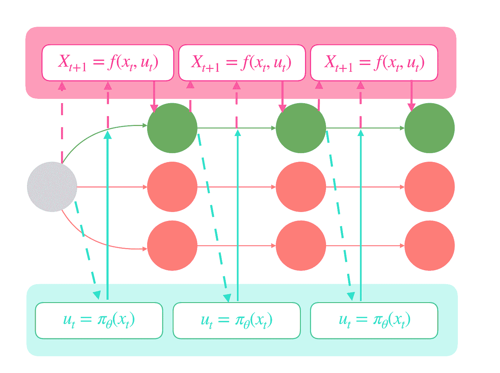

# 滑向基于模型

> 原文：<https://towardsdatascience.com/gliding-into-model-based-94aaf077d381?source=collection_archive---------21----------------------->

## *逻辑直观的解释*

由于术语和复杂的数学公式，强化学习(RL)对于该领域的新手来说可能是一个令人畏惧的领域。然而，其背后的原理比最初想象的更直观。让我们想象 RL 是一个新的尚未发行的塞尔达游戏，发生在遥远的未来，2119 年。

林克在 2119 年的任务是从里顿豪斯那里拯救人类，这是一个位于 2019 年的秘密机构，拥有强大的人工智能和时间机器。因为里顿豪斯是邪恶的，他们设计了一个在 2119 年毁灭人类的计划，并及时派遣他们的特工去完成任务。

游戏开始时，林克降落在一个荒凉的小岛上，他必须在那里找到人类文明的第一个迹象，并警告他们里顿豪斯的特工即将到来。当他降落在一座塔的顶部时，一位年长的智者出现并送给他一个滑翔伞作为礼物。林克现在的任务是滑翔伞，并找到一个人类文明的城镇，以警告他们里顿豪斯。

林克是一个电脑外星人，可以在他的大脑中安装任何软件。他不知道如何玩滑翔伞。在 Ritten-House 的代理到达那里之前，你的目标是编写一个程序来教 Link 滑翔伞和所有的技巧，他尽可能快地到达人类文明，并尽可能避免 Ritten-House。你的计划是在里顿豪斯的特工来阻止他之前把这个模拟发送给林克，这样他就会知道如何保护自己。

你的计划是在未来通过光波向你发送这个程序。

为了设计这个程序，你需要知道一种叫做强化学习的东西。在强化学习中，有一个代理正在与环境交互。

我们基于称为[马尔可夫决策过程](https://en.wikipedia.org/wiki/Markov_decision_process) (MDP)的数学框架，对代理与环境的交互进行建模。每个代理从状态“X”开始，在每个时间步采取一个动作“A”，得到奖励“R”，并进入下一个状态“Xt+1”，重复这个循环，直到代理达到目标状态“X`”。

现在，在你正在制作的模拟中，Link 作为滑翔伞是一个在天空中处于初始状态 X 的代理。在每个时间步，Link 从一组可能的动作中采取一个动作。在这里，向左或向右操纵他的风筝被认为是他可能的行动，他去了天空中一个新的状态或新的地方。他的目标是降落在目标州 x `，这是未来的几个州，在那里他可以找到人类文明。

在每一个时间步，基于他采取的每一个动作，他将在空间中处于不同的位置。例如，如果他把他的风筝转向右边，他会在一个不同的地方，当他把他的风筝转向左边。

然而，并非所有这些可能的行动都是同样有利的。他的目标是找到一系列最佳行动来实现他的目标。

这意味着你想让林克选择一条最有效的路线去接近人类。为了做到这一点，我们最好使用基于模型的方法。在基于模型的方法中，为了采取最优的行动，Link 还需要预测理想的未来状态，因此可以选择到达那里的最佳路线。

当 Link 在滑翔伞飞行时，他想知道他应该如何操纵他的风筝以便不坠落(即，找到最佳动作)。但是，他也想避开敌人并降落在最佳位置，如城镇所在的位置(即，预测下一个最佳状态)。

对未来状态的预测以及在哪里着陆才是正确的，这反过来会影响林克在当前时刻如何操纵他的风筝。你想根据他对未来状态的预测找到最佳行动。

林克可以预测敌人会在某个地点，为了避开敌人，他应该把风筝转向其他方向。

对未来状态的预测解释了环境是如何变化的。环境相对于当前状态和动作的这种变化被描述为一个函数，我们将这个函数称为*模型*。

你的目标是教林克学习这个模型。

模型的输入是当前状态 ***x*** 和动作 ***u*** 、，目标是预测未来状态 ***x t+1*** 。我们可以这样写:x t+1 =f(xt，ut)

我们称选择行动顺序直到剧集结束的过程为*策略*。直觉上，政策意味着林克如何在每一个时间点选择最佳方式来驾驶他的风筝，直到他最终到达城镇拯救人类。我们可以用下面的符号来描述策略:ut= лθ(xt)。这意味着在每个状态 xt，策略лθ告诉 Link 最佳动作 ut 是什么。

**成本或奖励函数**

我们使用成本函数或回报函数来寻找最优策略，或者换句话说，轨迹上的最优行动。根据不同的设置，我们使用成本或回报函数。

请注意，奖励只是成本函数的负值。我们试图最小化成本或最大化回报。在这个设置中，我们使用一个成本函数 c(xt，ut)。

寻找最佳行动与预测未来状态有什么关系？换句话说，最优策略与模型有什么关系？

在回答这个问题之前，我想让你想象一个世界，在这个世界里，这些功能中只有一个起作用。

你认为会发生什么？

第一种情况，模型能够预测下一个状态，但不能采取好的行动。

这里绿色是最佳的未来状态，模型有绿色和红色的**预测**。

这意味着，即使林克能够预测未来状态，他知道敌人在哪里，但他不能根据他对未来状态的了解采取好的行动。他不知道如何驾驶他的滑翔伞，并且向里顿豪斯坠落或消失，因为他不知道如何驾驶他的风筝。

现在，想象相反的场景，林克能够采取好的行动，并且是滑翔伞专家，但是他不能预测他的行动将带他去哪里。他知道如何驾驶他的风筝，但是他不知道去哪里。这也可能让他陷入困境。

这意味着他对未来没有任何预测。他可能会花很多时间根据他当前的情况和需要采取行动，而不是根据对未来状态的预测，也可能会随机搜索整个区域，直到他找到有人居住的城镇。这类似于许多无模型环境。预测使林克成为一个聪明的人，他能预测自己行为的后果，并根据这些预测做出决定。这也是理性的人类会做的。

再次以滑翔伞为例，林克能够在给定的时刻控制他的风筝不落下，但是他不记得敌人在哪里，结果，他不断地遇到他们，结果，他不清楚环境如何变化，他不能确切地知道哪个方向会把他带到城镇。

林克不仅需要知道如何驾驶他的风筝，还需要预测他应该去哪里，并根据他的预测驾驶他的风筝。现在，你可能对这两个函数为什么相关有了更好的直觉。

**让我们从数学角度更详细地阐述这一点。**

这是总损失的计算公式，我们正努力使其最小化。注意，这个损失由两个函数组成。

1.代价函数:c(xt，ut)。

2.，我们的模型~转移函数:f(xt-1，ut-1)

代替 c(xt，ut)中的 xt，我们可以把 x 写成它之前状态和它动作的转移函数。c(f(xt-1，ut-1)，ut)。我们可以将上述公式改写如下:

因为我们有一系列的步骤，所以我们试图将每一步的成本降到最低。因此，总损失是每个时间步的成本总和。

这直观地意味着，林克想要在任何时刻采取好的行动，而且是针对整个领域，直到他接触到人类。

该模型的承诺基于我们如何基于转移函数 f(xt，ut)找到预测未来状态 x t+1 的最优策略лθ之间的关系。

因此，现在我们要优化整个序列的总损失函数，包括两个函数:每个时间步的成本函数和转移函数。我们希望找到一种优化技术，使这两个函数的损失最小化。我们可以使用线性或非线性优化。我们可以使用神经网络来最小化总成本函数。

如果我们的环境是可区分的，我们可以通过反向传播进行优化。为了计算总损失，我们需要下列导数:

这部分就是我们所说的模型。我们想了解关于状态和动作的模型:

这部分是我们的成本。我们想了解状态和行为的成本:

世界模型

到目前为止，您已经了解了基于模型的方法，我们可以使用基于模型的方法之一——世界模型——作为 Link 模拟软件背后的核心机制。

这里，MD-RNN 类似于用于预测未来状态的转移函数 x t+1 =f(xt，ut)。然而，它只是与我们所学的略有不同。MD-RNN 增加了自己的隐藏状态来预测未来状态和 ht+1。

你可能还记得，之前我们讨论过根据设置，我们使用成本或回报函数。世界模型使用奖励而不是成本函数。这里，控制器网络充当奖励函数，其目标是找到在整个推广过程中最大化累积奖励的策略。控制器的输入是 zt 和 ht，输出是 at 的最优动作。ht 是控制器网络用来预测最佳动作的附加变量。我鼓励你自己阅读《世界模型》。

谢谢你救了林克·❤