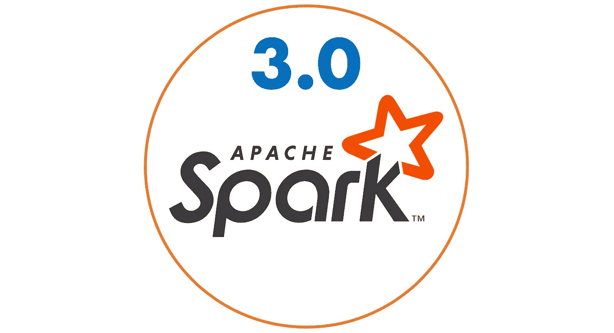

# Apache Spark 3.0 一瞥[早期访问]

> 原文：<https://towardsdatascience.com/glimpse-into-spark-3-0-early-access-c1854327d6c?source=collection_archive---------14----------------------->



[图沙尔·卡普尔](https://www.tusharck.com/):(【https://www.tusharck.com/】T2

[Apache](https://www.apache.org) 继续保持强势地位，展示了其针对大数据科学的 [Spark 3.0](https://spark.apache.org/news/spark-3.0.0-preview.html) 预览版。根据预告， [Spark](https://spark.apache.org) 即将推出几大重要功能。

你可以从这个链接下载预览版:[https://archive.apache.org/dist/spark/spark-3.0.0-preview/](https://archive.apache.org/dist/spark/spark-3.0.0-preview/)

让我们看看它的一些主要功能，这些功能为其大数据统一分析的目标注入了活力。

# **火花图:**密码脚本&属性图

Spark 3.0 中加入了流行的图查询语言 Cypher，它通过属性图模型 a directed multigraph 进行耦合。图形查询将遵循与 SparkSQL 相似的原则，它自己的催化剂为数据帧提供完全支持。

[点击查看 Databricks 在 Spark 3.0 图形 API 上的会话](https://databricks.com/session_eu19/graph-features-in-spark-3-0-integrating-graph-querying-and-algorithms-in-spark-graph)。

# Python 3，Scala 2.12 和 JDK 11

*   Spark 3.0 有望完全迁移到 Python3。
*   Scala 版本升级到 2.12。
*   它将全力支持 JDK 11 号。

# 深度学习:增加 GPU 支持

这是每个数据工程师和科学家都在寻找的东西，而 Spark 3.0 符合他们的期望。带 [NVIDIA](https://www.nvidia.com/en-us/) 的 Spark 3.0 提供 GPU 加速，可以跨多个 GPU 运行。它支持 AMD、Intel 和 Nvidia 等异构 GPU。对于 Kubernetes，它提供了执行程序 pod 级别的 GPU 隔离。除此之外，我们还得到了:

*   熊猫 UDF 的 GPU 加速。
*   您可以指定 RDD 操作中的 GPU 数量。
*   为了轻松指定深度学习环境，有 YARN 和 Docker 支持推出带 GPU 的 Spark 3.0。

## 日志丢失:支持

您还可以设置您的指标的物流损耗。

```
val evaluator = new MulticlassClassificationEvaluator() .setMetricName("**logLoss**")
```

# 二进制文件

您可以使用二进制文件作为 spark 数据帧的数据源，但是，现在不允许二进制的写操作。我们可以期待在未来的版本中。

```
val df = spark.read.format(**BINARY_FILE**).load(dir.getPath)
```

# 库伯内特斯

现在，在最新 Kubernetes 版本的支持下，您将能够通过 Kubernetes 托管集群。它在运行时提供 spark-submit 变化的 web-hooks 配置修改窗格。它还改进了 Kubernetes 的动态分配。此外，我们得到:

*   支持 GPU 调度。
*   Kubernetes 后端的 spark.authenticate secret 支持。
*   Kubernetes 资源管理器现在支持 Kerberos 身份验证协议。

# 考拉:熊猫的星火尺度

[考拉](https://github.com/databricks/koalas)是 Apache Spark 上的熊猫 API，它使数据工程师和科学家在与大数据交互时更有效率。随着 3.0 功能发布，考拉现在可以扩展到分布式环境，而不需要单独读取 Spark 3.0 数据帧，这与以前的单节点环境不同。

```
import databricks.koalas as ks
import pandas as pd

pdf = pd.DataFrame({'x':range(3), 'y':['a','b','b'], 'z':['a','b','b']})

# Create a Koalas DataFrame from pandas DataFrame
df = ks.from_pandas(pdf)

# Rename the columns
df.columns = ['x', 'y', 'z1']

# Do some operations in place:
df['x2'] = df.x * df.x
```

以上例子摘自[考拉吉特回购](https://github.com/databricks/koalas)。

# 卡夫卡流:包括磁头

现在你可以在[Kafka](https://kafka.apache.org)streaming([git](https://github.com/apache/spark/blob/master/docs/structured-streaming-kafka-integration.md))中读取标题了。

```
val df = spark .readStream .format("kafka") .option("kafka.bootstrap.servers", "host1:port1,host2:port2") .option("subscribe", "topic1")
**.option("includeHeaders", "true")**
.load()df.selectExpr("CAST(key AS STRING)", "CAST(value AS STRING)", **"headers"**) .as[(String, String, Map)]
```

# 纱线特征

纱线还获得了一组新特征，主要是:

*   Spark 3.0 框架现在可以自动发现集群或系统上的 GPU。
*   可以调度 GPU。

你可以在这里查看 YARN 的 GPU 配置:[https://Hadoop . Apache . org/docs/r 3 . 1 . 0/Hadoop-YARN/Hadoop-YARN-site/using GPU . html](https://hadoop.apache.org/docs/r3.1.0/hadoop-yarn/hadoop-yarn-site/UsingGpus.html)

# 分析缓存数据

现在您可以分析 Spark 3.0 中的缓存数据，这是 Spark ( [git](https://github.com/apache/spark/blob/master/sql/core/src/test/scala/org/apache/spark/sql/StatisticsCollectionSuite.scala) )最想要的特性之一。

```
withTempView("cachedQuery") {
  sql("""CACHE TABLE cachedQuery AS
          |  SELECT c0, avg(c1) AS v1, avg(c2) AS v2
          |  FROM (SELECT id % 3 AS c0, id % 5 AS c1, 2 AS c2 FROM range(1, 30))
          |  GROUP BY c0
       """.stripMargin)
**// Analyzes one column in the cached logical plan**
sql("**ANALYZE** TABLE cachedQuery COMPUTE STATISTICS FOR COLUMNS v1") **// Analyzes two more columns**
sql("**ANALYZE** TABLE cachedQuery COMPUTE STATISTICS FOR COLUMNS c0, v2")
```

# 动态分区剪枝

它通过在散列连接中重用维度表广播结果，在运行时提供优化的执行。这有助于 Spark 3.0 更有效地处理基于星型模式的查询，从而消除了 ETL 非规范化表的需要。

[点击查看 Databricks 关于 Apache Spark 中动态分区修剪的会话](https://databricks.com/session_eu19/dynamic-partition-pruning-in-apache-spark)。

# 三角洲湖

[Delta Lake](https://delta.io/) 是一个开源存储层，为 Apache Spark 3.0 带来了 ACID 事务，并且由于其易于实施和升级到任何现有 Spark 应用程序，它为数据湖带来了可靠性。

参见三角洲湖泊快速启动:【https://docs.databricks.com/delta/quick-start.html 

# 更多功能:

*   SparkML 中的决策树。
*   改进了查询执行期间的优化器。
*   可插拔目录集成。
*   执行器内存的度量。
*   动态分配。

上面提到的功能并不是 Spark 3.0 的唯一功能。毫无疑问，Spark 3.0 正在帮助数据科学家利用附加功能做更多事情，等待 Spark 3.0 的最终发布。