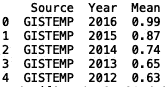
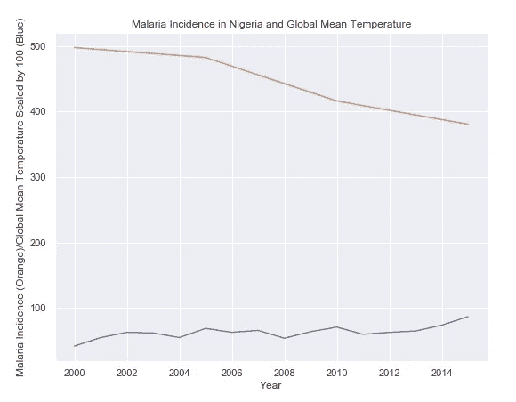
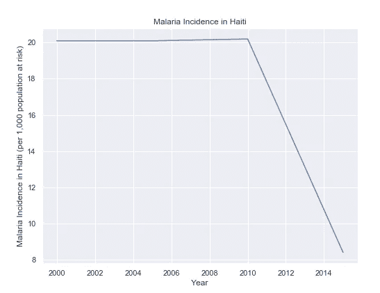

# 发展中地区的全球变暖和疟疾:Python 中的分析

> 原文：<https://towardsdatascience.com/global-warming-and-malaria-in-developing-regions-an-analysis-in-python-69a9ba52f83a?source=collection_archive---------15----------------------->


Photo by [Pixabay](https://www.pexels.com/@pixabay) on [Pexels](https://www.pexels.com/photo/black-white-mosquito-86722/)

气候变化预计会对尼日利亚、海地和也门等发展中国家产生不利影响。这些影响包括因昆虫和害虫增加造成的食物短缺、人口迁移和疾病传播。[世界卫生组织](https://www.who.int/publications/10-year-review/health-guardian/en/)将气候变化描述为疾病的威胁倍增器:

> 它应对现有的威胁——无论是霍乱爆发、寨卡病毒向新地理区域的传播，还是干旱带来的严重营养不良——并增强这些威胁。风险是熟悉的，但它们的影响在频率和严重性上被放大了。气候变化会扩大传染病的分布，特别是由蚊子和其他媒介传播的疾病，并引发其他疾病的出现。尼帕病毒和汉坦病毒作为人类病原体的出现被追溯到极端天气事件，这些事件迫使动物宿主离开它们的生态位并入侵人类住区。

有很好的历史证据表明气候条件和传染病之间的联系。具体而言，疟疾是一种病媒传播的疾病，预计将受到全球变暖的显著影响。

在之前的一篇文章中，我们研究了气候变化如何影响水稻和小麦等作物的产量。在本帖中，我们将对由[数据中心](https://datahub.io/collections/climate-change)提供的公共气候变化数据和由[ourworldindata.org](https://ourworldindata.org/crop-yields)提供的全球疟疾死亡数据进行简单的探索性分析。

我们从导入 python 库 Pandas 开始:

```
import pandas as pd
```

我们要查看的第一个数据集是年度全球气温数据。我们可以将数据读入 dataframe 并打印前五行:

```
df_global_temp = pd.read_csv("annual_temp.csv")
print(df_global_temp.head())
```


接下来，我们可以过滤我们的数据，以便我们只获得与 NASA GISTEMP 源相对应的记录:

```
df_global_temp = df_global_temp[df_global_temp['Source'] == 'GISTEMP'].reset_index()[["Source", "Year", "Mean"]]
print(df_global_temp.head())
```



接下来，我们可以绘制年平均温度与时间的关系图。接下来，我们导入 python 可视化软件包“seaborn ”,并绘制时间序列的线图:

```
import seaborn as sns
sns.set()
sns.lineplot(df_global_temp['Year'], df_global_temp['Mean'])
plt.ylabel("Mean")
plt.title("Average Global Mean Temperature")
```


接下来我们可以看看 ourworldindata.org 提供的每 1000 人中疟疾的平均发病率。让我们将“incidence-of-malaria.csv”数据读入一个数据帧，并查看前五行:

```
pd.set_option('display.max_columns', None)
df_malaria = pd.read_csv("incidence-of-malaria.csv")
print(df_malaria.head())
```


我们还可以观察一组独特的区域:

```
from collections import Counter
print(set(df_malaria['Entity'].values))
print("NUMBER OF REGIONS: ", len(set(df_malaria['Entity'].values)))
```


数据集仅包括每个区域 4 个点，共有 127 个区域。每个地区的数据都不多，所以任何分析都应该持保留态度。知道发展中地区更容易遭受气候变化带来的风险，缩小我们的范围将是有益的。[《时代》杂志称，尼日尼亚、海地、也门、菲律宾和斐济将面临气候变化带来的最严重后果](https://time.com/5687470/cities-countries-most-affected-by-climate-change/)。

考虑到这一点，我们可以从尼日利亚的疟疾发病率开始:

```
df_malaria = pd.read_csv("incidence-of-malaria.csv")
df_malaria = df_malaria[df_malaria['Entity']=='Nigeria'].reset_index()[["Entity", "Code", "Year", 'Incidence of malaria (per 1,000 population at risk) (per 1,000 population at risk)']]
print(df_malaria.head())
```


接下来我们可以绘制 2000 年至 2015 年尼日利亚的疟疾发病率:

```
sns.lineplot(df_malaria['Year'], df_malaria['Incidence of malaria (per 1,000 population at risk) (per 1,000 population at risk)'])
plt.ylabel("Malaria incidents in Nigeria (per 1,000 population at risk)")
plt.title("Malaria incidents in Nigeria")
```


接下来，我们可以叠加全球年平均气温(为清晰起见，以 100 为因子)和尼日利亚的疟疾发病率:

```
df_global_temp = df_global_temp[df_global_temp['Year'] <= 2015]
sns.set()
sns.lineplot(df_global_temp['Year'], df_global_temp['Mean']*100)
plt.ylabel("Mean")
sns.lineplot(df_malaria['Year'], df_malaria['Incidence of malaria (per 1,000 population at risk) (per 1,000 population at risk)'])
plt.ylabel("Malaria Incidence (Orange)/Global Mean Temperature Scaled by 100 (Blue)")
plt.title("Malaria Incidence in Nigeria and Global Mean Temperature")
```



虽然我们可以看到随着平均气温的上升，疟疾发病率的下降开始趋于平稳，但气候变暖与疟疾发病率平稳之间的联系并不令人信服。

我们也可以看看海地:

```
df_malaria = df_malaria[df_malaria['Entity']=='Haiti'].reset_index()[["Entity", "Code", "Year", 'Incidence of malaria (per 1,000 population at risk) (per 1,000 population at risk)']]
print(df_malaria.head())
```


```
sns.set()
sns.lineplot(df_malaria['Year'], df_malaria['Incidence of malaria (per 1,000 population at risk) (per 1,000 population at risk)'])
plt.ylabel("Malaria Incidence in Haiti (per 1,000 population at risk)")
plt.title("Malaria Incidence in Haiti")
```



海地的数据更不令人信服。我们可以叠加温度和疟疾数据:

```
df_global_temp = df_global_temp[df_global_temp['Year'] <= 2015]
sns.set()
sns.lineplot(df_global_temp['Year'], df_global_temp['Mean']*100)
plt.ylabel("Mean")
sns.lineplot(df_malaria['Year'], df_malaria['Incidence of malaria (per 1,000 population at risk) (per 1,000 population at risk)'])
plt.ylabel("Malaria Incidence in Haiti (per 1,000 population at risk)/Global Mean Temperature Scaled by 100 (Blue)")
plt.title("Malaria Incidence in Haiti and Global Mean Temperature")
```


在这一点上，从数据中得出任何结论都需要更详尽的分析。我们将在这里结束我们的分析，但请随意查看其他地区的疟疾发病率以及 datahub 上提供的一些其他气候变化数据。这篇文章中的数据集和代码可以在 [GitHub](https://github.com/spierre91/medium_code) 上找到。感谢您的阅读！