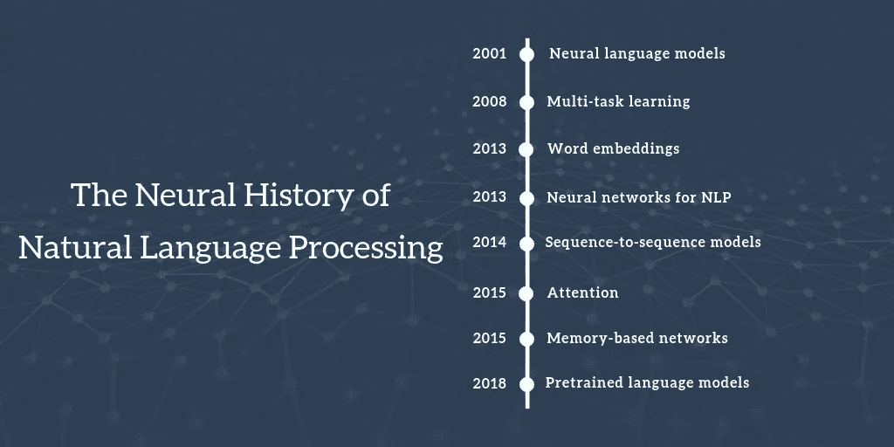

# 使用 char ngram 语言模型构建 Gmail 风格的智能撰写

> 原文：<https://towardsdatascience.com/gmail-style-smart-compose-using-char-n-gram-language-models-a73c09550447?source=collection_archive---------6----------------------->

## “OpenAI 构建了一个非常好的语言模型，发布它被认为太危险了”——Techcrunch

Image Source: Open AI’s GPT-2 (SoTA Language Model)

***让我们从头开始构建一个简单而强大的语言模型，并将其用于文本生成。***

如果你是一名 **Gmail** 用户，现在你应该已经体验过[智能撰写](https://www.blog.google/products/gmail/subject-write-emails-faster-smart-compose-gmail/)功能*(甚至可能不知道你实际上正在使用它)*。这是新的自动补全句子功能，将电子邮件的工作效率提升到一个令人兴奋的新水平。是在 Google I/O 2018 发布的[。对于那些没有使用过智能合成的人来说，我们首先将它与传统的预测文本和自动完成功能进行对比。](https://ai.googleblog.com/2018/05/smart-compose-using-neural-networks-to.html)

## 内容:

*   [智能作曲比你想象的要聪明](https://medium.com/p/a73c09550447#5234)
*   [语言模型，RNNs 和 Seq2Seq 建模](https://medium.com/p/a73c09550447#b6d6)
*   [实验](https://medium.com/p/a73c09550447#2987)
*   [演示](https://medium.com/p/a73c09550447#203c)

# 智能作曲比你想象的要聪明

我们每天都在进行大量基于文本的交流。今天，大多数网络和移动应用程序都有很好的功能来提高工作效率。例如， **Whatsapp** 提供预测文本，而**谷歌搜索** [会在你输入时自动完成](https://blog.google/products/search/google-search-autocomplete/)趋势搜索。总的来说，两者都提供了简单的基于**模型的前缀搜索**，即用户输入的文本被用作前缀来预测用户可能想要输入的下一个单词(在 Whatsapp 的情况下)或用户的搜索意图(在谷歌搜索的情况下)。如果你认为 smart compose 是预测文本和自动完成的漂亮扩展，你不会错，但它还有更多。差异是细微的。如下图所示。

## **Whatsapp 预测文本**

正如你所看到的，Whatsapp 会预测下一个可能的单词，并向你展示前三种可能性。虽然它是基于模型的，但它只预测下一个单词(一元词)或最多下一个单词对(二元词)，但仅此而已。但是公平地说，这对于 messenger 的情况来说已经足够好了。

Whatsapp predictive text

## **谷歌自动完成**

query autocomplete(如下所示)也是一个基于模型的解决方案，它考虑到了到目前为止键入的搜索短语，并对趋势搜索运行前缀搜索。(*我掩饰了许多复杂的细节，但对于这篇文章的范围来说，这已经足够了)*

Google Search Autocomplete

## 智能作曲

单词级别的预测文本很棒，但它们只适合用户输入短时出现的情况。但是对于电子邮件，用户需要在多封邮件中一次性输入大量文本。因此，用户需要输入的内容越少，用户体验和工作效率就越高。此外，在电子邮件中，如果你仔细看，我们最终会重复很多句子，从问候到基本的客套话到结束语*(它们是程序员害怕的胶水代码(或锅炉板代码)。*

这就是 smart compose 的与众不同之处，它是一个真正的生产力提升工具。它不仅使用当前文本，还使用主题和上一条消息(如果用户正在回复)来为您完成句子。如果你仔细观察，你会发现不同的补全是在不同的层次上完成的——有些补全是在两三个单词之后完成的，而有些是在几个字符之后完成的。

How smart compose saved me at least 25 keystrokes in one email. (Watch out how the **To** and **Subject** line are factored into the prediction)

## 动机

NMT(神经机器翻译)已经成为解释序列到序列模型(Seq2Seq 模型)的典型用例。虽然这并没有错，但依姆霍·NMT 并没有公正地对待 Seq2Seq 范式所能提供的所有魔力。此外，机器翻译还不是一个很好解决的问题(至少在撰写本文时是这样)。但看看智能电子邮件回复(Kannan 等人，2016 年)和智能撰写(gmail)，它们是非常实用的解决方案，效果非常好。因此，我认为构建一个智能合成的实验原型可以对 Seq2Seq 模型提供一个全新的视角。

在进入技术细节之前，一个友好的提醒:这篇文章的其余部分假设对 Seq2Seq 模型，编码器-解码器架构，递归神经网络(RNNs 和它的表弟 LSTM，GRU)有基本的理解。但话虽如此，我保证尽可能简单地传达这一点，所以请耐心等待*(可能会去喝一杯)*

# 语言模型、RNNs 和 Seq2Seq 建模

## 语言模型:直觉

语言模型(LM)的现代体现是 NLP 作为一个领域发展的一个重要里程碑。所以，我们先从了解一个 LM 背后的直觉开始。

Image Source: Sebastian Ruder ([http://ruder.io/a-review-of-the-recent-history-of-nlp/](http://ruder.io/a-review-of-the-recent-history-of-nlp/))

LMs 学习文本语料库的表示，类似于嵌入了的**单词，但是更好。我这么说是什么意思？简而言之，LM 的目标是分解文本语料库，并为文本序列分配概率，通常一次一个单词。(但也有其他变种)。**

那么，这是如何工作的呢？对于我们语料库中的文本序列*“狗对着陌生人吠叫”，*基于单词的 LM 使用概率链规则一次一个单词地估计 P(*狗对着陌生人吠叫))*的概率。它从第一个单词(“the”)的概率开始，接着是给出第一个单词(“the”)的第二个单词(“dog”)的概率，然后是给出第一个&第二个单词的第三个单词的概率，依此类推。从数学上来说，LM 估计如下:

具体地说，LM 估计如下，其中 n 是单词的数量。

LMs 有许多不同的用例。其中之一是，一个 LM 可以告诉一个文本序列对于一个给定的语料库有多可能。例如，一个文本序列 **P("一只没有翅膀的狗倒着飞)**将产生一个非常低的概率，除非文本语料库来自一些虚构小说。但是这个用例对我们来说没那么有趣。更有趣的是，LMs 非常适合序列生成(在本例中是文本生成)

1.  我们可以让一个 LM 生成一个任意长度的随机序列，带或者不带**前缀**(有时也称为**种子**或者**提示**)。前缀或提示可以是任何东西，一个单词或另一个任意长度的序列。例如，我们可以用一个单词提示一个 LM 生成一个随机的句子，或者我们可以用一个句子提示一个 LM 生成一个句子或一个段落。*给定任意长度序列作为输入，生成任意长度序列的特例称为* ***条件生成，*** *作为输出以输入为条件。这就是为什么这个范例被称为 Seq2Seq 建模。机器翻译是条件生成的典型例子，因为它很容易将观点传递给读者。*因此，下面显示的是经典 Seq2Seq 模型的布局，其中 ***x1，x2…xn*** 是输入序列， ***y1，y2..ym*** 为输出序列。(<开始>和<结束>是教师强制分隔符)

Layout of an RNN based Conditioned Generator

2.因此，如果你将这些点联系起来，Gmail 智能撰写只不过是一个**“条件生成”**，其*输入序列=当前电子邮件+主题行+前一封电子邮件(如果你正在回复)，输出序列=预测的句子完成*。(我鼓励你在这里停下来，试着在 gmail 中写一封邮件，看看条件生成是如何工作的)。下图显示了一种可能的智能合成模型架构

Conditioned generation in Smart Compose

好的，这些与 RNNs 和编码器-解码器架构有什么关系，它们之间有什么联系？让我们一次看一个

1.  **LMs 和 RNNs 有什么关系？** LMs 并不新鲜。过去，人们一直使用马尔可夫模型来学习 LM。但是它不是最好的选择，因为它有很多缺点，细节不在本文讨论范围之内。因此，长话短说 RNNs 作为 goto 架构出现，以进行序列建模，从而进行 LM，因为它们有望克服马尔可夫模型的缺点。尤其是 RNNs 可以无视马尔可夫限制并考虑长程相关性的事实。
2.  【RNNs 和条件生成是如何关联的？下图显示了 RNNs 提供的几种不同的 Seq2Seq 造型风格。如果您将上面的条件发生器布局与这些图像进行比较，您会发现多对多 **(n:m)** 风格(即输入序列长度*不等于输出序列长度*)与条件发生器完全相同。*(在这篇文章的上下文中，我们将考虑基于 RNN 的条件发生器，但还有更高级的架构，如* ***变压器*** *来实现条件发生器)*

**3。调理发生器和编码器-解码器是如何关联的？**条件发生器只是编码器-解码器架构的另一个名称，而发生器、条件发生器是来自 NLP 文献的术语。事实上，术语“条件发生器”解释了该架构的功能，术语“编码器-解码器”只是简单地命名了该架构中的组件。

现在我们已经很好地把所有的事情联系在一起了。让我们想想如何实现这样一个有条件的生成器。

# 实验

## 合成数据集创建

电子邮件是混合了一些特定信息的通用文本序列的语料库。为这个用例提取和准备训练数据集可能会很棘手。以下是两大原因:

1.  问候或开场白可以是“嗨，丽塔，你好吗？”我们不想学习“Rita”这个名字，但我们应该能够帮助写出开场白或问候语。
2.  电话号码、位置、地址甚至银行账号等私人信息都可能是信息的一部分。因此，在创建训练数据集时，必须小心识别和排除敏感信息。事实上，为了防止在预测中泄露敏感或不相关的信息，在预测质量上妥协是可以的。此外，严重的违法行为可能会引发法律问题。

我使用安然公司的电子邮件数据集作为来源，为这个实验提取和准备了一些电子邮件。尽管如此，从电子邮件语料库中提取训练数据集还没有一个好的解决方案。所以如果你想玩玩，就发挥创造力。但是请记住，公平和隐私是最重要的。

在安然数据集中，整个电子邮件内容(收件人、主题、正文..)在一个 CSV 字段中。这里的 [**是将**](https://gist.github.com/PrithivirajDamodaran/0b658bc73e5f50b1d0617698b6177444) 那些字段拆分的代码链接，如果你想节省一些时间的话。

## 实施细节

Sample of some short messages used in this experiment.

上面列出的是可能带有或不带有主题的电子邮件的一小部分示例。需要注意几件重要的事情:

**第一，**如果你查看我展示的 gmail 如何完成句子的例子，你会发现预测实际上并不是等你完成一个完整的单词。如果你开始输入 ***【叫我 wi】****它就会预测到 ***“有问题的话”*** *。*所以我们可能需要一个比单词级更细粒度的 LM，**因此我选择在 char ngram 级**构建。实现这一点的一种方法是准备数据集，如下所示:*

**

***二、**主题文本作为数据准备的一部分被添加(前缀)到邮件正文中，所以单个培训记录=主题文本(如果有的话)+消息文本*

**同样，这纯粹是出于实验目的，因为对于大型语料库，这种类型的数据准备会非常占用内存，因为一个文本序列会变成多个带有字符 ngram 前缀的序列。**

*那么，一个 char ngram 级 LM 如何改变我们的编码器-解码器架构呢？不会，架构是一样的，但是它训练的方式变了(如下所示)。*

**

*Char n-gram conditioning for generation (shown in red)*

***要点:**运行良好的架构选择是 **BiLSTM 编码器和**LSTM 解码器。为了简单起见，我用 Python 写了这个。我还构建了一个简单的 HTML 应用程序和一个 REST 端点来演示模型如何工作(或者它是否可用)。我的*还没有*在任何地方托管应用程序，所以你现在可以查看演示(如下)。但是我会尽快更新演示的链接。*

## ***代码***

*   *[链接到 LM 代码(笔记本)](https://nbviewer.jupyter.org/github/PrithivirajDamodaran/NLP-Experiments/blob/master/Gmail_style_smart_compose_with_char_ngram_based_language_model.ipynb)*
*   *[链接到安然电子邮件数据集](https://gist.github.com/PrithivirajDamodaran/0b658bc73e5f50b1d0617698b6177444)准备代码(要点)*

***未来工作和可能的延期***

*   *理解以上 LM 的困惑。*
*   *添加注意机制。*
*   *用变压器替换 LSTMs。*
*   *尝试更长的消息和提示。*

# *演示*

****

# *现在交给你了，*

*生成具有不同粒度提示的文本序列的能力非常强大。我们能从这里去哪里？我们能不能不仅仅着眼于提高生产率？为医生打造*智能处方创作功能*？*面向律师的智能合同创作功能*。看到了吗？可能性是无限的。我希望我已经调整了你的主动性，所以继续扩展这个想法，建立一个伟大的解决方案。我很想听听你会如何扩展这个想法。*

## *参考和启示*

*[1] Jason B [r](https://machinelearningmastery.com/develop-word-based-neural-language-models-python-keras/) ownlee，[如何用 Keras 在 Python 中开发基于单词的神经语言模型](https://machinelearningmastery.com/develop-word-based-neural-language-models-python-keras/)*

*[2] TF 团队，[原创 Tensorflow NMT 教程](https://github.com/tensorflow/tensorflow/blob/r1.13/tensorflow/contrib/eager/python/examples/nmt_with_attention/nmt_with_attention.ipynb)*

*[3]塞巴斯蒂安·鲁德[，自然语言处理的神经历史回顾](http://ruder.io/a-review-of-the-recent-history-of-nlp/index.html#2001neurallanguagemodels)*

*[4]打开 AI，GPT-II [根据种子提示生成随机文本](https://openai.com/blog/better-language-models/#sample1)*

*[5] Yoav Goldbe [r](https://machinelearningmastery.com/develop-word-based-neural-language-models-python-keras/) g， [NLP 图书](https://www.amazon.com/Language-Processing-Synthesis-Lectures-Technologies/dp/1627052984)*

*我欢迎反馈和建设性的批评。你可以在 Twitter [@prithivida](https://twitter.com/prithivida) 上找到我，或者你可以在这里留言。*