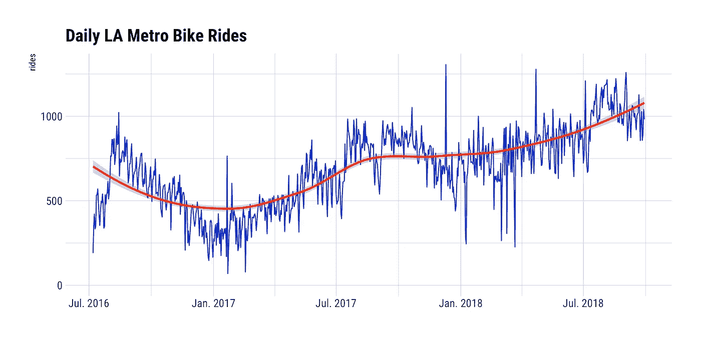
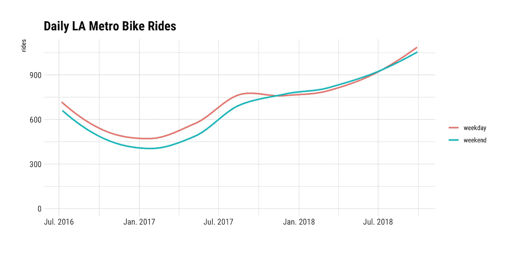
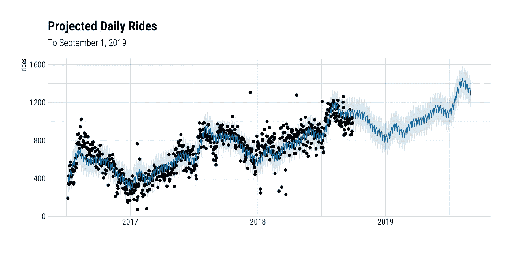
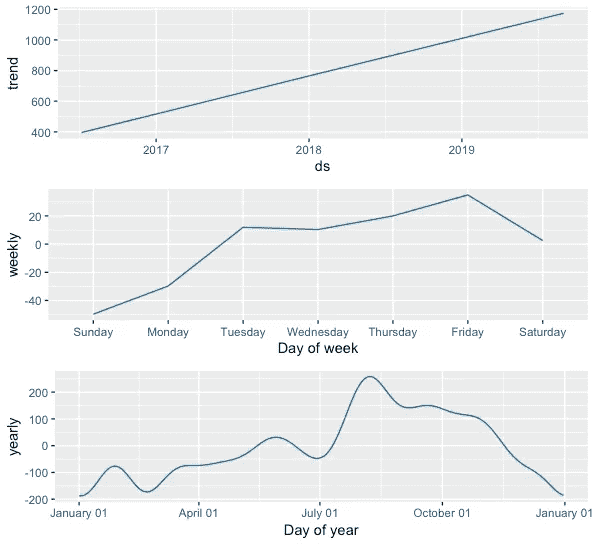
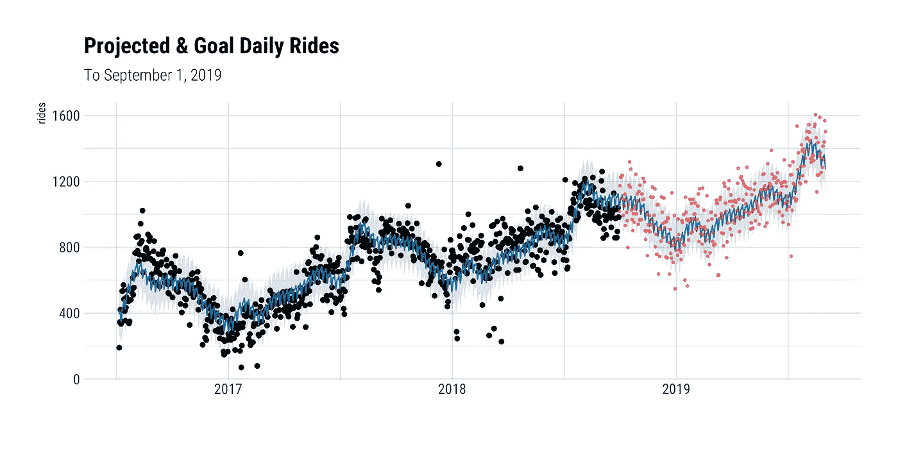
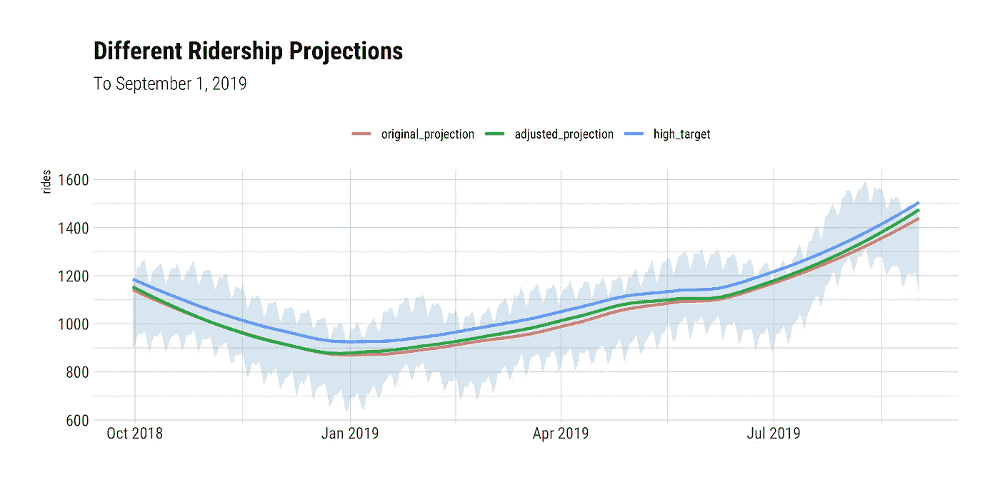

# Prophet & R 中基于目标的预测

> 原文：<https://towardsdatascience.com/goal-based-forecasting-in-prophet-r-b79900c64ca6?source=collection_archive---------14----------------------->

## 通过生成达到特定目标的预测来指导业务团队。

预测工具无处不在。但是，令人惊讶的是，很难弄清楚如何*调整*模型化的预测，以满足业务团队经常要求的目标或指标！

通过一些历史数据，您可以使用预测工具来预测未来的特定指标(例如，活跃用户数量、收入、售出的产品、出生的婴儿)。好的预测工具会将季节性(基于一周中的几天或一年中的几个月的波动)、总体增长、假期和其他变量考虑在内，以建立更合理、更可靠的预测模型。

然而，企业设定“目标”和“指标”我们如何构建符合这些目标和指标的预测？让我们假设我们是 [Tuckersoft](https://tuckersoft.net/) 的数据科学家，我们刚刚建立了一个预测，预测 1985 年 7 月将售出 15000 份 *Nohzdyve* 。因为我们是伟大的数据科学家，我们还提供了 7 月份每天的预计销售额(例如，“7 月 3 日，我们预计销售 472 份”)，这些日常销售额考虑了季节性、增长和假期。

Nohzdyve. Took me a while to realize it’s pronounced “nosedive.” 🤦🏻‍♂️

但是塔库尔先生已经给他的销售团队定下了 1985 年 7 月销售 18，000 份的目标。现在，我们如何“更新”预测以符合目标？最简单的方法是:取预计数字和目标数字之间的差值，并在我们感兴趣的日期范围内平均分配。所以我们拿 3000 本，除以 31 天，告诉 Thakur 先生我们每天需要多卖 97 本才能达到目标。

然而，我们现在忽略了季节性和所有其他进入我们预测模型的很酷的东西！也许我们倾向于在周末有更高的销售额，我们不指望在独立日(7 月 4 日)卖出任何东西。将每天的预测销售额加 97 并没有考虑这些因素。**我们想改变我们的预测，现在预测销量为 18，000 份，同时仍然考虑季节性和其他可变性。**然后，销售团队可以根据调整后的*基于目标的*预测来衡量每日进度。

# 使用 Prophet

[Prophet](https://facebook.github.io/prophet/) 是脸书开发的一款伟大的时间序列预测工具，有 R 和 Python 版本。我认为它是预测工具中的罗恩·波佩尔——你只需设置它，然后忘记它！

Set it and forget it! 🎉

使用 Prophet，只需几行 R 代码就可以创建预测:

就是这样！Prophet 通过分解趋势、季节性和节假日来生成预测，这是分析师容易理解的想法。可以通过在`prophet()`调用中设置参数来调整模型，并且可以使用一个列出日期的`holidays`数据框架来考虑假期。使用 Prophet 函数调用很容易生成按年、周、日显示趋势和季节性的漂亮图表。趋势变化点是自动计算的，但也可以手动插入或在过度拟合/欠拟合的情况下进一步指定。[点击这里查看更多关于](https://blog.fastforwardlabs.com/2017/03/22/prophet.html)先知特征的讨论。

# 在 Prophet 中建立基于目标的预测模型

但是如何得到一个*匹配*一个预设目标或指标的预测呢？这就是`predictive_samples()`的作用。该函数从“后验预测分布”中生成(默认)1，000 个样本每个样本都是基于历史数据和 Prophet 模型的略有不同的预测。你只需找到最接近你的目标的样本，这个样本代表了一个可能的、合理的实现目标的途径，*将季节性和节假日因素考虑在内*。

通过这种方式，我们的预测并没有真正得到调整，而是利用计算增强/采样功能产生数百或数千个预测，直到我们找到一个最能代表实现目标的新预测。

# 例如:洛杉矶地铁自行车共享乘车

这里做个例子。我已经创建了一个从洛杉矶地铁自行车共享网站下载的每日骑行数据的 CSV，从 2016 年 7 月 7 日(发布)到 2018 年 9 月 29 日(可用的最新数据)。

> [原始的&清理过的数据文件，以及汇编文件和生成 Prophet 预测的 R 脚本都可以在 Github 上获得。](https://github.com/foundinblank/setting-goals-using-prophet-models)

我们得到了这张图表:

Historical data for Los Angeles Metro Bike Share 🚲

我们可以看到一些年度季节性，在夏季的几个月里，乘坐次数更多。还有一个趋势转折点，游乐设施似乎真的起飞了。周季节性呢？检查的一种方法是查看工作日和周末:

🚴‍♀ Weekdays vs. Weekends 🚴

2017 年，周末的乘客量低于平日，但这一趋势在 2018 年发生了变化，大致相当。这是 Prophet 通过分解整体趋势和每日、每周和每年的季节性，开箱即用，很好地处理的事情。

我调用历史数据上的`prophet()`来生成先知模型，然后调用`predict()`来使用该先知模型预测到 2019 年 9 月 1 日的每日乘车次数。在本例中，我通过将 changepoint 参数从默认值 0.05 减少到 0.01 来降低趋势的灵活性:

According to this model, we’ll have 1,272 rides on September 1, 2019

这个先知模型为 2018 年 9 月 29 日至 2019 年 9 月 1 日之间的每一天生成了预测，**预测 2019 年 9 月 1 日将有 1272 次乘坐。**为了了解 Prophet 如何分解趋势和季节性，`prophet_plot_components()`生成了以下图表:

📈 📉 Components of a Prophet model.

多年来非常线性的趋势，周末较低的乘客量，夏末较高的乘客量——所有这些都进入了模型，并在计算每日乘客量预测时进行了加权。

## 目标:1500 次乘坐

但销售团队希望到 2019 年 9 月 1 日达到 1500 次乘坐。有了这个目标，我们每天的乘客量应该是怎样的呢？

使用相同的 Prophet 模型运行`predictive_samples()`从后验预测分布返回 1000 个样本(作为列),行数与您预测的天数一样多。如上所述，它们中的每一个都是可能的、可信的预测。我查看了对应于 2019 年 9 月 1 日的行，然后在 1000 列(样本)中找到了最接近 1500 次乘坐的单元格。包含该单元格的列是我要提供给销售团队的调整后的基于目标的预测！

下面的红点显示了为了在 2019 年 9 月 1 日达到 1，500 次乘坐，我们希望实现的调整后的日乘坐量。

The red dots 🔴 show the adjusted daily ridership we want to achieve to meet our Sep. 1, 2019 target.

这是放大的版本:

Zoomed In: The red dots 🔴 show the adjusted daily ridership we want to achieve to meet our Sep. 1, 2019 target.

你会看到一些调整后的每日客流量预测低于 Prophet 模型的原始预测。这只是生成的 1，000 个样本中的一个，因此模型将产生一些极端的数据点。**然而，调整后的乘客量预测比最初的预测平均每天多 13 次。每天调整后的预测将考虑季节性和节假日，以产生更可靠、更可信的每日预测。**

为了防止销售团队使用低于原始预测值的数据点*，可以将原始和调整后的客流量预测值合并在一起，这样，在任何特定日期，如果原始客流量预测值高于调整后的预测值，您将保留原始值，反之亦然。这产生了我(刚刚决定)称之为“高目标”的预测——销售团队可以瞄准的雄心勃勃的东西。*

Three projections! 📈 Original, adjusted, and a “high target” projection.

“高目标”预测是用更极端的个体数据点处理调整预测的一种方式，但我相信这里可以使用许多不同的方法！月度目标也很容易实现——只需根据与您感兴趣的月份相对应的行对`predictive_samples()`结果进行子集划分，对 1000 列(样本)中的每一列的行间日值进行求和，并找到最接近目标值的一列。

这是一个使用基本 Prophet 模型的简单例子，但是随着底层 Prophet 模型通过[设置附加参数](/playing-with-prophet-on-bike-sharing-demand-time-series-1f14255f7ff0)得到更好的调整，`predictive_samples()`的使用变得更加强大。总的来说，Prophet 是一个令人印象深刻的简单预测工具，它具有强大的功能，允许您提取符合特定目标的基于目标的预测，这是业务团队经常要求的可交付成果！

有没有其他方法可以产生基于目标的预测？请在下面分享。

*注:这篇帖子的灵感来自于我在这期 Github**中问的这个写得很笨拙的问题——感谢*[*Ben Letham*](http://lethalletham.com/)*为我指出了正确的方向！所有 R 脚本(使用*[*tid yverse*](http://www.tidyverse.org)*代码)、数据、图表均可在*[*my Github repo*](https://github.com/foundinblank/setting-goals-using-prophet-models)*获取。*