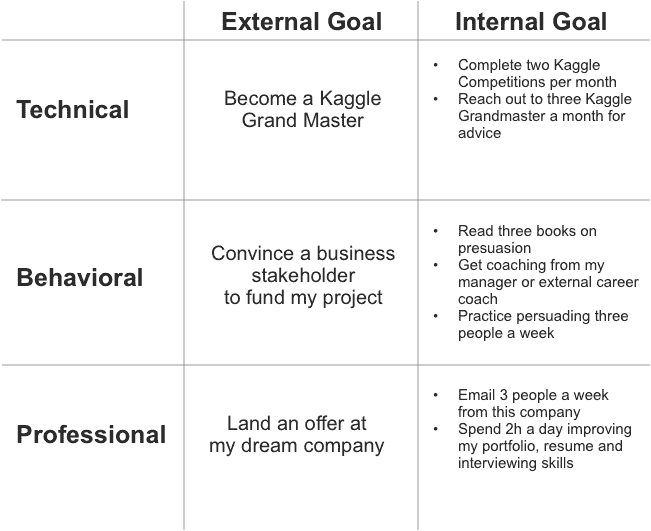
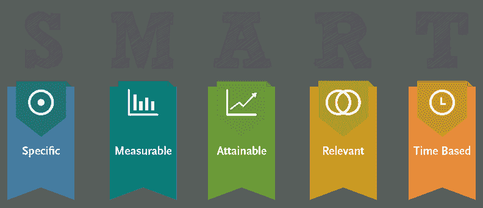

# 数据科学家的目标设定

> 原文：<https://towardsdatascience.com/goal-setting-for-data-scientists-b2ca1a3d96a1?source=collection_archive---------16----------------------->

## 设定和实现职业目标的框架

设定目标，尤其是在 12 月底左右，是反思和思考你希望在新的一年里从职业生涯中获得什么的好方法。在本文中，我们将讨论一个框架，供数据科学家用来实现他们的职业目标。

由于数据科学是一个跨学科的领域，您设定的目标类型将会非常多样。划分不同类型目标的一个好方法是分成以下三类:技术、行为和职业。

对于技术目标，您可能希望提高对某些技术或编程语言的理解。行为目标可能关注你的表达和说服技巧。最后，职业目标可以集中在实现职业里程碑上，比如升职或找到一份新工作。

# 专注于你能控制的事情

不管你设定什么类型的目标，重要的是你设定的目标在你的控制范围内。与其设定一个外部目标，比如升职，不如[设定在你控制范围内的内部目标](https://medium.com/@LyskovAndrei/one-simple-tactic-from-the-stoics-for-setting-better-goals-45d8c7b392e0)。例如，早点来帮忙做别人不想做的工作。

下面，您可以看到一些外部目标被重组为三个阶段的内部目标的例子:

设定内部目标的好处之一是，如果你没有实现外部目标(因为你控制范围内或控制范围外的原因)，你仍然会因为完成了你控制范围内的事情而有成就感。

# 对你设定的目标要明智

SMART(具体、可衡量、可实现、相关和基于时间)框架源于 20 世纪 80 年代的管理文献，用于设定目标和目的，已在整个商业和自我发展社区得到普遍使用。这个框架确保你设定的目标是你力所能及的，你可以随着时间的推移进行跟踪和衡量。

设定 SMART 目标时，您应该考虑以下问题:

1.  我想完成什么？
2.  通过/失败的标准是什么？
3.  我将如何衡量我的进步？
4.  根据我的技能水平和经验，这个目标合适吗？
5.  我有必要的时间和资源来完成这件事吗？
6.  我的退出标准是什么？
7.  我希望在什么时候完成这个目标？

# 让自己负起责任

为了确保符合你的目标，与朋友或教练分享你的目标是有用的，他们可以让你保持在正确的轨道上。你可能会有一个每周的检查，包括一个电话，甚至一个总结你进步的短信。

对于那些想对没有达到目标的人进行经济处罚的人来说，还有无数的工具可以利用。例如， [Beeminder](https://www.beeminder.com/) ，允许用户设定目标，这些目标要么是自我报告的，要么是与一些外部数据源相关联的(比如 [RescueTime](https://www.rescuetime.com/) ，它跟踪在线花费的时间)。因此，如果你想设定一个每月发表两篇数据科学文章的目标，你可以使用 Beeminder 作为一种对自己没有达到目标进行经济处罚的方式。

你可以使用的另一个工具是 [Stickk](https://www.stickk.com/) ，它类似于 Beeminder，增加了一个功能，即每当你未能达到目标时，你可以选择向一个反慈善机构捐款(即，如果你是利物浦球迷，你的反慈善机构可能是曼联球迷俱乐部)。

随着我们进入 2020 年，我鼓励你们考虑为每个类别(技术、行为和专业)设定至少一个目标。在设定这些目标时，确保设定明智的内部目标，并有办法让自己承担责任，无论是通过社会惩罚还是经济惩罚。