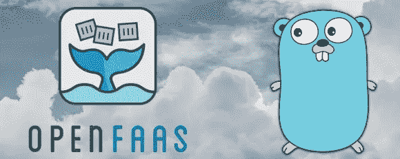

# 使用 OpenFaaS 和 Golang 实现无服务器——构建优化的模板

> 原文：<https://towardsdatascience.com/going-serverless-with-openfaas-and-golang-building-optimized-templates-730991084443?source=collection_archive---------25----------------------->

*注:这最初发布在*[*martinheinz . dev*](https://martinheinz.dev/blog/11)

在[上一篇关于 *OpenFaaS* 函数](https://dev.to/martinheinz/going-serverless-with-openfaas-and-golang-the-ultimate-setup-and-workflow-2hd1)的博文中，我们探索了我们可以用 *OpenFaaS* 做什么——我们在 *Golang* 中创建了我们的第一个 OpenFaaS 函数，我们为它编写了单元测试，用 *Travis* 设置了 CI/CD，用 *Taskfile* 自动化了常见任务。现在，是时候深入一点了。

在这篇博文中，我们将探讨如何构建定制模板，优化它们，从它们构建函数，最后，我们还将把 *Go* 模块合并到我们的新模板中。所以，让我们开始吧！

*TL；博士:这篇文章的完整源代码，包括文档可以在这里找到:*[*https://github.com/MartinHeinz/openfaas-templates*](https://github.com/MartinHeinz/openfaas-templates)

# 深入了解模板

如果我们想要构建自定义模板，那么我们首先需要了解它们是如何工作的。让我们首先看看模板由哪些文件组成:

*   模板清单——`template.yml`是一个描述模板本身的文件，因此 *OpenFaaS* 知道如何从中创建和部署功能。在该文件中，您可以找到诸如`language`、必需的`packages`或`fprocess`等信息
*   Entrypoint——接下来，为了使函数能够工作，我们需要一些文件(entry point ),这些文件要么监听 HTTP 请求，要么读取 *STDIO* 并将这些请求转发给函数本身。这个入口点文件是什么，取决于语言，所以可以有`main.go`、`index.py`、`index.js`等。
*   handler——现在，我们有了一个入口点，它将请求传递给我们的函数，我们需要以某种方式*处理*它。为此，我们有`handler.{go,js,py...}`来做实际的工作，并从函数返回响应
*   依赖性——大多数时候，你的函数会用到一些包。这些可以用语言特定的方式指定，例如使用`package.json`表示 *JavaScript* 或者使用`go.mod`表示 *Golang*
*   `Dockerfile` -最后，为了将所有这些文件打包成一个函数，我们有了`Dockerfile`，它构建、测试并创建最终的 *runner* 映像，该映像可以部署到 *OpenFaaS* 。

现在我们知道了函数由什么组成，它实际上是如何工作的？ *OpenFaaS* 模板有两个版本——*经典* ( `watchdog`)和新 *beta* ( `of-watchdog`)模板。它们都是通过创建微小的 *Golang* webserver 来运行的，webserver 整理 API 网关上接受的 HTTP 请求，然后将请求转发给被调用的函数。这就是相似之处，现在让我们看看不同之处:

*   `watchdog` : *经典*模板通过为每个请求派生一个流程来操作。一旦您的流程被分叉，看门狗通过`stdin`传入 HTTP 请求，并通过`stdout`读取 HTTP 响应。

*   `of-watchdog`:另一方面，当 watchdog 启动时，新模板派生出一个进程，然后我们将任何传入 watchdog 的请求转发到容器内的 HTTP 端口。

*以上图片摘自 OpenFaaS 架构文档—*[*https://docs.openfaas.com/architecture/watchdog/*](https://docs.openfaas.com/architecture/watchdog/)

如果你想更深入地了解`watchdog`(旧的和新的)是如何工作的，那么去[这里](https://github.com/openfaas/faas/blob/master/watchdog/README.md)或者[这里](https://github.com/openfaas-incubator/of-watchdog/blob/master/README.md)

# 创建模板

首先，模板有特定的文件/目录结构，这是我们需要遵循的，看起来是这样的:

使用上面的结构——`template`目录是所有模板驻留的地方。在其中，我们有一个名为`my-template`的模板，里面是它工作所必需的文件——所有这些我们已经在前一节中描述过了。这是一个非常小的例子，我们将会添加更多的文件。

结构到此为止，现在我觉得终于到了创建模板的时候了，先从*【经典* `*watchdog*` *风格】*模板开始吧。我们可以通过从官方模板商店[复制一个来创建一个。考虑到这是 *Golang* 模板的指南，我就拿基本的`go`模板(这里复制是多余的，你可以在这里](https://github.com/openfaas/templates/tree/master/template)看到最新版本的模板[)。](https://github.com/openfaas/templates/tree/master/template/go)

当我们把它复制到`template`文件夹时，我们应该检查它是否真的工作，对吗？所以让我们来建造它:

看起来不错，现在让我们部署功能，好吗？

就这样，我们创建了自己的模板(嗯，我们真的只是从官方商店借来的)并部署了从中获得的功能。然而，整个过程感觉相当笨拙，因为我们不得不使用相当多的命令来运行它，并直接调用`docker`命令，而不是例如`faas-cli build`和`faas-cli push`。在下一篇博文中，我们将用*任务文件*和几个脚本来简化这个过程。现在，让我们优化一下现有的模板...

# 我们可以改进什么？

上一节的*经典*模板非常好，但是有一些问题:

*   *无 Go 模块*:该模板不使用 1.11 中引入的 *Golang* 模块系统，这意味着必须使用不实用且过时的依赖管理。
*   *非最佳* `*Dockerfile*` : `Dockerfile`这个模板有相当多的不必要的层，使其构建缓慢，并且很少*比所需的*厚。
*   `*of-watchdog*` *更快*:如上所述，是*经典*模板，所以不用`of-watchdog`。因此，我们可以通过切换到`of-watchdog`并使用 HTTP 模式来提高它的性能。

所以，让我们来解决这些问题吧！

***注:*** *这里提一下，OpenFaaS 社区已经在这些模板上做了很多工作。经典的是遗留模板，你应该使用中间件或它的 http 版本，并可能应用下面介绍的调整和更改。*

其中一些问题可以通过在这里使用`openfaas-incubator/golang-http-template`来解决，但是我们可以把它推得更远一点，所以让我们从这里的中取出`golang-http`并在此基础上构建。

在这里，我将向您展示我使用[这个](https://github.com/openfaas-incubator/golang-http-template/blob/master/template/golang-http/Dockerfile)作为基础创建的最终`Dockerfile`，我将带您了解所有的变化及其背后的基本原理:

*注:您可以在* [*这里*](https://github.com/MartinHeinz/openfaas-templates/blob/master/template/golang-mod/Dockerfile) 中查看 `*Dockerfile*`

*我们从 2 个`FROM`命令开始，因为我们既需要 *Golang* image 来构建函数，也需要`watchdog` binary。接下来，我们打开 Go 模块并禁用 *CGO* ，这将允许我们调用这里不需要的 *C* 代码。下面的代码将`git`安装到构建映像中，因为我们需要它在构建期间下载 *Golang* 包。在接下来的 2 行中，我们复制`watchdog`二进制文件并使其可执行。现在是时候构建我们的函数二进制代码了——我们首先将源代码复制到`/go/src/handler`,然后对其运行 2 个命令—*test*和 *build* 。对于测试，我们使用模板中包含的`test.sh`脚本。让我们看看它能做什么:*

**注:您可以在* [*这里*](https://github.com/MartinHeinz/openfaas-templates/blob/master/template/golang-mod/test.sh) 中查看 `*test.sh*` *文件**

*首先，它从`function`目录中收集测试*目标*，这是我们的源代码。然后它对这些目标文件运行`go test`，如果测试通过，那么就该检查格式并寻找代码中的可疑结构，这就是`gofmt`和`go vet`的作用。那时——在测试成功通过之后——回到`Dockerfile`——我们构建名为`handler`的二进制文件。*

*`Dockerfile`的最后部分是*亚军*的形象。在这里，我们运行*的命令真的*开始变得重要了。我们希望减少对`RUN`、`COPY`和`ADD`的所有调用，因为这些调用会创建额外的图层，并会使最终图像膨胀。因此，首先我们使用单个`RUN`命令添加 CA，添加名为`app`的用户，函数将在该用户下运行并移动到它的主目录。接下来我们`COPY`将所有需要的文件从构建器镜像到 runner 目录，函数将从该目录在单层中运行，这包括 *Golang* 二进制、`watchdog`二进制和函数目录中的所有内容。最后，我们设置我们的用户，设置环境变量，并将`watchdog`二进制文件设置为默认启动命令。*

*现在，我们已经解决了`Dockerfile`,我们可以看看源代码了。为了简单起见，我只使用了前面提到的 [golang-http](https://github.com/openfaas-incubator/golang-http-template/tree/master/template/golang-http) 中的`main.go`和`handler.go`，因为在模板代码方面没有太多变化。但是缺少的是一些单元测试模板，所以让我们看看我们能做些什么...*

# *测试时间*

*如果你读过我以前的任何一篇文章，你就已经知道接下来会发生什么了——单元测试。模板可以包含任何代码——包括测试，所以我认为添加简单的测试模板来测试您的功能是合适的。这是一个测试例子:*

*该测试位于紧挨着`handler.go`的`handler_test.go`文件中。该测试涵盖了在进行 HTTP 请求/响应时所期望的基本检查，即状态代码检查和响应验证。因此，首先我们使用`handler.Response`创建期望值，接下来我们向由`Handle`函数表示的函数发出请求，传递我们的请求，最后我们对照期望值检查它的响应。*

# *将这一切结合在一起*

*我们终于有了模板所需的所有源代码，但是我们还不能完全使用它。我们缺少构建函数所需的`template.yml`。这是:*

*这里没什么好说的。我们指定语言、将作为`fprocess`运行的二进制文件和简单的欢迎消息。我们也可以在这里包括`build_options`和`packages`，但在这种情况下，这是不必要的。*

*接下来我们需要完成的是模板的依赖关系，考虑到我们正在使用 Go 模块，我们需要做的就是在`main.go`旁边创建`go.mod`文件，如下所示*

*然后运行`go mod tidy`，这将用我们所有的依赖项(`openfaas-incubator/go-function-sdk`和`stretchr/testify`)填充文件*

*现在唯一要做的就是构建、推动和部署它:*

# *结论*

*就这样，我们创建了自定义模板，可以用来构建和部署 *OpenFaaS* 函数。也就是说，剩下的事情不多了…在下一篇博文中，我们将构建个人模板库，在那里我们可以放置所有的自定义模板，然后添加模板的自动验证并将其包含在 CI/CD 管道中，最后我们将简化所有与使用 *Taskfile* 构建和运行模板相关的任务，就像我们在上一篇博文中对函数所做的那样。如果你想先睹为快，请看[我的库这里](https://github.com/MartinHeinz/openfaas-templates)，如果你喜欢这些类型的帖子，可以随意留下反馈或者直接启动库。😉*