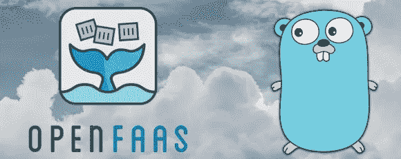

# 使用 OpenFaaS 和 Golang 实现无服务器——终极设置和工作流程

> 原文：<https://towardsdatascience.com/going-serverless-with-openfaas-and-golang-the-ultimate-setup-and-workflow-52a4a85a7951?source=collection_archive---------20----------------------->

*注:此文最初发布于*[*martinheinz . dev*](https://martinheinz.dev/blog/10)

无服务器应用已经流行了一段时间，一些有趣且有用的平台/工具/框架正在出现。其中之一是 *OpenFaaS* ，它是开源*功能的服务*工具，用于开发*云原生无服务器应用*。

在这篇博文中，我想向你展示如何设置(IMHO)开发 *OpenFaaS* 函数的理想项目和工作流程，以及如何使用 *Golang* 创建你的第一个函数。

*注意:这篇文章的完整源代码可以在这里找到:*[【https://github.com/MartinHeinz/openfaas-functions】T21](https://github.com/MartinHeinz/openfaas-functions)

# 为什么选择 OpenFaaS

你可能会问，为什么——在所有像 *AWS Lambda* 、 *Google Cloud Run* 、*open whish*等框架中。—我会选择 *OpenFaaS* 吗？嗯，对我来说有几个原因:

*   **无供应商锁定** —我选择 *OpenFaaS* 而不是其他选择的一个重要原因是，我不会被供应商锁定。但是，为什么它如此重要呢？这很重要，因为在某些时候，你可能会决定，你想要转移到其他平台，甚至完全远离*无服务器*，这是你无法用像 *AWS Lambda* 这样的工具真正做到的，这迫使你使用 AWS。
*   **云原生** —下一个优势是它运行在云环境中，比如 *Kubernetes* 、 *OpenShift* 或者 *k3s* (在本教程中使用)。我认为这是一个优势，因为现在构建小型 *Kubernetes* 集群非常便宜、快速和简单，在其中部署 OpenFaaS 也很简单，正如您将在下面看到的。
*   **任何语言** — *OpenFaaS* 都能够使用任何运行时，这要归功于所有函数都在 *Docker* 容器中运行这一事实。您甚至可以构建自己的模板，并以此为基础构建您的函数。
*   **性能**—*open FAAS*的另一个好处是它的性能，更具体地说——或者换句话说——空闲时将 pods 扩展到零的能力，以及具有更低延迟、缓存和持久连接的[基于 HTTP(beta)的模板](https://github.com/openfaas-incubator/of-watchdog)(你将在下一篇博客文章中看到)。

# 安装

要开始构建一些很酷的功能，我们首先需要安装一些工具。以下是它们的列表和说明:

*   *k3s* —为了运行这些功能，我们需要一个云环境，并且考虑到我们将使用本地机器，我们应该尽可能选择最轻量级的选项，这里我将使用 *Ranchers k3s* (或者您也可以使用*类*)。要安装，请使用以下命令:

*   *OpenFaaS* —如前所述， *OpenFaaS* 是一个云原生平台，所以我们需要把它放到我们的云环境中( *k3s* ):

*   为了能够与部署的 OpenFaaS 进行交互，我们还需要它的 CLI:

*   *任务文件*——最后，我们的设置使用*任务文件*——代替*Make*——来自动化常见任务。要安装它，您需要运行:

# 第一功能

现在我们已经准备好了所有的工具，让我们构建我们的第一个 *OpenFaaS* 函数。在我们实际进行任何编码之前，我们需要提取模板，在此基础上我们将构建函数:

上面，我们可以看到我们感兴趣的一个模板——`go`模板。让我们用它来创建函数:

从输出中，我们可以看到创建了哪些文件— `handler.go`和`first-func.yml`。第一个包含负责处理传入请求的函数，另一个是描述函数的 *YAML* 堆栈文件——它包含像图像名称、处理程序路径、语言等信息。也有更多的值可以指定，你可以在这里找到。你可能注意到我们还指定了`prefix`标志——我们需要它，以便能够将我们构建的函数的映像推送到远程存储库，在本例中是 *Docker Hub* 并且`prefix`是 *Docker Hub* 用户名。当我们部署该功能时，OpenFaaS 将使用远程注册表中的这个映像。

我将把摆弄代码和实现酷功能的工作留给你，我将只构建、推送和部署 *Hello World* 函数:

就这样，我们在 *k3s* 上的 *OpenFaaS* 中运行我们的函数。我们可以在 UI 和命令行中查看它。对于 UI 视图，您可以导航到`OPENFAAS_URL`(应该是 [http://127.0.0.1:31112](http://127.0.0.1:31112) )，对于 shell，您可以运行以下命令来显示和调用该函数:

我认为，这很简单，我们可以在此基础上进行构建。在下一篇博文中，我们将探讨如何利用更新的(beta) `of-watchdog`模板，以及如何使用 *Go* 模块构建我们自己的模板库，包括我们的优化模板。你可以在我的模板库[这里](https://github.com/MartinHeinz/openfaas-templates)先睹为快。

# 单元测试

看起来我们已经完成了，但是我们还缺少一样东西——单元测试。

要编写我们的单元测试，我们只需在`handler.go`旁边创建`handler_test.go`文件，并将这个测试放在那里:

您可能已经注意到，`go test`命令是在 *Docker* 构建过程中运行的，所以我们运行测试所需要的只是像以前一样构建函数:

你可能认为测试像这种*无服务器*功能的小代码片段是多余的，但是你不应该仅仅因为代码简单或简短就忽视测试，如果可能的话，一切都应该被测试。

# 通过任务文件变得简单

在这篇文章的开始，我要求您安装*任务文件*，但是我们实际上还没有使用它，所以让我们改变它，使工作流更简单，并使用我已经为您创建的*任务文件*目标来创建、构建、部署或调试功能:

第一步—使用某个模板创建具有指定名称的函数:

该任务在后台为您下载模板，创建函数，然后将文件添加到 git staging 区域。

接下来，让我们来构建它:

没什么特别的，它只是构建函数，但是您也可以继续，在一个命令中构建、推送和部署函数:

现在，为了检查一切是否按预期工作，让我们检查日志:

这将给出 Kubernetes 部署对象的描述以及如下所示的功能日志:

如果日志还不够，您可以使用以下命令调试该函数:

这将在 *Docker* 中本地运行该功能，并将终端连接到`watchdog`进程日志。现在，这个函数已经在您的机器上运行了，您可以使用`cURL`来调用它:

要查看`Taskfile.yml`中发生的事情或查看更详细的文档，请查看我的知识库中的`Taskfile.yml`[这里的](https://github.com/MartinHeinz/openfaas-functions/blob/master/Taskfile.yml)和`README.md` [这里的](https://github.com/MartinHeinz/openfaas-functions/blob/master/README.md)。

# 最简单的 CI/CD

我们需要设置的最后一件事是 CI/CD 管道，我们可以使用最后一个*任务文件*目标来完成，我在上一节中省略了这个目标——`task verify`——这个命令下载`faas-cli`(如果机器上没有的话)，并使用存储在`functions`目录中的 *YAMLs* 在存储库中构建每个函数:

要获得完整的代码清单，请查看存储库中的文件，特别是这里的`.travis.yml` [和这里的`verify.sh`](https://github.com/MartinHeinz/openfaas-functions/blob/master/.travis.yml)。

# 结论

正如你从这篇文章中看到的，开始开发*无服务器*应用程序真的很容易，考虑到*无服务器*不再只是炒作，这些技术已经相当成熟，我希望你能尝试一下。如果你想从这篇文章中看到更多的细节和完整的源代码，请查看我的知识库[这里](https://github.com/MartinHeinz/openfaas-functions)，如果你有一些建议/改进/问题，请随时提交问题或开始讨论。🙂

如前所述——在下一篇博文中，我们将看看如何建立自己的模板库，创建自定义模板，并使用它来创建更好的功能。