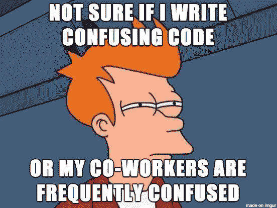

# 数据科学的良好编码实践

> 原文：<https://towardsdatascience.com/good-coding-practices-for-data-science-e9237783784c?source=collection_archive---------9----------------------->

虽然数据科学不是直接源于计算机科学的领域，但机器学习和人工智能的兴起已经使编码成为数据科学不可或缺的一部分。

虽然数据科学项目更具实验性，不像软件项目那样定义良好，但遵循一些好的编码原则有助于提高效率和扩大数据科学项目。

**这里有一些我尝试遵循的好的编码实践:**

*   **代码组织**

我确保我的所有代码不是放在一个文件中，而是分散在多个文件中。我通常将我的代码分成以下 4 个主要部分。

*a .规范文件*

在我的大多数项目中，我倾向于将规范文件作为 YAML 或 JSON，在那里我可以指定要设置的各种参数来运行代码。有了这些规范，我可以在不改变代码的情况下以不同的方式使用代码。比方说，我为一个国家建立了一个模型。如果我在规范文件中指定了一个国家变量，而不是在我的代码中硬编码这个国家变量，我可以通过修改规范在不同的国家使用这个代码。

*b .实用程序*

如果我的部分代码足够通用，可以跨多个项目使用，我会将它们放在名为“实用程序”的单独文件中，这样我就可以跨多个项目使用它们，并最大限度地减少重复工作。

*c .核心功能*

当涉及到核心逻辑的代码时，我再次尝试不把它们都放在一个文件中，而是把它们分散在多个文件中。例如，每个数据科学项目都有一个数据提取部分、数据探索部分、建模部分等等。我确保这些片段被分离到多个文件中。

d.主可执行文件

最后，我运行了一个单独的文件(通常称为 main.py ),它应该会执行整个代码。我试图在这个文件中使用最少的逻辑。这个文件的目的是让人们理解代码和代码流的不同部分的相互依赖性，而不是代码的详细逻辑。

*   **文档**

在我所有的项目中，我试图维护一个 **Readme 页面**，当我的代码发生变化**时，它会定期更新。**自述文件页面提供了代码的目标、安装和使用说明、代码架构和高级文件结构。

虽然自述文件是专注于代码的文档，但我维护了一个单独的文档来解释统计数据和机器学习逻辑。这样做的目的是帮助其他数据科学家理解我的逻辑和算法。

虽然文档似乎是一项平凡的任务，但它不仅仅是帮助别人，它还帮助我更清楚地了解我的代码。

*   **正在评论**

我通常在每个文件的顶部添加关于代码的高级注释。除了给读者一个文件的概述，这帮助我更好地组织我的文件。

对于我拥有的每一个方法，我都会写下关于方法目标的*注释，它所带的参数*和它返回的内容*。*这又一次帮助我将代码分割成合适的方法。

除了这些高级注释，如果我的代码中有任何复杂的逻辑，我会尝试编写一些高级注释。

*   **命名惯例**

我见过的大多数数据科学代码都有被命名为 x，y，z 等的变量和函数。这大概源于大部分数据科学家都是数学和统计学出身。这些命名约定使得代码对于试图理解它的人来说非常深奥。

当我写代码的时候，我会花一些时间为我的方法、类、变量等想一些最直观的名字。我还确保了我为这些代码元素使用的词性和字母大小写的一致性。例如，我尝试用小写动词表示方法，用骆驼格名词表示类等等。

事实上，好的命名约定减少了对注释和文档的需求。

*   **版本控制**

良好编码的最佳实践之一是维护版本控制。维护版本控制系统有很多好处。您可以在多人之间无缝协作，切换回旧版本的代码，在不影响旧版本的情况下向代码中添加新的更改/特性等。如果你以前没有使用过 [Git](https://git-scm.com/) ，创建一个 [Github](https://github.com/) 账户，然后开始上传你的项目。它是免费的，可以让你很好地理解版本控制系统。

鉴于数据科学项目涉及持续的实验和编辑，版本控制变得更加重要。假设您开发了一个模型，后来在模型中添加了一个新特性。如果您将这些保存为代码的两个版本，这将很容易让您比较这两个模型的性能。

*   **自动化测试**

虽然数据科学可能不像软件世界那样需要详尽的自动化测试用例来验证代码的健全性，但是用测试用例来验证数据的细微差别是一个非常好的实践。

在我的项目中，我使用 [unittest](https://docs.python.org/2/library/unittest.html) 包来进行自动化测试，以验证代码不同部分的功能，更重要的是检查潜在数据异常的处理，如空值、缺失值、异常值等。

虽然好的编码实践可以确保模块的健壮性，但是编写好的代码需要花费大量的时间和精力。并非所有项目都证明了这一点。如果你正在做一个要在一周内交付的分析，你就没有时间美化你的代码。

因此，我倾向于将每个项目分为 3 个阶段:POC、MVP 和生产，如下所述:

*   POC 是我想得到一个解决方案来证明建模的可行性的地方
*   MVP 是解决方案足够健壮可以使用的地方(附加特性和模型调整)
*   生产是解决方案完全自动化和部署的地方。

如果我处于 POC 阶段，我不会花太多时间清理我的代码，但是一旦我进入 MVP 阶段，我会确保我的代码遵循良好的编码实践。

如果您觉得在您的数据科学实践中有任何其他实践，请随时在下面发表评论！干杯。