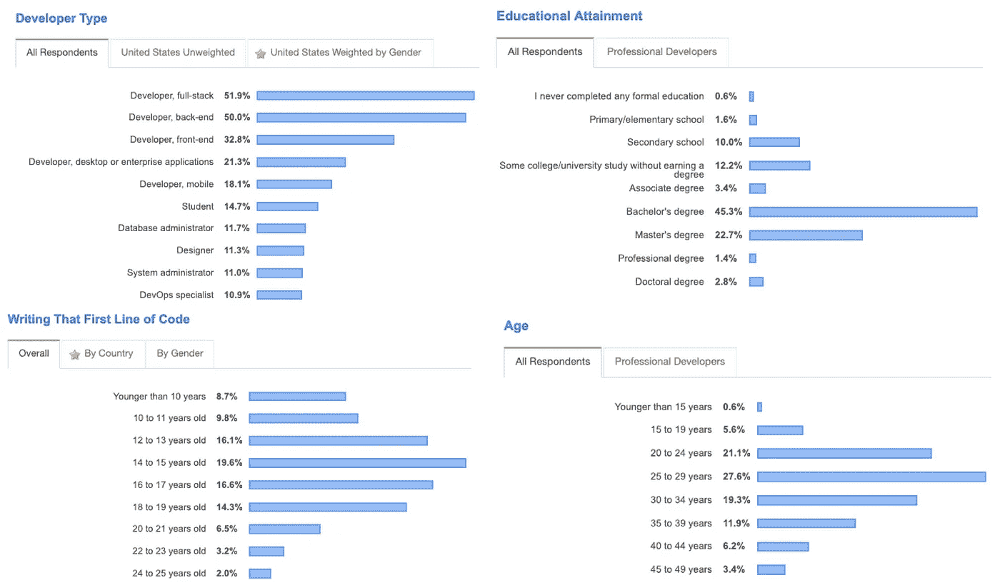
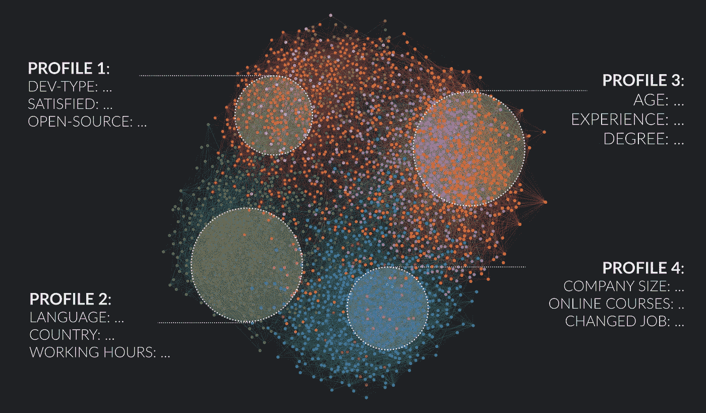
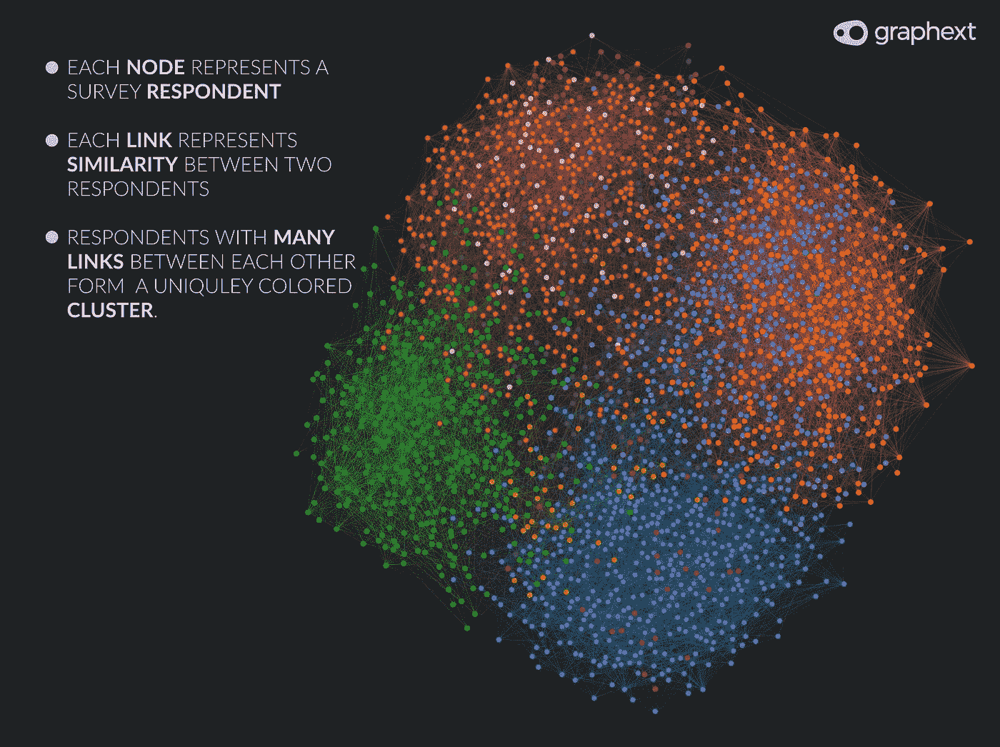
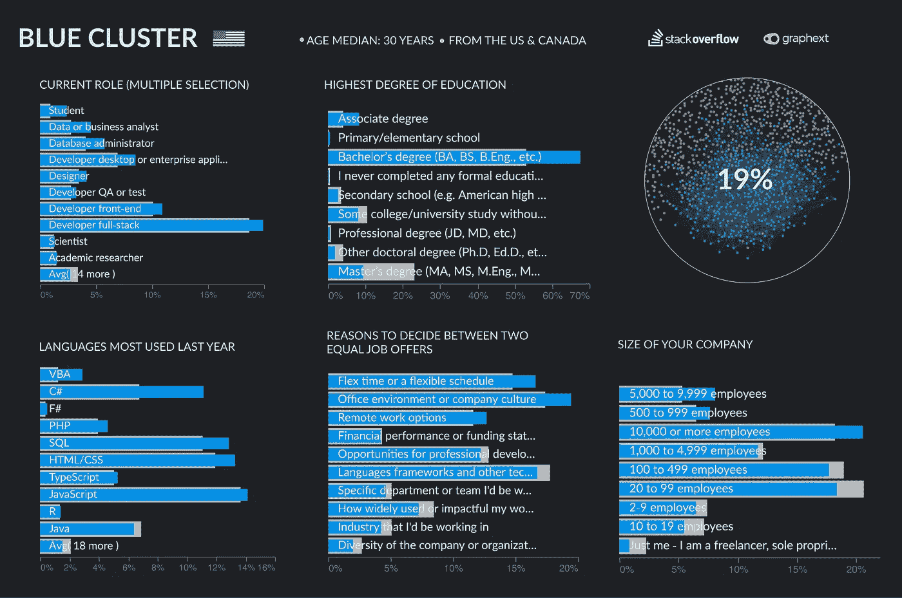
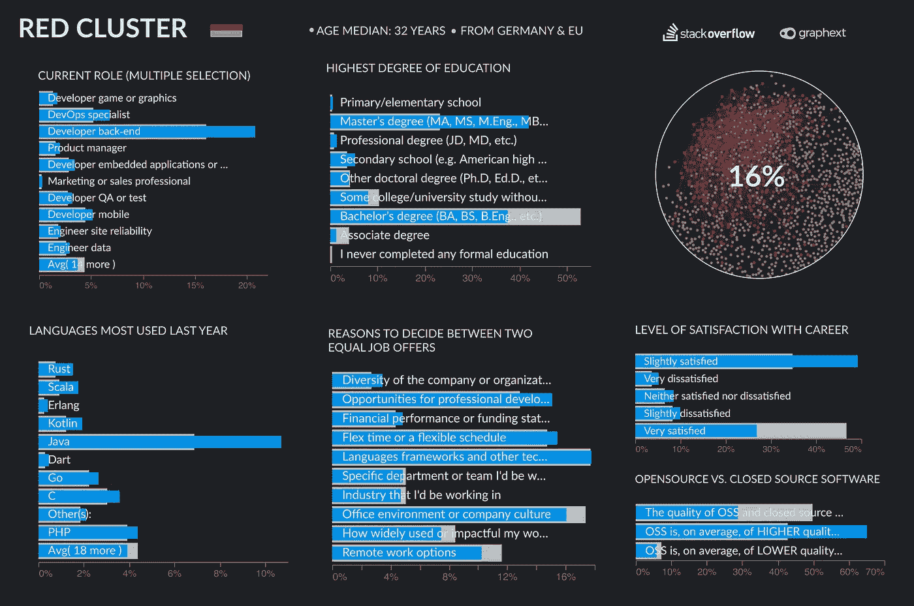
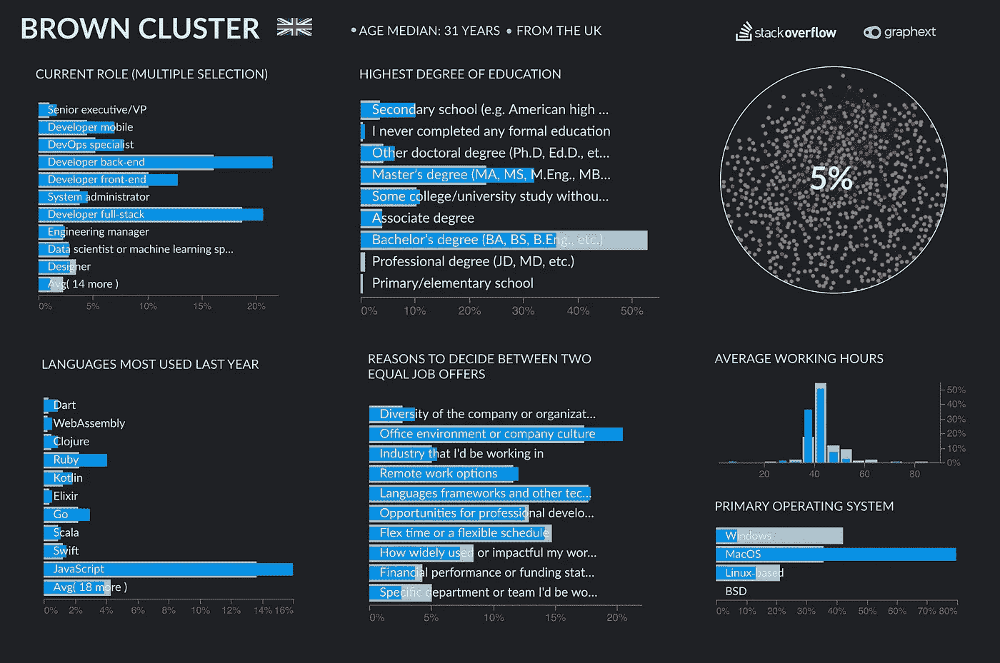

# 从优秀到卓越——如何成为世界上排名前 5%的开发者！

> 原文：<https://towardsdatascience.com/good-to-great-how-to-become-the-top-5-developer-in-the-world-be0fe50ef9c7?source=collection_archive---------9----------------------->

每年，Stack Overflow 都会为我们提供许多关于他们年度开发者调查的有趣见解。你将对市场上最需要的编程语言、高薪职位等等有一个很好的了解。

在 [Graphext](https://graphext.com/) ，我们也总是对调查结果非常感兴趣，但今年我们想尝试自己寻找见解。由于 Stack Overflow 发布了他们的调查数据，我们可以使用不同的方法简单地运行我们自己的分析。通过根据调查对象提供的所有答案创建聚类，我们将找到典型的、更详细的开发人员概况。

因此，今天我们将向您展示**我们如何从这一点:**

**对此:**

为了给我们的分析增添一点趣味，在开始我们的概要分析之前，我们问自己以下问题:

# 谁是收入最高的 5%的开发者？

将 88883 名调查对象按照回答了大多数问题的人进行筛选，我们最终得到 52545 人。从这些数据中，我们选择了年薪(美元)列的 95%分位数，我们的项目最终有大约 2600 名受访者。所有这些人的最低年收入为 573，108 美元，我们想了解这些人是谁。

***重要提示*** *: Stack Overflow 使用总薪酬、货币、汇率以及薪酬是按周、按月还是按年计算的信息来计算美元年薪。因此，每个项目收费很高的顾问很容易获得超过 200 万英镑的虚拟年薪。*

# 1.通用网络

在将我们的数据集输入到 Graphext 之后，我们得到了上面这张漂亮的图表。有几个颜色独特的开发人员群体已经可以识别，只需点击一下，我们就可以找到这些人的主要特征。

在下文中，我们将向您展示解释配置文件的主要变量。每个变量的值按提升排序，这意味着:

> 想象一下，在 VBA 整个人口计划中只有很少的人(6%)。当我们对我们的人口进行筛选时，VBA 不太可能成为最重要的编程语言。但是如果它的比例增加到——比如说——12 %,它对于选择的重要性就加倍了，因此我们说它是那个人的一个重要特征。
> 
> **另一方面**:如果 50%的人用 Java 编程，但在我们的集群中只有 30%的人这样做，那么这个特性就没有其他特性重要，即使它是最常用的编程语言。

# 简介#1:拥有学士学位的美国人

## 关键事实

*   工作之外的一些学习
*   数据和业务分析师、数据库管理员、设计师、QA、桌面应用程序、..
*   学士和副学士学位
*   在大公司工作
*   重要语言:VBA、C#、F#、PHP、SQL、..
*   在决定是否接受一份工作时，他们会寻找灵活的时间表、公司文化和远程工作选择

# 概要#2:德国 DevOps 和后端开发

## 关键事实

*   DevOps，后端开发，开发。对于游戏和图形，..
*   硕士学位、专业学位
*   对自己的职业不太满意
*   相信开源软件的质量
*   重要语言:Rust，Scala，Erlang，Java，..
*   他们在决定是否接受一份工作时，会考虑公司的多样性、职业发展和财务表现

# 简介 3:拥有博士和硕士学位的英国人

## 关键事实

*   高管、移动开发人员、开发人员、后端、前端、全栈、系统管理员，..
*   硕士和博士学位
*   几乎所有的都使用 MacOS
*   他们平均工作不到 40 小时
*   重要语言:Dart、WebAssembly、Clojure、Ruby、JavaScript
*   在决定是否接受一份工作时，他们会寻找多样性、公司文化和行业

## 结论和建议

尽管这些简介差别很大，但我们可以为你进入前 5%提取一些指导方针。

1.  在美国，你不需要硕士学位，获得学士学位后马上开始工作。而在德国和英国，攻读硕士和博士的传统途径更为普遍。
2.  学习 Rust 或 WebAssembly 这样的小众语言会让你获得竞争优势，让你在市场上更有需求。
3.  公司文化和公司的多样性是前 5%的人在决定工作机会时经常提到的标准。选择一个适合你的工作场所似乎是成功的关键。
4.  对你的职业选择持开放态度。作为 DevOps 或全栈开发人员，以及设计师或开发人员 QA，你可以赚很多钱

当然，还有更多的集群和洞见有待发现，这就是为什么我们让您可以访问这个项目。通过点击这个[链接](https://public.graphext.com/d5e62f5f0020e10c/index.html)，你可以进入这个项目，开始你的探索之旅。

如果您想了解更多信息，请点击这里向我们索取演示，或者参加我们 6 月 19 日的[网络研讨会](https://www.eventbrite.co.uk/e/graphext-webinar-apply-data-science-to-transform-your-marketing-analytics-tickets-62909784860)。