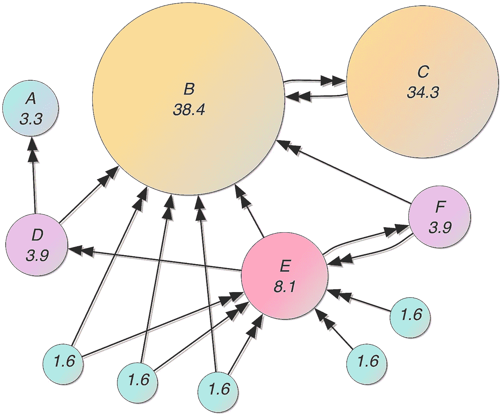
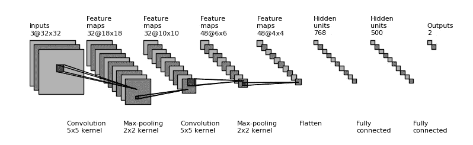
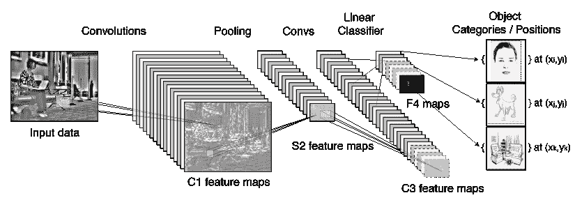
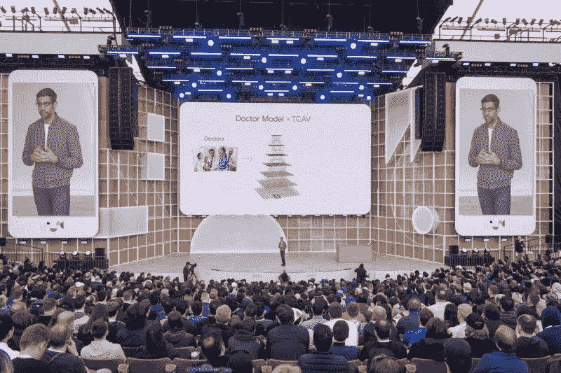

# 谷歌人工智能和半监督学习的发展

> 原文：<https://towardsdatascience.com/google-ai-and-developments-in-semi-supervised-learning-5b1a4ad29d67?source=collection_archive---------24----------------------->

Photo by [@kerber](https://unsplash.com/@kerber)

## 对人工智能领域意味着什么？

谷歌可以说是人工智能领域的领跑者之一。因此，努力了解他们的最新进展是很有意义的。昨天，在 7 月 10 日的 Google AI 博客上，两位研究人员谢启哲和 Thang Luong 写了一篇文章，标题是 [***用无监督数据增强推进半监督学习***](https://ai.googleblog.com/2019/07/advancing-semi-supervised-learning-with.html) **。我打算尽我所能理解这篇文章，并解释他们的发现可能导致的一些后果。**

在他们的介绍中，他们谈到了半监督学习中的无声革命。我不得不检查来源，我很有兴趣地看到他们提到了谷歌首席科学家 Vincent Vanhoucke 在 2019 年 5 月 15 日写的一篇文章。

接下来的三天我会看三个问题。

**第一天:谷歌如何成为人工智能领域的领跑者？**

第二天:无监督数据增强的半监督学习(SSL)取得了哪些进展？为什么它对人工智能领域很重要？

第三天:SSL 中静悄悄的革命是如何改变行业的？

今天是我从谷歌开始的第一天。

## Google 如何成为 AI 领域的领跑者？

谷歌如何开始的故事似乎经常被提及，以至于有些人会说它不需要被提及，所以我会尽我所能保持简短。从车库到谷歌总部，他们首先建立了一个搜索引擎，使用链接来确定各个页面的重要性。这家公司被称为 Backrub，因为该程序分析网络的[“反向链接”,以了解一个网站有多重要，以及它与其他什么网站相关。](https://www.businessinsider.com/the-true-story-behind-googles-first-name-backrub-2015-10?r=US&IR=T)

用算法逆向确保网站的分类是正确的，这是谷歌的第一个创新 **PageRank** 。它通过计算一个页面链接的数量和质量来粗略估计网站的重要性。潜在的假设是，更重要的网站可能会从其他网站收到更多的链接。这可能是谷歌使用的最著名的算法，但它不是创始人发明的。事实上，谷歌的创始人在他们的原始论文中引用了加菲尔德、马尔基奥里和克莱恩伯格。

[Mathematical **PageRanks**](https://en.wikipedia.org/wiki/PageRank#/media/File:PageRanks-Example.jpg) for a simple network, expressed as percentages. (Google uses a [logarithmic scale](https://en.wikipedia.org/wiki/Logarithmic_scale).) Page C has a higher PageRank than Page E, even though there are fewer links to C; the one link to C comes from an important page and hence is of high value. If web surfers who start on a random page have an 85% likelihood of choosing a random link from the page they are currently visiting, and a 15% likelihood of jumping to a page chosen at random from the entire web, they will reach Page E 8.1% of the time. (The 15% likelihood of jumping to an arbitrary page corresponds to a damping factor of 85%.) Without damping, all web surfers would eventually end up on Pages A, B, or C, and all other pages would have PageRank zero. In the presence of damping, Page A effectively links to all pages in the web, even though it has no outgoing links of its own.

谷歌于 1998 年 9 月 4 日在美国加利福尼亚州门洛帕克成立。在他们发射的几十年前，在另一个向后看的领域，反向传播，已经有了一些发展。连续反向传播的基础是由 Henry J. Kelley 在 1960 年和 Arthur E. Bryson 在 1961 年使用动态规划(使用最优子结构在图中寻找最短路径)的原理推导出来的。

随着进步，我们似乎不得不回顾过去，以弄清前进的方向，或者下一个岔路口。

> 我一直对到达感兴趣，对进入一个空间感兴趣，甚至对回头看你在哪里感兴趣。
> - [詹姆士·特瑞尔](https://en.wikipedia.org/wiki/James_Turrell)

[***反向传播***](https://brilliant.org/wiki/backpropagation/) *，误差的* ***反向传播*** *的简称，是一种利用梯度下降进行人工神经网络监督学习的算法。给定人工神经网络和误差函数，该方法计算误差函数相对于神经网络权重的梯度。*

最近，在 1986 年，通过大卫·鲁梅尔哈特、杰弗里·欣顿、罗纳德·j·威廉姆斯和詹姆斯·麦克莱兰的工作，重新引入了反向传播。就图像分类而言，这在后来被证明对图像搜索很重要。尤其是当后来谷歌成长为最受欢迎的搜索引擎，并推出图片搜索时:

> 因此，我们的联合创始人拉里·佩奇和谢尔盖·布林——像所有其他成功的发明家一样——不断迭代。他们从**图像**开始。毕竟，人们想要的不仅仅是文本。这一点在 2000 年格莱美颁奖典礼后变得更加明显，詹妮弗·洛佩兹穿着一件绿色礼服，吸引了全世界的目光。当时，这是我们见过的最流行的搜索查询。但是我们没有确定的方法让用户得到他们想要的:詹妮弗·洛佩兹穿着那条裙子。谷歌图片搜索诞生了。
> ——谷歌前首席执行官 Eric Schmidt 引自[《石英》杂志 2015 年 4 月](https://qz.com/378934/google-says-j-lo-is-why-we-have-image-search/)。

2001 年 7 月 Google Image 推出时，该网站提供了 2 . 5 亿张图片。

> 从搜索引擎的角度来看，网络本质上是数十亿页文字的集合体，以及连接这些文字的超链接。谷歌的重大突破之一是有效地链接这些单词，通过单词在页面上的出现来衡量相关性，以及指向该页面的超链接的数量，或其受欢迎程度[……]现在，大多数图像搜索引擎依赖关键词，或链接到照片的描述性文本，以检索与网络冲浪者的关键词查询匹配的结果列表。然而，如果照片或图像缺乏足够的描述，这种方法可能不可靠。
> - [斯蒂芬妮·奥尔森，CNET 2006 年](https://www.cnet.com/news/spying-an-intelligent-search-engine/)

到 2010 年，谷歌图片的数量已经超过 100 亿张。当时可能很清楚，他们必须做些什么。那就是谷歌大脑。

**Google** **Brain** 是 Google 的一个深度学习人工智能研究团队。谷歌大脑成立于 2010 年代初，将开放式机器学习研究与系统工程和谷歌规模的计算资源相结合。它始于谷歌研究员杰夫·迪恩、谷歌研究员格雷格·科拉多和斯坦福大学教授吴恩达之间的合作。

> 21 世纪初，当我在斯坦福大学时，我的博士生亚当·科茨(Adam Coates)带着一张图表来到我的办公室，这张图表显示，输入神经网络的数据越多，神经网络的表现就越好。我们开始寻找我们能找到的最大的计算机。这一发现，以及利用分布式计算扩大神经网络的想法，导致了 2011 年谷歌大脑的诞生。从那以后，深度学习取得了巨大的进步，因为我们收集了更多的数据，并创造了强大的计算机来使其工作。
> ——吴恩达引自 [WIPO 技术趋势 2019:人工智能](https://www.wipo.int/edocs/pubdocs/en/wipo_pub_1055.pdf)(第 9 页)。

深度学习热潮始于 2012 年的一篇论文，该论文以主要作者亚历克斯·克里兹夫斯基的名字命名，被称为“亚历克斯网”。多伦多大学撰写这篇论文的三位研究人员(包括 Geoffrey Hinton 和 Ilya Sutskever)参加了 ImageNet 竞赛，将图像分为一千个类别。AlexNet 通过使用深度神经网络实现了前所未有的准确性，该网络有八个可训练层和 65 万个神经元。

他们能够在如此多的数据上训练如此庞大的网络，因为他们知道如何利用消费级 GPU，这是为大规模并行处理而设计的。这证明了更好的算法、更多的训练数据和更强的计算能力的重要性。

> *2012 年，谷歌创建的一个神经网络学会了识别 YouTube 视频中的人类和猫——而从未被告知如何描述它们。它自学以 74.8%的准确率检测猫科动物，以 81.7%的准确率检测人脸
> -* [*通过谷歌*](https://cloud.withgoogle.com/build/data-analytics/explore-history-machine-learning/) 探索机器学习

2013 年，杰弗里·辛顿加入了谷歌大脑。AlexNet 在 2012 年获胜两年后，谷歌带着一个[甚至更深层次的神经网络](https://arxiv.org/abs/1409.4842)参加了比赛，并获得了最高奖项。该公司已经开始雇佣顶级机器学习专家，并收购专注于人工智能领域的公司。用于识别图像的一个流行版本是卷积神经网络(CNN)。

Shared by [Jefkine in Deepgrid](https://www.jefkine.com/general/2016/09/05/backpropagation-in-convolutional-neural-networks/)

[Typical CNN Architecture](https://en.wikipedia.org/wiki/Convolutional_neural_network#/media/File:Typical_cnn.png)

通过输入数据，你可以对不同的图像进行分类。该公司还拥有无与伦比的访问大型数据集的能力。2013 年的一篇论文描述了谷歌如何使用深度神经网络来识别谷歌街景拍摄的数千万张图像中的地址号码。

[Are.na](https://www.are.na/block/440532) on classification

DeepMind(深度学习，以 4 亿美元收购)的 [2014 年收购](https://techcrunch.com/2014/01/26/google-deepmind/)就是一个著名的例子，从而保持了神经网络设计的前沿。该公司已经创建了一个学习玩游戏的神经网络以及一个神经图灵机(可以像图灵机一样访问外部存储器)。该公司在 2016 年成为头条新闻，此前其 AlphaGo 程序在五局比赛中击败了世界冠军人类职业围棋选手 Lee Sedol。

2016 年，谷歌[创造了一种定制芯片](https://cloud.google.com/blog/products/gcp/google-supercharges-machine-learning-tasks-with-custom-chip)，称为张量处理单元，专门用于加速神经网络使用的操作。TensorFlow 与 Tensor AI 芯片相结合的机器系统现在对所有人免费。谷歌首席执行官桑德尔·皮帅提到，谷歌正在从“移动优先”向“人工智能优先”转变。

Google CEO Sundar Pichai speaks during the Google I/O Developers Conference on May 7, 2019 — Photo from [Ars Technica](https://arstechnica.com/gadgets/2019/05/googles-machine-learning-strategy-hardware-software-and-lots-of-data/).

你可以看到 CNN 的几个层次，以及用概念激活向量进行的**定量测试** ( **TCAV** )这是一种新的可解释性方法，可以了解你的神经网络模型使用什么信号进行预测

今年(2019)6 月我写了一篇名为[人工智能领域的专利](https://medium.com/@alexmoltzau/patents-in-the-field-of-artificial-intelligence-2019-52db9b03abe6?source=friends_link&sk=effdefe9c85481794fedad27d053990e)的文章。谷歌并不是人工智能领域拥有最多专利的公司之一。事实上，排名靠前的公司从大到小依次是:IBM(8290 家)、微软(5930 家)、东芝(5223 家)、三星(5102 家)和 NEC(4406 家)。我的文章参考了世界知识产权组织(WIPO)报告 [*技术趋势 2019:人工智能*](https://www.wipo.int/edocs/pubdocs/en/wipo_pub_1055.pdf) 。另一方面

> “……Alphabet(包括谷歌、DeepMind、Waymo 和 X Development)在申请的发明数量方面排名第十，总共有 3，814 项，在收购人工智能公司方面排名第一《世界知识产权组织 2019 年技术趋势:人工智能》(第 16 页)

从编程的角度来看，谷歌仍在向后看，以继续前进。然而，由于其二十多年来专注于分类的运营，以及其围绕新技术建立包容性网络的方式，以及其收购，我可以公平地解释为什么谷歌目前是人工智能领域的领跑者之一。

这是第 500 天的第 39 天。

我知道这是一个玩笑，正如你所理解的，我可能无法在接下来的几天里完全回答我在这篇文章中概述的问题，但是一如既往地，我当然希望你在旅程中坚持和我在一起。

> *什么是#500daysofAI？
> 我正在挑战自己，用#500daysofAI 写下并思考未来 500 天的人工智能话题。一起学习是最大的快乐，所以如果你觉得一篇文章引起了共鸣，请给我反馈。*