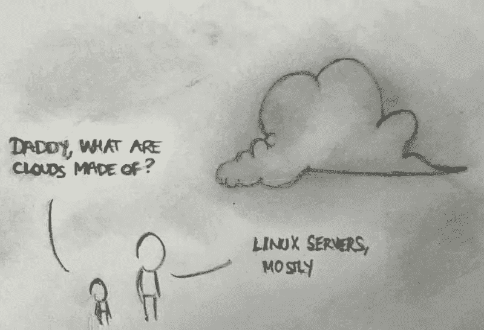
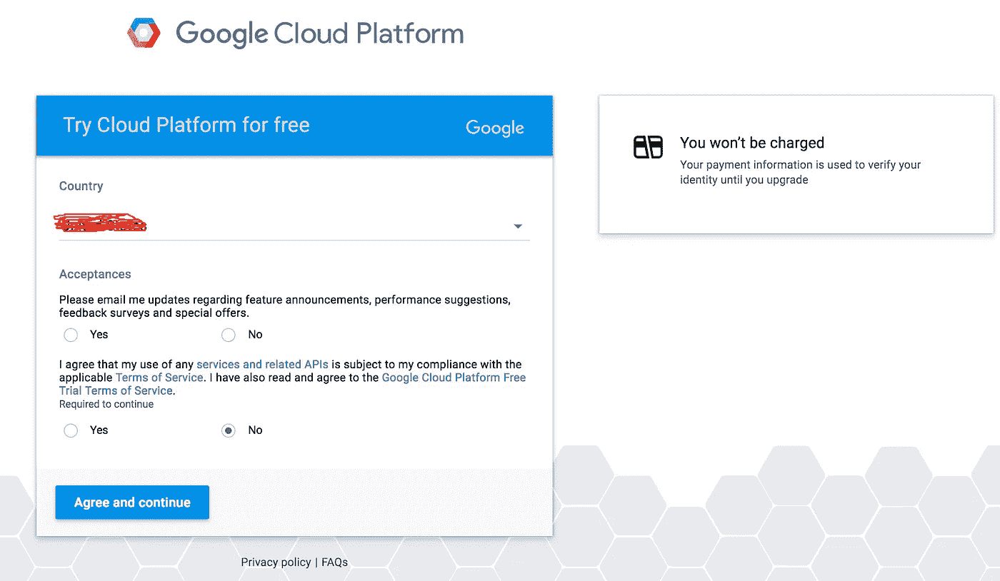
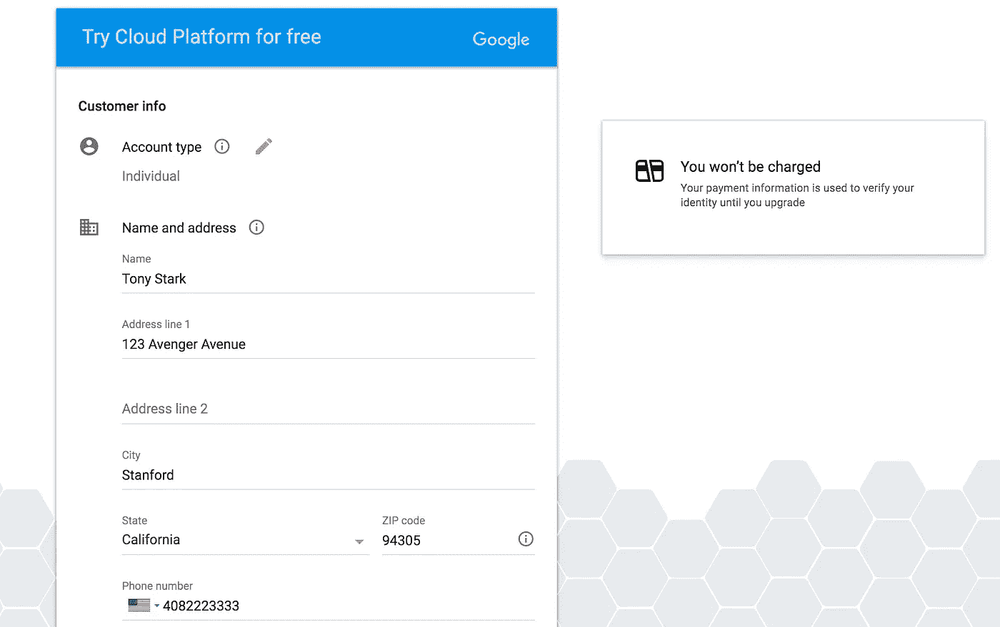
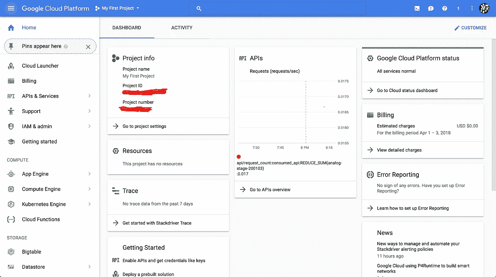
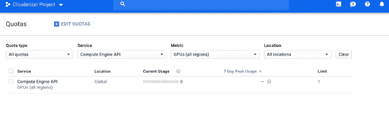
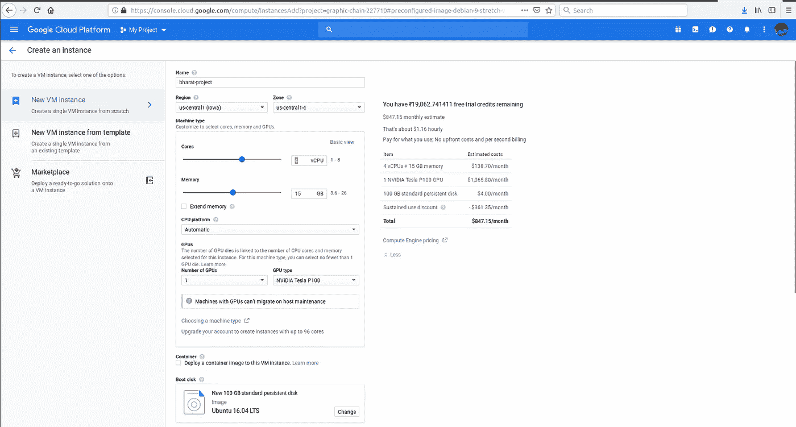
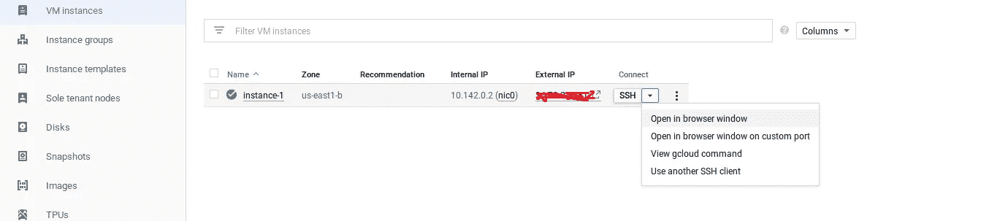
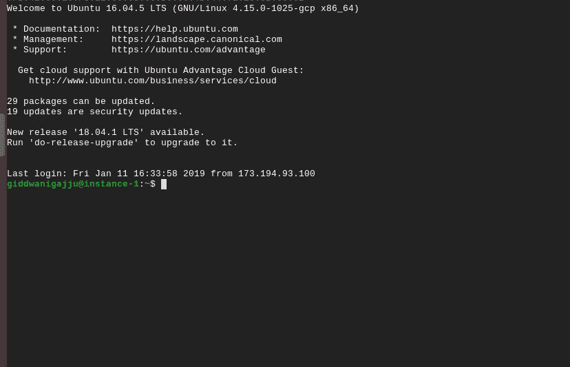

# 谷歌云:一个简单到令人惊叹的平台

> 原文：<https://towardsdatascience.com/google-cloud-an-easy-way-to-an-amazing-platform-1dc97c00ab9b?source=collection_archive---------12----------------------->

## 云是关于你如何计算，而不是你在哪里计算。— Paul Maritz，VMware 和 Pivotal 前首席执行官

> 免费免费使用您的谷歌云帐户的最佳描述方式..👽

# **为什么是云？**


[Telescope Desktop HD Wallpaper](https://hdwallsource.com/telescope-desktop-hd-wallpaper-51772.html)

所以你最终决定进入深度学习游戏，只是意识到在你的笔记本电脑上训练你的深度学习模型需要亿万年，因为要么你没有 GPU，所以你必须在 CPU 上训练你的模型，要么你甚至更不幸，只能用 AMD。不管怎样，我知道那种感觉，真的很糟糕😞

```
 Get your game on already, AMD!
```

# 现在最基本的问题！！什么是云计算？

[](https://www.google.co.in/url?sa=i&source=images&cd=&cad=rja&uact=8&ved=2ahUKEwjalof2zPnfAhWSA3IKHRUgDvsQjhx6BAgBEAM&url=https%3A%2F%2Fwww.cyberciti.biz%2Fhumour%2Fdad-what-are-clouds-made-of-in-it%2F&psig=AOvVaw07Ir7lMv3USskfbO2DSZVk&ust=1547978901470980)

Dad: What are clouds made of in IT? — nixCraft

在云计算中，建设和维护数据中心的资本投资被作为云“提供商”提供的弹性、类似公用事业的服务(包括存储、计算、网络、数据处理和分析、应用程序开发、机器学习，甚至完全托管的服务)来消费 IT 资源所取代。

## 谷歌云平台 300 美元免费积分——为深度学习学生提供难以置信的优惠:

朋友们好！😍

如果你是一名机器学习工程师/深度学习工程师/开发人员，还没有注册 GCP 帐户，你可以在[*这里*](https://cloud.google.com/free/) 从你的任何 gmail 帐户启用 GCP，并获得第一年 300 美元的免费点数(12 个月免费 wow gpu)。这个信用足够好，几乎 1000 小时的英伟达特斯拉 K80 图形处理器或英伟达特斯拉 P100 图形处理器！！

# 在我们开始之前

```
 # --BIG REMINDER: Make sure you stop your instances-
```

> 当你完成时，不要忘记停止你的实例(通过点击显示你的实例的页面顶部的停止按钮)，否则你将耗尽信用，这将是令人伤心的。😩

如果您正确遵循下面的说明，您应该能够重新启动实例，并且下载的软件仍然可用。

[](https://www.google.co.in/url?sa=i&source=images&cd=&cad=rja&uact=8&ved=2ahUKEwjT9vXbzPnfAhVBbn0KHUL8C6YQjhx6BAgBEAM&url=http%3A%2F%2Fcs231n.github.io%2Fgce-tutorial%2F&psig=AOvVaw2zc7K2U1HsiOklU1NpRTIx&ust=1547978468294767)

CS231n Stanford: Google Cloud Tutorial

# 创建和配置您的帐户:

如果你没有 Google cloud 账户，可以通过访问 Google Cloud [主页](https://cloud.google.com/free/)并点击计算来创建一个。当你进入下一页时，点击蓝色的免费试用按钮。如果您没有登录 gmail，您将会看到如下所示的页面。登录您的 gmail 帐户或创建一个新帐户如果您没有帐户，请填写所有必要的卡详细信息(您可以使用任何信用卡或借记卡(不包括 SBI)作为支付方式)。



在第一个选项中单击相应的“是”或“否”按钮，在阅读完所需的协议后，在第二个选项中选择“是”。按蓝色的同意并继续按钮进入下一页，输入所需信息(您的姓名、帐单地址和信用卡信息)。记住选择“个人”作为“账户类型”:



A dummy account 😘

输入所需信息后，请按蓝色的“开始我的免费试用”按钮。你会看到这样一个页面:Tan Tadha da dha👐— —现在你在你的谷歌云平台里了！！点击左上角以蓝色显示的谷歌云平台，它将带你进入主仪表盘:

```
 Dashboard will looks like
```



# 重要提示:

一些最近注册了 GCP 的用户，可以在开始他们的项目时看到这个错误:

```
 “Quota ‘GPUS_ALL_REGIONS’ exceeded. Limit: 0.0 globally."
```

> 请前往`Dashboard-> IAM & admin -> Quotas` - >搜索以下额度`GPUs (all region)`。



在情况限制，为这是 0，你需要通过点击`Edit Quotas`请求谷歌增加到 1 或任何你需要的值。

# 创建虚拟实例:

启动一个虚拟实例:-: `Compute Engine-> VM Instances-> Create`。

这将带你到一个页面，看起来像下面的截图。

> `(NOTE: Please carefully read the instructions in addition to looking at the screenshots. The instructions tell you generally what values I prefer to fill in :)).`



Create your VM Instance

名称:`xyz` - >区:`us-central-1-c` - >(点击自定义)CPU &内存大小:`4` - > GPU : `1 -Nvidia Tesla P100 or K80`(价格适中)- >点击`change`启动盘，选择`ubuntu 16.04`为默认，`100 GB disk size` - >勾选，选择允许 HTTP 流量和允许 HTTPS 流量- >最后按`Create`。

太棒了。您已经成功创建了您的`VM instance` -它将被永久固定，包含内部和外部 IP 地址(从这里您的 gpu 开始计算您的点数)。见下图截图



Instance is ready :)

# 几个命令行中最重要但最令人恐慌的设置:😁

现在设置您的谷歌云平台:

生成一个 VM 实例后→点击 SSH 附近的一个`key`作为圈出- > `open in browser window` - >一个 google `Active Cloud Shell`！！



“Google cloud shell”

> 以下是一系列命令行:用于设置你的谷歌云账户

```
$curl -O https://developer.download.nvidia.com/compute/cuda/repos/ubuntu1604/x86_64/cuda-repo-ubuntu1604_9.0.176-1_amd64.debsudo dpkg -i cuda-repo-ubuntu1604_9.0.176-1_amd64.deb$ sudo apt-get update
$ sudo apt-get install cuda-9-0$ sudo nvidia-smi -pm 1 
$ nvidia-smi $ wget "https://developer.download.nvidia.com/compute/machine-learning/repos/ubuntu1604/x86_64/libcudnn7_7.0.4.31 1+cuda9.0_amd64.deb" $ sudo dpkg -i libcudnn7_7.0.4.31-1+cuda9.0_amd64.deb $ echo 'export CUDA_HOME=/usr/local/cuda' >> ~/.bashrc
$ echo 'export PATH=$PATH:$CUDA_HOME/bin' >> ~/.bashrc
$ echo 'export LD_LIBRARY_PATH=/usr/local/cuda/extras/CUPTI/lib64:$LD_LIBRARY_PATH' >> ~/.bashrcsource ~/.bashrc $ sudo apt-get install python3-dev $ python3-pip libcupti-dev
$ sudo pip3 install tensorflow-gpu # this applies to all GPUs
$ sudo nvidia-smi -pm 1 $ python3import tensorflow as tf with tf.device('/cpu:0'):    
 a_c = tf.constant([1.0, 2.0, 3.0, 4.0], shape=[1, 3],name='a-cpu')   
 b_c = tf.constant([1.0, 2.0, 3.0, 4.0], shape=[3, 1], name='b-cpu')
 c_c = tf.matmul(a_c, b_c, name='c-cpu')

with tf.device('/gpu:0'):    
 a_g = tf.constant([1.0, 2.0, 3.0, 4.0], shape=[1, 3], name='a-gpu')
 b_g = tf.constant([1.0, 2.0, 3.0, 4.0], shape=[3, 1], name='b-gpu') 
 c_g = tf.matmul(a_g, b_g, name='c-gpu') with tf.Session(config=tf.ConfigProto(log_device_placement=True)) as sess:       print (sess.run(c_c))   
   print (sess.run(c_g)) 
print ('DONE!')
```

现在简单的说就是把每一个命令行复制粘贴到谷歌云终端，你会发现我们已经在他们的服务器上了，网速，流畅度都比你的本地机器好得多。

从最后两行开始，我已经在 google-cloud 中安装了“tensorflow-gpu ”,并在终端中进行了测试。

为了进一步的测试，我包含了从这段代码到我的 github 库的链接: [github](https://github.com/tarahb2103) : `[gpu_mnist_speedcheck.py](https://github.com/tarahb2103/Google-Cloud-An-Easy-Way-to-an-Amazing-Platform/blob/master/gpu/gpu_mnist_speedcheck.py)`:只要把代码复制到你的 gcp 引擎的终端，然后按 enter - tadha da🎉—现在你会发现，与本地机器相比，培训大约是 15 倍。

> **注意:**在这里你可以安装所有需要的库(比如 pytorch，mxnet 等。)你的深度学习项目想要什么就有什么。在完成您的培训模块后，请按 SSH 附近的`Stop`(在 3 个点上)来停止您的实例，以确保您的学分持续更长时间。

```
 Thank You Everyone  See you soon!
```