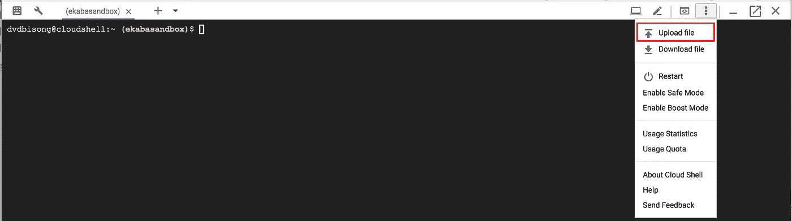

# 用于医学图像分类的谷歌云自动视觉

> 原文：<https://towardsdatascience.com/google-cloud-automl-vision-for-medical-image-classification-76dfbf12a77e?source=collection_archive---------3----------------------->

## 使用胸部 X 射线图像的肺炎检测


The normal chest X-ray (left panel) shows clear lungs without any areas of abnormal opacification in the image. Bacterial pneumonia (middle) typically exhibits a focal lobar consolidation, in this case in the right upper lobe (white arrows), whereas viral pneumonia (right) manifests with a more diffuse “interstitial” pattern in both lungs. (Source: Kermany, D. S., Goldbaum M., et al. 2018\. Identifying Medical Diagnoses and Treatable Diseases by Image-Based Deep Learning. Cell. [https://www.cell.com/cell/fulltext/S0092-8674(18)30154-5](https://www.cell.com/cell/fulltext/S0092-8674(18)30154-5))

Google Cloud AutoML Vision 简化了图像识别用例的自定义视觉模型的创建。在引擎盖下使用神经架构搜索和转移学习的概念来寻找最佳网络架构和使模型的损失函数最小化的最佳超参数配置。本文使用 Google Cloud AutoML Vision 开发了一个端到端的医学图像分类模型，用于使用胸部 X 射线图像进行肺炎检测。

# 目录

*   [使用胸部 x 光图像进行肺炎检测](https://medium.com/p/76dfbf12a77e#fdf2)
*   [关于数据集](https://medium.com/p/76dfbf12a77e#f2b1)
*   [第 1 部分:在 GCP 实现 AutoML 云愿景](https://medium.com/p/76dfbf12a77e#0ba2)
*   [第 2 部分:将数据集下载到 Google 云存储中](https://medium.com/p/76dfbf12a77e#b4bd)
*   [第 3 部分:为建模准备数据集](https://medium.com/p/76dfbf12a77e#cefd)
*   [第 4 部分:使用云自动视觉建模](https://medium.com/p/76dfbf12a77e#5fd4)
*   [第 5 部分:测试模型](https://medium.com/p/76dfbf12a77e#c62e)
*   [第 6 部分:结论](https://medium.com/p/76dfbf12a77e#e3a3)

# 关于数据集

数据集包含:

*   5232 张儿童胸部 x 光照片。
*   其中 3883 张是细菌性(2538 张)和病毒性(1345 张)肺炎的样本。
*   1349 个样本是健康的肺部 x 光图像。

数据集托管在 Kaggle 上，可通过[胸部 x 光图像(肺炎)](https://www.kaggle.com/paultimothymooney/chest-xray-pneumonia)访问。

# 第 1 部分:在 GCP 上实现 AutoML 云愿景

(1).去云端控制台:[https://cloud.google.com/](https://cloud.google.com/)


Google Cloud Homepage

(2).通过单击 GCP 仪表盘左上角的三点划线打开 Cloud AutoML Vision。选择人工智能产品部分下的视觉。


Open AutoML Vision

(3).选择自动视觉下的图像分类。


Image Classification under AutoML Vision

(4).设置项目 API、权限和云存储桶，以存储用于建模和其他资产的图像文件。


Setup Project APIs and Permissions

(5).询问时，从下拉列表中选择您的 GCP 帐单项目。现在我们准备创建一个数据集，用于在 AutoML 上构建定制分类模型。在将原始数据集从 Kaggle 下载到云存储并准备好用于 AutoML 建模的数据后，我们将返回这里。

在这种情况下，自动创建的桶被称为:g **s://ekabasandbox-vcm** 。

# 第 2 部分:将数据集下载到 Google 云存储中

(1).激活**云外壳**(红色圆圈中)以启动临时 VM 实例来存放从 Kaggle 下载的数据集，将其解压缩并上传到存储桶。


Activate Cloud Shell

(2).安装 Kaggle 命令行界面。这个工具将允许我们从 Kaggle 下载数据集。运行以下代码:

```
sudo pip install kaggle
```

但是，请注意，云外壳实例是短暂的，当会话结束时，它不会保存系统范围内的更改。此外，如果数据集特别大，还有其他选择，例如启动计算虚拟机，下载数据集，解压缩，然后上传到云存储。可以设计其他高级数据管道，将数据输入 GCP 进行分析/机器学习。

(3).下载 Kaggle API 令牌密钥，使 Kaggle CLI 能够针对 Kaggle 进行身份验证/授权，以下载所需的数据集。

*   登录您的 Kaggle 帐户。
*   转到:https://www . ka ggle . com/[ka ggle _ 用户名]/帐户
*   点击:创建新的 API 令牌。


Create API Token

*   将令牌下载到您的本地机器，并将其上传到云 shell。



*   将上传的`.json`键移动到目录`.kaggle`中。使用下面的代码:

```
mv kaggle.json .kaggle/kaggle.json
```

(4).从 Kaggle 下载数据集到 Google 云存储。

```
kaggle datasets download paultimothymooney/chest-xray-pneumonia
```

(5).解压缩下载的数据集

```
unzip chest-xray-pneumonia.zip
unzip chest_xray.zip
```

(6).将数据集从临时云外壳实例移动到创建的云存储桶。在此插入您的存储桶名称。

```
gsutil -m cp -r chest_xray gs://**ekabasandbox-vcm**/chest_xray/
```

# 第 3 部分:为建模准备数据集

(1).在谷歌云 AI 平台上推出 Jupyter 笔记本。


Notebooks of GCP AI Platform

(2).创建新的笔记本实例。


Start a new JupyterLab instance

(3).选择实例名称并创建。


Choose an instance name and create

(4).打开 JupyterLab


Open JupyterLab

(5).在使用 AutoML Cloud Vision 构建自定义图像识别模型之前，必须以特定格式准备数据集:

1.  对于训练，支持 JPEG、PNG、WEBP、GIF、BMP、TIFF 和 ICO 图像格式，每个图像的最大大小为 30mb。
2.  为了便于推断，JPEG、PNG 和 GIF 图像格式受支持，每张图像的最大大小为 1.5mb。
3.  最好将每个图像类别放入图像文件夹内的包含子文件夹中。例如，
    (图像目录)>(图像类别 1-子目录)——(图像类别 n-子目录)
4.  接下来，创建一个指向图像路径及其相应标签的 CSV。AutoML 使用 CSV 文件指向训练图像及其标签的位置。CSV 文件放在包含图像文件的同一个 GCS 存储桶中。使用配置 AutoML Vision 时自动创建的存储桶。在我们的例子中，这个桶被命名为 gs:// **ekabasandbox-vcm** 。

(6).从 Github 克隆预处理脚本。点击标有( **1)** 的红色圆圈图标，输入 Github URL[https://Github . com/dvdbisong/automl-medical-image-classification](https://github.com/dvdbisong/automl-medical-image-classification)，克隆带有预处理代码的 repo。


Clone preprocessing script

(7).运行笔记本`preprocessing.ipynb`中的所有单元格，创建包含图像路径和标签的 CSV 文件，并将该文件上传到云存储。务必更改`bucket_name`的参数。


Run notebook cells

# 第 4 部分:使用云自动视觉建模

(1).从 AutoML Vision 仪表板中单击“新建数据集”。


Create New Dataset

(2).填写数据集名称，并从 AutoML 创建的云存储桶中选择 CSV 文件。


Create Dataset

(3).现在，如果您看到错误消息“找到重复的文件”,您可以退出。据我所知，从文件名来看，情况并非如此。


Cloud AutoML Processed Images

(4).点击**列车**，如上图红色所示，启动 Cloud AutoML 建模。


Start AutoML Training

(5).选择模型的托管方式和培训预算。


Select training parameters

(6).模型训练完成后，单击“评估”查看模型的性能指标。


Evaluate model performance

(7).评估性能指标(精确度、召回率和混淆矩阵)。


Evaluation page. Left: Precision and Recall score. Right: Confusion matrix and precision, recall graphs

# 第 5 部分:测试模型

(1).点击**预测**标签来测试模型。


Predict model

(2).这里有一个测试的例子。该图像是胸部 x 射线扫描，并未用于训练模型。阅读本文的医学专家可以验证模型预测的准确性。


Model test

自定义图像识别模型也作为 REST 或 Python API 公开，用于集成到软件应用程序中，作为推断的预测服务。

# 第六部分:结论

本文提供了一个通过利用 Google 云平台 AutoML vision 为定制用例设计强大的 Vision 模型的演练。此外，模型托管在云上，作为预测服务进行推理。这是一种强大的机制，可以在决定是否继续进行更细粒度和/或手动调整的建模工作之前，快速原型化和构建图像分类或对象检测用例。有了这个，我相信它将作为一个模板，适用于你关心的视力问题。此外，确保删除不再需要的模型和数据集，这将节省云成本。

本文节选自 Apress (Springer Nature)出版的《在 Google 云平台上构建机器学习和深度学习模型》一书。