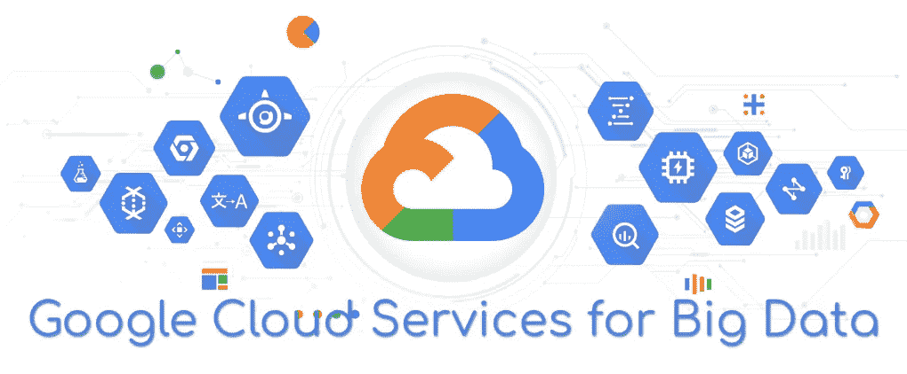

# 面向大数据的谷歌云服务

> 原文：<https://towardsdatascience.com/google-cloud-services-for-big-data-b9a657877ae2?source=collection_archive---------7----------------------->

## 在本文中，我们将回顾谷歌云服务，它可以帮助您构建伟大的大数据应用程序。

谷歌云平台提供了很多不同的服务，这些服务涵盖了数据和大数据应用的所有流行需求。所有这些服务都与其他谷歌云产品集成在一起，它们各有利弊。在本文中，我们将回顾 GCP 可以为数据和大数据应用提供哪些服务，这些服务有哪些作用，有哪些优势和局限性，每种服务的定价策略是什么，以及有哪些替代方案。

# 云发布订阅

Cloud PubSub 是一个消息队列代理，允许应用程序可靠、快速、异步地交换消息。基于发布-订阅模式。

Visualization of PubSub workflow

下图描述了 PubSub 的基本流程。发布者应用程序将消息发布到发布订阅主题；该主题向发布订阅发送消息；订阅存储消息；订阅者应用程序从订阅中读取消息。

## 利益

*   高可靠性通信层
*   大容量

## 局限性:

*   一封邮件的最大大小是 10 MB
*   10 MB 是一个请求的最大大小，这意味着如果我们需要为每个请求发送 10 条消息，每条消息的平均最大大小将是 1 MB。
*   最大属性值大小为 1 MB

## 定价策略:

您需要为传输的每 GB 数据付费。

## 类似物和替代品:

*   阿帕奇卡夫卡
*   兔子 q
*   亚马逊 SQS
*   Azure 服务总线
*   还有很多其他的开源消息代理

# 谷歌云物联网核心

Design of Cloud IoT Core

云物联网核心是一个物联网设备注册表。该服务允许将设备连接到谷歌云平台，从设备接收消息，并向设备发送消息。为了从设备接收消息，物联网核心使用 Google PubSub。

## 好处:

*   MQTT 和 HTTPS 传输协议
*   安全的设备连接和管理

## 定价策略:

您需要为通过这项服务传输的数据量付费。

## 类似物和替代品:

*   AWS 物联网核心
*   Azure 物联网

# 云数据探测器

Cloud Dataproc 是在 Google Cloud 中运行 Apache Spark 和 Apache Hadoop 的一种更快、更简单、更具成本效益的方式。Cloud Dataproc 是一个云原生解决方案，涵盖了与部署和管理 Spark 或 Hadoop 集群相关的所有操作。简单地说，使用 Dataproc，您可以创建一个实例集群，动态地改变集群的大小，配置它，并在那里运行 MapReduce 作业。

## 好处:

*   非常快速的部署
*   一个完全托管的服务，这意味着你只需要正确的代码，没有操作工作
*   动态调整集群的大小
*   自动缩放

## 局限性:

*   无法选择所用框架的特定版本
*   为了省钱，您不能暂停/停止数据处理集群，只能删除集群。这可以通过 Cloud Composer 来实现
*   您不能选择集群管理器，只能选择 YARN

## 定价策略:

您为每个使用的实例支付一些额外的费用。集群工作时，GCP 按分钟计费。

## 类似物和替代品:

*   在虚拟机上设置集群
*   亚马逊电子病历
*   Azure 高清洞察

# 云数据流

The place of Cloud Dataflow in a Big Data application

云数据流是一种托管服务，用于开发和执行广泛的数据处理模式，包括 ETL、批处理、流处理等。数据流用于构建数据管道。该服务基于 Apache Beam，支持 Python 和 Java 作业。

## 好处:

*   将批处理和流式处理与单个 API 相结合
*   非常快速的部署
*   一个完全托管的服务，没有运营工作
*   动态工作再平衡
*   自动缩放

## 局限性:

*   基于单一解决方案，因此继承了 Apache Beam 的所有限制
*   串流引擎中单个元素值的最大大小为 100 Mb

## 定价策略:

基于云数据流的实际使用，云数据流作业按每秒计费。

## 类似物和替代品:

*   在虚拟机上设置集群，并通过内置的 runner 运行 Apache Beam
*   据我所知，其他云提供商没有类似的产品

# 谷歌云数据准备

This is what the interface of Dataprep looks like

Dataprep 是一个可视化、探索和准备数据的工具。您可以构建管道来为不同的存储 ETL 您的数据。并在简单易懂的网络界面上完成。

例如，您可以使用 Dataprep 构建 ETL 管道，从 GCS 中提取原始数据，清理这些数据，转换成所需的视图，并将数据加载到 BigQuery 中。此外，您还可以安排每天/每周/等等的作业来运行新原始数据的管道。

## 好处:

*   简化 ETL 管道的构建
*   提供清晰有用的网络界面
*   为数据工程师自动化大量手工工作
*   内置调度程序
*   为了执行 ETL 工作，Dataprep 使用 Google Dataflow

## 局限性:

*   仅适用于 BigQuery 和 GCS

## 定价策略:

对于数据存储，您需要为数据存储付费。为了执行 ETL 作业，你需要为谷歌数据流付费。

# 云作曲家

Cloud Composer 是管理数据处理的工作流编排服务。Cloud Composer 是 Apache Airflow 的云接口。Composer 允许自动执行 ETL 作业，例如，可以创建 Dataproc 集群，对提取的数据执行转换(通过 Dataproc PySpark 作业)，将结果上传到 BigQuery，然后关闭 Dataproc 集群。

## 利益

*   填补了其他 GCP 解决方案的空白，比如 Dataproc
*   继承了阿帕奇气流的所有优势

## 局限性:

*   在公共 IP 地址上提供气流 web 用户界面
*   继承了阿帕奇气流的所有限制

## 定价策略:

您只需为部署了 Composer 的资源付费。但是编写器将被部署到 3 个实例。

## 类似物和替代品:

*   定制部署的阿帕奇气流
*   其他编排开源解决方案

# BigQuery

Example of integration BigQuery into a data processing solution with different front-end integrations

BigQuery 是一个数据仓库。

BigQuery 允许我们存储和查询海量数据集，高达数百 Pb。BigQuery 的结构是关系数据库非常熟悉的，它有表结构，使用 SQL，也支持批处理和流写入数据库，与所有 GCP 服务集成，包括数据流，Apache Spark，Apache Hadoop 等。它最适合用于交互式排队和离线分析。

## 好处:

*   巨大的容量，高达数百 Pb
*   结构化查询语言
*   批处理和流式写入
*   支持复杂查询
*   内置 ML(简单——目前很愚蠢)
*   无服务器
*   共享数据集-您可以在不同的项目之间共享数据集
*   全球位置
*   所有流行的数据处理工具都有 BigQuery 接口

## 局限性:

*   不支持事务，但是谁需要 OLAP 解决方案中的转换
*   该行的最大大小是 10Mb

## 定价策略:

您需要为存储的信息(每 Gb)和执行的查询分别付费。

对于已执行的查询，您可以选择两种支付模式中的一种，要么为每个已处理的 TB 付费，要么支付稳定的月费用。这取决于你的喜好。

## 类似物和替代品:

*   亚马逊红移
*   天蓝色宇宙数据库

# 云大表

谷歌云 BigTable 是谷歌的 NoSQL 大数据数据库服务。这是支持许多核心谷歌服务的同一个数据库，包括搜索、分析、地图和 Gmail。Bigtable 旨在以一致的低延迟和高吞吐量处理大量工作负载，因此它是运营和分析应用程序的绝佳选择，包括物联网、用户分析和金融数据分析。

基于 Apache HBase 的云 Bigtable。

这个数据库有非常大的容量，如果你有超过万亿字节的数据，建议使用。BigTable 最适合时序数据，物联网数据。

## 利益

*   在 1Tb 或更多数据上具有良好的性能
*   无需停机即可调整集群大小
*   难以置信的可扩展性
*   Apache HBase 的支持 API

## 局限性:

*   在小于 300 Gb 的数据上性能非常差
*   不适合实时
*   不支持酸性操作
*   单个值的最大大小为 100 Mb
*   一行中所有值的最大大小为 256 Mb
*   每个节点的硬盘最大容量为 8 Tb
*   群集中最少 3 个节点

## 定价策略:

BigTable 非常昂贵。您需要为节点(每个节点每小时最低 0.65 美元)和存储容量(每月每 TB 最低 26 美元)付费

## 类似物和替代品:

*   定制部署的 Apache HBase

# 云存储

Description of different options of GCS

GCS 是文件的 blob 存储。您可以在那里存储任意数量、任意大小的文件。

## 好处:

*   适用于所有流行编程语言和操作系统的良好 API
*   不可变文件
*   文件的版本
*   适合任何大小的文件
*   适合任何数量的文件
*   等等

## 定价策略:

GCS 有几个定价计划。在标准计划中，您需要为 1Gb 的存储数据付费。

## 类似物和替代品:

*   亚马逊 S3
*   Azure Blob 存储

# 其他谷歌云服务:

还有几个服务，我不得不提到。

1.  **谷歌云计算引擎**为虚拟机提供任何性能容量。
2.  **Google CloudSQL** 是一个托管 MySQL 和 PostgreSQL 数据库的云原生解决方案。内置纵向和横向扩展、防火墙、加密、备份以及使用云解决方案的其他优势。有万亿字节的容量。支持困难的查询和交易
3.  **Google Cloud Spanner** 是一个完全托管的、可扩展的关系数据库服务。支持 SQL 查询，自动复制，事务。它有十亿字节的容量。最适合大规模数据库应用程序，这种应用程序存储的数据超过数 TB。这是一个 OLTP 数据库。
4.  **Google StackDriver** 正在监控 Google 服务和基础设施，以及托管在 GCP 的应用程序。
5.  **云数据实验室**是一种可视化和探索数据的方式。该服务提供了一种云本地方式来托管 Python Jupiter 笔记本。
6.  **Google Cloud AutoML** 和 **Google AI 平台**允许以最小的努力训练和托管高质量的定制机器学习模型。

# 结论

现在，您已经熟悉了 GCP 提供的主要数据服务。这些知识可以帮助您构建良好的数据解决方案。当然，云不是万能的，如果你使用云的方式不对，它会影响你每月的基础设施账单。

因此，非常仔细地构建您的提案的架构，并根据您的需求选择必要的服务，以达到所需的业务目标。探索每个特定案例的所有优点和局限性。关心成本。当然，还要记住解决方案的可伸缩性、可靠性和可维护性。

# 有用的链接:

如果您想了解更多信息，可以查看以下内容:

*   谷歌大数据产品[https://cloud.google.com/products/big-data/](https://cloud.google.com/products/big-data/)
*   谷歌大数据解决方案[https://cloud.google.com/solutions/big-data/](https://cloud.google.com/solutions/big-data/)
*   QwikLabs 上的数据工程实验室:[https://www.qwiklabs.com/quests/25](https://www.qwiklabs.com/quests/25)
*   Coursera 上的谷歌数据工程课程:[https://www . Coursera . org/professional-certificates/GCP-Data-Engineering # courses](https://www.coursera.org/professional-certificates/gcp-data-engineering#courses)
*   大数据架构示例[https://gcp.solutions/workload/Big%20Data](https://gcp.solutions/workload/Big%20Data)