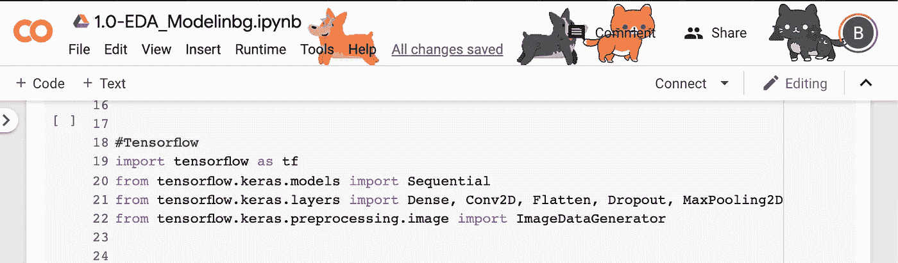
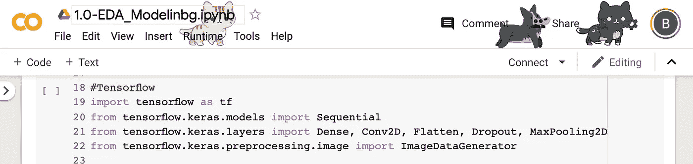

# Google Colab:类固醇上的 Jupyter 实验室(完美的深度学习)

> 原文：<https://towardsdatascience.com/google-colab-jupyter-lab-on-steroids-perfect-for-deep-learning-cdddc174d77a?source=collection_archive---------13----------------------->

## 加上可爱的动画柯基犬和猫在你的笔记本上

Corgis and Cats on Google Colab

> 躲在付费墙后面？点击此处[阅读带我朋友链接的文章。](/google-colab-jupyter-lab-on-steroids-perfect-for-deep-learning-cdddc174d77a?source=friends_link&sk=d8f48d229957c4e4259bd861bdb9bfbf)

我正在做一个深度学习项目，需要在几周内完成。不幸的是，我可怜的 MacBook 很难处理我所有的项目数据和我在 Jupyter 实验室生成的复杂模型，这延误了我的整个项目。

[Google Colaboratory，更广为人知的名字是 Google Colab](https://colab.research.google.com/) ，是一个免费的*“类似于 Jupyter 实验室”*的环境，你猜对了，是由 Google 提供支持的。而且它有很多优点，会让你的下一个机器学习项目更快。

自从我将我的项目迁移到 Google Drive + Google Colab 环境中，我一直在加快速度。Google Colab 提供了一个**免费的特斯拉 K80 GPU** 在云上运行。这是我的新小秘密，我将与你分享。

# 优势

*注意:如果你不关心所有的功能优势，你想知道的只是如何让柯基犬和猫出现，请转到选择的末尾。*

*   它使用 Python 2 和 3 执行所有 Jupyter Notebook 执行的任务和代码。
*   它是**代码**的谷歌文档。不同的团队成员可以实时共享和编辑笔记本，添加评论，查看版本历史，并返回到以前的版本，就像在谷歌文档中一样。
*   不再有蟒蛇。它完全基于云，不需要任何主要设置或安装。如果您想要使用的库不在 Colab 上，就像往常一样 pip 它。安装在虚拟环境中。
*   **选择硬件加速器**。在 GPU 或 TPU 上根据您的需要运行您的笔记本。
*   **代码片段集成:**一个预收费的代码库，可以尝试几种特定的解决方案。(如相机激活、可视化、集成等。).这在学习机器学习的时候特别好。
*   **不再疯狂滚动。**目录始终可见。
*   **个性化。添加您自己的快捷键、夜间/灯光/自适应模式和字体。**
*   **游乐场模式。点击两下，你就可以打开一个不会被保存的新笔记本，并在不影响原有代码的情况下尝试不同的代码选项。**

*   **柯基犬和猫模式。**换成这个模式，全速编码，看看会发生什么。

*fast speed

# **集成**

*   **表格**。类似于 Google Forms，这个功能相当新。它支持带类型检查的多种类型的字段，包括滑块、日期选择器、输入字段和允许输入的下拉菜单，就在笔记本中。
*   **栈溢出。**只需突出显示您有问题的代码，然后将其堆叠起来。
*   **GitHub 上的代码要点**(你的代码截图)。
*   **GitHub。**不再有 git 添加、提交、推送…

# 不足之处

*   一个大的:**不离线运行。**
*   当虚拟机关闭时，没有从 Google Drive 装载就导入到环境中的数据集将会丢失。

*你怎么看待 Google Colab？如果你愿意尝试，请在评论中告诉我！*