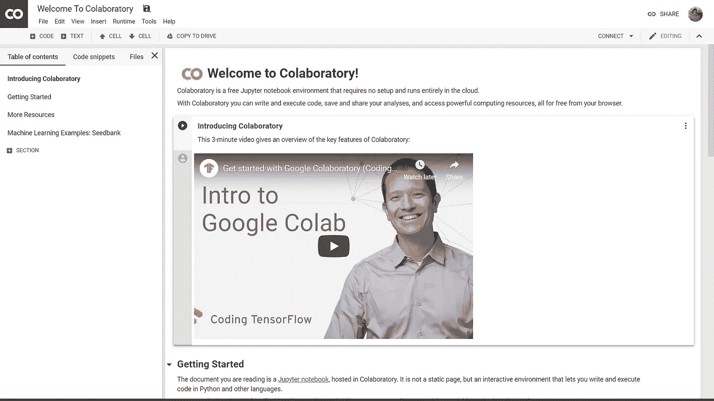
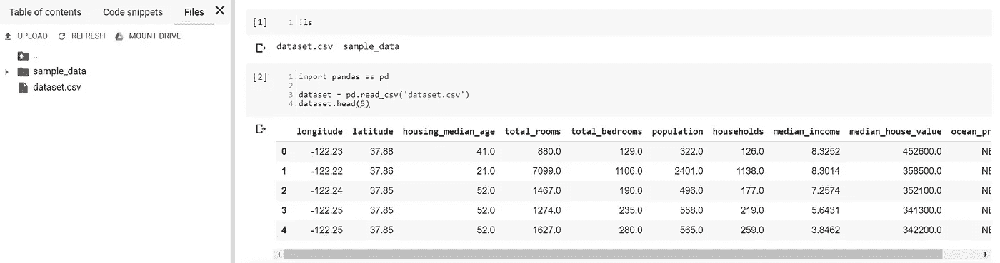
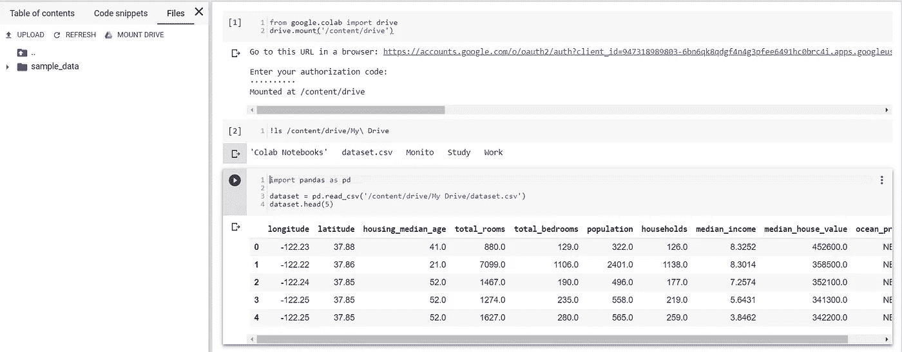
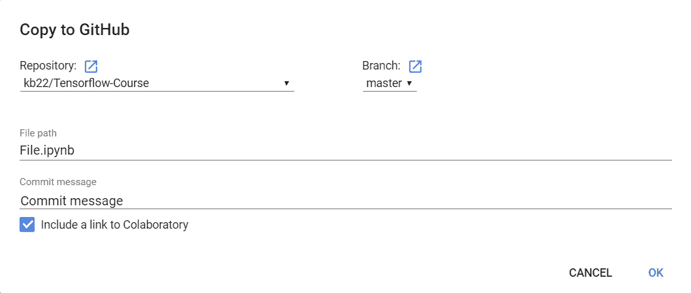
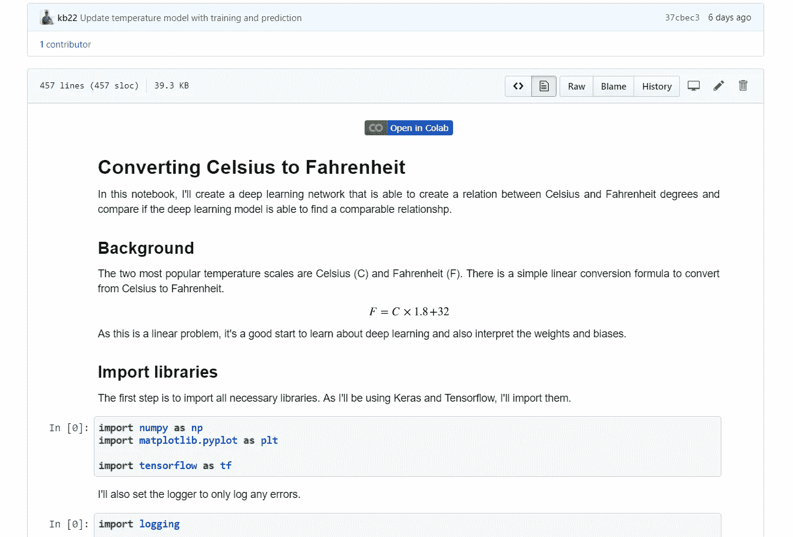
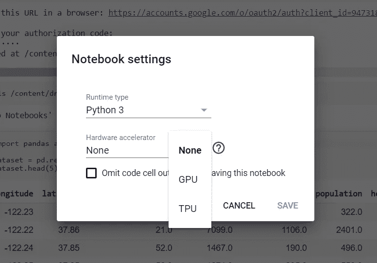
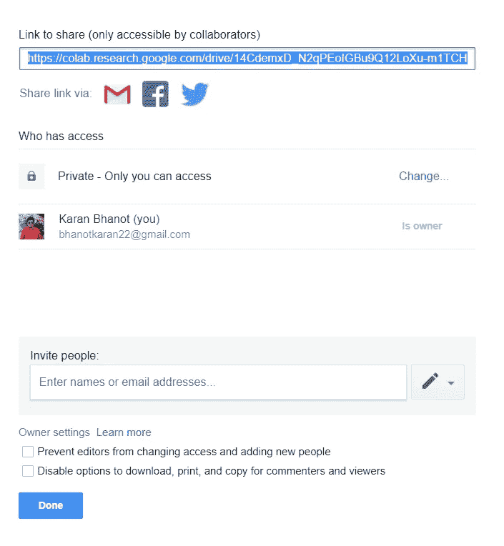

# Google Colab——您在云上的 Python 工作空间

> 原文：<https://towardsdatascience.com/google-colab-your-python-workspace-on-cloud-c3aed424de0d?source=collection_archive---------16----------------------->

## 了解 Google Colab

Photo by [Kaitlyn Baker](https://unsplash.com/@kaitlynbaker?utm_source=medium&utm_medium=referral) on [Unsplash](https://unsplash.com?utm_source=medium&utm_medium=referral)

今天我换了一个新的机器来开发。虽然有一个学习曲线来适应新机器，但我仍然可以继续我的项目，并通过 Google Colab 继续我的在线课程。这实际上就像登录我的谷歌账户一样简单，我已经准备好了。

因此，我决定分享我的见解，为什么我觉得 Google Colab 如此有用，以及帮助我更有效地使用它的命令。

# Google Colab 是什么？

Google Colab introductory notebook

Google Colab，也称为 Colaboratory，是一个由 Google 提供和支持的 Jupyter 环境，可以选择与 CPU、GPU 甚至 TPU 一起工作。它就像任何其他的 Jupyter 笔记本一样，我们可以用 Python 编写代码，并以 markdown 的形式编写描述，以及所有其他的 Jupyter 功能等等。

顶部包括保存笔记本、将笔记本共享到 GitHub 库、更改运行时环境、运行单元等所有控件。底部分为左面板，包括目录和文件，右边是完整的功能笔记本。

# 为什么选择 Google Colab？

Photo by [freestocks.org](https://unsplash.com/@freestocks?utm_source=medium&utm_medium=referral) on [Unsplash](https://unsplash.com?utm_source=medium&utm_medium=referral)

虽然有很多原因可以解释为什么人们更喜欢使用 Google Colab 这样的服务来工作，但以下是它对我有用的原因:

1.  **GitHub 集成:**虽然笔记本保存在我们的 Google drive 中，但我更愿意分享一些笔记本，作为他们自己的 GitHub 存储库的一部分。Google Colab 允许在链接我们的 GitHub 配置文件后直接共享到任何存储库。
2.  **零设置时间:**要开始使用 Google Colab，你只需进入[https://colab.research.google.com/](https://colab.research.google.com/)并从弹出菜单中选择`NEW PYTHON 3 NOTEBOOK`。
3.  **平台独立性:**由于 Jupyter 笔记本可以直接从浏览器访问，我们可以使用任何机器，Mac、Windows、Linux 等。它会完全一样的工作。
4.  **免费资源可用性:**深度学习的训练模型需要大量的能力，因此，并非所有的笔记本电脑和台式机都配备了这种能力。Google Colab 提供对 GPU 的免费访问，我们可以利用它来完成深度学习任务。

# 探索 Google Colab

现在我们已经了解了 Google Colab 是什么，以及它为每个人带来了多少好处，让我们来探索几个关键的重要方面。这些确实帮助我提高了工作效率，让我的工作更容易理解。

## 快速键盘快捷键

在细胞间移动很容易。你只需要使用键盘上的`UP`和`DOWN`箭头键。要开始编辑单元格，只需按下`Enter`。要退出编辑单元格，只需按下`Esc`。

已经有一些预定义的键盘快捷键可供您使用。一些最基本的包括运行单元格的`Shift + Enter`、`Ctrl + M Y`将单元格转换为代码单元格、`Ctrl + M M`将单元格转换为文本单元格等等。你可以通过`Tools > Keyboard shortcuts...`获得完整的列表，你可以根据自己的喜好定制和更改快捷方式。

除了预定义的快捷方式，我还根据自己的需要定制了另外两个快捷方式。由于处理单元格的快捷方式以`Ctrl + M`的组合开始，我决定在配置自己的快捷方式时保持不变。为了创建新的代码单元，我创建了快捷键`Ctrl + M C`。为了创建新的文本单元格，我创建了快捷键`Ctrl + M T`。

存在类似的快捷方式，也可以使用`Command Key`为 Mac 进行配置。

## 加载数据集

Google Colab 允许我们通过多种方式访问我们的数据集。

**上传数据集** 在左侧面板，选择`Files`标题。选择选项`Upload`并选择数据集文件。

dataset.csv uploaded and being read through pandas

但是，这些文件在运行时刷新时会被删除，所以如果运行时由于某种原因没有完成任务就崩溃了，您将不得不再次上传它们。

**从 Google drive 加载数据集** 其次，我们可以导入已经保存在 Google drive 中的数据集。这是有益的，因为如果笔记本崩溃，我们不需要再次上传数据集。

要安装 Google drive，我们使用以下代码:

运行这段代码时，会提供一个链接，允许我们登录到我们的帐户，并提供一个授权令牌，需要在提供的空间中输入该令牌才能工作。这使我们能够使用`/content/drive`中的`My Drive`文件夹访问 Google drive 的内容。

Loading dataset from Google drive

## 保存到 GitHub 存储库

对我来说，最吸引人和最有用的特性之一是 Google Colab 和 GitHub 之间的集成。我更喜欢在 Jupyter 笔记本上工作，并将我的工作保存到我的帐户中的特定 GitHub 存储库中。Google Colab 使整个过程变得简单易用。

从`File`菜单中，我们选择`Save a copy in GitHub...`选项。它会打开一个链接我们的 GitHub 帐户的屏幕，这是一个一次性的过程，之后，我们会看到另一个弹出窗口。我们可以选择存储库、分支、文件名和提交消息。就这么简单！！

Save notebook to GitHub

我们还可以在 GitHub 资源库中添加一个指向该笔记本的链接，这样任何人在 GitHub 上查看该笔记本都可以快速进入工作状态。

Open in Colab option in the notebook saved via Google Colab

## 更改运行时类型

如果你曾经处理过深度学习模型，你就会理解 GPU 在提高训练速度方面可以发挥的作用。Google Colab 提供了为我们添加 GPU/TPU 的选项，完全免费。这使得我们能够以更高的速度训练我们的深度学习模型。

从`Runtime`菜单中，选择`Change runtime type`。在硬件加速器下，我们可以选择`None`继续使用 CPU，或者根据需要将运行时间改为`GPU`或`TPU`。

Select between various hardware acceleration options

单击`SAVE`后，运行时将会刷新，您会注意到在右上角会出现`CONNECTING`，表示我们现在正在激活新的运行时类型。

## 共享 Colab 笔记本

另一个重要特征是与世界分享我们的工作。Google Colab 右上角的共享选项允许我们选择一个电子邮件地址列表来共享笔记本，或者只是获得一个可共享的链接。

Sharing the notebook

# 结论

Google Colab 是一个很好的方式来跟上你的工作，并随时随地访问它。它有许多功能，如创建简单的快捷方式，共享和保存笔记本等。

您可能还喜欢:

 [## 使用 GitHub API 的 GitHub 用户洞察—数据收集和分析

### 探索 GitHub API

towardsdatascience.com](/github-user-insights-using-github-api-data-collection-and-analysis-5b7dca1ab214)  [## 在 Kaggle 上使用 CNN 进行深度学习以识别疟疾细胞

### 医学领域的深度学习

towardsdatascience.com](/deep-learning-to-identify-malaria-cells-using-cnn-on-kaggle-b9a987f55ea5)  [## 让我们使用 LDA 构建一个文章推荐器

### 基于搜索查询推荐文章

towardsdatascience.com](/lets-build-an-article-recommender-using-lda-f22d71b7143e)  [## 使用 Flask、Flask RESTPlus 和 Swagger UI 处理 API

### Flask 和 Flask-RESTPlus 简介

towardsdatascience.com](/working-with-apis-using-flask-flask-restplus-and-swagger-ui-7cf447deda7f) 

请分享你的想法、观点和建议。我很乐意收到你的来信。