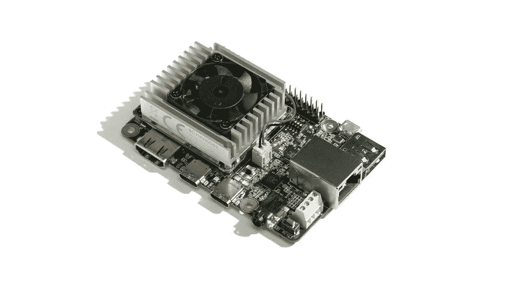
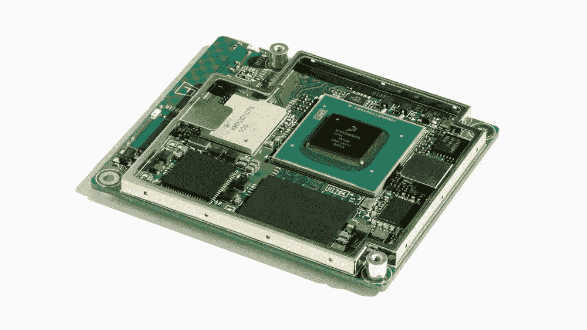
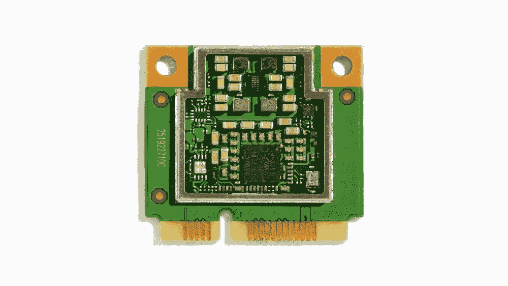
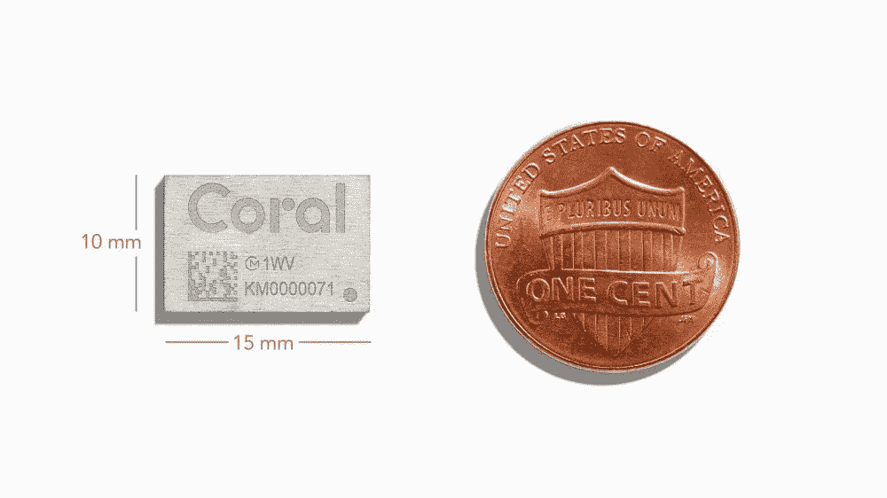
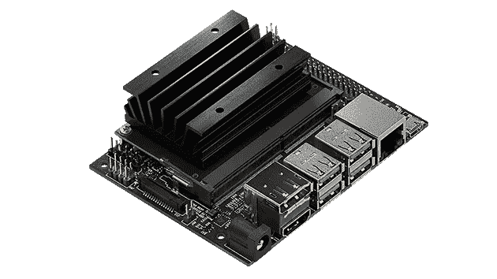
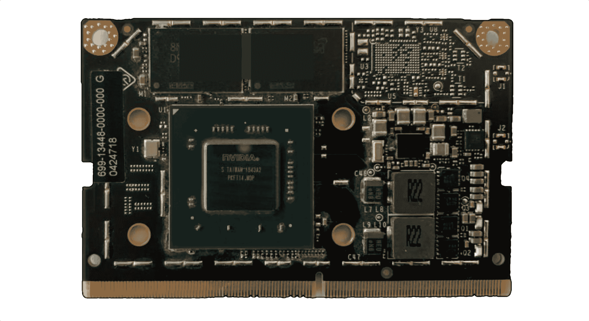
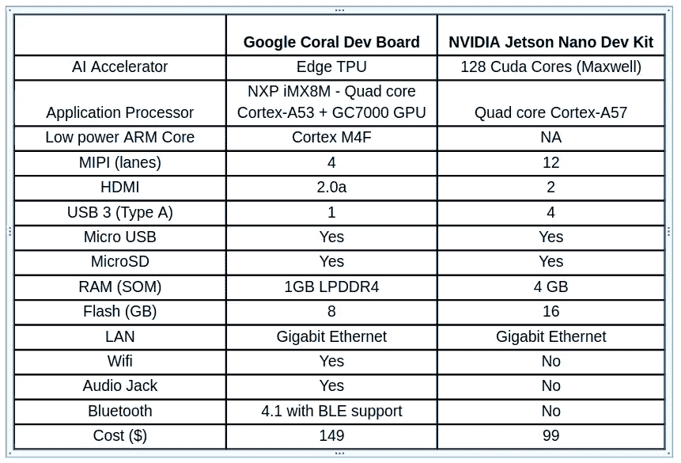
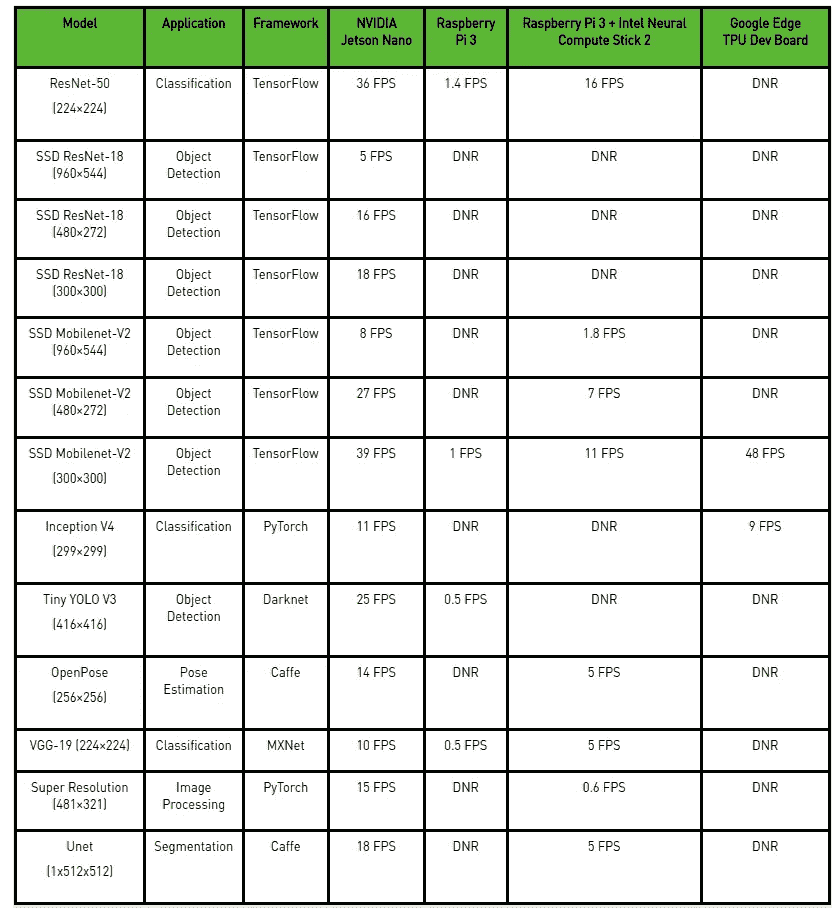
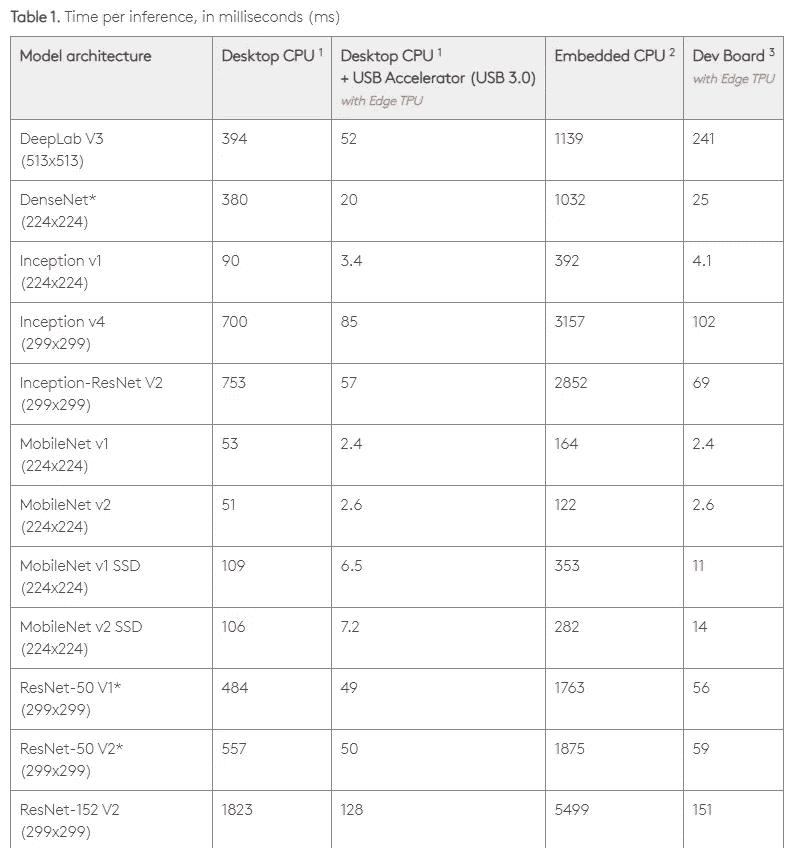

# Google Coral Edge TPU 主板与 NVIDIA Jetson Nano 开发主板—硬件比较

> 原文：<https://towardsdatascience.com/google-coral-edge-tpu-board-vs-nvidia-jetson-nano-dev-board-hardware-comparison-31660a8bda88?source=collection_archive---------2----------------------->

NVidia 和 Google 最近都发布了针对 EdgeAI 的开发板，并以一定的价格吸引了开发者、制造商和爱好者。两个开发板主要用于推理，但支持有限的迁移学习再培训。边缘 TPU 使用[重量印记](https://arxiv.org/pdf/1712.07136.pdf)技术支持[转移学习训练](https://coral.withgoogle.com/docs/edgetpu/retrain-classification-ondevice/)。这两个开发套件都包含一个 SOM(模块上系统),连接到一个开发板，开发板上有各种连接器，如 USB、以太网、microSD 插槽等。这是两个开发套件的硬件比较，这两个套件可以用作单板计算机(SBC)而不是 Edge TPUu 盘。如果你不想阅读整篇文章，在我看来，Coral Edge 开发套件的性价比略高，因为它包括 Wifi 和蓝牙等基本外设，但 Jetson Nano 具有更好的软件支持(INT8 和 FP16 推理)。

**珊瑚缘 TPU 发展局**

整个套件的尺寸为-88 毫米 x 60 毫米 x 22 毫米，而 [SOM](https://coral.ai/products/som) 的尺寸仅为-48 毫米 x 40 毫米 x 5 毫米。因此人们还可以设计自己不同外形的基板，并连接到 SOM。该板只带有一个 u-boot 引导加载程序，以后人们可以像 Mendel linux 一样加载一个[映像](https://coral.withgoogle.com/docs/dev-board/get-started/)。几个例子/教程[这里](https://coral.withgoogle.com/examples/)。此处提供了电路板的预培训模型[。](https://coral.withgoogle.com/models/)

Coral SOM 上的恩智浦 iMXM 处理器还配有 Vivante GC7000 lite 图形 GPU，它能用于图形以外的其他用途吗？详细规格—[https://coral.withgoogle.com/docs/dev-board/datasheet/](https://coral.withgoogle.com/docs/dev-board/datasheet/)

在这里购买—[https://coral.withgoogle.com/products/dev-board](https://coral.withgoogle.com/products/dev-board)

Image from — [https://coral.withgoogle.com/products/dev-board/](https://coral.withgoogle.com/products/dev-board/)

[Edge TPU SOM](https://coral.ai/products/som) 现在售价 114.99 美元，只有 Edge TPU(不含恩智浦处理器)作为[迷你 PCIe](https://coral.withgoogle.com/products/pcie-accelerator) 、 [M.2 A+E 键](https://coral.withgoogle.com/products/m2-accelerator-ae)和 [M.2 B+M 键](https://coral.withgoogle.com/products/m2-accelerator-bm)出售，每个售价 34.99 美元。

Edge TPU SOM — [Source](https://coral.ai/products/som)

Edge TPU Mini PCIe card — [Source](https://coral.withgoogle.com/products/pcie-accelerator)

不久，Edge TPU 将作为可焊接在板上的 MCM(多芯片模块)上市，MCM 包含 Edge TPU 芯片和用于电源管理的 PMIC(电源管理集成电路)。Edge TPU 可以以 2 TOPS/watt 执行 4 TOPS。

Edge TPU MCM — [Source](https://coral.ai/products/accelerator-module)

**NVIDIA Jetson Nano 开发套件**

像这里的珊瑚板一样，也有一个 SOM 连接到基板上。Jetson SOM 稍大一些，为 69.6 毫米 x 45 毫米。该板采用基于 Ubuntu 18.04 的环境。根据 NVidia [文档](https://developer.nvidia.com/embedded/develop/hardware) Nano 可以做到 472 GFLOPs(每秒千兆次浮点运算)并支持 5W 和 10W 功耗模式。

详细规格—[https://www . NVIDIA . com/en-us/autonomous-machines/embedded-systems/jetson-nano/](https://www.nvidia.com/en-us/autonomous-machines/embedded-systems/jetson-nano/)

在此购买—[https://www . NVIDIA . com/en-us/autonomous-machines/embedded-systems/jetson-nano/](https://www.nvidia.com/en-us/autonomous-machines/embedded-systems/jetson-nano/)

NVidia Jetson Dev kit — [https://www.nvidia.com/en-us/autonomous-machines/embedded-systems/jetson-nano/](https://www.nvidia.com/en-us/autonomous-machines/embedded-systems/jetson-nano/)

Jetson SOM — [https://blog.hackster.io/introducing-the-nvidia-jetson-nano-aaa9738ef3ff](https://blog.hackster.io/introducing-the-nvidia-jetson-nano-aaa9738ef3ff)

**比较**

下面是两种主板硬件特性的比较

*Coral Edge 主板未来将提供 2GB 和 4GB RAM 选项。*

# 表演

Nvidia 提供了 Jetson Nano 与其他 SBC 的一些性能比较，如 Raspberry Pi 3、Google Coral Edge TPU 板—[https://devblogs.nvidia.com/jetson-nano-ai-computing/](https://devblogs.nvidia.com/jetson-nano-ai-computing/)

Data from — https://devblogs.nvidia.com/jetson-nano-ai-computing/

在上述结果中，Jetson Nano 使用了 FP16 precision。

上面给出的 Coral Edge TPU 板的结果很少，因为它不能运行未使用训练后量化或[量化感知训练](https://coral.withgoogle.com/docs/edgetpu/models-intro/)为 Edge TPU 编译的预训练模型。谷歌提供了一些相对于桌面 CPU 的[对比](https://coral.withgoogle.com/docs/edgetpu/benchmarks/)(64 位英特尔至强黄金 6154 CPU @ 3.00GHz) 性能以及使用嵌入式 CPU 时的*四核 Cortex-A53 @ 1.5GHz)*

Edge TPU Benchmark — [Source](https://coral.withgoogle.com/docs/edgetpu/benchmarks/)

更多结果在这里—[https://github.com/jolibrain/dd_performances](https://github.com/jolibrain/dd_performances)

还有[https://www.phoronix.com/scan.php?page=article&item = NVIDIA-jetson-nano&num = 3](https://www.phoronix.com/scan.php?page=article&item=nvidia-jetson-nano&num=3)

# **结论**

在我看来，珊瑚边 TPU 开发局更好，因为以下原因—

1.售价 149 美元的 Coral dev board 比 Jetson Nano(99 美元)略贵，但它支持 wifi 和蓝牙，而 Jetson Nano 则需要购买外部 Wifi 加密狗。

2.此外，coral 板上的恩智浦 iMX8 SOC 包括一个视频处理单元和一个 Vivante GC700 lite GPU，可用于传统的图像和视频处理。它还有一个 Cortex-M4F 低功耗微控制器，可用于与温度传感器、环境光传感器等其他传感器通信。更多传感器点击此处—[http://light sensors . blogspot . com/2014/09/collection-of-variable-sensors . html](http://lightsensors.blogspot.com/2014/09/collection-of-various-sensors.html)

Jetson 也有视频编码器和解码器单元。此外，Jetson Nano 对其他深度学习框架有更好的支持，如 [Pytorch](https://github.com/NVIDIA-AI-IOT/torch2trt) 、MXNet。它还支持 NVidia TensorRT 加速器库进行 FP16 推理和 INT8 推理。Edge TPU 板仅支持 8 位量化 Tensorflow lite 模型，您必须使用[量化感知训练](https://github.com/tensorflow/tensorflow/tree/r1.13/tensorflow/contrib/quantize#quantization-aware-training)。

我对边缘应用的深度学习感兴趣，我在 [NLP](https://blog.insightdatascience.com/using-transfer-learning-for-nlp-with-small-data-71e10baf99a6) ，计算机视觉和[可扩展系统](https://heartbeat.fritz.ai/building-production-machine-learning-systems-7eda2fda0cdf)方面有经验，如果你正在招聘，你可以在这里联系我[。](https://www.linkedin.com/in/manusuryavansh/)

**附加有用链接**

 [## 如何自制深度学习加速器芯片！

### 目前，全世界有 100 多家公司在制造 ASIC(专用集成电路)

towardsdatascience.com](/how-to-make-your-own-deep-learning-accelerator-chip-1ff69b78ece4)  [## 机器学习边缘设备:基准报告| Tryolabs 博客

### 人类正在产生和收集比以往更多的数据。我们的口袋里有便于创作的设备…

tryolabs.com](https://tryolabs.com/blog/machine-learning-on-edge-devices-benchmark-report/)  [## 边缘 TPU:谷歌珊瑚 USB 加速器的实践

### 什么是 Edge AI，为什么它很重要？

heartbeat.fritz.ai](https://heartbeat.fritz.ai/edge-tpu-google-coral-usb-accelerator-cf0d79c7ec56)  [## 使用 Coral Dev Board、Edge TPU 和 TensorFlow Lite 构建离线工作的人工智能

### 由 TensorFlow Lite 的开发者倡导者 Daniel Situnayake (@dansitu)发布。

medium.com](https://medium.com/tensorflow/build-ai-that-works-offline-with-coral-dev-board-edge-tpu-and-tensorflow-lite-7074a9fd0172)  [## Google Coral Edge TPU vs NVIDIA Jetson Nano:深入了解 EdgeAI 性能

### 新的谷歌珊瑚边缘 TPU 和英伟达杰特森纳米之间的快速和肮脏的比较，稍微深入到…

blog.usejournal.com](https://blog.usejournal.com/google-coral-edge-tpu-vs-nvidia-jetson-nano-a-quick-deep-dive-into-edgeai-performance-bc7860b8d87a)