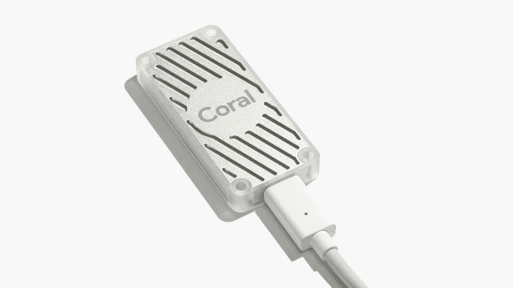
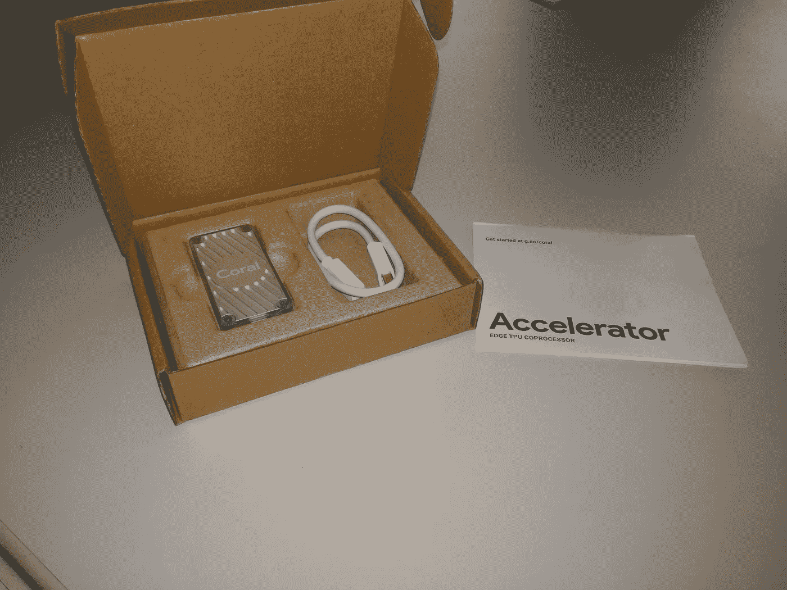
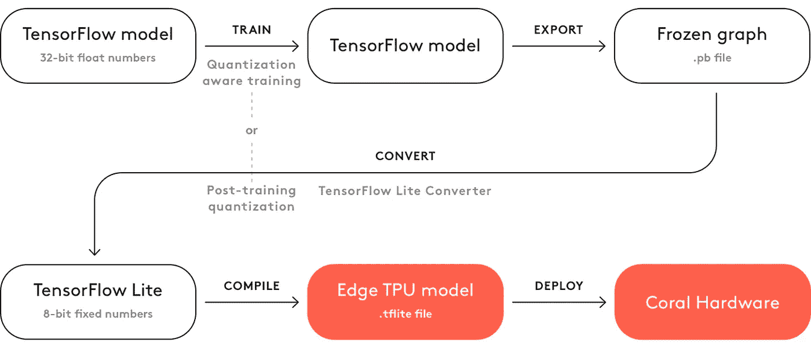

# 谷歌珊瑚 USB 加速器游戏攻略

> 原文：<https://towardsdatascience.com/google-coral-usb-accelerator-introduction-18989a962d25?source=collection_archive---------8----------------------->

## 在小型设备中加速机器学习模型



[Coral USB Accelerator](https://coral.withgoogle.com/products/accelerator/)

去年在谷歌 Next T1 大会上，谷歌宣布他们正在围绕他们在 T4 的 Edge TPUs T5 在 T2 制造两款新的硬件产品 T3。他们的目的是允许边缘设备，如 [Raspberry Pi](https://www.raspberrypi.org/) 或其他微控制器，通过允许它们在自己的硬件上本地运行预训练的 [Tensorflow Lite](https://www.tensorflow.org/lite) 模型的推理，来利用人工智能应用的能力，如图像分类和对象检测。这不仅比拥有服务于机器学习请求的云服务器更安全，而且还可以大大减少延迟。

# 珊瑚 USB 加速器

Coral USB 加速器的尺寸为 65x30x8mm 毫米，比其竞争对手英特尔 Movidius 神经计算棒略小。起初，这似乎不是什么大问题，但如果你考虑到英特尔棒往往会阻塞附近的 USB 端口，使其难以使用外设，这就非常重要了。
Coral USB 加速器售价为 60€(之前为 75€)，可通过网站订购，包括:

*   [鼠标](https://www.mouser.com/ProductDetail/Coral/G950-01456-01?qs=sGAEpiMZZMve4%2FbfQkoj%252BNzzHFZgWGqIphwvwTL5xvk%3D)
*   [参见](https://www.seeedstudio.com/Coral-USB-Accelerator.html)
*   [亚马逊](https://www.amazon.com/dp/B07S214S5Y)

在硬件方面，它包含一个边缘张量处理单元(TPU)，以相对较低的功耗为深度学习模型提供快速推理。



Figure 1: Box contains the USB Accelerator, USB Type-C to USB 3 Adapter and a simple getting started instruction

USB 加速器适用于以下操作系统之一:

*   Linux Debian 10 或其衍生版本(如 Ubuntu 18.04 或 Raspbian)
*   安装了 MacPorts 或 Homebrew 的 macOS
*   Windows 10

当通过 USB 3.0 连接时，它工作得最好，即使它也可以与 USB 2.0 一起使用，因此也可以与 Raspberry Pi 3 等不提供任何 USB 3 端口的微控制器一起使用。

# 设置

珊瑚 USB 加速器的设置是没有痛苦的。官方网站上的[入门说明](https://coral.ai/docs/accelerator/get-started/#1-install-the-edge-tpu-runtime)在我的树莓派和 PC 上都非常好用，几分钟后就可以运行了。

## 1:安装边缘 TPU 运行时

Edge TPU 运行时为 Edge TPU 提供核心编程接口。

**Linux**

首先，将 Debian 软件包仓库添加到您的系统中:

```
echo "deb https://packages.cloud.google.com/apt coral-edgetpu-stable main" | sudo tee /etc/apt/sources.list.d/coral-edgetpu.list

curl https://packages.cloud.google.com/apt/doc/apt-key.gpg | sudo apt-key add -

sudo apt-get update
```

然后，安装边缘 TPU 运行时:

```
sudo apt-get install libedgetpu1-std
```

以上命令安装默认的 Edge TPU 运行时，它以降低的时钟频率运行。如果您想以最大时钟频率运行 Coral USB 加速器，请运行以下命令:

```
sudo apt-get install libedgetpu1-max
```

只有当你真的需要最大功率时才建议这样做，因为当你在最大模式下运行时，USB 加速器的金属摸起来会变得非常热。

现在，使用提供的 USB 3.0 电缆将 USB 加速器连接到您的计算机。如果您在安装时已经插上了它，请将其移除并重新插上，以便新安装的 udev 规则可以生效。

**macOS**

首先，下载并解压缩 Edge TPU 运行时:

```
curl -O https://dl.google.com/coral/edgetpu_api/edgetpu_runtime_20210119.zip

unzip edgetpu_runtime_20210119.zip
```

然后安装边缘 TPU 运行时:

```
cd edgetpu_runtime

sudo bash install.sh
```

安装脚本将询问您是否要启用最大工作频率。如上所述，如果真的有必要，我建议只使用最大工作频率。

现在，使用提供的 USB 3.0 电缆将 USB 加速器连接到您的计算机。如果您在安装时已经插上了它，请将其移除并重新插上，以便新安装的 udev 规则可以生效。

**视窗**

首先，确保你有最新版本的[微软 Visual C++ 2019 可再发行版](https://support.microsoft.com/en-us/help/2977003/the-latest-supported-visual-c-downloads)。

然后，下载[edge TPU _ runtime _ 2021 01 19 . zip](https://dl.google.com/coral/edgetpu_api/edgetpu_runtime_20210119.zip)文件，解压，双击 *install.bat* 文件。

安装脚本将询问您是否要启用最大工作频率。如上所述，如果真的有必要，我建议只使用最大工作频率。

现在，使用提供的 USB 3.0 电缆将 USB 加速器连接到您的计算机。如果您在安装时已经插上了它，请将其移除并重新插上，以便新安装的 udev 规则可以生效。

## 2:安装 PyCoral 库

PyCoral 是一个构建在 TensorFlow Lite 库之上的 Python 库，旨在加快开发速度并为 Edge TPU 提供额外的功能。

要安装 PyCoral 库，请使用以下命令。

**Linux**

```
sudo apt-get install python3-pycoral
```

**MacOS 还是 Windows**

```
pip3 install --extra-index-url https://google-coral.github.io/py-repo/ pycoral
```

# 使用 PyCoral 运行模型

PyCoral 构建在 Tensorflow Lite 之上，允许您在 Edge TPU 上运行 Tensorflow Lite 模型，而无需编写大量样板文件。

您可以在 [google-coral/pycoral 知识库](https://github.com/google-coral/pycoral/tree/master/examples)中找到使用 PyCoral 进行图像分类、对象检测、语义分割和其他应用的示例。

要运行示例影像分类脚本，请遵循以下步骤:

1.从 GitHub 下载示例代码:

```
mkdir coral && cd coral

git clone https://github.com/google-coral/pycoral.git

cd pycoral
```

2.下载鸟类分类器模型、标签文件和一张鸟类照片:

```
bash examples/install_requirements.sh classify_image.py
```

3.对鸟照片运行图像分类器:

```
python3 examples/classify_image.py \
--model test_data/mobilenet_v2_1.0_224_inat_bird_quant_edgetpu.tflite \
--labels test_data/inat_bird_labels.txt \
--input test_data/parrot.jpg
```


Figure 2: Parrot ([Source](https://coral.ai/static/docs/images/parrot.jpg))

# 使用 Tensorflow Lite API 运行模型

您也可以在没有 PyCoral 库的情况下运行 Tensorflow Lite 模型。这提供了更多的灵活性，因为它允许您在有和没有边缘 TPU 的情况下运行相同的代码，但它也要求您编写更多的代码来使其工作。

为了在 Edge TPU 上运行 Tensorflow Lite 模型，创建一个 [tflite 解释器，将 Edge TPU 运行时库作为委托](https://coral.ai/docs/edgetpu/tflite-python/#load-tensorflow-lite-and-run-an-inference):

```
import tflite_runtime.interpreter as tflite
interpreter = tflite.Interpreter(model_path,
  experimental_delegates=[tflite.load_delegate('libedgetpu.so.1')])
```

你可以在 [google-coral/tflite 知识库](https://github.com/google-coral/tflite)中找到使用它进行图像分类和物体检测的例子。

通过以下步骤运行图像分类示例:

1.从 Github 下载示例代码:

```
mkdir coral && cd coralgit clone [https://github.com/google-coral/tflite.git](https://github.com/google-coral/tflite.git)
```

2.下载鸟类分类器模型、标签文件和一张鸟类照片:

```
cd tflite/python/examples/classificationbash install_requirements.sh
```

3.用鸟的照片运行图像分类器:

```
python3 classify_image.py \
--model models/mobilenet_v2_1.0_224_inat_bird_quant_edgetpu.tflite \
--labels models/inat_bird_labels.txt \
--input images/parrot.jpg
```


Figure 3: Parrot ([Source](https://coral.ai/static/docs/images/parrot.jpg))

您应该会看到这样的结果:

```
INFO: Initialized TensorFlow Lite runtime.
----INFERENCE TIME----
Note: The first inference on Edge TPU is slow because it includes loading the model into Edge TPU memory.
11.8ms
3.0ms
2.8ms
2.9ms
2.9ms
-------RESULTS--------
Ara macao (Scarlet Macaw): 0.76562
```

您可以对对象检测示例执行相同的操作:

```
cd tflite/python/examples/detectionbash install_requirements.shpython3 detect_image.py \
  --model models/mobilenet_ssd_v2_coco_quant_postprocess_edgetpu.tflite \
  --labels models/coco_labels.txt \
  --input images/grace_hopper.bmp \
  --output images/grace_hopper_processed.bmp
```


Figure 4: Grace Hopper ([Source](https://github.com/google-coral/tflite/tree/master/python/examples/detection))

您应该会看到这样的结果:

```
INFO: Initialized TensorFlow Lite runtime.
----INFERENCE TIME----
Note: The first inference is slow because it includes loading the model into Edge TPU memory.
33.92 ms
19.71 ms
19.91 ms
19.91 ms
19.90 ms
-------RESULTS--------
tie
  id:     31
  score:  0.83984375
  bbox:   BBox(xmin=228, ymin=421, xmax=293, ymax=545)
person
  id:     0
  score:  0.83984375
  bbox:   BBox(xmin=2, ymin=5, xmax=513, ymax=596)
```

# 使用边缘 TPU Python API 运行模型

> *Edge TPU API(Edge TPU 模块)提供了执行图像分类和对象检测的简单 API。它构建在 TensorFlow Lite C++ API 之上，并抽象出处理输入张量和输出张量所需的大量代码。Edge TPU API 还包括通过权重印记或反向传播来执行设备上传输学习的 API。—* [*谷歌珊瑚文档*](https://coral.ai/docs/edgetpu/api-intro)

首先，你必须安装边缘 TPU Python 库。在 Mac 或 Windows 上，请遵循此处的说明。如果您使用的是 Linux，可以用 Debian 包安装这个库(示例保存在/usr/share/edgetpu/examples):

```
sudo apt-get updatesudo apt-get install python3-edgetpu
```

您可以用与 Tensorflow Lite 示例相同的方式运行这些示例，但是它们使用的是 Edge TPU 库，而不是 Tensorflow Lite。

# 构建您自己的模型

尽管谷歌提供了许多可以与 USB 加速器一起使用的预编译模型，你可能想要运行你自己的定制模型。

为此，您有多种选择。您可以使用一种称为迁移学习的技术，重新训练已经与 Edge TPU 兼容的现有模型，而不是从头开始构建您的模型。要了解更多细节，请查看重新训练[图像分类](https://coral.ai/docs/edgetpu/retrain-classification)和[物体检测](https://coral.ai/docs/edgetpu/retrain-detection/)模型的官方教程。

如果你喜欢从头开始训练一个模型，你当然可以这样做，但是你需要注意在 USB 加速器上部署你的模型时会有一些限制。

首先，你需要对你的模型进行量化。这意味着将所有 32 位浮点数(如权重和激活输出)转换为最接近的 8 位定点数。

为了与边缘 TPU 兼容，必须使用量化感知训练(推荐)或全整数训练后量化。有关更多信息，请查看文档中的[量化部分](https://coral.ai/docs/edgetpu/models-intro/#quantization)。

量化后，你需要将你的模型从 Tensorflow 转换到 Tensorflow Lite，然后使用 [Edge TPU 编译器](https://coral.ai/docs/edgetpu/compiler/)进行编译。



Figure 5: Building custom model process ([Source](https://coral.ai/docs/edgetpu/models-intro/#model-requirements))

# 推荐读物

[](https://coral.withgoogle.com/docs/accelerator/get-started/) [## 开始使用 USB 加速器| Coral

### 了解如何在 Linux 计算机或 Raspberry Pi 上设置 Coral USB 加速器，并运行一些演示代码。

coral.withgoogle.com](https://coral.withgoogle.com/docs/accelerator/get-started/) [](https://coral.withgoogle.com/docs/edgetpu/models-intro/) [## TPU |珊瑚边缘的张量流模型

### 有关如何创建与 Edge TPU 兼容的 TensorFlow Lite 模型的详细信息

coral.withgoogle.com](https://coral.withgoogle.com/docs/edgetpu/models-intro/) 

# 结论

谷歌 Coral USB 加速器是一款出色的硬件，它允许边缘设备，如 [Raspberry Pi](https://www.raspberrypi.org/) 或其他微型计算机，利用人工智能应用的力量。它拥有优秀的[文档](https://coral.withgoogle.com/docs/)，包含从[安装和演示应用](https://coral.ai/docs/accelerator/get-started/)到[构建你自己的模型](https://coral.ai/docs/edgetpu/models-intro/)的所有内容，以及详细的 [Python API](https://coral.ai/docs/edgetpu/api-intro/) 文档。

这就是这篇文章的全部内容。感谢阅读。如果你对我接下来应该报道的内容有任何反馈、建议或想法，请随时在社交媒体上发表评论或联系我。