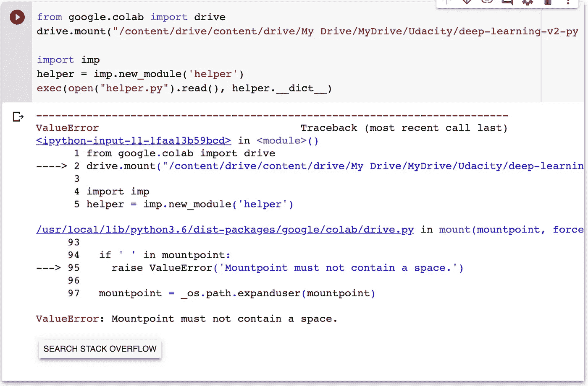

# Google Drive+Google Colab+GitHub；不要只是读，要做！

> 原文：<https://towardsdatascience.com/google-drive-google-colab-github-dont-just-read-do-it-5554d5824228?source=collection_archive---------1----------------------->

## GitHub、Google Colab 和 Google Drive 如何协同工作；如何处理自定义文件，并将 Jupyter 笔记本修改推送到 GitHub Repo。

Interaction Between The Three Components

我最近被贝塔斯曼理工学院奖学金挑战课程第一期录取了——人工智能轨道纳米学位项目。在课程中，Jupyter 笔记本练习由 Udacity 在 [GitHub repo](https://github.com/udacity/deep-learning-v2-pytorch) 中提供。我一直在本地使用 Anaconda Jupyter 和 Jupyter lab 来运行这些练习，但是我注意到在这些课程的后面有更多的任务需要更广泛的计算，并且运行时间越来越长。对于我的旧笔记本电脑来说，CPU 的工作量太大了，所以我必须找到其他替代品。

[Google Colab](https://colab.research.google.com/notebooks/welcome.ipynb) 已经在 Slack 社区中提出。它有一个完全在云上运行的 Jupyter 笔记本电脑的预设置环境(我的笔记本电脑非常感谢🐌).最重要的是，它提供了“免费”的 GPU(图形处理单元)。

本文的目标是了解:

*   如何将 Github repo 集成到 Google Colab(提供步骤)
*   如何处理自定义 Python 文件
*   如何将您在 Jupyter 笔记本上的更改保存到不同的分支，并保持主分支干净。

奥列格·żero 的[文章](/colaboratory-drive-github-the-workflow-made-simpler-bde89fba8a39)和娜塔莉亚斯韦尔奇科娃的 G [itHub repo](https://github.com/nataliasverchkova/on-using-google-colab) 提供了非常好的指导，帮助我开始设置。然而，对我来说，我在实现过程中发现了几个挑战。我花了几个小时寻找额外的资源来解决我遇到的这些问题，但是没有直接的指南来实现我想要的，所以我希望这篇文章可以帮助面临相同问题的其他人。

## 开箱即用的解决方案 Google Colab 和 GitHub

在这个[笔记本](https://colab.research.google.com/github/googlecolab/colabtools/blob/master/notebooks/colab-github-demo.ipynb)中，有几种直接从 GitHub 加载/浏览笔记本文件的方式。您可以在您的私有存储库(需要 GitHub 认证)或公共存储库中访问您的笔记本。

Colab-Github-demo Jupyter notebook

如果你点击[http://colab.research.google.com/github](http://colab.research.google.com/github)，它会指引你一个弹出窗口，你可以通过 GitHub 网址、组织或用户进行搜索。

在我做出更改后，我可以将这些文件保存回 GitHub 分支。很简单，对吧？没那么快！如果您的笔记本没有任何想要导入的自定义文件，这种方法将会很有效。所以，我需要找到另一种解决方案。

## 先从 Google Colab + Google Drive + GitHub 开始吧

在我们详细讨论之前，让我们来看看那些组件(Google Drive、Google Colab、GitHub)的每个角色以及它们之间的交互。

*   **Google Colab:** 所有的操作都在这里调整大小。它被用作 shell 来运行 bash 命令和 git 命令。当然，我们使用 Jupyter notebook 运行我们的 Udacity 笔记本。
*   **Google Drive:** 当我们使用 Google Colab 时，我们的工作被临时存储在一个虚拟机中大约 8 到 12 个小时。所以这并不理想，因为我们的处理任务可能会持续几天、几个月或几年，这取决于每个项目。解决方案之一是将你的培训存储在云存储托管中。众所周知，Google Drive 是谷歌提供的云存储。它提供免费的 15 GB 存储空间，并且很容易与谷歌 Colab 集成。在这种情况下，我们使用这个位置来永久存储我们工作的克隆 GitHub repo。
*   **GitHub:** 一个用于版本控制和协作的代码托管平台。使用版本控制和分支策略是一个很好的实践。我分叉了 Udacity 深度学习-v2-pytoch [库](https://github.com/vsay01/deep-learning-v2-pytorch)。

## 1.将 Google Drive 安装到 Google Colab

在 Google Colab 中，我们将创建一个笔记本来执行我们的命令。如果您已登录，一旦您创建了笔记本，您的文件将存储在名为 Colab Notebooks 的文件夹中。

Colab Notebooks Folder in Google Drive

我将奥列格·żero 的[文章](/colaboratory-drive-github-the-workflow-made-simpler-bde89fba8a39)中提供的部分代码划分到笔记本的不同单元格中，以便更好地理解流程。要将 Google Drive 安装到 Colab，我们可以使用:

Mount Google Drive Gist

感谢 Google 提供的库，这非常简单。按照说明使用 Google Drive 进行身份验证。

Running commands to mount Google Drive

Result after authenticated and mounted successfully

如果看到“挂载在/content/drive”，说明 Google Drive 挂载成功。🎉

如果您熟悉终端命令，您可以仔细检查位置和目录:

请参考我为每个命令添加的每个注释。注意上面最后一个命令的输出。我们有“Colab 笔记本”和“MyDrive”文件夹。这些文件夹存储在我的 Google Drive 的根目录下。

## 2.将 GitHub 存储库克隆到 Google Drive

现在我们准备克隆我们的 GitHub repository 项目，并通过 Google Colab 将其存储在 Google Drive 中。我将克隆分叉库[deep-learning-v2-py torch](https://github.com/vsay01/deep-learning-v2-pytorch)。

*   在我的例子中，我将把克隆的 GitHub 存储库存储在这个目录中:"/content/Drive/My Drive/uda city/deep-learning-v2-py torch "

Google Drive Directories

我们需要定义一些将在脚本中使用的变量:

*   我的谷歌驱动路径
*   GIT _ 用户名
*   GIT_TOKEN (GitHub 访问令牌)
*   GIT_REPOSITORY

**如何生成 GitHub 访问令牌:**

进入右上角的用户资料→点击设置→然后选择开发者设置。

GitHub personal access tokens

select scope for your access token

在这种情况下，回购范围就足够了。要了解有关定义个人令牌访问的范围的更多信息:[https://developer . github . com/apps/building-oauth-apps/understanding-scopes-for-oauth-apps/](https://developer.github.com/apps/building-oauth-apps/understanding-scopes-for-oauth-apps/)

# 注意:不要将你的访问令牌公开

*   在笔记本的新单元格中，我们将设置所需的信息:

[https://gist.github.com/vsay01/12ff13b05d768dc2d4f4646fbf41cd33](https://gist.github.com/vsay01/12ff13b05d768dc2d4f4646fbf41cd33)

*   设置完所需的信息后，让我们执行克隆。

我们有两个选择:

## 选项 1

最后，我们应该看到 GitHub 存储库的内容保存在我们指定的目录中。注意我们有 folder .git，它是用来表示这个文件夹是 git 文件夹。

请记住，我们希望在开发分支中进行更改，而不是在主分支中。所以，我们来验证几件事。如果您不熟悉 git 或需要更新，这里有一个很好的资源。

在输出中！git 分支，有两个分支，开发和掌握。“*”表示我们正在进行的当前分支。默认情况下，您将从主分支开始，除非您克隆特定分支。您可以使用以下命令签出开发分支:

## 选项 2

如果你想将所有文件/文件夹从你在 google drive 中克隆的存储库中复制到 Google Colab 本地运行时，那么你可以遵循[奥列格·żero](https://medium.com/u/b15e8d374ce1?source=post_page-----5554d5824228--------------------------------)的[文章](/colaboratory-drive-github-the-workflow-made-simpler-bde89fba8a39)。

**注意:** data/是一个包含我想排除的大量数据的文件夹。请随意将其更改为您想要排除的不同文件夹路径/名称。

正如奥列格·żero 的[文章](/colaboratory-drive-github-the-workflow-made-simpler-bde89fba8a39)中所解释的:

> 上面的代码片段在`*/content/drive*`安装 Google Drive 并创建我们项目的目录。然后，它从 Github 中取出所有文件，并将它们复制到那个目录中。最后，它收集属于驱动器目录的所有内容，并将其复制到我们的本地运行时。
> 
> 这个解决方案的一个好处是，如果多次执行，它不会崩溃。无论何时执行，它只会更新新的东西。此外，使用`*rsync*`，我们可以选择*排除*一些内容，这可能需要很长时间来复制(...数据？).

**3。修改/处理您的笔记本**

到目前为止，我们做了以下工作:

*   将 Google Drive 安装到 Google Colab
*   将 GitHub 存储库克隆到 Google Drive

这是有趣的部分😃。现在，我们准备在笔记本上进行更改和工作

**4。处理自定义文件问题**

第 2 部分 PyTorch 中的神经网络(练习)。ipynb notebook，我们需要导入一个自定义文件 helper.py，来访问 helper 函数。

可以看到，helper . view _ classify(img . view(1，28，28)，ps)正在工作。

## 5.将更改保存到 GitHub

**如果您选择上面的选项 2，那么请按照** [**奥列格żero**](https://medium.com/u/b15e8d374ce1?source=post_page-----5554d5824228--------------------------------)**的** [**条**](/colaboratory-drive-github-the-workflow-made-simpler-bde89fba8a39) **一节的“保存，收工”来保存您的更改。**

对于选项 1，现在您已经完成了更改，是时候将更改保存并推送到您想要的分支中的 GitHub 存储库中了。这是 git [备忘单](https://education.github.com/git-cheat-sheet-education.pdf)。

我建议在不同的单元中运行这些命令，以确保所有的文件更改都正确地添加到提交中。

上面的命令将添加所有文件；如果只想添加修改过的文件，可以使用:

**也请更改提交的注释；用户.电子邮件和用户名**

在这里，我可以验证更改是否已成功推送:

我们完成了——我希望你喜欢这篇文章。

我将继续添加我在学习过程中发现的与 Google Colab 相关的任何问题:

## 问题#1

Google Colab 脚本抛出“OSError:传输端点未连接”

**适合我的解决方案**:

*   卸载 Google Drive，然后再次重新装载。
*   运行时→管理会话并终止笔记本

## 问题#2

我遇到了这个问题，即使；我已经导入了自定义文件。

**适合我的解决方案:**

当我将 Google Drive 导入 Google Colab 时；我需要确保当前路径是项目文件夹。

## 问题#3

错误:装入点不能包含空格。

**适合我的解决方案**:

*   避免在路径中使用空格

## 问题#4

*   资产文件夹中的图像不会加载到 Jupyter 笔记本中；

**适合我的解决方案**:

*   从图片中获取可共享 google drive 链接。
*   在这个 URL 中使用来自可共享 google drive 链接的图片 id:https://docs.google.com/uc?id =[图像 id] [1]

例如:

*   这是猫狗图片的分享链接:[https://drive.google.com/open?id = 1 hfswhk 0 uiwleeiuz _ bwb 1 dxnoqrapzo-](https://drive.google.com/open?id=1HfsWHk0UiWleEiuz_bwb1dxNoQRApZo-)；所以我们使用 id 并与 URL [1]连接起来；我们有:

https://docs.google.com/uc?id = 1 hfswhk 0 uiwleeiuz _ bwb 1 dxnoqrapzo-

## 问题#5

来自 Jupyter 代码的 google drive 中的参考图片。在 custom_filters.ipynb 笔记本中，我们需要引用数据文件夹“data/curved_lane.jpg”中的图像

**适合我的解决方案**:

1.  导入 google drive
2.  然后你有两个选择:

*   引用代码中图像的完整路径。比如，“。/Drive/My Drive/My Drive/uda city/deep-learning-v2-py torch/卷积-神经网络/conv-可视化/数据/curved_lane.jpg "
*   将目录切换到父文件夹并访问数据文件夹。因此，到图像的路径可以缩短为。/data/curved_lane.jpg "

## 问题#6

我在**conv _ visualization . ipynb**笔记本中遇到以下错误。

> ————————————
> 错误回溯(最近一次调用 last)
> <ipython-input-1–9775 b 898 dc2d>在<模块>()
> 10 bgr _ img = cv2 . im read(img _ path)
> 11 #转换为灰度【T15COLOR_BGR2GRAY)
> 13
> 14 #规格化、重新缩放条目以位于[0，1]内
> 
> 错误:OpenCV(4 . 1 . 2)/io/OpenCV/modules/imgproc/src/color . CPP:182:错误:(-215:断言失败)！函数“cvtColor”中的 _src.empty()

**对我管用的方案**:

发生此问题的原因是输入图像的路径不正确或输入图像名称中有特殊字符。在我修正了输入图像路径后，它工作得很好。

