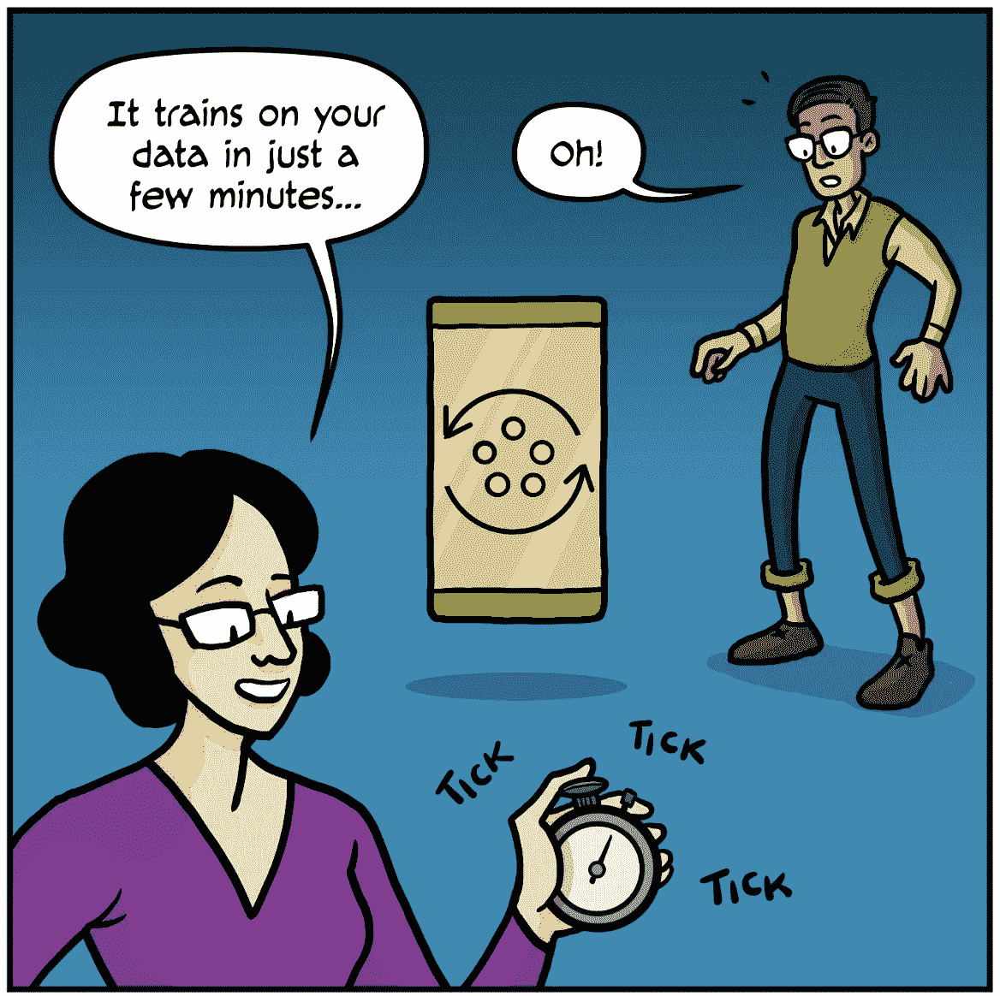

# 谷歌联合学习和人工智能

> 原文：<https://towardsdatascience.com/google-federated-learning-and-ai-64c6e4e4e22f?source=collection_archive---------17----------------------->

Photo by [@memorieson35mm](https://unsplash.com/@memorieson35mm)

## 保密性和人工智能

我以前听说过联合学习。然而，最近几天深入半监督学习让我意识到了这个概念及其用法。在这篇文章中，我将给出一个简单的概念解释，而不是深入到广泛的技术细节。由于疏忽管理用户数据，脸书最近被美国联邦贸易委员会罚款 50 亿美元。谷歌同样面临来自欧盟委员会的十亿美元****的正式指控。这些公司如何改进？谷歌提出了部分解决方案。****

**由于对通信技术中的隐私和安全目的的日益关注，很高兴看到 **Google** 希望通过这个概念来解决这个问题。现在我想进一步探索它，但首先我想分享一幅来自谷歌的关于联合学习的漫画的一部分:**

************************

**谷歌关于联合学习的漫画[就这样开始了。我真的建议你查看上一句中链接的完整版本来阅读整个故事。](https://federated.withgoogle.com/)**

**根据维基百科上*机器学习*页面的短存根:**

*****联合学习*** *是一种训练机器学习模型的新方法，它分散了训练过程，允许用户的隐私得到维护，无需将他们的数据发送到中央服务器。这也通过将训练过程分散到许多设备来提高效率。例如，*[*Gboard*](https://en.wikipedia.org/wiki/Gboard)*利用联邦机器学习在用户手机上训练搜索查询预测模型，而无需将单个搜索发回谷歌。***

****简而言之**:关于在分散的数据上训练一个集中的模型。**

****

**那么为什么这很重要呢？**

## **隐私和人工智能**

**我决定去看看国际隐私组织对人工智能有什么看法。**

**[*【隐私国际(PI)*](https://privacyinternational.org/topics/artificial-intelligence) *是一家慈善机构，挑战那些想要了解个人、团体和整个社会一切的政府和公司。PI 希望的未来是，人们能够控制他们的数据和他们使用的技术，政府和公司不再能够使用技术来监控、跟踪、分析、描述，并最终操纵和控制我们。但是我们必须为未来而战。***

**他们的网站上有一个关于人工智能的网页。我将从他们的简短页面中借鉴或复制一些要点*(斜体*):**

*   *****重新识别和去匿名*** *:人工智能应用可用于识别和跟踪不同设备上的个人，无论是在家中、工作场所还是公共场所。***
*   *****剖析的不透明和保密*** *:人工智能的一些应用对个人、监管者，甚至系统的设计者本身来说可能是不透明的，因此很难质疑或询问结果。***
*   *****数据利用*** *:人们往往无法完全了解自己的设备、网络、平台产生、处理、或分享的数据种类和数量。随着我们将智能和互联设备带入我们的家庭、工作场所、公共空间甚至身体，教育公众了解这种数据利用的需求变得越来越迫切。***

**在这种情况下，使用人工智能进行侧写，或者跨设备甚至在公共场所跟踪和识别人，这种不对称放大了鸿沟。那么他们**提出的解决方案**是什么呢？**

1.  **使人工智能领域和机器学习技术的使用符合**尊重、促进和保护国际人权标准**的最低要求。**
2.  **确保人工智能保护个人免受审查现有法律带来的风险**并在必要时修订法律**，以解决新出现的隐私威胁的影响。**

**回到谷歌漫画，这是如何在联邦学习中解决的？**

********************

****安全聚合**是一种交互式加密协议，用于计算屏蔽向量的和，如模型权重。它通过协调成对的参与客户端之间的随机掩码的交换来工作，使得当接收到足够数量的输入时，掩码相互抵消。要了解更多关于安全聚合的信息，请参见[保护隐私的机器学习实用安全聚合](https://ai.google/research/pubs/pub47246)。**

## **追踪报道的弊端**

**技术领域的数据科学家、工程师、软件、硬件或销售人员有任何责任吗？是的，所以让我引入医疗事故的概念。**

*****医疗事故*** *:在侵权法中，医疗事故，也称为业务过失，是“业务人员的疏忽或不称职的一个实例”***

**这是出了名的难以断言，然而责任的概念是一个有趣的概念。我们可以严肃地质疑这种渎职或专业疏忽是否是技术行业在处理数据方面如此糟糕的声誉的原因。如果有一些关于你如何处理数据的专业标准，那就太好了。**

****你觉得沃尔玛更了解你了吗？**沃尔玛进行了广泛的市场调查，但是我们可以质疑他们带有机器学习的新相机是否仅用于跟踪盗窃。沃尔玛透露，它已经在 1000 家商店用人工智能摄像头跟踪收银台的盗窃行为。**

> **Everseen 首席执行官艾伦·欧赫利希(Alan O'Herlihy)表示，该公司的技术旨在减少结账处的摩擦，并将结账监控“数字化”。**

****

**Ireland-based Everseen is one of several companies supplying Walmart with the technology for its Missed Scan Detection program.[YouTube/Everseen](https://www.youtube.com/watch?v=ibIKS84ETpM) from [Business Insider](https://www.businessinsider.com/walmart-tracks-theft-with-computer-vision-1000-stores-2019-6?r=US&IR=T)**

**这张照片当然是我在以前的文章中提到的拟人化的一个很好的例子——希望将机器显示为人类。当然，没有像人一样的机器盯着你的图像，尽管它看起来像一系列朗朗上口的词的体现，如机器人，机器人过程自动化(RPA)，自主等。**

**一家新公司[刚刚为一个人工智能筹集了 1 亿美元](https://techcrunch.com/2019/07/16/near-raises-100m-for-an-ai-that-merges-online-and-offline-behavior-to-build-consumer-profiles/?fbclid=IwAR0G71kADuvgn1D_ltMTZ-kjutDsTf6NQtgShordeMWIdKzqDVs57g-YGoY),这个人工智能融合了线上和线下行为来建立消费者档案。**

> **广告和营销领域的圣杯之一是找到一种方法来准确捕捉和理解消费者一整天都在做什么，不管是数字活动还是线下活动。[……]附近——该公司已经建立了一个名为“火种源”的交互式、基于云的人工智能平台，该平台在 44 个国家开展工作，根据大量信息创建匿名的、基于位置的用户档案(目前每月 16 亿)，这些信息来自手机、数据合作伙伴、运营商及其客户，但该公司声称该平台是“以隐私设计为基础”建立的**

****那么，追踪你的感受，汇总并在未经你同意的情况下出售它怎么样？至少没有你的明确同意*(阅读条款和条件)*。****

**目前没有同意的案例，因此这在欧盟严格来说可能是不合法的，但我不确定。可能会有一些灰色地带，一些演员可以利用，我不是律师。**

**当一个人自愿同意另一个人的提议或愿望时，表示同意。这种模糊的定义在技术领域并不可取，因为似乎大多数公司都认为你同意进入他们的平台。**

****:一般禁止处理个人数据，除非法律明确允许，或者数据主体已经同意处理。虽然同意是处理个人数据的一个较为知名的法律依据，但它只是《一般数据保护条例》( GDPR)中提到的六个依据之一。其他是:合同、法律义务、数据主体的重大利益、公共利益和 GDPR 第 6(1)条所述的合法利益。****

****现在可能有更多的要求来说明你收集了哪些数据，并要求那些出售数据的人进行申报。然而，沃尔玛和 Near 或许能够以某种方式绕过这一点。众所周知，很难理解数据卖家的情况，以及他们把什么卖给了谁。然而，作为一个启发式的经验法则，我们可以推测这是否是一个过分的要求。****

******先征得同意**:****

1.  ****使用数据****
2.  ****汇总数据****
3.  ****存储数据****
4.  ****出售数据****

****这似乎经常被忽视，仅仅是出于权宜之计的考虑— *也就是快速移动和打破东西*,这似乎已经成为处理数据的同义词。去年(2018 年)的一个做法被[量化的 VC](https://medium.com/u/c614a7c2f7e7?source=post_page-----64c6e4e4e22f--------------------------------) 描述为非常[活](https://medium.com/swlh/move-fast-and-break-things-is-not-dead-8260b0718d90)。****

> ****脸书可能在 2019 年 7 月受到 FTC50 亿美元罚款的打击。然而，4 月份的时候，据说[公司预留了 30 亿美元](http://In April, Facebook said it set aside $3 billion to help cover an expected fine of between $3 billion and $5 billion.)来期待这一天的到来。****

> ****具体来说，监管机构试图确定脸书是否违反了它在 2011 年与当局达成的协议条款，当时它承诺不会在未经用户同意的情况下收集和分享个人数据。****

********

****我们可以严肃地质疑这种公司人员的渎职或专业疏忽以及处理数据的系统性问题是否是导致科技行业如此[声名狼藉的原因。以谷歌为例，到目前为止，它已经被欧盟委员会罚款超过 80 亿美元(尽管这对他们的收入影响很小)。](https://www.ey.com/en_gl/trust/why-trust-in-tech-giants-is-eroding--and-how-it-can-be-rebuilt)****

****亚马逊最畅销的产品之一是他们的新[带摄像头的闹钟](https://www.vox.com/recode/2019/7/16/20695008/amazon-ring-prime-day-fear-social-media)。然而，这可能会产生意想不到的不良后果。私人房东已经开始使用便宜的照相软件来追踪车牌。甚至一些人工智能和伦理的倡导者也将它称为“人工智能算法”，并将“它”与伦理行为结合起来。不同收入水平的公司以及个人都在应用这些技术，需要确定如何处理不同个人的数据以及何时越过这条线。****

****我们必须开始讨论人，而不是技术，尽管透明的算法是要争取的。Cassie Kozyrkov[在谈到算法中的偏差时做出了明智的声明:](https://medium.com/u/2fccb851bb5e?source=post_page-----64c6e4e4e22f--------------------------------)****

> ****教科书反映了作者的偏见。像教科书一样，数据集也有作者。它们是根据人们的指示收集的。[……]偏见不是来自 AI 算法，而是来自人。****

*******偏见*** *:对某人或某团体的倾向或偏见，尤指以被认为不公平的方式。*****

****我这么说，并不是说我们可以责怪人们，而不是他们工作的公司。然而，对于与处理数据相关的实践，必须有专业的责任。在这方面，我们不能一直拿“算法”或“人工智能”当替罪羊。****

## ****联邦计算和学习****

****2019 年 5 月 9 日，谷歌关于 Tensorflow 的演示展示了联合计算和联合学习的概述。您可以在此处查看演示的视频版本，但是您也可以滚动查看此处展示的几张幻灯片:****

********************************************************

****所以总结起来联邦学习隐私技术的四个原则是:****

1.  ****设备上的数据集:保留原始数据，过期旧数据，静态过期。****
2.  ****联合聚合:合并来自多个设备的报告。****
3.  ****安全聚合:计算加密设备报告的(向量)和。一个具有安全保证的实用协议:通信效率和掉话容忍度。****
4.  ****联合模型平均:每个设备上的梯度下降的许多步骤。****

*****联盟***是一组计算或网络提供商，他们以集体的方式就操作标准达成一致。当描述两个不同的、形式上断开的、可能具有不同内部结构的电信网络的互操作时，可以使用该术语。该术语也可用于团体试图授权集体发展权以防止分裂的情况。在电信互连中，不同系统的内部操作方式与联盟的存在无关。******

******在软件工程中* ***碎片化或*** ***项目分叉*** *当开发人员从一个软件包中取出一份源代码并在其上开始独立开发时，就会出现这种情况，从而创建出一个独特而独立的软件。这个术语通常不仅仅意味着一个开发分支，还意味着开发人员社区的分裂，一种分裂的形式(人与人之间的分裂)。******

******A* ***作案手法*** *(通常简称为* ***M.O.*** *)是某人的工作习惯，特别是在商业或刑事调查的背景下，但也更为普遍。这是一个拉丁短语，大约翻译为操作模式。******

*****正如我之前在[关于半监督机器学习(SSL)](/advancements-in-semi-supervised-learning-with-unsupervised-data-augmentation-fc1fc0be3182) 的文章中提到的，我在那里听说过联合学习这个术语:“*作为一名作家，我解释谷歌大脑成员的文章和谷歌人工智能的博客帖子，可能看起来像一个青少年在评论一个专业运动队。”******

*****从这个意义上说，如果有什么不清楚的地方，我可能不清楚，如果你想解释或讨论，我总是很乐意这样做。*****

*****最后一点，我确实意识到这是谷歌的推销，不能全信。*****

********************

# *****这是第 500 天的第 44 天*****

> ******什么是#500daysofAI？
> 我在挑战自己，用#500daysofAI 来写下并思考未来 500 天的人工智能话题。一起学习是最大的快乐，所以如果你觉得一篇文章引起了共鸣，请给我反馈。******