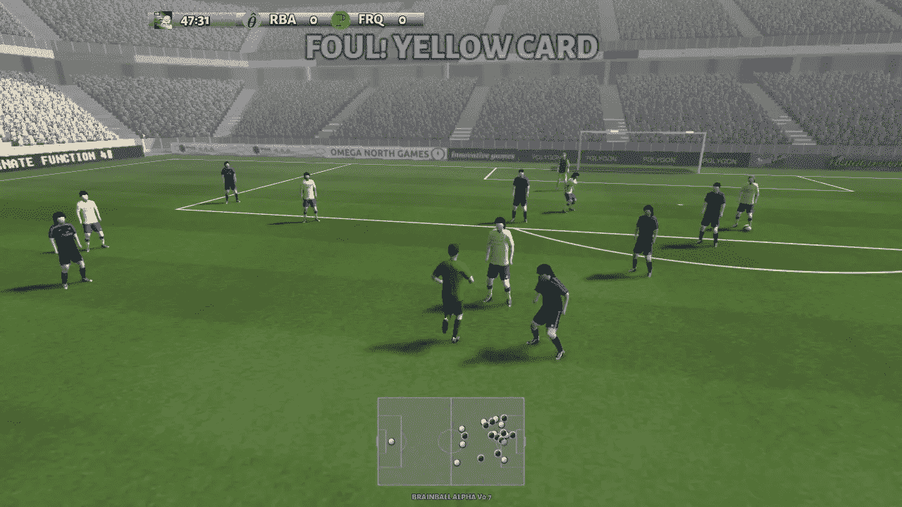
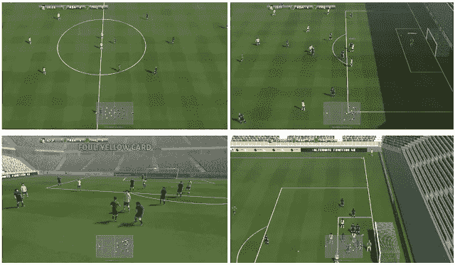
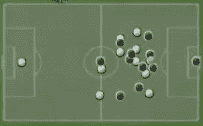
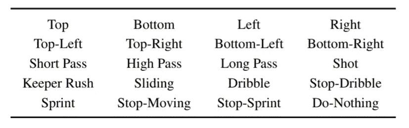
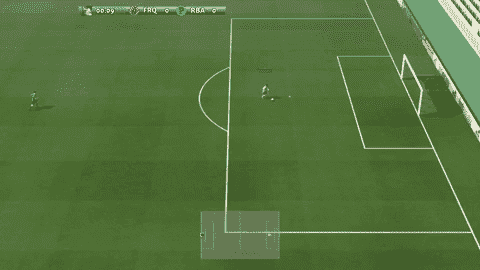
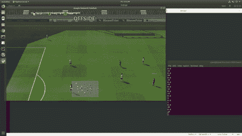
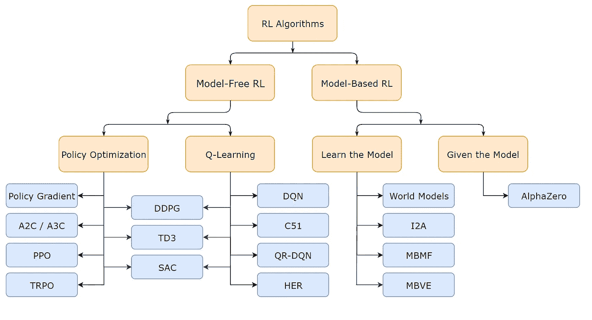
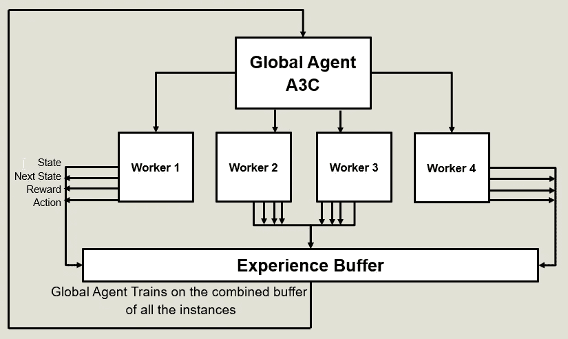

# Google 足球环境—使用 A3C 安装和培训 RL 代理

> 原文：<https://towardsdatascience.com/google-football-environment-installation-and-training-rl-agent-using-a3c-d058a44f0fad?source=collection_archive---------13----------------------->

合著者: [Ujwal Tewari](https://medium.com/u/33682014d935?source=post_page-----d058a44f0fad--------------------------------)



[Frame from google football environment](https://ai.googleblog.com/2019/06/introducing-google-research-football.html)

几天前，谷歌大脑团队发布了一个开源足球环境，用于强化学习研究。他们提供了[代码库(GitHub)](https://github.com/google-research/football) 和他们的研究论文。

# 了解环境

让我们分解这个复杂的环境，了解它的状态空间表示，动作空间和成功的 RL 模型训练所需的其他配置-

> **状态空间**

这个环境支持三种类型的状态表示。

1.  像素:表示由一个 1280×720 的 RGB 图像组成，对应于渲染的屏幕。请注意，这包括记分牌和在画面底部中间部分的小地图(迷你地图),原则上，所有玩家的位置都可以从中推断出来。



4 frames of dimension 1280 x 720

2.超级迷你地图(SMM): SMM 基本上是一堆二进制矩阵，定义了呈现在屏幕中下方的迷你地图。SMM 表示由四个 96 × 72 矩阵组成，分别编码关于主队、客场队、球和现役球员的信息。编码是二进制的，表示在相应的坐标中是否有玩家、球或活动玩家。



Super Mini Map

3.floats:floats 表示提供了更紧凑的编码。它由一个 115 维的向量组成，概括了游戏的许多方面，如球员坐标、控球、方向、活跃球员或游戏模式。

注意-只有像素和 SMM 表示可以跨多个连续的时间步长进行堆叠(例如，确定球的方向)。

> **动作空间**

gfootball 的动作空间非常有趣，并且与实际的足球比赛非常相关。该动作被给予当前活动的玩家**，即头上有蓝色条的玩家。该环境支持 20 种操作。**



他们已经为**不活跃的球员**实现了内置的基于规则的机器人，该机器人遵循与合理的足球动作和策略相对应的动作，例如当我们不控球时奔向球或者与我们活跃的球员一起向前移动。

> **场景**

谷歌大脑团队提供了不同难度的不同场景。它的主要目标是允许研究人员快速开始新的研究想法，并对其进行迭代。代理最容易学习的场景是“空球门关闭”，其中只有一名球员站在球门前，没有守门员。



Empty goal close scenario

> **安装**

让我们开始将这种凉爽的环境融入我们的系统。我们使用的系统有 ubuntu 18.04 操作系统和 python 3.6。安装游戏引擎和库的最好和最简单的方法是克隆 git 库。

> 注意—最好先创建一个 anaconda 环境或 python 虚拟环境，然后在该环境中安装依赖项。

```
- git clone https://github.com/google-research/football.git
- cd football
- pip3 install .[tf_cpu] --process-dependency-links
  Or for gpu version
- pip3 install .[tf_gpu] --process-dependency-links
- This command can run for a couple of minutes, as it compiles the C++ environment in the background.
```

安装后，您可以通过运行 GitHub 存储库中的文件 [environment_test.py](https://github.com/Ujwal2910/Deep-RL-on-Gfootabll-Google-football-OpenAI-style-environment-/blob/master/Rendering%20Gfootball%20ENVS/evironment_test.py) 来测试您的安装。

```
- git clone [https://github.com/Ujwal2910/Deep-RL-on-Gfootabll-Google-football-OpenAI-style-environment.git](https://github.com/Ujwal2910/Deep-RL-on-Gfootabll-Google-football-OpenAI-style-environment-.git)
- cd Deep-RL-on-Gfootabll-Google-football-OpenAI-style-environment/
- cd enviornment_render/
- python3 environment_test.py
```

它将连续渲染帧:



Output of running environment_test.py

如果您遇到 numpy 版本错误，根本原因可能是重叠的 numpy 版本。只需尝试卸载 numpy，然后再次尝试运行脚本。

> **要记住的事情**

我们目前已经向 google football Github repository 报告了两个问题，他们已经承认了这个问题，并给出了一个临时的解决方案，直到他们修复这个问题。

1.  在 115 维向量的浮点表示中，115 维仅针对 11v11 场景指定，对于所有其他场景，该数字会有所不同。所以你可以首先**用 state.shape[0]检查，然后相应地构建你的模型**。([链接到问题](https://github.com/google-research/football/issues/33))
2.  目前，他们的程序改变了运行代码的当前工作目录，因此**在保存模型时使用绝对路径**。([链接到问题](https://github.com/google-research/football/issues/31))

# 培训 RL 代理

强化学习基本上分为基于值的函数和基于策略的函数上运行的算法。在这些算法中，演员-评论家算法是两者的结合，具有较小的方差和较高的收敛速度。

关于各种 RL 算法的更详细的数学解释，你可以参考这篇[博文](https://medium.com/@jonathan_hui/rl-deep-reinforcement-learning-series-833319a95530)



Classification of reinforcement algorithms: [Source](https://hollygrimm.com/rl_mc)

在这样的行动者-评论家算法中，有一种是异步优势行动者-评论家算法，或通常称为 A3C。

# 异步优势演员-评论家-



让我们分解这个复杂的算法，理解 A3C-的三个 A

> **异步-**

A3C 具有多个工作人员的优势，每个工作人员分别在自己的环境中工作，并采取彼此完全独立的行动。以下步骤将以简单易懂的方式总结其工作原理，并展示其优于其他 RL 算法的优势-

1.  每个工人在他们自己的环境中独立工作。
2.  随着每个工作者在平行空间中运行，更多的探索发生了。
3.  每个工人在每集结束时给出包含-[当前状态、下一个状态、采取的行动、获得的奖励、完成(布尔值，表明该集是否结束)]的信息元组。
4.  来自每个工作者的这些元组在全局缓冲区中是成对的
5.  然后全局代理在这个全局缓冲区上训练并保存其权重。
6.  然后，工作者加载全局代理的保存的权重。
7.  然后，工人根据全局代理的训练权重采取行动。
8.  重复相同的步骤，直到全局代理收敛。
9.  由于工人平行运行，训练速度更快。

> **优势功能-**

q 值可以分为两部分-

1.  状态值函数 V(s)
2.  优势值 A(s，A)

优势函数可以如下导出

> Q(s，a)= V(s)+ A(s，A)
> 
> A(s，a) =Q(s，a) -V(s)
> 
> A(s，a)= r+ γV(s_cap) -V(s)

优势函数实际上帮助我们更好地描述在给定状态下一个动作与其他动作相比如何，而价值函数则捕捉在这个状态下它有多好。

# 代码实现

对于 RL 算法的实现，我们使用了 [ChainerRL](https://github.com/chainer/chainerrl) 库，因为它包含 A3C 的优化版本。我们使用了一个名为 [a3c.py](https://github.com/Ujwal2910/Deep-RL-on-Gfootabll-Google-football-OpenAI-style-environment/blob/master/A3C_code/a3c.py) 的文件，其中包含了培训代理的代码。

上面的代码片段只包含了算法的核心。你可以在这里查看整个文件。我们使用*学院关闭目标*场景进行训练，场景名称可在变量*global _ environment _ name*中定义，同样，其状态空间可在变量 *state_space_size* 中定义。

以下视频展示了培训结果

Training result on Empty Goal Close scenario

## 存储库链接

> [https://github . com/ujwal 2910/Deep-RL-on-Gfootabll-Google-football-open ai-style-environment](https://github.com/Ujwal2910/Deep-RL-on-Gfootabll-Google-football-OpenAI-style-environment)